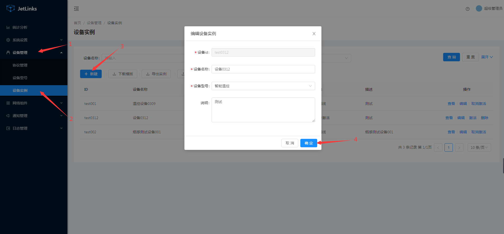
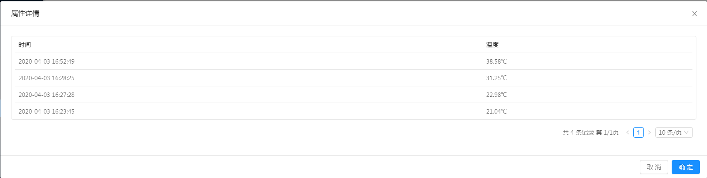

# 通过网关设备接入多个下挂设备

场景: 网关设备与平台进行连接,传感器连接到网关设备. 平台可对网关以及网关下的所有设备进行管理.

## 协议解析

以下操作基于[快速体验](../quick-start/demo.md).
中使用的[demo协议包](https://github.com/jetlinks/demo-protocol)
以及[模拟器脚本](https://github.com/jetlinks/jetlinks-community/tree/master/simulator).

流程:

1. 父设备通过MQTT等方式接入平台,子设备自动上线.
2. 平台下发子设备消息.网关使用协议的编解码器会收到`ChildDeviceMessage`,将其编码为网关设备能识别的消息即可.
3. 父设备上报子设备数据,解码器将收到的设备报文解码为`ChildDeviceMessage`或者`ChildDeviceMessageReply`. 注意:`ChildDeviceMessage.deviceId`为
   父设备ID,`ChildDeviceMessage.message.deviceId`为子设备ID.

::: tip
可根据[设备消息协议解析SDK](../basics-guide/protocol-support.md).修改协议解析方式.
子设备消息请重点关注: `ChildDeviceMessage`以及`ChildDeviceMessageReply`
:::

## 创建设备型号
1. 进入系统: `设备管理`-`设备型号`-`新建`。  
2. 输入设备型号信息，设备类型选择`网关`。  
3. 点击`确定`进行保存。  


**导入设备型号:**[设备型号-演示型号.json](files/设备型号-演示型号.json)

## 创建网关设备

1. 进入系统: `设备管理`-`设备实例`-`新建`。  
2. 输入设备信息。  
3. 点击`确定`进行保存。  
  

**导入设备实例:**[设备实例.xlsx](files/设备实例.xlsx)

## 创建子设备

创建步骤同[创建设备型号](#创建设备型号)、[创建网关设备](#创建网关设备)，设备型号中设备类型选择`设备`。

**导入子设备型号:**[设备型号-子设备型号.json](files/设备型号-子设备型号.json)
**导入子设备实例:**[设备实例-自设备.xlsx](files/设备实例-子设备.xlsx)

## 关联网关设备和子设备

### 自动关联

在某些场景下,子设备是动态和网关绑定的,此时,需要在自定义协议作用解析消息为`ChildDeviceMessage<DeviceRegsiterMessage>`即可.
如果是自动关联的,设备状态也将更新为和网关设备状态一致.

### 手动关联

1. 进入系统: `设备管理`-`网关设备`。  
  

2. 选择需要绑定子设备的网关设备，绑定子设备。  

  

  

## 设备上线

网关与平台建立连接时,会自动修改所有子设备的状态.
如果要单独更新子设备上下线状态.请根据协议解析为`ChildDeviceMessage<DeviceOnlineMessage>`或者`ChildDeviceMessage<DeviceOfflineMessage>`.

### 模拟网关设备上线（下线），子设备上线（下线）

使用[模拟器](https://github.com/jetlinks/device-simulator)模拟网关设备。  

1. 进入项目目录:`simulator`([获取源代码](../install-deployment/docker-start.md#获取源代码))。  

2. 运行device-simulator.jar。  

```shell script
java -jar -Dfile.encoding=UTF-8 device-simulator.jar \
  mqtt.limit=1 \
  mqtt.start=0 \
  mqtt.enableEvent=true \
  mqtt.eventLimit=1 \
  mqtt.eventRate=1000 \
  mqtt.scriptFile=./scripts/demo-children-device.js \
  mqtt.address=127.0.0.1 \
  mqtt.port=1889
```


3.运行成功后可在平台看到网关以及子设备都已上线。

  

  

4.断开连接网关下线，子设备下线。  

  

  

### 模拟事件上报

在项目目录：`simulator/scripts`中的demo-children-device.js文件中模拟了子设备事件上报。  

```js
var events = {
    reportProperty: function (index, session) {
        var deviceId = "child-device-1";//子设备id
        var topic = "/children/report-property";//属性上报topic
        var json = JSON.stringify({
            "deviceId": deviceId,
            "success": true,
            "timestamp": new Date().getTime(),
            properties: {"temperature": java.util.concurrent.ThreadLocalRandom.current().nextDouble(20, 40)},
        });
        session.sendMessage(topic, json)
    },
    fireAlarm: function (index, session) {
        var deviceId = "child-device-1";
        var topic = "/children/fire_alarm";//事件上报topic
        var json = JSON.stringify({
            "deviceId": deviceId, // 设备编号 "pid": "TBS-110", // 设备编号
            "a_name": "商务大厦", // 区域名称 "bid": 2, // 建筑 ID
            "b_name": "C2 栋", // 建筑名称
            "l_name": "12-05-201", // 位置名称
            "timestamp": new Date().getTime() // 消息时间
        });

        session.sendMessage(topic, json)
    }
};
```
运行[模拟器](https://github.com/jetlinks/device-simulator)后会定时上报。  

  

属性上报日志：  

  

时间上报日志：  

  

## 消息下行

平台已经自动处理了下行的子设备消息.直接调用设备消息接口即可.
如果出现无法下行消息,或者状态不同步时,尝试重新激活一下设备.
