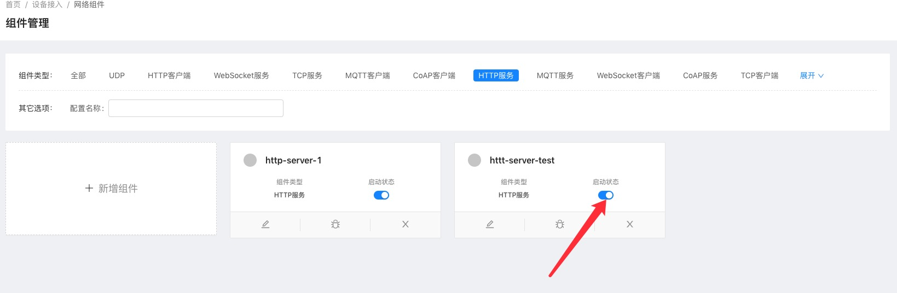
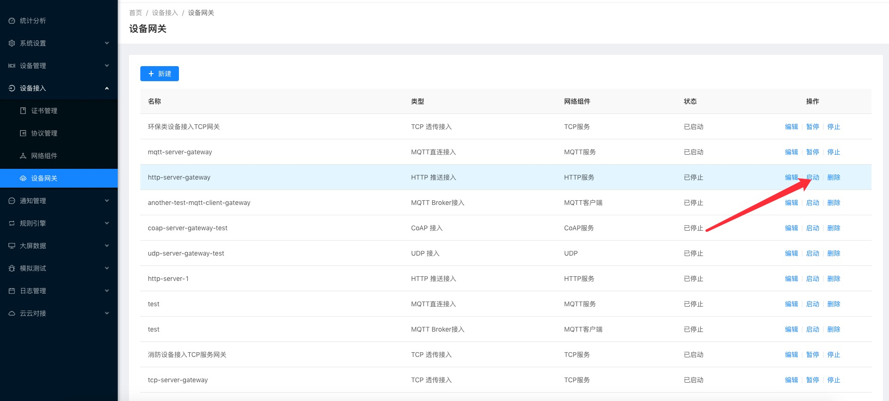
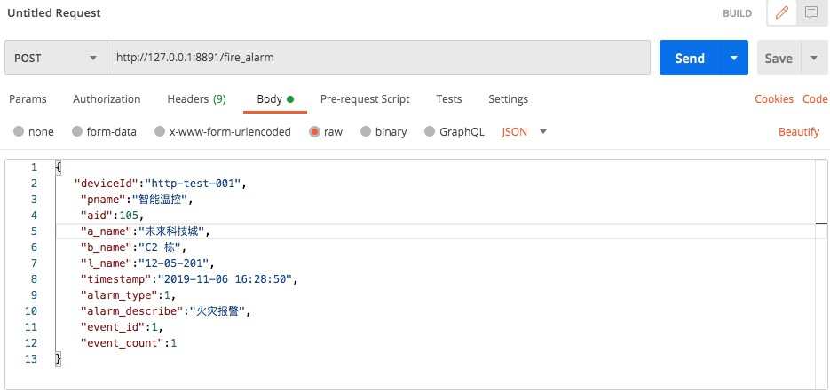
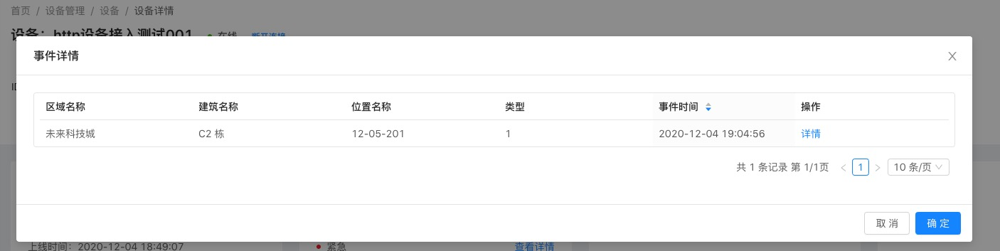

# 使用HTTP 接入设备消息

注意：此功能在企业版中支持。

## 创建协议

请参考[创建协议](../advancement-guide/mqtt-connection.md#创建协议)

## 创建产品

参考[tcp接入设备示例中的创建产品](tcp-connection.md#创建产品),创建id为**http-test**的产品  

  

并**发布**。    

## 创建设备实例

参考[tcp接入设备示例中的创建设备](tcp-connection.md#创建设备),创建**id为http-test-001**的设备并**激活**。   

 

## 创建网络组件
1. 选择 `设备接入`-->`网络组件`--> 点击`新增组件`按钮。  

  

2. 在创建完成的模块上点击`启动`按钮。  
  
  

## 创建设备网关
1. 选择 `设备接入`-->`设备网关`--> 点击`新建`按钮。  

  
::: tip 注意
和MQTT服务设备网关不同的是,http必须指定消息协议,因为无法通过消息识别出对应的设备标识.
同时多个协议可共用一个网关，通过上面配置中的协议路由来进行分发.  
在消息解码时也无法通过上下文(`MessageDecodeContext`)获取到设备操作接口(`DeviceOperator`).
此处使用`demo`协议. 
:::
2. 在操作列点击`启动`按钮启动网关。  

   

## 推送消息
此处使用postman模拟设备请求。  
### 模拟设备上报属性  
   

::: tip 注意：
请求时路径中带的/report-property相当于mqtt中的topic，在demo协议将中根据路径来判断消息类型。  
:::

设备运行状态中查看：  

  

### 模拟设备事件上报
   

::: tip 注意：
请求时路径中带的/fire-alarm相当于mqtt中的topic，在demo协议将中根据路径来判断消息类型。  
:::

设备运行状态中查看：  

  

事件详情： 
 
  
## 指令下发

由于http是短链接,无法直接下发指令,可以在`消息拦截器中`或者`编码时`通过将消息设置到`device.setConfig`中,在收到
http请求拉取消息时，通过`device.getSelfConfig`获取配置,并返回。