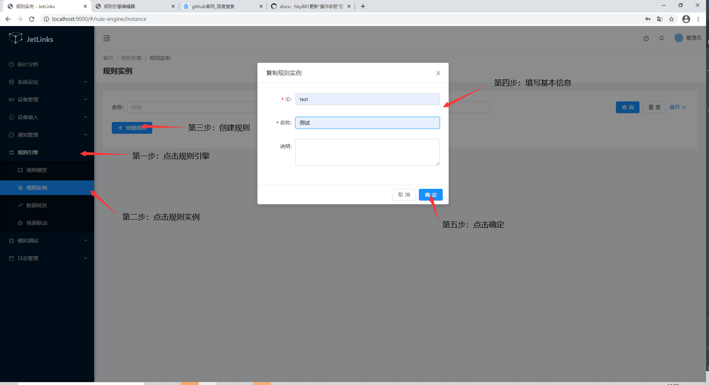

# 通过规则引擎发布HTTP服务

原理: 利用`网络组件`中的HTTP服务,向外暴露API接口

## 创建HTTP服务

1. 进入系统: `设备接入`-`网络组件`-`新建组件`。  

2. 输入组件信息，组件类型选择HTTP服务。  

3. 点击`保存`进行保存。  
  

4. 启动服务。  
  

## 创建规则实例
1. 进入系统: `规则引擎`-`规则实例`-`创建规则`。  

2. 输入id、名称。  

3. 点击`确定`进行保存。  

   

## 配置监听HTTP

1. 点击规则实例上的`编辑`按钮。  

  

2. 在工作区中拖入`监听HTTP`节点。  

  

3. 双击节点进入编辑页。  

  

## 添加处理逻辑

1. 在工作区中拖入`函数`节点。  

2. 双击节点进入编辑页。  

    此处将  
    ```json
    {  
      "deviceId":  "test001",
      "data": {
         "temp":123,
         "name":"abc"
       }
    }  
    ```
    转换为  
    ```json
    {
        "sn": "test001",
        "data": {
            "property": "abc",
            "value": 123
        }
    }
    ```
    为例。  
  

转换节点中的代码为：  
```js
var ctx = context;
handler.onMessage(function(ruleData){
    var data = ruleData.data;
    ctx.getLogger().warn("ruleData:{}",ruleData);
    var oldData = data.payload;
    var result =  {
        payload: {
            sn: oldData.deviceId,
            data: {
                property: oldData.data.name,
                value: oldData.data.temp
            }
        }
    };
return result;
})
```
## 配置响应HTTP

在工作区中拖入`响应HTTP`节点。  
  

配置完成后[启动规则](../basics-guide/course/rule-engine-nodered.md#保存)。  
## 测试

此处以postman来测试此规则。  

   

请求成功并响应预期中的数据则通过。  
 

回到规则引擎设计器中，点击右上角调试按钮，将展示各节点运行产生的数据。  

    