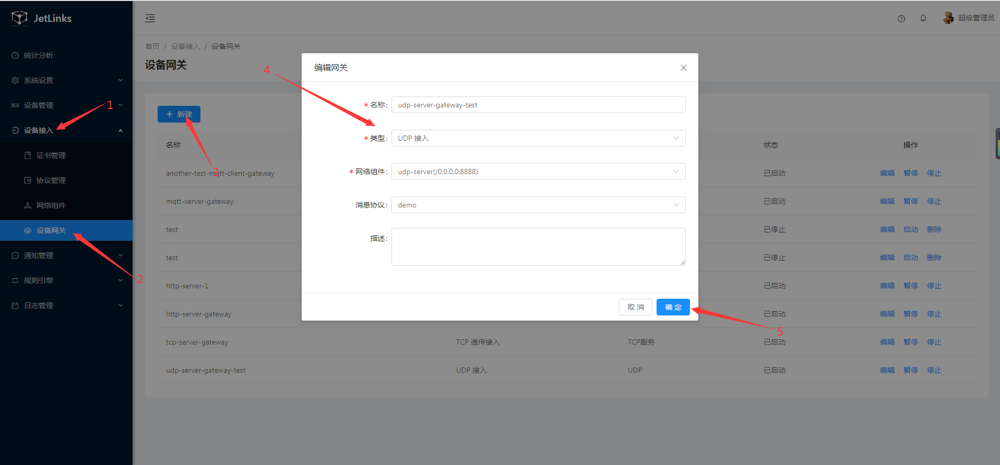
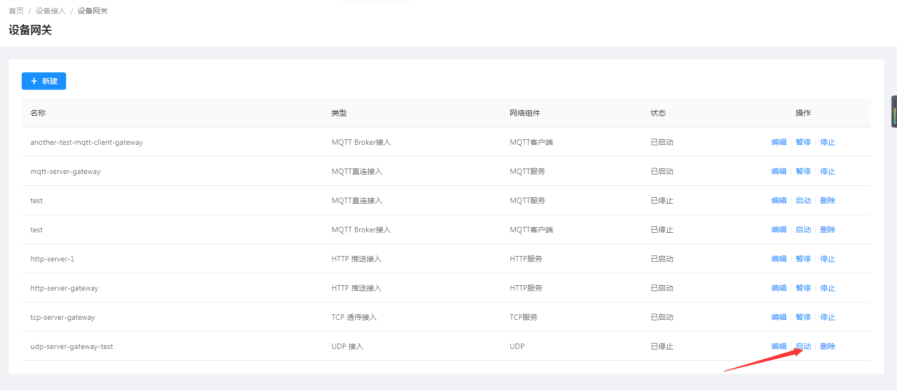
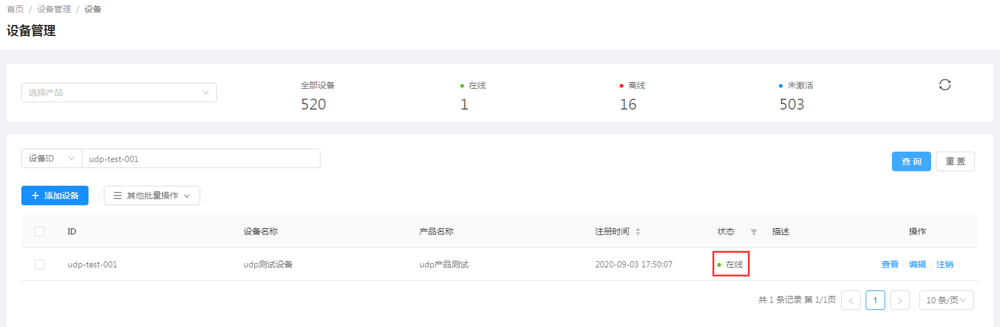

# 使用UDP服务网关接入设备
本文档使用[Packet Sender](https://packetsender.com/download#show)工具模拟tcp客户端接入平台。

## 创建协议

请参考[创建协议](../advancement-guide/mqtt-connection.md#创建协议)

## 创建产品

参考[tcp接入设备示例中的创建产品](tcp-connection.md#创建产品)创建**id为udp-test**的产品并**发布**。  

  

## 创建设备实例

参考[tcp接入设备示例中的创建设备](tcp-connection.md#创建设备)创建**id为udp-test-001**的设备并**激活**。   

  

## 创建UDP服务网络组件

1. 选择 `设备接入`-->`网络组件`--> 点击`新增组件`按钮。  

  


2. 在创建完成的模块上点击`启动`按钮。  
  
  

## 创建UDP服务设备网关

1. 选择 `设备接入`-->`设备网关`--> 点击`新建`按钮。  

  
::: tip 注意
和MQTT服务设备网关不同的是,udp必须指定消息协议,因为无法通过消息识别出对应的设备标识.
在消息解码时也无法通过上下文(`MessageDecodeContext`)获取到设备操作接口(`DeviceOperator`).
此处使用`demo`协议. 
:::
2. 在操作列点击`启动`按钮启动网关。  

   

## 使用UDP模拟工具接入

1. 下载并安装`SocketTool4`。  

::: tip 注意
此处以json方式传输数据。
:::

2. 创建udp客户端。  

   
 
3. 模拟设备设备属性上报

在SocketTool4工具的`数据发送窗口`填写发送的报文。  
此处使用的报文为：  
```json
{
  "properties":{
      "temperature":36.5 //温度属性
     },
  "messageType": "REPORT_PROPERTY",//org.jetlinks.core.message.MessageType
  "deviceId": "udp-test-001",//设备id
  "key": "admin"//udp认证配置，udp_auth_key	
}
```
单击`发送数据`按钮发起发送数据。  
  

收到上报的消息后平台中设备状态将变为上线。  

  

在设备`运行状态`中可以看到温度属性已发生变化。  

  

点击`详情`按钮可查看属性上报日志信息、图标展示。  

  
 
6. 模拟设备上报事件

在SocketTool4工具的`数据发送窗口`填写发送的报文。  
此处使用的报文为：  
```json
{
    "data": {
          "pname":"智能温控",
          "aid":105,
          "a_name":"未来科技城",
          "b_name":"C2 栋",
          "l_name":"12-05-201",
          "timestamp":"2019-11-06 16:28:50",
          "alarm_type":1,
          "alarm_describe":"火灾报警",
          "event_id":1,
          "event_count":1
    },
    "event": "fire_alarm",//事件标识
    "messageType": "EVENT",//org.jetlinks.core.message.MessageType
    "deviceId": "udp-test-001",//设备id
    "key": "admin"//udp认证配置，udp_auth_key	
}
``` 

单击`发送数据`按钮发起发送数据。  
  


在设备`运行状态`中可以看到事件已上报。  

  

点击`详情`按钮可查看属性上报日志信息、图标展示。  

     