## 快速入门

### 创建可视化应用

1. 进入平台，在**大屏管理**页面中，单击**新建大屏**。

   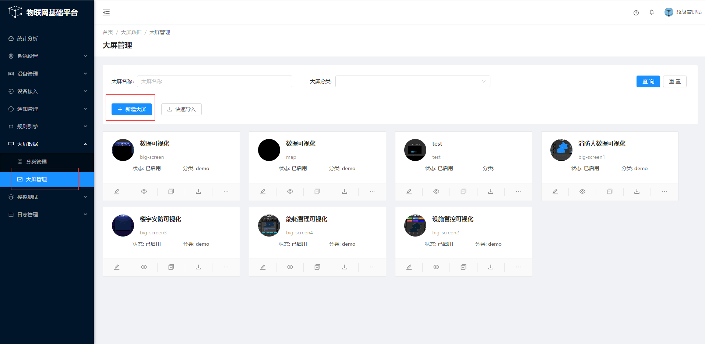

2. 在**新建大屏** 对话框中，输入可视化应用的信息。

   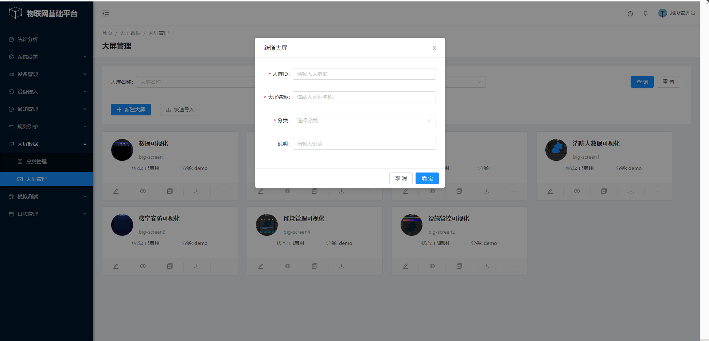

3. 单击**确认**

   应用创建成功后会跳转到大屏编辑页面

   然后跳转进入大屏编辑页面

   

### 添加并配置可视化组件

#### 添加并配置柱形图组件

1. 在画布左上组件栏中，鼠标滑过第一列**图表列**，出现图标列组件，点击**柱形图**，将**柱形图**组件添加到画布中.

   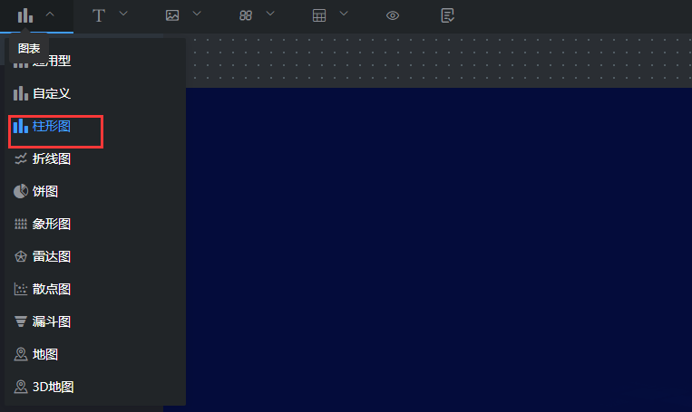  

2. 配置**柱形图**的样式

   

3. 配置**柱形图**的数据，

   在**代码编辑**中，修改数据

   

   修改好数据后，点击**确认**。

   

   然后点击**刷新**。

   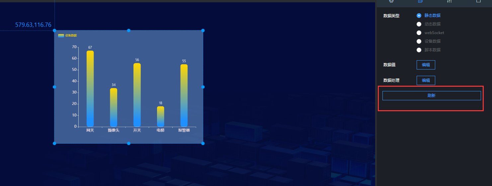  

   通过上面的方式添加上您的大屏所需要的组件，完成大屏组件的拖拽。

### 调整组件的图层和位置

1. 在平台**大屏管理**页面中，选择一个可视化应用，单击**编辑**。

   

2. 右击组件，选择调整组件的图层位置，或者在左侧图层栏，拖动组件上移或下移，调整组件图层位置。

   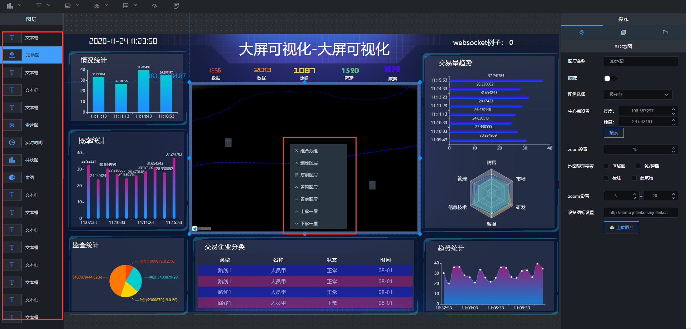

3. 在画布中通过拖拽调整组件位置，或在**操作栏**的参数中修改组件的坐标位置。

   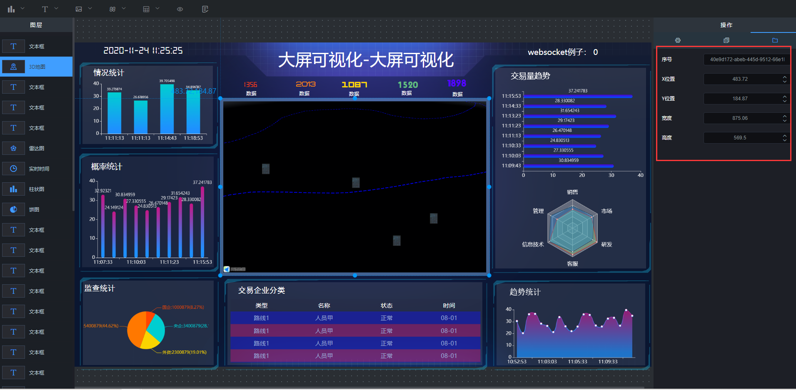

### 预览并保存可视化应用

1. 单击画布编辑器顶部的**预览**图标，预览可视化应用。

     

2. 单击画布编辑器顶部的**保存**图标，保存可视化应用。

     

### 查看可视化应用

1. 在平台**大屏管理**页面中，选择一个可视化应用，单击**预览**。

   

2. 即可成功查看到可视化应用

   

## 可视化应用管理

### 编辑可视化应用

1. 在平台**大屏管理**页面中，选择一个可视化应用，单击**编辑**。

   

2. 在可视化应用编辑页面，修改组件的布局和配置，或者添加、删除组件，完成可视化应用的编辑。

   编辑完成后，可查看可视化应用。

### 重命名可视化应用

1. 在平台**大屏管理**页面中，选择一个可视化应用，单击**编辑**图标。

   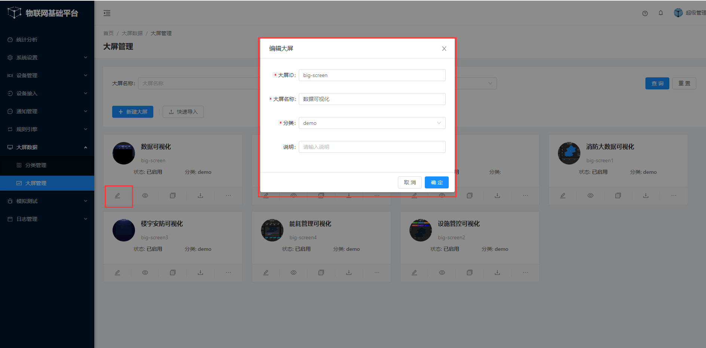

### 复制可视化应用

1. 在平台**大屏管理**页面中，选择一个可视化应用，单击**复制**图标。

   

2. 重新填写大屏信息，系统会自动生成一个相同的可视化应用

   

### 下载和导入可视化应用

1. 在平台**大屏管理**页面中，选择一个可视化应用，单击**下载**图标，可以把可视化应用下载下来。

    

2. 在平台**大屏管理**页面中，选择一个可视化应用，单击**快速导入**图标，可以把下载下来的可视化应用导入进平台。

   
::: tip 温馨提示：
**注意json文件的大屏id是否与平台已有的数据重复，如果重复，需要先修改id，才能导入成功
:::
### 删除可视化应用

1. 新建的可视化应用默认是**已启动**状态，此时是不能删除的，需要把其改为**已禁用**状态

   

2.  然后就可以单击删除，删除可视化应用，同时也可以启动可视化应用

   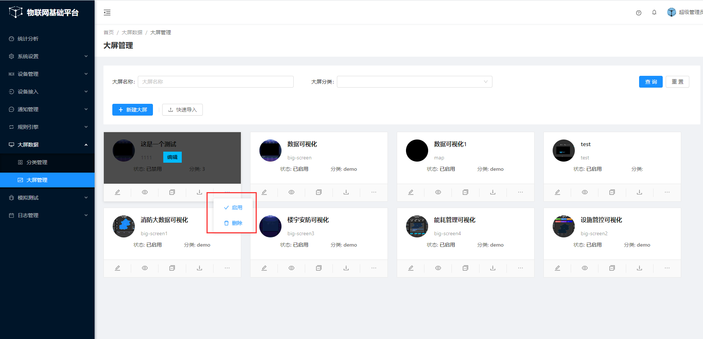

### 预览可视化应用

1. 在平台**大屏管理**页面中，选择一个可视化应用，单击**预览**图标。

   

## 数据配置管理

一个组件最多只有5种数据配置方式，分别为：静态数据、动态数据、WebSocket、设备数据和脚本数据

### 静态数据

第一步，点击选择**静态数据**，编辑数据值

第二步，弹出数据值编辑框，修改数据值，点击**确定**

第三步，此时数据就成功被设置。

### 动态数据

第一步， 选择数据类型为**动态数据**，然后填入请求接口url，选择请求方式

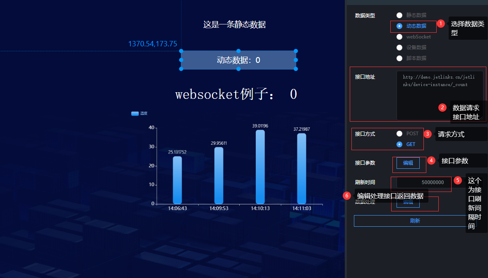

第二步，编辑参数，参数必须是json格式，而且**需要避免符号为中文符号**

第三步，刷新时间设置，默认为5s刷新一次（即5s重新请求一次接口）。接下来需要编辑接口返回的数据（注意里面的代码为js代码），让其渲染到组件上。

第四步，点击刷新

### WebSocket

第一步，选择数据类型为**WebSocket**

第二步，编辑接口参数

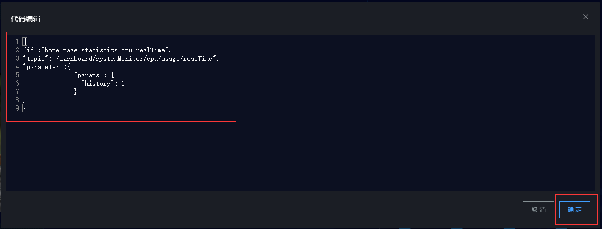

第三步，编辑接口返回数据

第四步，点击刷新

### 设备数据

第一步，选择数据类型为**设备数据**，然后选择设备，配置参数

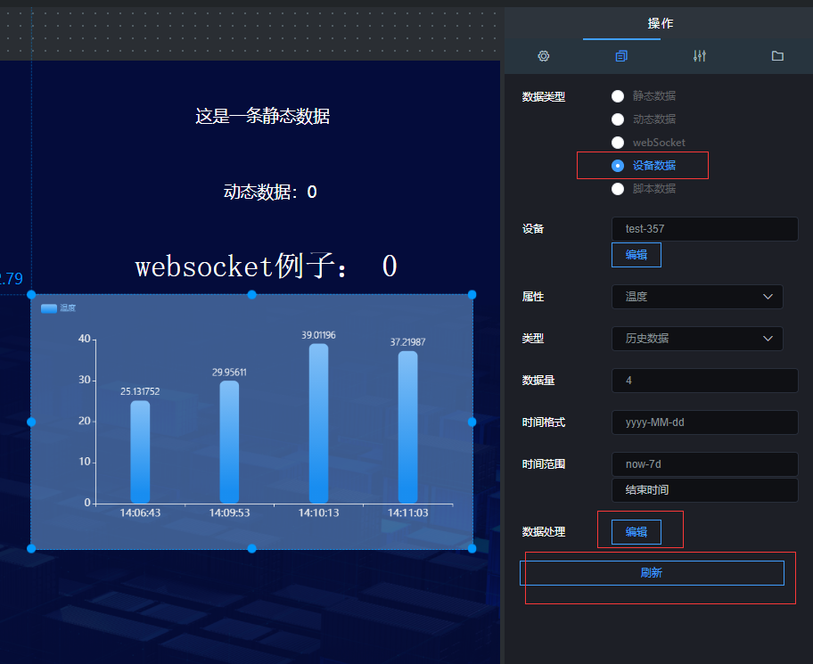

第二步，编辑返回数据

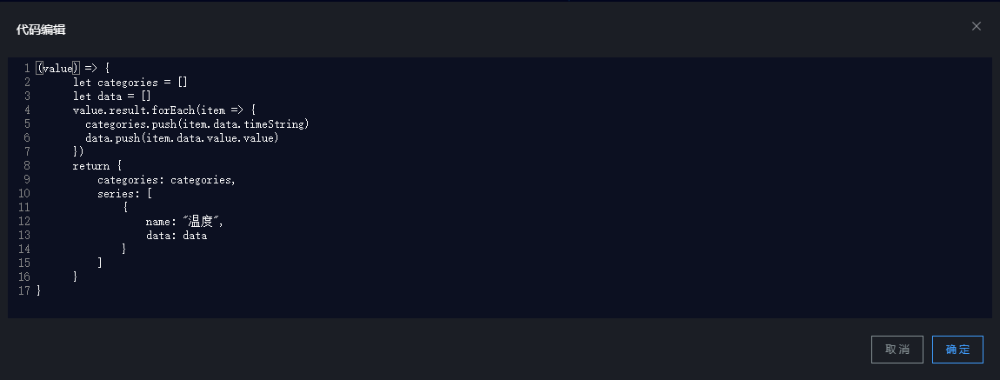

第三步，点击刷新

### 脚本数据

第一步，选择数据类型为**脚本数据**

第二步，编辑脚本代码

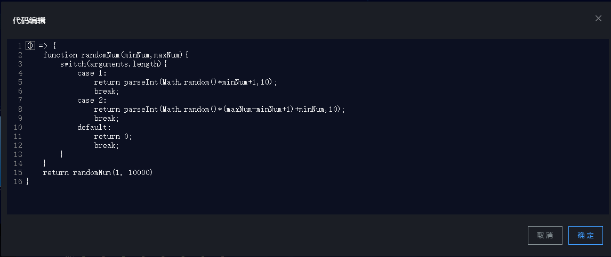

第三步，编辑返回数据

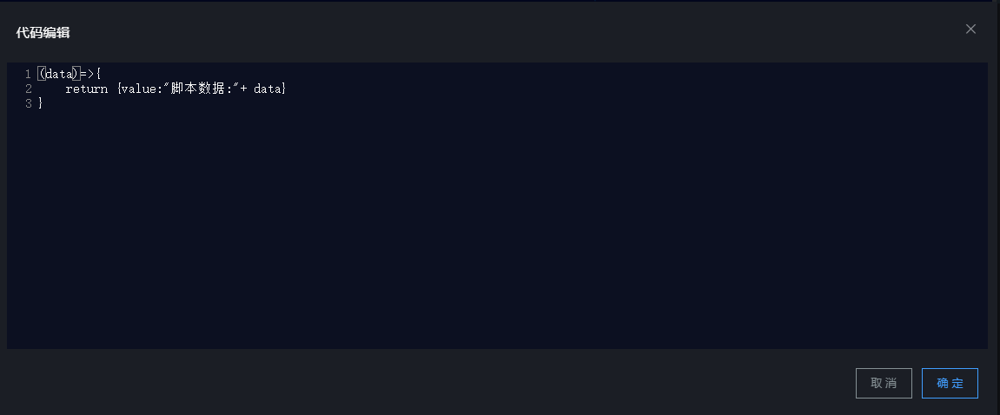

第四步，点击刷新

