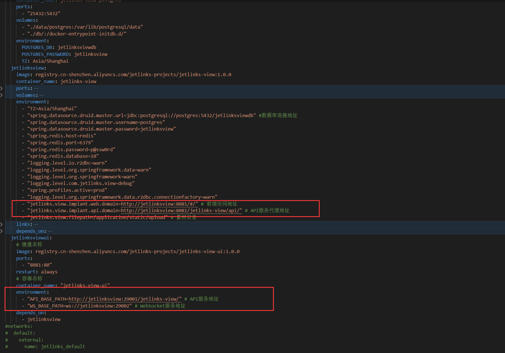
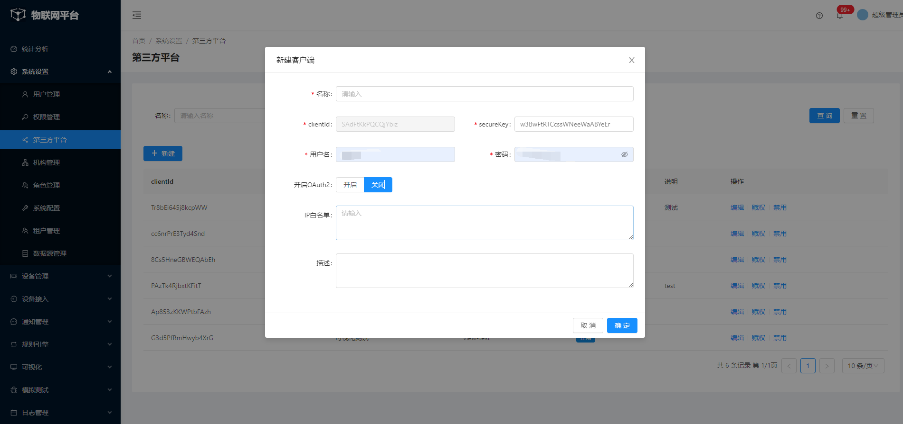
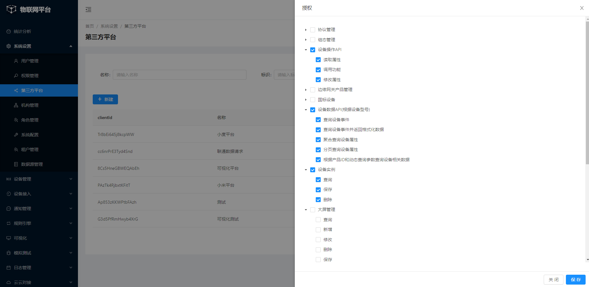

# 启动大屏

jetlinks新版大屏是独立的项目，需要手动和jetlinks-pro平台集成。
可视化大屏分为两个项目可视化前端和可视化后端是独立的项目。


## 获取源码
下载大屏代码：

```bash
$ git clone git@github.com:jetlinks/jetlinks-view.git
```
下载组态代码：

```bash
$ git clone git@github.com:jetlinks/jetlinks-view-pro.git
```

源码目录结构
```
--jetlinks-view
------|----docker                     # docker
------|----|----data                  # 静态文件目录
------|----|----db                    # 数据库文件，用于docker初始化创建pg数据库容器时导入平台依赖的基础数据
------|----|----docker-compose.yml    # 自动化部署
------|----jetlinks-view-admin        # 入口及业务实现模块
------|----jetlinks-view-core         # 核心模块
------|----jetlinks-view-perms        # 公共模块
------|----jetlinks-view-system       # 系统模块
------|----jetlinks-view-ui           # ui模块
```

## docker启动

进入`jetlinks-view\docker`目录下修改`docker-compose.yml`内的参数


- 在jetlinksview服务节点下的environment新增以下两条参数
- 
```yaml
"jetlinks.view.implant.web.domain=http://jetlinksview:8081/#/" # 大屏前端部署访问地址
"jetlinks.view.implant.api.domain=http://jetlinksview:8081/jetlinks-view/api/" # 大屏前端API服务代理地址
```

- 在jetlinksviewui服务节点下的environment新增以下两条参数

```yaml
"API_BASE_PATH=http://jetlinksview:29001/jetlinks-view/" # API服务地址
"WS_BASE_PATH=ws://jetlinksview:29002" # WebSocket服务地址
```

执行`docker-compose up -d`命令启动可视化项目依赖的基础服务Redis和PostgreSQL以及平台提供的镜像仓库内的大屏项目。

## 源码启动

- 启动后端

::: warning
前端源码启动及打包版本要求
node 14.17.6 LTS版本
npm 6.14 版本过高会打包失败
:::

在`jetlinks-view`目录下执行以下命令
```shell
mvn clean package -Dmaven.test.skip=true
```

将打包好的jar上传至服务器后执行以下命令

```shell
java -jar jetlinks-view-admin.jar
```

守护态启动命令：
```shell
nohup java -jar jetlinks-view-admin.jar > jetlinks-view.log &
```

- 启动前端

进入`jetlinks-view-ui`目录

```shell
# 安装依赖npm、yarn二选一
npm install
yarn install
```

本地启动项目
```shell
npm run dev
yarn dev
```

打包项目
```shell
npm run build
yarn build
```

服务器使用`dist`目录源码部署需配合`nginx`搭建前端。

nginx配置文件可以参考`jetlinks-view-ui`目录下的`CICD`下的`env_default.conf`文件

需要更改的参数主要是`API_BASE_PATH`参数以及`.env.production`内的`VITE_API_URL`,`VITE_WEBSOCKET_URL`两个参数


## 自行制作镜像

如不想使用平台提供的镜像，可自行打包镜像。

- `jetlinks-view`根目录提供了打包后端docker镜像脚本的文件`build-and-push-docker.sh`。
- `jetlinks-view-ui`目录提供了打包前端docker镜像脚本的文件`build-and-push-docker.sh`。


自行打包镜像时需要自己提供镜像仓库地址，同时修改脚本内的`dockerImage`参数。阿里云提供个人版的镜像仓库，可以自行去申请。

然后在脚本所在路径执行`./build-and-push-docker.sh`命令即可。

打包完成后执行第二步docker启动内的操作。

## jetlinks平台配置修改
+ 使用源码部署情况下
    - 方式1：

    在jetlinks中添加大屏跳转地址： 

    在配置文件`jetlinks-pro/jetlinks-standalone/src/main/resources/application.yml`中添加下面的参数

    ```yaml
    api:
      urls:
        big-screen-pm: http://localhost:29001/jetlinks-view/implant/v3/ImplantGetUserByToken/project/{token} #项目管理
        big-screen-datasource: http://localhost:29001/jetlinks-view/implant/v3/ImplantGetUserByToken/datasource/{token} #数据源管理
    ```

    - 方式2：
    在启动jetlinks-pro项目时加上以下参数

    ```shell
    java -jar --api.urls.big-screen-pm=http://localhost:29001/jetlinks-view/implant/v3/ImplantGetUserByToken/project/{token} --api.urls.big-screen-datasource=http://localhost:29001/jetlinks-view/implant/v3/ImplantGetUserByToken/datasource/{token} jetlinks-standalone.jar
    ```
+ docker方式启动
	
    在jetlinks-pro的`dc文件（docker-compose.yml）`内找到`jetlinks-pro`节点在`environment`下添加下面两条参数
    ```yaml
    api.urls.big-screen-pm: http://localhost:29001/jetlinks-view/implant/v3/ImplantGetUserByToken/project/{token}
    api.urls.big-screen-datasource: http://localhost:29001/jetlinks-view/implant/v3/ImplantGetUserByToken/datasource/{token}
    ```

重新启动jetlinks-pro平台。

## 和jetlinks IOT平台集成

- 在权限管理里将id为`device-api-product`，`device-opt-api`，`device-instance`数据进行编辑，修改分类为`API接口`

- 登录jetlinks IOT平台，菜单选择系统设置>第三方平台，新增一个第三方平台

- 第三方平台赋权（勾选如下所示权限）


- 获取到jetlinks申请的clientId和secureKey后，登录jetlinks-view平台，菜单选择鉴权管理，找到"jetlinksIOT系统OpenAPI鉴权规则"，点击修改填写请求参数配置`X-Client-Id`和`Jetlinks_OpenApi_secureKey`以及请求路径。

该路径配置成jetlinks IOT平台部署地址改参数可以配置成以下两种方式：

第一种通过jetlinks IOT前端nginx代理的方式访问, jetlinks IOT前端默认使用9000端口+/jetlinks的方式转发至后端8844服务上

第二种则是直接请求jetlinks IOT后端接口

```yaml
http://192.168.1.123:9000/jetlinks/api/v1/token
http://192.168.1.123:8844/api/v1/token
```
 
- 修改jetlinks-view数据库的默认值

:::warning
将数据库内给的默认值替换成自行部署的jetlinks IOT（jetlinks-pro）平台环境地址。

根据实际情况下方SQL内的`0.0.0.0:90000`换成自己的`IP`及`端口`，然后连接view数据库执行批量更新jetlinks环境语句

若上一步配置的jetlinks IOT后端地址是前端代理
:::
```sql
update ink_datasource set source_url=replace(source_url,'demo.jetlinks.cn', '0.0.0.0:9000') where source_flag=1;

```
直接使用jetlinks IOT后端接口
```sql
update ink_datasource set source_url=replace(source_url,'demo.jetlinks.cn/jetlinks', '0.0.0.0:8844') where source_flag=1;

```


- 点击测试按钮进行校验返回的有`result`参数则说明集成成功。
```json
{
	"result": ["d91eb32115e046bd8dfdc9c5f935b021"],
	"System_Record_Time": ["2022-08-22 16:56:25"],
	"message": ["success"],
	"status": [200.0],
	"timestamp": [1.661158585047E12]
}
```
