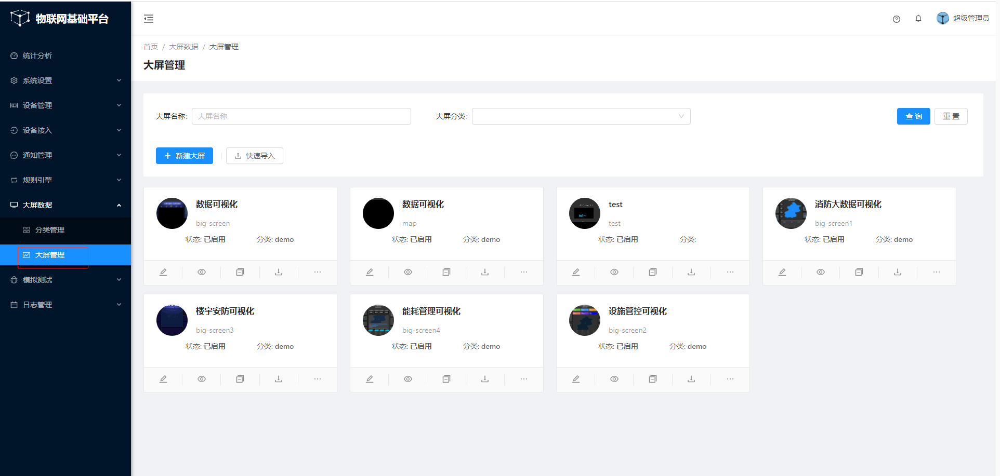

# 启动大屏

jetlinks的可视化数据大屏的前端是独立的，启动完jetlinks的平台前端和后端服务，如果你需要使用大屏可视化，还需要启动大屏前端。

::: warning
可视化数据大屏设计器暂未免费开源 (企业版中提供)
:::

## 本地启动
下载大屏前端代码：

```bash
$ git clone https://github.com/jetlinks/jetlinks-big-screen.git
$ cd jetlinks-big-screen
```

修改后台接口地址：进入vue.config.js，修改后端请求地址

```javascript
devServer: {
    proxy: {
        "/jetlinks": {
            target: "http://demo.jetlinks.cn/jetlinks", // 你的后端地址
                changeOrigin: true,
                ws: "ws://demo.jetlinks.cn/jetlinks", // 你的后端websocket地址
                pathRewrite: {
                '^/jetlinks': ''
            }
        },
    }
}
```

启动：

```bash
$ cd jetlinks-big-screen
$ npm install
$ npm run serve 
```

## docker启动
可通过docker镜像启动大屏，执行性如下命令：  
```bash
docker run -d -e "API_BASE_PATH=http://host.docker.internal:8844/" --name=big-screen -p 9002:80 registry.cn-shenzhen.aliyuncs.com/jetlinks-pro/jetlinks-big-screen:1.0.0
```

或者在docker-compose.yml中加入如下配置：
```yaml
  big-screen:
    image: registry.cn-shenzhen.aliyuncs.com/jetlinks-pro/jetlinks-big-screen:1.0.0
    container_name: big-screen
    ports:
      - 9002:80
    environment:
      - "API_BASE_PATH=http://192.168.3.25:8844/" #API根路径
```

::: tip 注意：
API_BASE_PATH为jetlinks服务地址。
:::

## jetlinks配置修改
在jetlinks中修改大屏跳转地址： jetlinks-pro/jetlinks-standalone/src/main/resources/application.yml
```yaml
api:
  urls:
    big-screen-path: http://localhost:9002/ #localhost根据大屏实际部署地址修改
```
创建大屏权限：进入平台，系统设置=>权限管理=>新建


赋权：进入平台，系统设置=>用户管理=>赋权，给用户赋权：


然后通过平台的大屏管理进入大屏：




