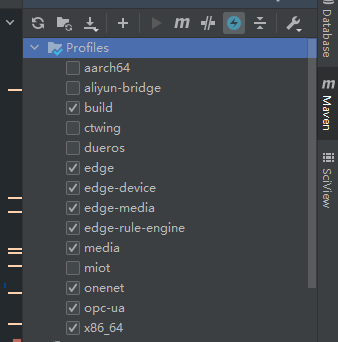
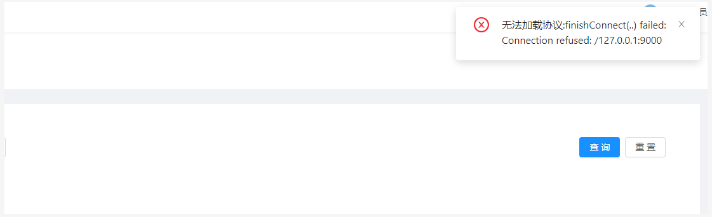

## 项目在本地环境安装的时候镜像总是拉取不下来？
* IDEA：File->Settings->Maven->User settings->选自己安装的maven里的settings.xml
* Local repository:使用默认的
* 查看settings.xml里的mirrors节点，将mirror节点注释。
* 删除repository里的jar包，maven视图栏里reimport/refresh

## 项目在启动时报类缺失或者找不到？
* 查看java文件引入类是否报错？
* 报错的话，将pro及standalone两个仓库切至develop分支，并更新代码及子模块
* maven视图栏找到root节点的模块 执行clean
* maven视图栏选择蓝色闪电图标并执行install/package
* 保证mvn命令可执行的情况下，执行以下命令
```yaml
mvn clean package -Dmaven.test.skip=true 
```

## 项目在docker-compose拉取镜像时偶尔报出ERROR异常
* 系统要求JDK 1.8.0_2xx <br/>
*  ubantu 18.0.x系统<br/>
*  自行配置国内镜像仓库地址

## 项目使用jar包方式在服务器使用jar命令启动时报如下错误

设置`application.yml`内的参数，参数如下
>  spring.reactor.debug-agent.enabled=false

##   启动报elasticsearch节点无法进入
进入jetlinks挂载目录`data`文件夹内，进入data文件夹，找到`elasticsearch`目录
执行以下命令中任意一个即可
```shell script
chmod 777 -R elasticsearch
chmod 755 -R elasticsearch
```

---

##   若启动时只有jetlinks的banner显示
修改yml内logging.level.org.jetlinks的日志显示级别是debug
```shell script
docker logs -f [serviceName]
#具体的serviceName可通过docker-compose images 命令查看
```

---
##   启动无故失败

使用down命令清除docker-compose编排的挂载目录、网络以及缓存等消息，再重启

```yaml
docker-compose down
docker-compose up -d
```

---
## 切换成mysql数据库报'unknown database jetlinks'

 自行在mysql数据库里创建jetlinks的数据库，表可不建，项目会在启动时自己创建表结构以及初始化部分数据。

---

## 项目启动报以下错误


查看日志启动时使用的profiles
修改启动类项目下的application以及profile指定激活的application文件里的
```yaml
 easyorm.dialect
 easyorm.default-schema
```

改成对应的数据库方言<br/>
例：使用embedded环境<br/>
默认数据库方言h2<br/>
如使用mysql：则需要指定dialect为mysql<br/>
default-schema也需要改成创建的数据库名

## 数据库切换至mysql后项目启动时报"Operator called default onErrorDropped",下拉至底部抛出"Caused by: javax.net.ssl.SSLHandshakeException: No appropriate protocol (protocol is disabled or cipher suites are inappropriate)"

查看数据库是否开启SSL

```yaml
show global variables like '%ssl%';
+---------------+-----------------+
| Variable_name | Value           |
+---------------+-----------------+
| have_openssl  | YES             |
| have_ssl      | YES             |    #已经开启了SSL
| ssl_ca        | ca.pem          |
| ssl_capath    |                 |
| ssl_cert      | server-cert.pem |
| ssl_cipher    |                 |
| ssl_crl       |                 |
| ssl_crlpath   |                 |
| ssl_key       | server-key.pem  |
+---------------+-----------------+
```

如果开启了ssl 可以在连接地址中加入`ssl=false`【r2dbc协议参数】参数指定关闭ssl连接;
项目启动时如报警告时区未设置，加上`serverTimezone=GMT`参数。

---

## 项目启动时发现admin用户没有完整的权限
* 登录http://demo.jetlinks.cn/ 账密：联系jetlinks方人员
* 系统设置→权限管理 →导出
* 回到自己部署的项目：系统设置→权限管理 →导入
* 用户管理→赋权→勾上需要的权限
* 退出重新登录

## 项目启动发现某些资源访问404
根据https://github.com/jetlinks/jetlinks-pro下
的操作步骤一步一步拉取代码<br/>
不要跳过更新代码！！！<br/>
更改的代码也不要提交到jetlinks的代码仓库，请自行建立代码托管仓库！！！


>执行完成更新代码第二步后，将jetlinks-pro及jetlinks-standalone项目的分支切换至develop


勾选需要的模块<br/>
基础必选模块：build、x86_64


---
## 设备无法连接上jetlinks平台
* 网络组件host建议填入0.0.0.0
* 端口：查看docker-compose.yml里的预留端口 默认预留的8100-8110端口 填入预留的端口，如需更多端口请自定义后重启项目即可
* 微服务版：在micro-service目录下的docker-compose.yml里的iot组件内添加自定义ports
* 修改后重启网络组件
* 仍然不能接入，查看云服务器：如阿里云，检查安全组内是否开放了预留端口
* 再尝试使用emqx socket_tool等工具连接

---
## 微服务版本在启动micro-service时提示无法连接127.0.0.1:6379/5432等端口

修改micro-service内的docker-compose.yml<br/>
查看给启动失败的component添加environment参数

  添加下面的参数信息，ip换成自己的服务器公网ip <br/>
```yaml
"spring.redis.host=192.168.22.65"
"elasticsearch.client.host=192.168.22.65"
"spring.r2dbc.url=r2dbc:postgresql://192.168.22.65:5432/jetlinks"
```

## 微服务版本如何添加组件模块？
以OPC-UA为例，
https://github.com/jetlinks/jetlinks-opc-ua
下的操作说明拉取opc-ua模块，单机版按照文档指示操作。<br/>
微服务版本在jetlinks-parent内加入
```yaml
<modules>
    <module>expands-components/jetlinks-opc-ua</module>
</modules>
```
在`iot-service`模块内加入
```yaml
<dependency>
    <groupId>org.jetlinks.pro</groupId>
    <artifactId>jetlinks-opc-ua</artifactId>
    <version>${project.version}</version>
    <!--${project.version}替换成iot-service内引用的版本 -->
</dependency>
```
在`api-gateway-service`模块内的`application.yml`文件内找到`iot-service`组件<br/>
在`predicates`字段后添加`/opc/**`路由<br/>
其他模块类似,具体路由路径查看引入项目内的web目录下的controller方法上注解的`@RequestMapping`标识。

## 上传的协议包在发布的时候提示无法加载协议

修改docker-compose.yml里面的
```yaml
hsweb.file.upload.static-location
改成能访问的公网ip，后缀目录请勿变化
```
---
## 大屏项目启动后访问的ip地址仍为127.0.0.1
docker-compose.yml里面的jetlinks镜像下 environment参数内添加
```yaml
api.urls.big-screen-path=http://公网ip:9002/
```

----

## 调试邮件发送报No appropriate protocol (protocol is disabled or cipher suites are inappropriate)
配置以下参数
```yaml
 mail.smtp.starttls.enable：true
 mail.smtp.auth：true
 mail.smtp.socketFactory.class：javax.net.ssl.SSLSocketFactory
 mail.smtp.socketFactory.port：465
 mail.smtp.port：465
 mail.smtp.ssl.protocols：TLSv1.2
```

## 视频网关如何配置？
[视频网关配置](../media-guide/media-base-config.md)

## 关于集群下的mqtt客户端组件无法共享订阅问题？
1. 集群下的服务器要分配不同的server-id
2. 网络组件->独立配置->填写不同的服务ip/域名、clientId
3. 推送消息时topic无需带“/”

## 关于设备->运行状态无法自动刷新需要手动刷新问题。
1. F12查看console报错原因
2. 提示connection failed
3. 9000代理后端端口不正确
4. 修改前端API_BASE_PATH路径 
5. docker方式启动指定-e 参数

## 自定义的消息协议为什么点击方法调用返回超时？
1. 自定义的协议jar包是否有这个功能？
2. 自定义的协议jar包是否上传至jetlinks平台重新发布？
3. 自定义协议是否使用了正确的下发消息类型？
如：
调用设备功能需使用：FunctionInvokeMessage<br/>
设备属性读取需使用：ReadPropertyMessage<br/>
...
  
## 如何使用podman部署？
podman大部分兼容docker，并且可以直接使用docker镜像、命令非常相似
podman默认的镜像库为国外的，可以使用国内的镜像地址来镜像加速。

