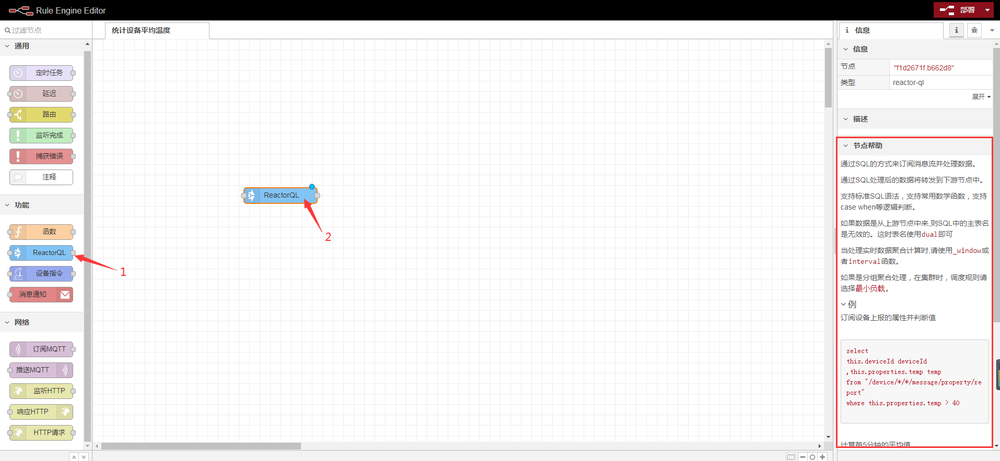

# 在规则引擎中统计设备平均温度

原理: 利用`ReactorQL`订阅设备的实时数据,使用聚合函数来处理数据.

## 创建规则实例

1. 进入系统: `规则引擎`-`规则实例`-`创建规则`。  

2. 输入id、名称。  

3. 点击`确定`进行保存。  

  

## 创建ReactorQL节点

1. 点击规则实例上的`编辑`按钮。  

  

2. 在工作区中拖入`监听HTTP`节点。  



使用方式可参考工作区右侧的`节点帮助`。  

3. 双击节点进入编辑页。  

  

使用SQL如下：  
```sql

select 
avg(this.properties.temperature) avg, --平均温度
max(this.properties.temperature) max, --最大值
min(this.properties.temperature) min, --最小值
count(1) count  --总计上报次数
from "/device/t-sensor/*/message/property/**" --订阅t-sensor型号下所有设备
group by interval('1m')
having avg > 30 -- 平均温度高于30度 就发送数据到下一个节点

```

## 发送邮件通知

在工作区中拖入`消息通知`节点，并编辑。  

  

配置请参考[通知-邮件](../basics-guide/course/notification.md#邮件通知)  

使用jetlinks源码中的模拟器模拟上报温度数据，平均温度高于30度，将会发送邮件。  

   

收到邮件  

   

