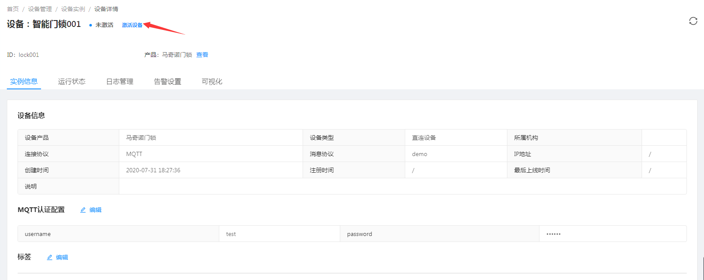

# 当房间开门时,打开对应房间的空调

原理: 

1. 利用`ReactorQL节点`来订阅设备的开门事件. 
2. 利用`设备指令`节点选择相同分组内的另外一个设备.

## 创建智能门锁设备

1. 进入系统: `设备管理`-`设备产品`-`新建`。  

   

2. 输入产品信息以及相关信息。  

   

3. 点击`确定`进行保存。  

4. 配置MQTT认证信息。  

   

5. 配置物模型。  

   

6. 应用配置。  

   

7. 创建设备实例。  

   

8. 激活设备。  

   

::: tip 注意：
新建产品启用需要发布，此处直接点击`应用配置`按钮，则会自动发布该产品。  
:::

## 创建智能空调设备

参考[创建智能门锁设备](#创建智能门锁设备)。  

创建产品： 
 
  

配置物模型：  

  

创建设备实例：  

  

分别激活设备产品、设备实例。  

## 创建房间分组

1. 创建分组

  

2. 关联智能门锁和智能空调。  

  

## 创建规则实例

### 创建ReactorQL节点

1. 在工作区中拖入`监听HTTP`节点。  


使用方式可参考工作区右侧的`节点帮助`。  

2. 双击节点进入编辑页。  

  

使用SQL如下：  

```sql
select 
t.deviceId deviceId
from "/device/t-lock/*/message/event/open-door" t
```

### 创建设备指令

1. 在工作区中拖入`设备指令`节点。  


使用方式可参考工作区右侧的`节点帮助`。  

2. 双击节点进入编辑页。  

  

选择设备输入:
```text
same_group(deviceId),product('t-smart-ac')
```

消息内容输入:
```json
{
  "messageType": "INVOKE_FUNCTION",
  "functionId":"open",
  "inputs": []
}
```

配置完成后[启动规则](../basics-guide/course/rule-engine-nodered.md#保存)。  
## 模拟器设备消息

1. 此处通过mqtt.fx来模拟智能门锁lock001（以下简称客户端lock001）   

  

和智能空调ac001（以下简称客户端ac001） 。  

  

点击按钮`Connect`连接平台，连接成功后，设备应为在线状态。  

::: tip 注意： 
同一台机器无法开启两个mqtt.fx客户端时，请在两台机器上模拟两个设备，或者启用jetlinks源码中的[模拟器](https://github.com/jetlinks/jetlinks-community/tree/master/simulator)。
:::

2. 在客户端ac001中订阅功能调用topic：`/invoke-function`。  

  

3. 在客户端lock001中推送开门的事件，topic为`/open-door`。  

  

4. 客户端ac001收到功能调用消息表示此规则应用成功。  

  