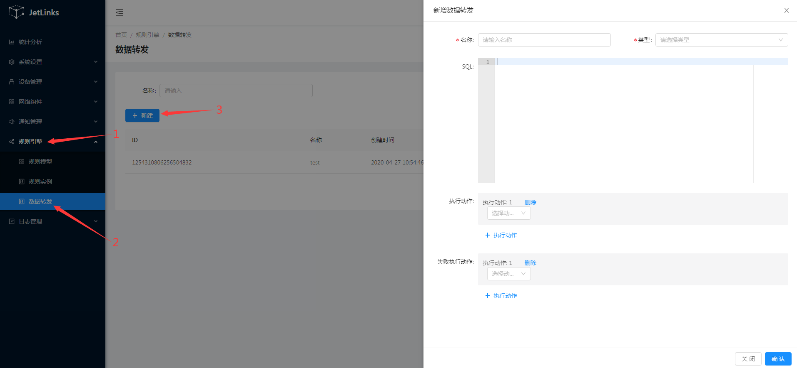
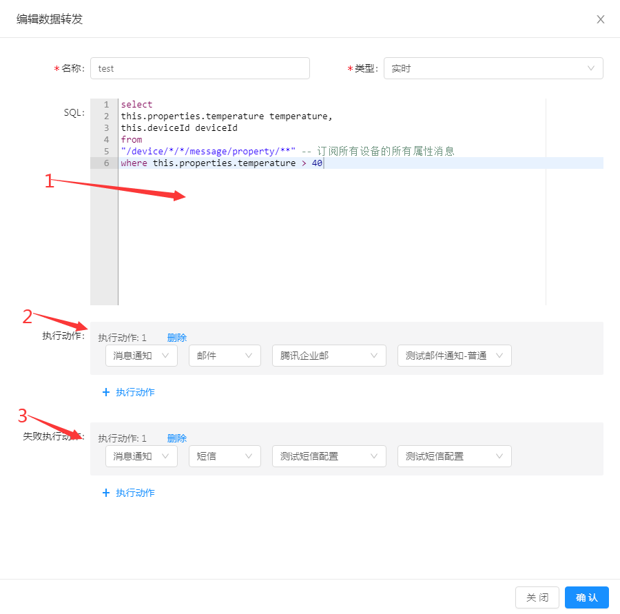

# 规则引擎-数据转发

规则引擎中可使用SQL来订阅消息网关中到数据,并将处理后的数据转发到指定的地方,如: 发送消息通知,推送到MQ等.
支持标准sql语法与拓展函数,支持聚合函数,窗口函数.

## 创建规则

**操作步骤**
1. 进入系统: `规则引擎`-`数据转发`-`新建`。  
  
  
2. 编辑数据转发信息。 

  i. 在`SQL`中填写需执行的SQL语句（请参考[SQL例子](../dev-guide/reactor-ql.md)）；  
    
  ii.  选择执行动作；  
    
  iii. 选择失败执行动作。  
  
  
1. 点击`确定`进行保存。  
