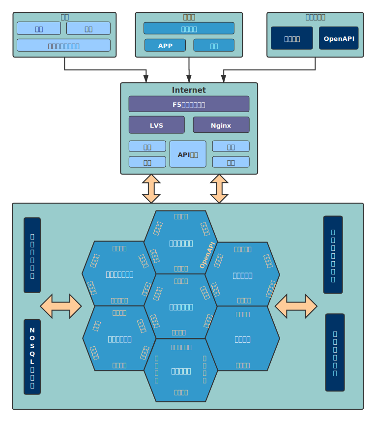

# 微服务

企业版中提供了对微服务的支持,可通过微服务的方式,实现对业务系统开发及整合。

## 架构图



主要技术栈:

1. spring-cloud: 微服务框架。
2. spring-cloud-gateway: api网关，负责路由以及统一鉴权。
3. alibaba-nacos: 注册中心、配置中心。
4. spring-webflux: 响应式web框架。
5. jetlinks-pro: jetlinks企业版相关模块。


## 业务服务模块集成

jetlinks cloud 使用`nacos`作为服务注册中心。微服务需要注册到`nacos`中。nacos使用请[查看文档](https://nacos.io/zh-cn/docs/what-is-nacos.html)。
业务模块配置好后


## 统一身份认证

::: tip JWT说明
jwt默认使用`RSA`进行加密,下游服务通过解析jwt中的subject,则为当前登录用户的认证信息。

```java
byte[] keyBytes = Base64.decodeBase64(key);
X509EncodedKeySpec keySpec = new X509EncodedKeySpec(keyBytes);
KeyFactory keyFactory = KeyFactory.getInstance("RSA");
PublicKey key = keyFactory.generatePublic(keySpec);
Algorithm algorithm = Algorithm.RSA256((RSAPublicKey) key, null);
JWTVerifier verifier = JWT.require(algorithm)
    .withIssuer("api.gateway")
    .build();
DecodedJWT jwt = verifier.verify(token.substring(4));
String infoJson=jwt.getSubject();//认证信息

```
:::

认证信息格式:

```json
{
	"user": {
		"id": "1199596756811550720", //user id
		"username": "admin", //用户名
		"name": "超级管理员", //姓名
		"type": "user" //类型
	},
	"permissions": [{
		"id": "device-instance", //权限ID
		"name": "设备实例", //权限名称
		"actions": ["query", "save", "delete"] //可进行到操作
  }],
  //用户维度
	"dimensions": [{
		"id": "admin", //维度标识
		"name": "管理员", //名称
		"type": "role" //类型，如: 角色,机构,租户等
	}],
	"attributes": {}
}
```

:::tip 租户维度说明
当用户是一个租户的成员时,在认证信息中的维度信息(`dimensions`)中将会有如下数据:

```json
 {
    "id": "77f1552ed133b44b3886a3ea965a6adc", //租户ID
    "name": "测试", //租户名称
    "type": "tenant", //类型固定为tenant
    "options": {
        "admin": true, //是否为租户管理员
        "memberName": "测试", //租户成员名称
        "main": true, //是否为主租户,同一个用户在多个租户中时,用来标识用户的主租户
        "memberType": "tenantMember", //成员类型
        "memberId": "39d36d9be23e97758d54b5eba97cbf5d"
    }
}
```
:::


2. 业务服务模块集成
3. 微服务之间API调用
4. 跨地域微服务开发,调试

## 内部微服务开发

开发内部服务时, 建议使用以下方式进行开发。

开发环境:

`JDK 1.8.0_2xx`,`maven3.3.x`,`docker`,`ElasticSearch 6.8.x`,`PostgreSQL 11`,`Redis 5.x`,`nacos 1.2.x`

目录结构:

```bash
--|--.... 
--|--micro-services                     #微服务相关模块
--|------|---api-gateway-service        #api网关服务 
--|------|---authentication-service     #统一认证服务
--|------|---iot-service                #设备接入微服务 
--|------|---service-components         #微服务通用组件
--|------|---service-dependencie        #微服务统一依赖管理 
--|--docker-compose.yml                 #使用docker快速启动开发环境
--|--....

```

微服务模块统一命名以`service`结尾,如:`xxxxx-service`.并且引入`service-dependencies`进行统一依赖管理.

## 服务注册

使用`nacos`进行服务注册及发现,配置文件:`resources/boostrap.yml`.

```yml
spring:
  cloud:
    nacos:
      discovery:
        enabled: true
        server-addr: 127.0.0.1:8848
```

## 路由配置

TODO

## 统一认证

用户信息由`authentication-service`统一管理,所有api请求都经过`api-gateway-service`进行路由,
在路由时,如果请求头中携带有`X-Access-Token`或者请求参数中携带有:`:X_Access_Token`,将会从`authentication-service`
获取用户认证信息,并使用`jwt`通过`http header`:`Authorization: jwt {token}`传递到下游服务。

::: tip JWT说明
jwt默认使用`RSA`进行加密,公钥通过:`jetlinks.token.jwt.key`进行配置。下游服务通过解析jwt中的subject,则为当前登录用户的认证信息。

```java
byte[] keyBytes = Base64.decodeBase64(key);
X509EncodedKeySpec keySpec = new X509EncodedKeySpec(keyBytes);
KeyFactory keyFactory = KeyFactory.getInstance("RSA");
PublicKey key = keyFactory.generatePublic(keySpec);
Algorithm algorithm = Algorithm.RSA256((RSAPublicKey) key, null);
JWTVerifier verifier = JWT.require(algorithm)
    .withIssuer("api.gateway")
    .build();
DecodedJWT jwt = verifier.verify(token.substring(4));
String infoJson=jwt.getSubject();//认证信息

```
:::

认证信息格式:

```json
{
	"user": {
		"id": "1199596756811550720", //user id
		"username": "admin", //用户名
		"name": "超级管理员", //姓名
		"type": "user" //类型
	},
	"permissions": [{
		"id": "device-instance", //权限ID
		"name": "设备实例", //权限名称
		"actions": ["query", "save", "delete"] //可进行到操作
  }],
  //用户维度
	"dimensions": [{
		"id": "admin", //维度标识
		"name": "管理员", //名称
		"type": "role" //类型，如: 角色,机构,租户等
	}],
	"attributes": {}
}
```

:::tip 租户维度说明
当用户是一个租户的成员时,在认证信息中的维度信息(`dimensions`)中将会有如下数据:

```json
 {
    "id": "77f1552ed133b44b3886a3ea965a6adc", //租户ID
    "name": "测试", //租户名称
    "type": "tenant", //类型固定为tenant
    "options": {
        "admin": true, //是否为租户管理员
        "memberName": "测试", //租户成员名称
        "main": true, //是否为主租户,同一个用户在多个租户中时,用来标识用户的主租户
        "memberType": "tenantMember", //成员类型
        "memberId": "39d36d9be23e97758d54b5eba97cbf5d"
    }
}
```
:::

### 权限控制

使用内置模块(`service-components`)进行开发时,已经封装了对应到权限解析以及处理。直接使用`Authentication`相关api即可。
如果使用其他技术栈,则需要自行认证权限信息，如: 通过过滤器获取权限信息，并设置到上下文中进行处理。

### 服务间调用

响应式方式,推荐使用`service-components`中的`ServicesRequesterManager.getWebClient(serviceId)`获取对应的服务的
`WebClient`请求接口,使用http方式来请求服务。