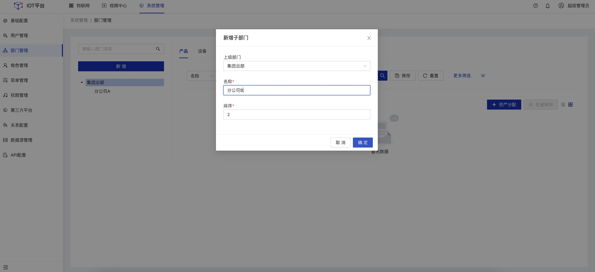
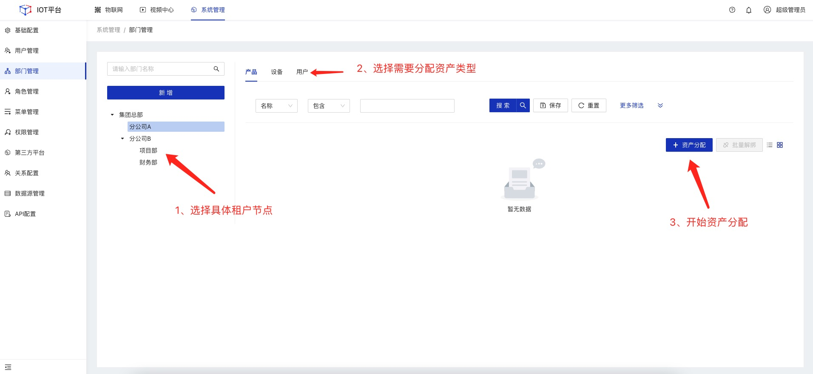
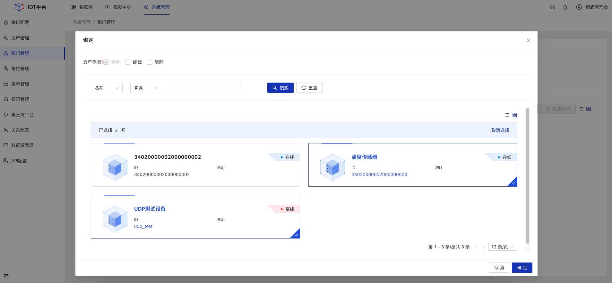

# 平台怎样支持"租户"概念问题

### 平台"租户"定义

不同的公司、组织或机构之间使用同一套系统功能，并对互相的业务数据不可见。平台将这样的公司、组织或机构定义为"租户"。

### "租户"功能支持

平台对"租户"概念由[部门管理](/System_settings/Basic_configuration13.md#部门管理)功能进行支持

*注：部门菜单名称可通过菜单管理功能，修改为"租户"管理*

#### 新增"租户"

1.点击顶部**系统管理**，在左侧导航栏，选择**部门管理**，进入列表页。 
2.点击左侧**新增**按钮，在弹框页填写"租户"信息，然后点击**确定**。 

  

    
    说明
  

"租户"支持新增多级结构，如集团总部-分公司A-项目部。

#### 租户资产分配

点击左侧树中的具体节点，点击页面右侧tab，选择要分类的资产类型（产品、设备、用户），点击**资产分配**按钮分配不同维度的资产给当前"租户"

勾选需要分配的资产数据，然后点击**确定**。实现"租户"资产分配

  

    
    说明
  

"租户"下用户所创建的业务数据，也会绑定到当前租户中。

#### 租户资产说明

1. "租户"用户进入系统功能后，对其它租户的资产数据不可见。
2. "租户"资产分配只能分配当前用户所拥有的资产。
3. "租户"可以看到"租户"下属机构、部门等虚拟维度的所有资产数据
4. "租户"之间的所有资产隔离均使用逻辑隔离实现

  

    
    特此申明！
  

   由于"租户"资产隔离实现逻辑为物理隔离。 故而平台`系统日志`、`基础配置`、`网络流量监控`等功能不支持资产隔离

#### 其他操作

"租户"其它操作请参考：[部门管理](/System_settings/Basic_configuration13.md#部门管理)
