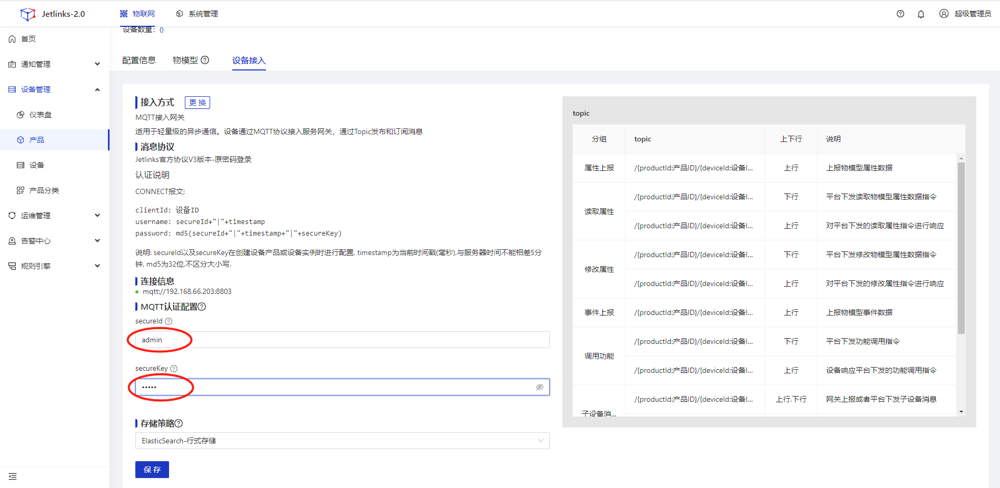
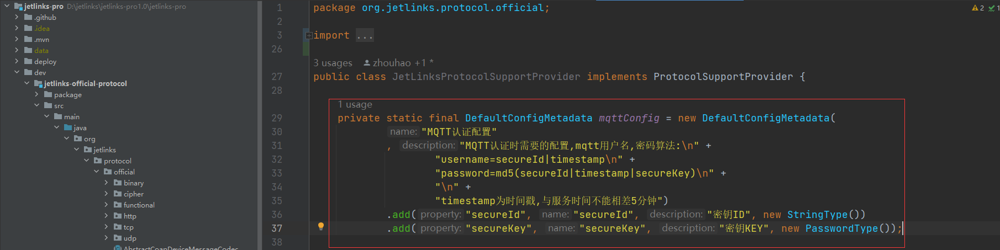

# IoT设备身份认证

## 应用场景
<div class='explanation primary'>
  <p class='explanation-title-warp'>
    <span class='iconfont icon-bangzhu explanation-icon'></span>
    <span class='explanation-title font-weight'>说明</span>
  </p>
   <p>IoT设备身份认证，是一种物联网设备的可信身份标识，具备不可篡改、不可伪造的安全属性，是实现万物互联、服务流转的关键基础设施。</p>
</div>

## 指导介绍
   <p>1. <a href="/dev-guide/IoT_device_identity_authentication.html#新建" >新建</a></p>
   <p>2. <a href="/dev-guide/IoT_device_identity_authentication.html#设备认证" >设备认证</a></p>
   <p>2. <a href="/dev-guide/IoT_device_identity_authentication.html#一机一密和一型一密" >一机一密和一型一密</a></p>

<div class='explanation primary'>
  <p class='explanation-title-warp'>
    <span class='iconfont icon-bangzhu explanation-icon'></span>
    <span class='explanation-title font-weight'>说明</span>
  </p>
   <p>MQTT认证配置,需要在协议包中进行配置,本文以官方协议的MQTT协议为例</p>
  在<code>org.jetlinks.protocol.official.JetLinksProtocolSupportProvider</code>类中第一行添加如下代码
</div>

```java
 private static final DefaultConfigMetadata mqttConfig = new DefaultConfigMetadata(
            "MQTT认证配置"
            , "MQTT认证时需要的配置,mqtt用户名,密码算法:\n" +
                    "username=secureId|timestamp\n" +
                    "password=md5(secureId|timestamp|secureKey)\n" +
                    "\n" +
                    "timestamp为时间戳,与服务时间不能相差5分钟")
            .add("secureId", "secureId", "密钥ID", new StringType())
            .add("secureKey", "secureKey", "密钥KEY", new PasswordType());
```

## 新建
### 创建产品
 参考：[创建产品](/Device_access/Create_product3.1.html)
### 点击产品，查看接入方式中的mqtt配置



### 创建设备
参考：[创建设备](/Device_access/Create_Device3.2.html)

## 设备认证

### 1.需要在`org.jetlinks.protocol.official.JetLinksProtocolSupportProvider`类中create方法内任意位置处添加如下代码添加如下代码
```java
CompositeProtocolSupport support = new CompositeProtocolSupport();
support.addAuthenticator(DefaultTransport.MQTT, new JetLinksAuthenticator());
```
### 2.JetLinksAuthenticator类中核心认证代码

```java
if (request instanceof MqttAuthenticationRequest) {
            //获取mqtt连接
            MqttAuthenticationRequest mqtt = ((MqttAuthenticationRequest) request);
            //获取用户名，格式：secureId|timestamp
            String username = mqtt.getUsername();
            //获取密码：原密码被MD5加密，md5(secureId|timestamp|secureKey)
            String password = mqtt.getPassword();
            String requestSecureId;
            try {
                //判断用户名中是否包含'|',不包含抛出异常
                String[] arr = username.split("[|]");
                if (arr.length <= 1) {
                    return Mono.just(AuthenticationResponse.error(401, "用户名格式错误"));
                }
                //取不包含时间戳的用户名作为SecureId
                requestSecureId = arr[0];
                //解析传入时间戳
                long time = Long.parseLong(arr[1]);
                //和设备时间差大于5分钟则认为无效
                if (Math.abs(System.currentTimeMillis() - time) > TimeUnit.MINUTES.toMillis(5)) {
                    return Mono.just(AuthenticationResponse.error(401, "设备时间不同步"));
                }
                //获取设备配置的secureId和secureKey
                return deviceOperation.getConfigs("secureId", "secureKey")
                        .map(conf -> {
                            //此处的secureId为设备接入处，MQTT认证配置中的secureId值
                            String secureId =  conf.getValue("secureId").map(Value::asString).orElse(null);
                            //此处的secureKey为设备接入处，MQTT认证配置中的secureKey值
                            String secureKey = conf.getValue("secureKey").map(Value::asString).orElse(null);
                            //签名
                            String digest = DigestUtils.md5Hex(username + "|" + secureKey);
                            if (requestSecureId.equals(secureId) && digest.equals(password)) {
                                return AuthenticationResponse.success(deviceOperation.getDeviceId());
                            } else {
                                return AuthenticationResponse.error(401, "密钥错误");
                            }
                        });
            } catch (NumberFormatException e) {
                return Mono.just(AuthenticationResponse.error(401, "用户名格式错误"));
            }
        }
        return Mono.just(AuthenticationResponse.error(400, "不支持的授权类型:" + request));
    }
```
## 一机一密和一型一密
`org.jetlinks.protocol.official.JetLinksProtocolSupportProvider`中MQTT原配置

### 一机一密
#### 每一台设备都有自己的认证密码
#### 在平台使用一机一密
用如下代码代替：`org.jetlinks.protocol.official.JetLinksProtocolSupportProvider`中MQTT原配置
```java
 private static final DefaultConfigMetadata mqttConfig = new DefaultConfigMetadata(
            "MQTT认证配置"
            , "MQTT认证时需要的配置,mqtt用户名,密码算法:\n" +
                    "username=secureId|timestamp\n" +
                    "password=md5(secureId|timestamp|secureKey)\n" +
                    "\n" +
                    "timestamp为时间戳,与服务时间不能相差5分钟")
            .add("secureId", "secureId", "密钥ID", new StringType())
            .add("secureKey", "secureKey", "密钥KEY", new PasswordType())
            .scope(DeviceConfigScope.device);
```
### 一型一密
#### 每一台产品下的设备使用相同的认证密码
#### 在平台使用一型一密
用如下代码代替：`org.jetlinks.protocol.official.JetLinksProtocolSupportProvider`中MQTT原配置

```java
 private static final DefaultConfigMetadata mqttConfig = new DefaultConfigMetadata(
            "MQTT认证配置"
            , "MQTT认证时需要的配置,mqtt用户名,密码算法:\n" +
                    "username=secureId|timestamp\n" +
                    "password=md5(secureId|timestamp|secureKey)\n" +
                    "\n" +
                    "timestamp为时间戳,与服务时间不能相差5分钟")
            .add("secureId", "secureId", "密钥ID", new StringType())
            .add("secureKey", "secureKey", "密钥KEY", new PasswordType())
            .scope(DeviceConfigScope.product);
```

