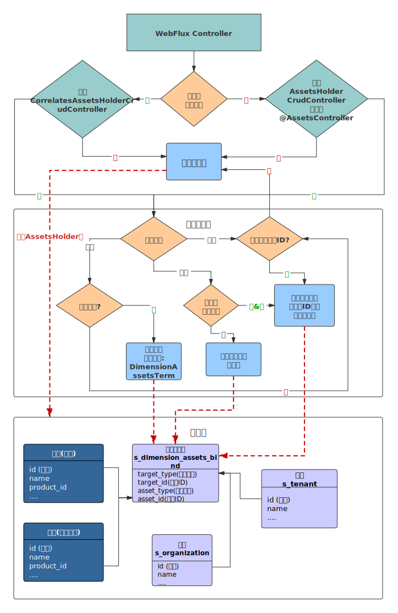

# 数据权限,资产管理

企业版`1.11`版本增加了权限的数据权限控制,可将任意数据(产品,设备,等业务数据)分配给任意维度(租户,机构,用户等).
实现灵活的数据共享个权限控制.

## 配置
为了兼容之前版本的[租户功能](./multi-tenant.md),默认此功能未开启.可根据需求通过配置进行开启.

场景一:
1. 当用户和任意`org`关联时,用户只能管理和用户关联的`org`下的数据。
2. 当用户没有和`org`关联时,如果用户不是租户管理员,则只能管理分配给自己的数据.如果是租户管理员则可以管理全部租户下的数据.
3. 当用户即没有和`org`关联,也没有和租户关联,则能管理平台的所有数据
```yml
jetlinks:
  assets:
    enabled-dimensions: org # 开启数据权限控制的维度
    auto-binding: true      # 在进行新增和删除时是否自动绑定解绑
    dimension-exclude-asset-types: organization #机构是租户的资产，但是是维度,所以不进行维度绑定
    tenant-member:
      enabled: true # 是否开启租户权限控制
      ignore-assets: # 忽略租户权限控制的资产类型
        - visualizationCatalog
        - deviceCategory
```

场景二:
1. 当用户和任意`org`关联时,用户只能管理自己创建和分配给自己以及用户关联的`org`下的数据。
2. 当用户没有和`org`关联时,用户只能管理自己创建和分配给自己的数据
```yml
jetlinks:
  assets:
    enabled-dimensions: user,org # 开启数据权限控制的维度
    auto-binding: true      # 在进行新增和删除时是否自动绑定解绑
    dimension-exclude-asset-types: organization #机构是租户的资产，但是是维度,所以不进行维度绑定
    tenant-member:
      enabled: false # 关闭基于原版租户的权限控制
```

## 实现原理

通过`Authentication#getDimensions`来获取当前用户已绑定的维度`Dimension`信息,并根据维度信息创建对应的资产持有人`AssetsHolder`信息.

利用`AOP`,拦截对应的`controller`方法,根据注解`AssetsController`中的相关配置进行控制:



1. 动态查询(QueryParamEntity)将被注入条件`DimensionAssetsTerm`.查询数据时，会自动添加数据权限控制查询条件.(仅支持关系型数据库)
2. 默认会将方法的第一个参数当成资产ID,使用注解`AssetsController.type`值作为资产类型,获取资产绑定`AssetsHolder.getBindings`信息并进行权限控制.
3. 可通过`AssetsController.assetIdIndex`来修改方法上资产ID参数索引.
4. 如果设置了`AssetsController.assetObjectIndex`,则会将对应索引的方法参数当成资产对象进行处理，使用`AssetsController.property`当作资产ID属性从资产对象中获取资产ID进行控制.


## 默认维度,资产

平台已有的维度类型:

1. `user`: 用户
2. `tenant`: 租户
3. `org`: 机构

平台已有的资产类型:

1. `organization`: 机构也是一种资产
2. `product`: 产品
3. `device`:设备
4. `deviceGroup`:设备分组
5. `deviceCategory`:设备分类

其他实现`AssetType`接口的枚举.

## 自定义维度

实现接口`DimensionProvider`并注入到spring.

## 自定义资产

1. 定义资产类型: 实现接口`AssetType`或者`EnumAssetType`.例如:
```java
@AllArgsConstructor
@Getter
public enum MyAssetType implements EnumAssetType {
    custom("自定义资产类型", Arrays.asList(CrudAssetPermission.values()))
    ;
    private final String name;

    private final List<AssetPermission> permissions;

    @Override
    public String getId() {
        return name();
    }
}

```

2. 定义资产提供者:实现接口`AssetSupplier`
```java
@Component
@AllArgsConstructor
public class MyAssetSupplier implements AssetSupplier {

    private final ReactiveRepository<CustomEntity, String> repository;

    @Override
    public List<AssetType> getTypes() {
        return Arrays.asList(MyAssetType.values());
    }

    @Override
    @SuppressWarnings("unchecked")
    public Flux<DefaultAsset> getAssets(AssetType type, Collection<?> assetId) {
        return repository
            .findById((Collection<String>) assetId)
            .map(data -> new DefaultAsset(data.getId(), data.getName(), MyAssetType.custom));
    }
}

```

3. 声明式数据权限控制

```java

@RestController
@RequestMapping("/my-controller")
@Resource(id = "my-controller", name = "自定义操作")
@AssetsController(type = "custom")//声明资产类型
@AllArgsConstructor
//实现AssetsHolderCrudController通用增删改查接口,在进行相关操作时自动控制数据权限
public class CustomController implements AssetsHolderCrudController<CustomEntity, String> {

    private final CustomService service;

    @Override
    public CustomService getService() {
        return service;
    }
}

```

4. 编程式权限控制

```java

public Mono<Void> method(MyEntity entity){
  //更多操作看AssetsHolder接口
  return AssetsHolder
        .assertPermission(MyAssetType.custom,Arrays.asList(entity.getId()))
        .then(doSomeThing(entity));
}
```

## 自定义资产权限控制

实现`AssetsHolderProvider`接口,并根据用户信息返回`AssetsHolder`.
