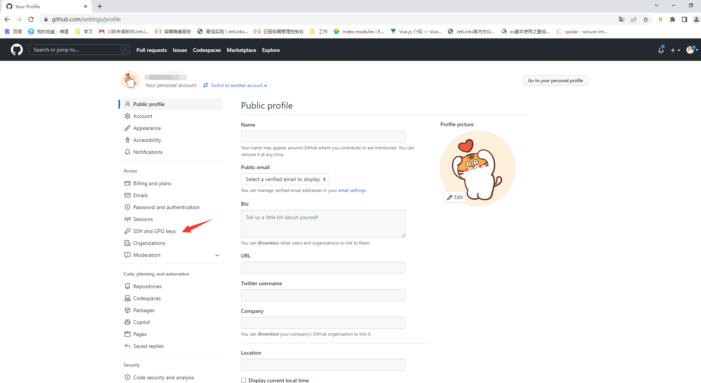
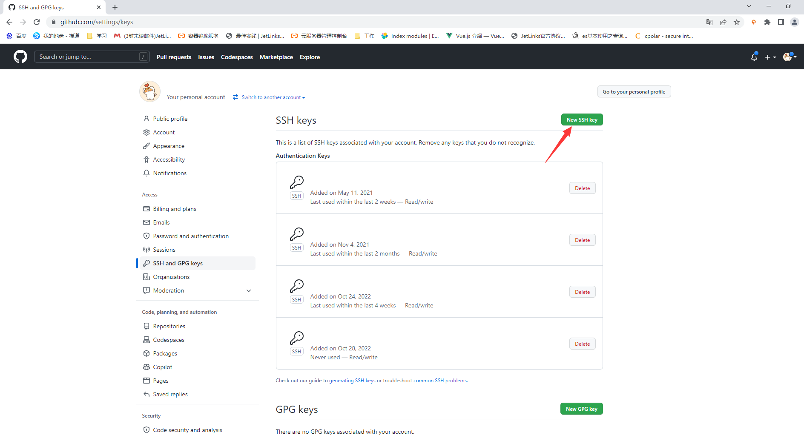
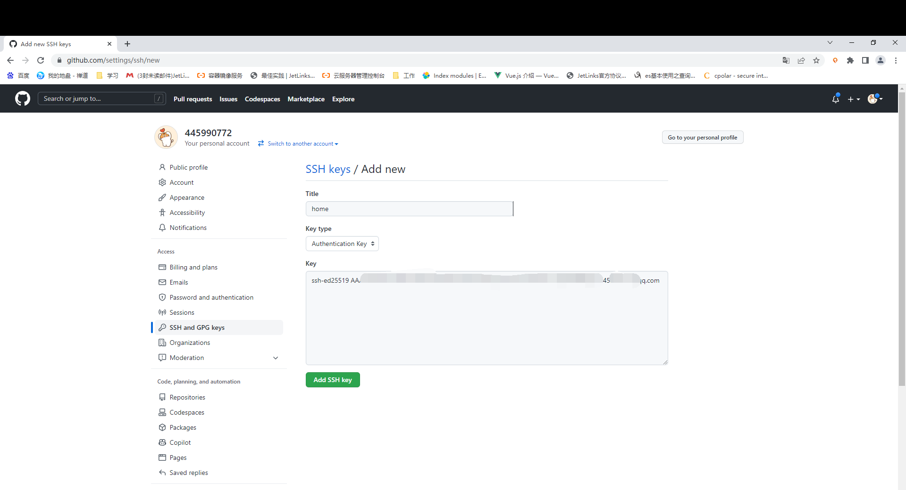

# 平台开发指导手册

## 常见开发问题

- <a target='_self' href='/dev-guide/code-guide.html#%E6%BA%90%E7%A0%81%E6%8B%89%E5%8F%96%E5%8F%8A%E5%AD%90%E6%A8%A1%E5%9D%97%E6%9B%B4%E6%96%B0%E6%8C%87%E5%8D%97'>
   如何拉取源码及更新子模块？</a>
- <a target='_self' href='/dev-guide/code-guide.html#%E5%9C%A8jetlinks%E4%B8%8A%E6%9E%84%E5%BB%BA%E8%87%AA%E5%B7%B1%E7%9A%84%E4%B8%9A%E5%8A%A1%E5%8A%9F%E8%83%BD'>
   在JetLinks上构建自己的业务功能？</a>
- <a target='_self' href='/dev-guide/code-guide.html#%E7%9B%91%E5%90%AC%E5%AE%9E%E4%BD%93%E5%8F%98%E5%8C%96%E5%81%9A%E4%B8%9A%E5%8A%A1'>
   实体变更后如何触发自己的业务流程？</a>
- <a target='_self' href='/dev-guide/code-guide.html#%E4%BD%BF%E7%94%A8%E6%B6%88%E6%81%AF%E6%80%BB%E7%BA%BF'>
   如何获取消息总线内的数据？</a>
- <a target='_self' href='/dev-guide/code-guide.html#%E6%B7%BB%E5%8A%A0%E8%87%AA%E5%AE%9A%E4%B9%89%E5%AD%98%E5%82%A8%E7%AD%96%E7%95%A5'>
  如何添加自定义存储策略？</a>
- <a target='_self' href='/dev-guide/code-guide.html#%E4%B8%BB%E5%8A%A8%E4%BB%8E%E7%AC%AC%E4%B8%89%E6%96%B9%E5%B9%B3%E5%8F%B0%E3%80%81%E8%AE%BE%E5%A4%87%E8%8E%B7%E5%8F%96%E6%95%B0%E6%8D%AE'>
   主动从设备获取属性、事件如何操作？</a>
- <a target='_self' href='/dev-guide/code-guide.html#%E7%9F%AD%E8%BF%9E%E6%8E%A5%E3%80%81%E4%BD%8E%E5%8A%9F%E8%80%97%E7%B1%BB%E8%AE%BE%E5%A4%87%E6%8E%A5%E5%85%A5%E5%B9%B3%E5%8F%B0'>
   短连接接入平台 </a>
- <a target='_self' href='/dev-guide/code-guide.html#%E8%AE%BE%E5%A4%87%E7%9B%B8%E5%85%B3%E6%95%B0%E6%8D%AE%E6%8E%A8%E9%80%81%E5%88%B0%E6%B6%88%E6%81%AF%E4%B8%AD%E9%97%B4%E4%BB%B6'>
   设备数据推送到消息中间件 </a>
- <a target='_self' href='/dev-guide/code-guide.html#%E7%AC%AC%E4%B8%89%E6%96%B9%E5%B9%B3%E5%8F%B0%E8%AF%B7%E6%B1%82jetlinks%E6%9C%8D%E5%8A%A1%E6%8E%A5%E5%8F%A3'>
   第三方平台请求JetLinks服务接口</a>
- <a target='_self' href='/dev-guide/code-guide.html#%E8%87%AA%E5%AE%9A%E4%B9%89sql%E6%9D%A1%E4%BB%B6%E6%9E%84%E9%80%A0%E5%99%A8'>
  自定义SQL条件构造器</a>
- <a target='_self' href=''>
  如何在协议包里面使用Redis？</a>
- <a target='_self' href=''>
  如何在协议包里面使用平台的业务方法？</a>

### 源码拉取及子模块更新指南

#### 应用场景

<div class='explanation primary'>
  <p class='explanation-title-warp'>
    <span class='iconfont icon-bangzhu explanation-icon'></span>
    <span class='explanation-title font-weight'>说明</span>
  </p>

  <p>1. 该指南提供首次拉取代码的用户配置SSH Key操作步骤，以及拉取代码后如何更新子模块的代码。</p>
  <p>2. 将更新后的代码提交到自己的仓库内。</p>
  <p>3. 如何更新源仓库代码并同步至自己的仓库内。</p>

</div>

#### 操作步骤

##### 配置SSH Key

1. 在电脑的空闲磁盘上创建目录，并且安装Git客户端程序。

安装Git客户端程序不在此处进行详述，可自行百度搜索安装Git。


<div class='explanation warning'>
  <p class='explanation-title-warp'>
    <span class='iconfont icon-bangzhu explanation-icon'></span>
    <span class='explanation-title font-weight'>问题1</span>
  </p>
  <p>目录名称应以英文命名，不要使用中文进行命名！</p>
  <p>使用中文命名可能会导致文件上传时，查找中文目录名称转义失败，抛出无法加载协议的异常。</p>

</div>

2. 登录Github，进入个人中心->`Settings`->选择`SSH and GPG keys`




3. 创建SSH key
   

在第一步新建的目录内，右键空白处弹出菜单`git bash here`，在弹出的shell控制台内执行下方命令：

该命令需要修改邮箱地址为您自己的邮箱地址。

```shell
$ ssh-keygen -t ed25519 -C "your_email@example.com"
```

示例如下:

```shell
$ ssh-keygen -t ed25519 -C "445990772@qq.com"
Generating public/private ed25519 key pair.
#回车
Enter file in which to save the key (/c/Users/LJ/.ssh/id_ed25519): 
#回车 
Enter passphrase (empty for no passphrase):
#回车
Enter same passphrase again:
# 提示生成了公钥和身份信息
Your identification has been saved in id_ed25519
Your public key has been saved in id_ed25519.pub
The key fingerprint is:
SHA256:IBctEwVoRajdZLE29buxRlpxPDW5E4z453215tgUqcTQIrUrs 445990772@qq.com
The key's randomart image is:
+--[ED25519 256]--+
|     =O*+o.+.=o. |
|    +.==.o+o+.*. |
|   +o+Oo..o.+. + |
|  . .=.=  .+ .+  |
|      E S =    . |
|         + +     |
|        . +      |
|         .       |
|                 |
|                 |
|                 |
+----[SHA256]-----+

```

<div class='explanation info'>
  <p class='explanation-title-warp'> 
    <span class='iconfont icon-tishi explanation-icon'></span>
    <span class='explanation-title font-weight'>提示</span>
  </p>
<p>注意: 如果您使用的遗留系统不支持 Ed25519算法，请使用:</p>

```shell

$ ssh-keygen -t rsa -b 4096 -C "your_email@example.com"

```

</div>

4. 将生成的ssh key添加至github内。

创建完成后使用下方命令复制公钥内容，

```shell
$ clip < ~/.ssh/id_ed25519.pub

```

<div class='explanation info'>
  <p class='explanation-title-warp'> 
    <span class='iconfont icon-tishi explanation-icon'></span>
    <span class='explanation-title font-weight'>提示</span>
  </p>
<p>如果clip命令不起作用，您可以找到隐藏的.ssh 文件夹，隐藏的.ssh 文件夹一般在<b class='explanation-title font-weight'>C:\Users\{当前设备名称}</b>目录下，
找到该目录下的<b class='explanation-title font-weight'>.pub</b>文件，复制该内容粘贴至github</p>

</div>



5. 拉取代码

进入第一步创建的文件夹内执行拉取代码及子模块

- 拉取`jetlinks-pro`

```shell
 $ git clone -b master --recurse-submodules git@github.com:jetlinks-v2/jetlinks-pro.git
```

- 拉取`jetlinks-cloud`

```shell
 $ git clone -b master --recurse-submodules git@github.com:jetlinks-v2/jetlinks-cloud.git
```

6. 更新基础子模块

<div class='explanation info'>
  <p class='explanation-title-warp'> 
    <span class='iconfont icon-tishi explanation-icon'></span>
    <span class='explanation-title font-weight'>提示</span>
  </p>
<p>JetLinks物联网平台只包含基础模块，扩展模块添加请参考第7步，未购买扩展模块可以跳过第7步。</p>
<p>非首次拉取代码也可以使用下方命令更新全部子模块，但更新过后仍需执行<span class='explanation-title font-weight'>reimport</span>。</p>
</div>

```shell
$ git pull && git submodule init && git submodule update && git submodule foreach git checkout master && git submodule foreach git pull origin master
```

7. 首次更新添加JetLinks扩展子模块

执行下方命令添加子模块

```shell
$ git submodule add --force [git仓库地址] [下载文件路径]
```

示例命令:

```shell
$ git submodule add --force git@github.com:jetlinks-v2/jetlinks-ctwing.git expands-components/jetlinks-ctwing
```

其余模块同理。

<div class='explanation info'>
  <p class='explanation-title-warp'> 
    <span class='iconfont icon-tishi explanation-icon'></span>
    <span class='explanation-title font-weight'>提示</span>
  </p>
<p>当您不知道仓库地址填什么的情况下，进入jetlinks-v2仓库内进行搜索模块名称，扩展模块相关信息查看<a target="_blank" href="/install-deployment/enterprise-version-start.html#添加扩展模块仓库">扩展模块列表</a></p>
</div>


[//]: # (移除子模块：git rm -f 【子模块本地存储目录】)

8. 代码拉取完毕后`reimport`


可以自行配置Maven多线程参数加快编译，具体线程数根据自己的电脑情况填写。


9. 扩展子模块加入Maven多模块项目

<div class='explanation info'>
  <p class='explanation-title-warp'> 
    <span class='iconfont icon-tishi explanation-icon'></span>
    <span class='explanation-title font-weight'>提示</span>
  </p>
<p>如无扩展模块，该步骤可跳过。</p>
</div>

在项目根目录下的`pom.xml`中的modules节点中添加模块

```xml

<modules>
    <module>expands-components/jetlinks-ctwing</module>
</modules>
```

- jetlinks-pro添加子模块依赖

在启动模块(jetlinks-standalone/pom.xml)中引入依赖

```xml

<dependency>
    <groupId>org.jetlinks.pro</groupId>
    <artifactId>jetlinks-ctwing</artifactId>
    <version>${project.version}</version>
</dependency>

```

- jetlinks-cloud添加子模块依赖

在启动模块(iot-service/pom.xml)中引入依赖

```xml

<dependency>
    <groupId>org.jetlinks.pro</groupId>
    <artifactId>jetlinks-ctwing</artifactId>
    <version>${project.version}</version>
</dependency>

```

其余模块同理。

10. 提交代码至自建仓库

```shell
$  git remote add gitee "git@gitee.com:/jetlinks-v2/$(echo ${PWD##*/}).git"
$  git submodule foreach 'git remote add gitee "git@gitee.com:/jetlinks-v2/$(echo ${PWD##*/}).git"'
$  git push gitee master
$  git submodule foreach git push gitee master 
```

11. 更新源仓库代码并同步自建仓库

查看远程仓库信息

```shell
$  git remote -v
# gitee 是上一步remote add声明的自建仓库名
gitee   git@gitee.com:/jetlinks-v2/jetlinks-v2.git (fetch)
gitee   git@gitee.com:/jetlinks-v2/jetlinks-v2.git (push)
#origin 一般是源原仓库
origin  git@github.com:jetlinks-v2/jetlinks-pro.git (fetch)
origin  git@github.com:jetlinks-v2/jetlinks-pro.git (push)

```

执行完更新子模块命令后执行下方命令同步至自建仓库

```shell
# gitee代表推送至自建仓库名为gitee的远程仓库， master为分支名
$ git push gitee master

```

#### 常见问题

<div class='explanation warning'>
  <p class='explanation-title-warp'>
    <span class='iconfont icon-bangzhu explanation-icon'></span>
    <span class='explanation-title font-weight'>问题1</span>
  </p>

  <p>Q：配置完SSH Key如果仍提示需要输入git@github.com‘s password，且尝试了所有密码均提示:Permission denied, please try again。</p>
  <p>A：Github官网给出的说法是：防火墙拒绝完全允许SSH连接。如果不能使用带有凭据缓存的HTTPS克隆，可以尝试使用通过HTTPS端口建立的SSH连接进行克隆。
大多数防火墙规则应该允许这样做，但是代理服务器可能会干扰。可以参照下方步骤解决该问题。</p>

</div>

1. 要测试是否可以通过 HTTPS 端口使用 SSH，请运行以下 SSH 命令。

```shell
$ ssh -T -p 443 git@ssh.github.com
> Hi USERNAME! You've successfully authenticated, but GitHub does not
> provide shell access.
```

2. 在`~/.ssh`目录下编辑或创建`config`文件，并添加下方内容。

`~/.ssh`目录在第四步的提示内有说明。

```shell
Host github.com
Hostname ssh.github.com
Port 443
User git
```

3. 在切换到端口443后第一次与 GitHub 交互时，您可能会收到一条警告消息。

此处在配置公钥过后选择`yes`即可

```shell
> The authenticity of host '[ssh.github.com]:443 ([140.82.112.36]:443)' can't be established.
> ED25519 key fingerprint is SHA256:+DiY3wvvV6TuJJhbpZisF/zLDA0zPMSvHdkr4UvCOqU.
> This host key is known by the following other names/addresses:
>     ~/.ssh/known_hosts:32: github.com
> Are you sure you want to continue connecting (yes/no/[fingerprint])?
```

4. 配置好上述内容后，执行拉取命令即可。

<div class='explanation warning'>
  <p class='explanation-title-warp'>
    <span class='iconfont icon-bangzhu explanation-icon'></span>
    <span class='explanation-title font-weight'>问题2</span>
  </p>

  <li>Q：拉取代码的时候出现 <b class='explanation-title font-weight'> Please make sure you have the correct access rights and the repository exists</b>？</li>
  <li>A：确认是否购买该模块或者账户未被添加进仓库，请联系商务。</li>

</div>

<div class='explanation warning'>
  <p class='explanation-title-warp'>
    <span class='iconfont icon-bangzhu explanation-icon'></span>
    <span class='explanation-title font-weight'>问题3</span>
  </p>

  <p>Q：Maven项目启动过程中出现jar包引入失败。</p>
  <p>A：一般是由于自行设置了配置文件的mirrors镜像加速地址，注释或者使用纯净的<b class='explanation-title font-weight'>settings.xml</b>配置文件。</p>

</div>

### 在JetLinks上构建自己的业务功能

#### 应用场景

<div class='explanation primary'>
  <p class='explanation-title-warp'>
    <span class='iconfont icon-bangzhu explanation-icon'></span>
    <span class='explanation-title font-weight'>说明</span>
  </p>

   <p>当您想使用JetLinks平台做自己的业务，又不想将项目独立时，可以选择基于JetLinks进行开发。</p>

</div>

#### 操作步骤

##### 创建新的Maven项目

1. 创建自定义Maven项目


2. 自定义的Maven项目与jetlinks-pro同级（低版本IDEA窗口下，新的Maven模块后显示root字样）


##### 将自定义模块加入JetLinks平台

1. 在jetlinks-pro目录根路径下的`pom.xml`文件内声明自定义项目加入多模块管理


示例代码:

```xml

<modules>
    <module>jetlinks-parent</module>
    <module>jetlinks-components</module>
    <module>jetlinks-manager/authentication-manager</module>
    <module>jetlinks-manager/device-manager</module>
    <module>jetlinks-manager/network-manager</module>
    <module>jetlinks-manager/notify-manager</module>
    <module>jetlinks-manager/rule-engine-manager</module>
    <module>jetlinks-manager/logging-manager</module>
    <module>jetlinks-manager/datasource-manager</module>
    <module>jetlinks-manager/things-manager</module>
    <module>jetlinks-standalone</module>
    <!--  声明加入自定义模块名称-->
    <module>my-demo</module>
    <module>test-report</module>
</modules>
```

2. 在jetlinks-standalone目录路径下的`pom.xml`文件内`profiles`节点中声明以下代码


示例代码:

```xml
<!-- 使用profile动态加入模块-->
<profile>
    <id>demo</id>
    <dependencies>
        <dependency>
            <groupId>com.example</groupId>
            <artifactId>my-demo</artifactId>
            <version>${project.version}</version>
        </dependency>
    </dependencies>
</profile>
```

3. reimport项目

以上两步操作完成之后需要使用Maven窗口的`reimport`按钮，重新引入模块依赖，此时模块被加入jetlinks-pro项目下


4. 加入子模块声明后，修改自定义项目pom文件内容

示例代码：

```xml
<?xml version="1.0" encoding="UTF-8"?>
<project xmlns="http://maven.apache.org/POM/4.0.0" xmlns:xsi="http://www.w3.org/2001/XMLSchema-instance"
         xsi:schemaLocation="http://maven.apache.org/POM/4.0.0 https://maven.apache.org/xsd/maven-4.0.0.xsd">
    <modelVersion>4.0.0</modelVersion>
    <!-- 声明父模块 -->
    <parent>
        <groupId>org.jetlinks.pro</groupId>
        <artifactId>jetlinks-parent</artifactId>
        <version>2.0.0-SNAPSHOT</version>
        <relativePath>../jetlinks-parent/pom.xml</relativePath>
    </parent>

    <groupId>com.example</groupId>
    <artifactId>my-demo</artifactId>

    <dependencies>
        <!-- 引入hsweb依赖，该依赖主要用于业务系统crud功能模块   -->
        <dependency>
            <groupId>org.hswebframework.web</groupId>
            <artifactId>hsweb-starter</artifactId>
            <version>${hsweb.framework.version}</version>
        </dependency>

        <dependency>
            <groupId>org.hswebframework</groupId>
            <artifactId>hsweb-easy-orm-rdb</artifactId>
        </dependency>
    </dependencies>
    <build>
        <plugins>
            <plugin>
                <groupId>org.apache.maven.plugins</groupId>
                <artifactId>maven-resources-plugin</artifactId>
                <configuration>
                    <nonFilteredFileExtensions>
                        <nonFilteredFileExtension>zip</nonFilteredFileExtension>
                        <nonFilteredFileExtension>jar</nonFilteredFileExtension>
                    </nonFilteredFileExtensions>
                </configuration>
            </plugin>
        </plugins>
    </build>

</project>


```

<div class='explanation info'>
  <p class='explanation-title-warp'> 
    <span class='iconfont icon-tishi explanation-icon'></span>
    <span class='explanation-title font-weight'>提示</span>
  </p>
<p>Q：如何确认模块被引入？</p>
<p>A：可以使用Maven工具或者命令打包时出现自定义模块的名称说明模块被引入。</p>

```text

[INFO] Reactor Summary:
[INFO] 
[INFO] jetlinks-parent .................................... SUCCESS [  1.346 s]
[INFO] jetlinks-components ................................ SUCCESS [  0.084 s]
[INFO] test-component ..................................... SUCCESS [  9.813 s]
[INFO] common-component ................................... SUCCESS [ 13.924 s]
[INFO] timeseries-component ............................... SUCCESS [  5.407 s]
[INFO] dashboard-component ................................ SUCCESS [  8.283 s]
[INFO] network-component .................................. SUCCESS [  0.108 s]
[INFO] network-core ....................................... SUCCESS [ 10.744 s]
[INFO] gateway-component .................................. SUCCESS [ 11.436 s]
[INFO] assets-component ................................... SUCCESS [ 12.147 s]
[INFO] geo-component ...................................... SUCCESS [  7.302 s]
[INFO] api-component ...................................... SUCCESS [  8.520 s]
[INFO] configure-component ................................ SUCCESS [ 11.337 s]
[INFO] script-component ................................... SUCCESS [  8.600 s]
[INFO] streaming-component ................................ SUCCESS [  3.830 s]
[INFO] things-component ................................... SUCCESS [ 21.910 s]
[INFO] elasticsearch-component ............................ SUCCESS [ 13.424 s]
[INFO] relation-component ................................. SUCCESS [  9.770 s]
[INFO] rule-engine-component .............................. SUCCESS [  8.008 s]
[INFO] notify-component ................................... SUCCESS [  0.102 s]
[INFO] notify-core ........................................ SUCCESS [  8.918 s]
[INFO] notify-sms ......................................... SUCCESS [  8.037 s]
[INFO] io-component ....................................... SUCCESS [  8.139 s]
[INFO] notify-email ....................................... SUCCESS [  8.770 s]
[INFO] notify-wechat ...................................... SUCCESS [  9.273 s]
[INFO] notify-dingtalk .................................... SUCCESS [  9.235 s]
[INFO] notify-voice ....................................... SUCCESS [  7.400 s]
[INFO] notify-webhook ..................................... SUCCESS [  7.467 s]
[INFO] coap-component ..................................... SUCCESS [ 15.998 s]
[INFO] mqtt-component ..................................... SUCCESS [ 12.371 s]
[INFO] http-component ..................................... SUCCESS [ 13.102 s]
[INFO] tcp-component ...................................... SUCCESS [ 17.454 s]
[INFO] websocket-component ................................ SUCCESS [ 17.322 s]
[INFO] udp-component ...................................... SUCCESS [ 16.092 s]
[INFO] simulator-component ................................ SUCCESS [ 10.106 s]
[INFO] protocol-component ................................. SUCCESS [ 10.202 s]
[INFO] datasource-component ............................... SUCCESS [ 10.831 s]
[INFO] messaging-component ................................ SUCCESS [  0.102 s]
[INFO] rabbitmq-component ................................. SUCCESS [  7.784 s]
[INFO] kafka-component .................................... SUCCESS [  7.923 s]
[INFO] logging-component .................................. SUCCESS [  5.452 s]
[INFO] tenant-component ................................... SUCCESS [  8.594 s]
[INFO] influxdb-component ................................. SUCCESS [  9.655 s]
[INFO] tdengine-component ................................. SUCCESS [ 10.927 s]
[INFO] clickhouse-component ............................... SUCCESS [ 10.780 s]
[INFO] cassandra-component ................................ SUCCESS [ 11.147 s]
[INFO] function-component ................................. SUCCESS [  0.107 s]
[INFO] function-api ....................................... SUCCESS [  3.569 s]
[INFO] function-manager ................................... SUCCESS [ 14.735 s]
[INFO] collector-component ................................ SUCCESS [ 12.584 s]
[INFO] application-component .............................. SUCCESS [ 14.226 s]
[INFO] authentication-manager ............................. SUCCESS [ 18.356 s]
[INFO] device-manager ..................................... SUCCESS [ 15.212 s]
[INFO] network-manager .................................... SUCCESS [ 13.248 s]
[INFO] notify-manager ..................................... SUCCESS [  9.168 s]
[INFO] rule-engine-manager ................................ SUCCESS [ 11.895 s]
[INFO] logging-manager .................................... SUCCESS [  7.648 s]
[INFO] datasource-manager ................................. SUCCESS [  8.070 s]
[INFO] things-manager ..................................... SUCCESS [  9.319 s]
[INFO] jetlinks-ctwing .................................... SUCCESS [  6.386 s]
[INFO] jetlinks-onenet .................................... SUCCESS [  6.444 s]
[INFO] jetlinks-opc-ua .................................... SUCCESS [ 11.776 s]
[INFO] jetlinks-aliyun-bridge-gateway ..................... SUCCESS [  8.857 s]
[INFO] jetlinks-dueros .................................... SUCCESS [  7.087 s]
[INFO] jetlinks-media ..................................... SUCCESS [ 13.981 s]
[INFO] network-card-manager ............................... SUCCESS [  9.961 s]
[INFO] jetlinks-modbus .................................... SUCCESS [ 12.166 s]
[INFO] jetlinks-standalone ................................ SUCCESS [  9.283 s]
//Maven的编译或打包信息内出现自定义项目的名称表明，该项目已被加入jetlinks-pro的多模块管理内
[INFO] my-demo ............................................ SUCCESS [  1.987 s]
[INFO] test-report ........................................ SUCCESS [  9.504 s]
[INFO] jetlinks-pro ....................................... SUCCESS [  0.953 s]
[INFO] ------------------------------------------------------------------------
[INFO] BUILD SUCCESS
[INFO] ------------------------------------------------------------------------
[INFO] Total time: 02:48 min (Wall Clock)
[INFO] Finished at: 2022-11-29T14:05:27+08:00
[INFO] Final Memory: 451M/3453M
[INFO] ------------------------------------------------------------------------

Process finished with exit code 0
```

</div>

4. 添加简单的Controller类、实体等

简单的业务系统目录结构如下图：


请求入口Controller：

```java
package com.example.mydemo.web;

import com.example.mydemo.entity.TestEntity;
import com.example.mydemo.service.TestService;
import io.swagger.v3.oas.annotations.Operation;
import io.swagger.v3.oas.annotations.tags.Tag;
import lombok.AllArgsConstructor;
import lombok.Getter;
import org.hswebframework.web.authorization.annotation.Authorize;
import org.hswebframework.web.authorization.annotation.QueryAction;
import org.hswebframework.web.authorization.annotation.Resource;
import org.hswebframework.web.crud.web.reactive.ReactiveServiceCrudController;
import org.springframework.web.bind.annotation.GetMapping;
import org.springframework.web.bind.annotation.RequestMapping;
import org.springframework.web.bind.annotation.RestController;
import reactor.core.publisher.Flux;

@Getter
@RestController
@AllArgsConstructor
@RequestMapping("/test")
@Resource(id = "test", name = "自定义接口")
@Tag(name = "自定义接口")
public class TestController implements ReactiveServiceCrudController<TestEntity, String> {

    private final TestService service;

    @GetMapping
    @QueryAction
    @Operation(summary = "自定义接口说明")
    public Flux<Void> getAll() {
        return Flux.empty();
    }

}

```

实体Entity类：

```java
package com.example.mydemo.entity;

import io.swagger.v3.oas.annotations.media.Schema;
import lombok.Getter;
import lombok.Setter;
import org.hswebframework.ezorm.rdb.mapping.annotation.Comment;
import org.hswebframework.ezorm.rdb.mapping.annotation.DefaultValue;
import org.hswebframework.web.api.crud.entity.GenericEntity;
import org.hswebframework.web.api.crud.entity.RecordCreationEntity;
import org.hswebframework.web.api.crud.entity.RecordModifierEntity;
import org.hswebframework.web.crud.generator.Generators;

import javax.persistence.Column;
import javax.persistence.Index;
import javax.persistence.Table;

@Table(name = "dev_my_demo_test", indexes = {
        @Index(name = "idx_demo_device_id_index", columnList = "type,device_id")
})
@Comment("自定义表")
@Getter
@Setter
public class TestEntity extends GenericEntity<String> implements RecordCreationEntity, RecordModifierEntity {

    @Column(name = "device_id")
    @Comment("设备id")
    private String deviceId;

    @Column
    @Comment("类型")
    private Integer type;

    @Column(name = "creator_id", updatable = false)
    @Schema(
            description = "创建者ID(只读)"
            , accessMode = Schema.AccessMode.READ_ONLY
    )
    private String creatorId;

    @Column(name = "creator_name", updatable = false)
    @Schema(
            description = "创建者名称(只读)"
            , accessMode = Schema.AccessMode.READ_ONLY
    )
    private String creatorName;

    @Column(name = "create_time", updatable = false)
    @DefaultValue(generator = Generators.CURRENT_TIME)
    @Schema(
            description = "创建时间(只读)"
            , accessMode = Schema.AccessMode.READ_ONLY
    )
    private Long createTime;

    @Column
    @DefaultValue(generator = Generators.CURRENT_TIME)
    @Schema(
            description = "修改时间"
            , accessMode = Schema.AccessMode.READ_ONLY
    )
    private Long modifyTime;

    @Column(length = 64)
    @Schema(
            description = "修改人ID"
            , accessMode = Schema.AccessMode.READ_ONLY
    )
    private String modifierId;

    @Column(length = 64)
    @Schema(
            description = "修改人名称"
            , accessMode = Schema.AccessMode.READ_ONLY
    )
    private String modifierName;
}


```

业务层Service：

```java
package com.example.mydemo.service;

import com.example.mydemo.entity.TestEntity;
import org.hswebframework.web.crud.service.GenericReactiveCrudService;
import org.springframework.stereotype.Service;

@Service
public class TestService extends GenericReactiveCrudService<TestEntity, String> {

}

```

5. 在jetlinks-pro的启动类上加入自定义项目的扫描路径

```java
//新增需要Spring扫描的包
@SpringBootApplication(scanBasePackages = {"org.jetlinks.pro", "com.example.mydemo"}, exclude = {
        DataSourceAutoConfiguration.class,
        KafkaAutoConfiguration.class,
        RabbitAutoConfiguration.class,
        ElasticsearchRestClientAutoConfiguration.class,
        ElasticsearchDataAutoConfiguration.class,
        MongoReactiveAutoConfiguration.class,
})
@EnableCaching
//新增实体扫描包
@EnableEasyormRepository({"org.jetlinks.pro.**.entity", "com.example.mydemo.entity"})
@EnableAopAuthorize
@EnableAccessLogger
public class JetLinksApplication {

    public static void main(String[] args) {
        SpringApplication.run(JetLinksApplication.class, args);
    }

    @Component
    @Slf4j
    public static class AdminAllAccess {

        @EventListener
        public void handleAuthEvent(AuthorizingHandleBeforeEvent e) {
            if (e.getContext().getAuthentication().getUser().getUsername().equals("admin")) {
                e.setAllow(true);
            }
        }

        @EventListener
        public void handleAccessLogger(AccessLoggerAfterEvent event) {

            log.info("{}=>{} {}-{}", event.getLogger().getIp(), event.getLogger().getUrl(), event.getLogger().getDescribe(), event.getLogger().getAction());

        }
    }

}

```

#### 核心类说明

| 类名                            | 说明                                              |
|-------------------------------|-------------------------------------------------|
| `ReactiveServiceCrudController<E, K>` | 实体CRUD操作的抽象接口，该接口继承了CRUD相关操作的接口，这些接口内封装了默认的实现方法 |
| `GenericEntity<PK>`             | 实体类需要继承该类，需要声明实体id数据类型                          |
| `GenericReactiveCrudService<TestEntity, String>`    | 业务层实体需要继承该类，该类有默认的crud方法的实现                     |

#### 常见问题

<div class='explanation warning'>
  <p class='explanation-title-warp'>
    <span class='iconfont icon-bangzhu explanation-icon'></span>
    <span class='explanation-title font-weight'>问题1</span>
  </p>

<p>Q：如何将自定义的接口加入swagger扫描并在API配置中显示出来？</p>
<p>A：在平台的<a>application.yml</a>文件内swagger下声明该项目扫描路径。</p>

```yaml
springdoc:
  swagger-ui:
    path: /swagger-ui.html
  group-configs:
    - group: 设备接入相关接口
      packages-to-scan:
        - org.jetlinks.pro.network.manager.web
        - org.jetlinks.pro.device.web
      paths-to-match:
        - /gateway/**
        - /network/**
        - /protocol/**
    - group: 系统管理相关接口
      packages-to-scan:
        - org.jetlinks.pro.auth
        - org.hswebframework.web.system.authorization.defaults.webflux
        - org.hswebframework.web.file
        - org.hswebframework.web.authorization.basic.web
        - org.jetlinks.pro.openapi.manager.web
        - org.jetlinks.pro.logging.controller
        - org.jetlinks.pro.tenant.web
    - group: 自定义接口
      packages-to-scan:
        - com.example.mydemo.web
```

效果图：


</div>


<div class='explanation warning'>
  <p class='explanation-title-warp'>
    <span class='iconfont icon-bangzhu explanation-icon'></span>
    <span class='explanation-title font-weight'>问题2</span>
  </p>

  <p>Q：自定义的接口不想被平台鉴权拦截？</p>
  <p>A：在类上或者方法上声明<span class="explanation-title font-weight">@Authorize(ignore = true)</span>。</p>
  <p>类上注解表明该类所有方法均不受鉴权拦截，方法上则仅限当前被注解的方法不受鉴权拦截。</p>


</div>

<div class='explanation error'>
  <p class='explanation-title-warp'>
    <span class='iconfont icon-jinggao explanation-icon'></span>
    <span class='explanation-title font-weight'>危险</span>
  </p>

  <p><li>响应式返回Mono&lt;Object&gt;或者Flux&lt;Object&gt;会报错，必须指出明确的返回类型。 </li></p>
  <p><li>响应式使用@RequestBody注解的参数必须使用流包裹。</li></p>
  <p><li>JetLinks从上至下使用全部使用响应式，基于JetLinks平台构建自己的业务代码时也请使用响应式。</li></p>
  <p><li>如果不会写响应式，建议最好独立项目不要与JetLinks混合使用非响应式，可能会导致项目出现阻塞。</li></p>

</div>

### 监听实体变化做业务

#### 应用场景

<div class='explanation primary'>
  <p class='explanation-title-warp'>
    <span class='iconfont icon-bangzhu explanation-icon'></span>
    <span class='explanation-title font-weight'>说明</span>
  </p>

  <li>产品在正常状态时，按钮显示为禁用；产品在启用状态时，按钮显示为启用。</li>
  <li>产品禁用后，设备无法再接入。但不影响已经接入的设备。</li>

</div>

```java
//此处将具体代码实现放入
//1.对关键部分代码进行步骤梳理及注释说明
//2.对核心部分代码用醒目的文字进行说明，说明内容包括但不限于设计思想、设计模式等
```

#### 核心类说明

| 类名 | 方法名 | 返回值 | 说明 |
|----------------| -------------------------- |--------|---------------------------|
| DeviceOperator | getSelfConfig() |`Mono<Value>` | 从缓存中获取设备自身的配置，如果不存在则返回`Mono.empty()`|

#### 常见问题

*对开发过程中出现的问题进行总结*


<div class='explanation warning'>
  <p class='explanation-title-warp'>
    <span class='iconfont icon-bangzhu explanation-icon'></span>
    <span class='explanation-title font-weight'>问题1</span>
  </p>

  <li>产品在正常状态时，按钮显示为禁用；产品在启用状态时，按钮显示为启用。</li>
  <li>产品禁用后，设备无法再接入。但不影响已经接入的设备。</li>

</div>


<div class='explanation warning'>
  <p class='explanation-title-warp'>
    <span class='iconfont icon-bangzhu explanation-icon'></span>
    <span class='explanation-title font-weight'>问题2</span>
  </p>

  <li>产品在正常状态时，按钮显示为禁用；产品在启用状态时，按钮显示为启用。</li>
  <li>产品禁用后，设备无法再接入。但不影响已经接入的设备。</li>

</div>

<div class='explanation error'>
  <p class='explanation-title-warp'>
    <span class='iconfont icon-jinggao explanation-icon'></span>
    <span class='explanation-title font-weight'>危险</span>
  </p>

若设备限制数量不能满足您的业务需求，请
<a>提交工单</a>
说明您的需求。

</div>

<div class='explanation info'>
  <p class='explanation-title-warp'> 
    <span class='iconfont icon-tishi explanation-icon'></span>
    <span class='explanation-title font-weight'>提示</span>
  </p>
若设备限制数量不能满足您的业务需求，请
<a>提交工单</a>
说明您的需求。
</div>

### 使用消息总线

#### 应用场景

EventBus是一个基于发布者/订阅者模式的事件总线框架。发布者/订阅者模式，也就是观察者模式，其定义了对象之间的一种一对多的依赖关系，
当事件发布时，平台的其他模块，例如：产品/设备、规则引擎、设备告警等模块都可以同时订阅到该事件，能够有效地降低消息发布者和订阅者之间的耦合度。

#### 核心接口说明

核心接口org.jetlinks.core.event.EventBus

| 方法名                                                                                                     | 返回值                  | 说明                         |
|---------------------------------------------------------------------------------------------------------|----------------------|----------------------------|
| subscribe(Subscription subscription)                                                                    | Flux\<TopicPayload\> | 从事件总线中订阅事件                 |
| subscribe(Subscription subscription, Function\<TopicPayload, Mono\<Void\>\> handler)                    | Disposable           | 从事件总线中订阅事件并指定handler来处理事件  |
| subscribe(Subscription subscription, Decoder\<T\> decoder)                                              | \<T\> Flux\<T\>      | 从事件总线中订阅事件并按照指定的解码器进行数据转换  |
| subscribe(Subscription subscription, Class\<T\> type)                                                   | \<T\> Flux\<T\>  | 订阅主题并将事件数据转换为指定的类型  |
| publish(String topic, Publisher\<T\> event)                                                             | \<T\> Mono\<Long\>   | 推送消息流到事件总线                 |
| publish(String topic, Publisher\<T\> event, T event)                                                    | \<T\> Mono\<Long\>   | 推送单个数据到事件总线中并指定编码器用于将事件数据进行序列化                |
| publish(String topic, Encoder\<T\> encoder, Publisher\<\? extends T\> eventStream)                      | \<T\> Mono\<Long\>   | 推送消息流到事件总线并指定编码器用于进行事件序列化  |
| publish(String topic, Encoder\<T\> encoder, Publisher\<\? extends T\> eventStream, Scheduler scheduler) | \<T\> Mono\<Long\>   | 推送消息流到事件总线并指定编码器和调度器用于进行事件序列化 |

#### 消息总线对应topic说明

| Topic                                            | 说明       |
|--------------------------------------------------|----------|
| /_sys/network/{typeId}/reload                    | 重启网络组件   |
| /_sys/network/{typeId}/shutdown                  | 停止网络组件   |
| /_sys/network/{typeId}/destroy                   | 删除网络组件   |
| /_sys/media-gateway/{gatewayId}/sync-channel     | 视频网关同步   |
| /_sys/media-gateway/start                        | 视频网关启动   |
| /_sys/media-gateway/stop                         | 视频网关停止   |
| /_sys/collector-conf                             | 采集器配置    |
| /_sys/collector-remove                           | 采集器删除    |
| /_sys/collector-point                            | 采集器点位    |
| /_sys/collector-channel                          | 采集器通道    |
| /_sys/collector-channel-remove                   | 删除采集器通道  |
| /sys-event/{operationType}/{operationId}/{level} | 系统事件     |
| /logging/system/{logName}/{logLevel}             | 系统日志     |
| /_sys/notifier/reload                            | 消息通知重启   |
| /_sys/registry-product/{productID}/register      | 产品注册     |
| /_sys/registry-product/{productID}/unregister    | 产品注销     |
| /_sys/registry-product/{productID}/metadata      | 产品物模型    |
| /_sys/user-dimension-changed/{userId}            | 用户维度变更   |
| /_sys/metadata-mapping-changed                   | 物模型变更    |
| /_sys/metadata-mapping-deleted                   | 物模型删除    |
| /debug/device/{deviceId}/trace                   | 设备诊断     |
| /_sys/notify-channel/register                    | 注册消息通道   |
| /_sys/notify-channel/unregister                  | 注销消息通道   |
| /_sys/alarm/config/deleted                       | 告警配置删除   |
| /_sys/alarm/config/created                       | 告警配置创建   |
| /_sys/alarm/config/saved                         | 告警配置保存   |
| /_sys/alarm/config/modified                      | 告警配置修改   |
| /_sys/device-alarm-config/save                   | 设备告警保存   |
| /_sys/device-alarm-config/bind                   | 设备告警绑定   |
| /_sys/device-alarm-config/unbind                 | 设备告警解绑   |
| /_sys/thing-connector/started                    | 启动连接器    |
| /_sys/thing-connector/stopped                    | 停止连接器    |
| /_sys/thing-connector/deleted                    | 删除连接器    |

##### typeId字段说明

| 网络组件类型标识          | 说明           |
|-------------------|--------------|
| TCP_CLIENT        | TCP客户端       |
| TCP_SERVER        | TCP服务        |
| MQTT_CLIENT       | MQTT客户端      |
| MQTT_SERVER       | MQTT服务       |
| HTTP_CLIENT       | HTTP客户端      |
| HTTP_SERVER       | HTTP服务       |
| WEB_SOCKET_CLIENT | WebSocket客户端 |
| WEB_SOCKET_SERVER | WebSocket服务  |
| COAP_CLIENT       | CoAP客户端      |
| COAP_SERVER       | CoAP服务       |
| UDP               | UDP          | 

设备消息对应事件总线详情参照<a href='/function-description/device_message_description.html#总线topic'>
设备消息对应事件总线topic</a>

<div class='explanation info'>
  <p class='explanation-title-warp'> 
    <span class='iconfont icon-tishi explanation-icon'></span>
    <span class='explanation-title font-weight'>提示</span>
  </p>

<li>可用通配符*替换topic中的参数，发布和订阅均支持通配符，例如：</li>

`/_sys/network/MQTT_SERVER/shutdown`，表示停止类型为MQTT服务的网络组件，<br/>
`/_sys/network/*/shutdown`，表示停止所有类型的网络组件，可订阅该topic

<li>通配符通配符*表示匹配单层路径，**表示匹配多层路径，例如：</li>

`/device/product001/*/online`，表示订阅产品product001下所有设备的上线消息 <br/>
`/device/product001/**`，表示订阅产品product001下所有设备的所有消息 <br/>


</div>

#### 发布/订阅事件实例

发布事件:

```java
      public Mono<Void> shutdown(NetworkType type,String NetworkId){
        return
        //将停止网络组件事件推送到消息总线   
        eventBus.publish("/_sys/network/"+type.getId()+"/shutdown",NetworkId)
        .then();
        }
```

订阅事件：

```java
      //使用Subscribe方法
public void doSubscribe(){
        eventBus
        //调用subscribe方法
        .subscribe(Subscription
        //构建订阅者消息
        .builder()
        //订阅者标识
        .subscriberId("network-config-manager")
        //订阅topic
        .topics("/_sys/network/*/shutdown")
        //订阅特性,有三类特性
        .justBroker()
        .build())
        //拿到消息总线中的数据进行后续处理
        .flatMap(payload->{
        ...
        })
        .subscribe();
        }

//使用Subscribe注解
@Subscribe(topics = "/_sys/media-gateway/start", features = Subscription.Feature.broker)
public Mono<Void> doStart(String id){
        return this
        .findById(id)
        .flatMap(this::doStart);
        }
```

<div class='explanation warning'>
  <p class='explanation-title-warp'>
    <span class='iconfont icon-bangzhu explanation-icon'></span>
    <span class='explanation-title font-weight'>问题</span>
  </p>

 <li>如何实现共享订阅</li>

会根据传入的订阅特性字段判断是否为shared共享订阅，若是共享订阅则会先存到缓存中，后续再依次处理缓存中的共享订阅，在处理的过程中会
判断订阅消息是否是同一个订阅者的，若是同一个订阅者则只处理最早的那条订阅消息。

</div>

#### 共享订阅实例

使用Subscribe方法：

```java
      public void doSubscribe(){
        eventBus
        //调用subscribe方法
        .subscribe(Subscription
        //构建订阅者消息
        .builder()
        //订阅者标识
        .subscriberId("network-config-manager")
        //订阅topic
        .topics("/_sys/network/*/shutdown")
        //订阅特性为shared
        .shared()
        .build())
        //拿到消息总线中的数据进行后续处理
        .flatMap(payload->{
        ...
        })
        .subscribe();
        }
```

使用Subscribe注解：

```java

//订阅特性为shared
@Subscribe(topics = "/_sys/media-gateway/start", features = Subscription.Feature.shared)
public Mono<Void> doStart(String id){
        return this
        .findById(id)
        .flatMap(this::doStart);
        }
```

订阅特性字段Feature说明

| 标识         | 说明         |
|------------|------------|
| shared | 共享订阅 |
| local| 订阅本地消息     |
| broker | 订阅代理消息     |

<div class='explanation info'>
  <p class='explanation-title-warp'> 
    <span class='iconfont icon-tishi explanation-icon'></span>
    <span class='explanation-title font-weight'>提示</span>
  </p>


在使用Subscribe注解订阅事件时，传入参数分别为订阅topic、订阅者标识和订阅特性，后两者为选填，若不填订阅者标识默认值为本方法名，订阅特性默认值为local，
当订阅特性为shared时就只能填写这一个特性，当订阅特性中没有shared时，local和broker可同时填写。<br/>

</div>

#### 多订阅特性实例

Subscribe方法：

```java
eventBus
        .subscribe(Subscription.of("gateway"", "/_sys/media-gateway/start", Subscription.Feature.local, Subscription.Feature.broker))
 ```

Subscribe注解：

 ```java
@Subscribe(topics = "/_sys/media-gateway/start", features = {Subscription.Feature.broker, Subscription.Feature.local})
```

### 添加自定义存储策略

#### 应用场景

<div class='explanation primary'>
  <p class='explanation-title-warp'>
    <span class='iconfont icon-bangzhu explanation-icon'></span>
    <span class='explanation-title font-weight'>说明</span>
  </p>

<p>当平台提供的存储策略不满足自己的需求时，可以选择自行开发.</p>

</div>

##### 操作步骤

1. 实现`ThingsDataRepositoryStrategy`接口或者继承`AbstractThingDataRepositoryStrategy`类。重写接口或父类的方法

<div class='explanation info'>
  <p class='explanation-title-warp'>
    <span class='iconfont icon-bangzhu explanation-icon'></span>
    <span class='explanation-title font-weight'>提示</span>
  </p>

<p>推荐使用继承 <span class='explanation-title font-weight'>AbstractThingDataRepositoryStrategy</span>的方式。
AbstractThingDataRepositoryStrategy继承CacheSaveOperationsStrategy类，CacheSaveOperationsStrategy类在执行存储操作时会将
数据库操作对象存放至内存，在调用存储方法过程中减少上下文对象的创建。
</p>

</div>

```java

@AllArgsConstructor
public class CustomRowModeStrategy extends AbstractThingDataRepositoryStrategy {

    private final ThingsRegistry registry;
    //自定义存储帮助类
    private final CustomHelper helper;

    @Override
    public String getId() {
        return "custom-row";
    }

    @Override
    public String getName() {
        return "自定义-行式存储";
    }

    @Override
    public SaveOperations createOpsForSave(OperationsContext context) {
        //创建自定义SaveOperations类，返回自定义SaveOperations对象
        return new CustomColumnModeSaveOperations(
                registry,
                context.getMetricBuilder(),
                context.getSettings(),
                helper);
    }

    @Override
    protected QueryOperations createForQuery(String thingType, String templateId, String thingId, OperationsContext context) {
        //创建自定义QueryOperations类，返回自定义QueryOperations对象
        return new CustomColumnModeQueryOperations(
                thingType,
                templateId,
                thingId,
                context.getMetricBuilder(),
                context.getSettings(),
                registry,
                helper);
    }

    @Override
    protected DDLOperations createForDDL(String thingType, String templateId, String thingId, OperationsContext context) {
        //创建自定义DDLOperations类，返回自定义DDLOperations对象
        return new CustomColumnModeQueryOperations(
                thingType,
                templateId,
                thingId,
                context.getMetricBuilder(),
                context.getSettings(),
                registry,
                helper);
    }

    @Override
    public int getOrder() {
        return 10000;
    }
}


```

2. 创建自定义存储策略的操作对象(上一步内相关注释)

```java
//创建自定义SaveOperations

public class CustomRowModeSaveOperations extends RowModeSaveOperationsBase {

    private final CustomHelper helper;


    public CustomRowModeSaveOperations(ThingsRegistry registry,
                                       MetricBuilder metricBuilder,
                                       DataSettings settings,
                                       CustomHelper helper) {
        super(registry, metricBuilder, settings);
        this.helper = helper;
    }


    @Override
    protected Map<String, Object> createRowPropertyData(String id, long timestamp, ThingMessage message, PropertyMetadata property, Object value) {
        Map<String, Object> values = super.createRowPropertyData(id, timestamp, message, property, value);

        //额外的数据类型处理
        //时间统一转换为时间戳
        values.compute(ThingsDataConstants.COLUMN_PROPERTY_TIME_VALUE, (key, val) -> {
            if (val == null) {
                return null;
            }
            return CastUtils.castDate(val).getTime();
        });
        //地理位置值存储为数组
        values.compute(ThingsDataConstants.COLUMN_PROPERTY_GEO_VALUE, (key, val) -> {
            if (val == null) {
                return null;
            }
            GeoPoint point = GeoPoint.of(val);

            return Arrays.asList((float) point.getLon(), (float) point.getLat());
        });

        //默认null
        values.putIfAbsent(ThingsDataConstants.COLUMN_PROPERTY_NUMBER_VALUE, null);
        values.putIfAbsent(ThingsDataConstants.COLUMN_PROPERTY_TIME_VALUE, null);
        values.putIfAbsent(ThingsDataConstants.COLUMN_PROPERTY_GEO_VALUE, null);

        return values;
    }

    @Override
    protected Map<String, Object> createEventData(ThingEventMessage message, ThingMetadata metadata) {
        return super.createEventData(message, metadata);
    }

    @Override
    protected Mono<Void> doSave(String metric, TimeSeriesData data) {
        return helper.doSave(metric, data);
    }

    @Override
    protected Mono<Void> doSave(String metric, Flux<TimeSeriesData> data) {
        return helper.doSave(metric, data);
    }
}


```

```java
//创建自定义QueryOperations
public class CustomModeQueryOperations extends RowModeQueryOperationsBase {

    private final CustomHelper helper;

    public CustomModeQueryOperations(String thingType,
                                     String thingTemplateId,
                                     String thingId,
                                     MetricBuilder metricBuilder,
                                     DataSettings settings,
                                     ThingsRegistry registry,
                                     CustomHelper helper) {
        super(thingType, thingTemplateId, thingId, metricBuilder, settings, registry);
        this.helper = helper;
    }

    @Override
    protected Flux<TimeSeriesData> doQuery(String metric, Query<?, QueryParamEntity> query) {
        return helper.doQuery(metric, query.getParam());
    }

    @Override
    protected <T> Mono<PagerResult<T>> doQueryPage(String metric, Query<?, QueryParamEntity> query, Function<TimeSeriesData, T> mapper) {
        return helper.doQueryPager(metric, query.getParam(), mapper);
    }

    @Override
    protected Flux<AggregationData> doAggregation(String metric,
                                                  AggregationRequest request,
                                                  AggregationContext context) {
        return doSomeThings();
    }

    @Override
    protected Flux<ThingPropertyDetail> queryEachProperty(@Nonnull String metric,
                                                          @Nonnull Query<?, QueryParamEntity> query,
                                                          @Nonnull ThingMetadata metadata,
                                                          @Nonnull Map<String, PropertyMetadata> properties) {
        return doSomeThings();
    }

}

```

```java
//创建自定义DDLOperations
public class CustomRowModeDDLOperations extends RowModeDDLOperationsBase {

    private final CustomHelper helper;

    public CustomRowModeDDLOperations(String thingType,
                                      String templateId,
                                      String thingId,
                                      DataSettings settings,
                                      MetricBuilder metricBuilder,
                                      CustomHelper helper) {
        super(thingType, templateId, thingId, settings, metricBuilder);
        this.helper = helper;
    }

    static Set<String> notSaveColumns = new HashSet<>(Arrays.asList(
            ThingsDataConstants.COLUMN_PROPERTY_OBJECT_VALUE,
            ThingsDataConstants.COLUMN_PROPERTY_ARRAY_VALUE,
            ThingsDataConstants.COLUMN_LOG_TYPE,
            ThingsDataConstants.COLUMN_PROPERTY_TYPE
    ));

    @Override
    protected Mono<Void> register(MetricType metricType, String metric, List<PropertyMetadata> properties) {
        switch (metricType) {
            case properties:
                return helper
                        .createTable(metric, properties
                                        .stream()
                                        .filter(prop -> !notSaveColumns.contains(prop.getId()))
                                        .collect(Collectors.toList()),
                                metricBuilder.getThingIdProperty(),
                                ThingsDataConstants.COLUMN_PROPERTY_ID,
                                ThingsDataConstants.COLUMN_TIMESTAMP);

            case log:
                return helper
                        .createTable(metric, properties,
                                metricBuilder.getThingIdProperty(),
                                ThingsDataConstants.COLUMN_TIMESTAMP);
            case event:
                if (settings.getEvent().eventIsAllInOne()) {
                    return helper
                            .createTable(metric, properties,
                                    metricBuilder.getThingIdProperty(),
                                    ThingsDataConstants.COLUMN_EVENT_ID,
                                    ThingsDataConstants.COLUMN_TIMESTAMP);

                }
                return helper
                        .createTable(metric, properties,
                                metricBuilder.getThingIdProperty(),
                                ThingsDataConstants.COLUMN_TIMESTAMP);
        }
        return Mono.empty();
    }

    @Override
    protected Mono<Void> reload(MetricType metricType, String metric, List<PropertyMetadata> properties) {
        return helper.reload(metric);
    }
}

```

3. 自定义`CustomHelper`存储帮助类。该类主要是完成自定义存储的具体实现。

#### AbstractThingDataRepositoryStrategy

| 类名 | 方法名 | 返回值 | 说明 |
|----------------| -------------------------- |--------|-------------------|
| DeviceOperator | getSelfConfig() |`Mono<Value>` | 从缓存中获取设备自身的配置，如果不存在则返回`Mono.empty()`|

#### 常见问题

*对开发过程中出现的问题进行总结*

<div class='explanation warning'>
  <p class='explanation-title-warp'>
    <span class='iconfont icon-bangzhu explanation-icon'></span>
    <span class='explanation-title font-weight'>问题1</span>
  </p>

  <li>产品在正常状态时，按钮显示为禁用；产品在启用状态时，按钮显示为启用。</li>
  <li>产品禁用后，设备无法再接入。但不影响已经接入的设备。</li>

</div>


<div class='explanation warning'>
  <p class='explanation-title-warp'>
    <span class='iconfont icon-bangzhu explanation-icon'></span>
    <span class='explanation-title font-weight'>问题2</span>
  </p>

  <li>产品在正常状态时，按钮显示为禁用；产品在启用状态时，按钮显示为启用。</li>
  <li>产品禁用后，设备无法再接入。但不影响已经接入的设备。</li>

</div>

<div class='explanation error'>
  <p class='explanation-title-warp'>
    <span class='iconfont icon-jinggao explanation-icon'></span>
    <span class='explanation-title font-weight'>危险</span>
  </p>

若设备限制数量不能满足您的业务需求，请
<a>提交工单</a>
说明您的需求。

</div>

<div class='explanation info'>
  <p class='explanation-title-warp'> 
    <span class='iconfont icon-tishi explanation-icon'></span>
    <span class='explanation-title font-weight'>提示</span>
  </p>
若设备限制数量不能满足您的业务需求，请
<a>提交工单</a>
说明您的需求。
</div>

### 主动从第三方平台、设备获取数据

#### 应用场景

当平台需要主动去调用第三方平台接口，或者设备无法主动将数据推送到平台，就需要进行以下步骤进行数据的主动拉取。<br/>
1、通过实现自定义协议的DeviceStateChecker来自定义处理设备状态获取逻辑,比如通过调用第三方平台获取设备信息。<br/>
2、通过实现自定义协议的DeviceMessageSenderInterceptor.afterSent来拦截消息发送,替换掉默认处理方式.在这里使用WebClient或者Vertx请求第三方或者设备。<br/>
3、请求后解析数据为对应的消息,调用DecodedClientMessageHandler.handleMessage(device,message)
完成默认消息处理之后,返回消息。<br/>

#### 例子一,通过http到第三方平台获取数据

##### 第一步 定义消息编码解码器

~~~java
public class HttpMessageCodec implements DeviceMessageCodec {

    // 定义一个通用的响应，用于收到请求后响应
    private static final SimpleHttpResponseMessage response = SimpleHttpResponseMessage
            .builder()
            .payload(Unpooled.wrappedBuffer("{success:true}".getBytes()))
            .contentType(MediaType.APPLICATION_JSON)
            .status(200)
            .build();

    @Override
    public Transport getSupportTransport() {
        return DefaultTransport.HTTP;
    }

    @Nonnull
    @Override
    public Publisher<? extends Message> decode(@Nonnull MessageDecodeContext context) {
        // 这里用于别的平台请求/通知jetlinks的请求处理
        // 把消息转换为http消息
        HttpExchangeMessage message = (HttpExchangeMessage) context.getMessage();
        String url = message.getUrl();
        // 这里通常需要判断是不是自己需要的请求，如果不是直接返回/响应，防止非法请求
        if (!url.endsWith("/eventRcv")) {
            return message.response(response).then(Mono.empty());
        }
        // 获取具体消息类型
        ByteBuf payload = message.getPayload();
        String string = payload.toString(StandardCharsets.UTF_8);
        // 通常来说，云平台通知的定义为事件消息（也可以定义成别的消息）
        EventMessage eventMessage = new EventMessage();
        eventMessage.setEvent("test");
        eventMessage.setDeviceId(string);
        eventMessage.setData(string);
        eventMessage.setMessageId(String.valueOf(System.currentTimeMillis()));
        eventMessage.setTimestamp(System.currentTimeMillis());
        return message.response(response).thenMany(Flux.just(eventMessage));
    }


    @Nonnull
    @Override
    public Publisher<? extends EncodedMessage> encode(@Nonnull MessageEncodeContext context) {
        // 对接其他云平台，命令发起不在这里处理，所以这里返回空就可以了
        return Mono.empty();
    }

}
~~~

##### 第二步 定义一个消息拦截器

~~~java

@Slf4j
@AllArgsConstructor
@Getter
@Setter
public class HttpMessageSenderInterceptor implements DeviceMessageSenderInterceptor {
    // 通过构造器注入一个编码消息处理器，用于消息的持久化
    private DecodedClientMessageHandler handler;

    private static final WebClient webclient = WebClient.builder().build();

    /**
     * 在消息发送后触发.
     *
     * @param device  设备操作接口
     * @param message 源消息
     * @param reply   回复的消息
     * @param <R>     回复的消息类型
     * @return 新的回复结果
     */
    public <R extends DeviceMessage> Flux<R> afterSent(DeviceOperator device, DeviceMessage message, Flux<R> reply) {
        return Flux.from(
                // 从配置中获取url等各种请求所需参数
                device.getConfigs("url")
                      .flatMap(values -> {
                          String url = values.getValue("url").map(Value::asString).orElse(null);
                          // 通常发起请求都是通过方法调用
                          FunctionInvokeMessage invokeMessage = (FunctionInvokeMessage) message;
                          // 从命令发起的上下文中获取消息体
                          List<FunctionParameter> inputs = invokeMessage.getInputs();
                          Map<String, Object> body = iputs
                                  .stream()
                                  .collect(Collectors
                                          .toMap(FunctionParameter::getName, FunctionParameter::getValue));
                          return webclient  // 构造WebClient
                                            .post()  // 指定请求类型
                                            .uri(url) // 请求路径
                                            .bodyValue(body) // 请求参数
                                            .retrieve() // 发起请求
                                            .bodyToMono(String.class) // 响应参数
                                            .flatMap(s -> {
                                                // 响应参数包装为功能回复参数
                                                FunctionInvokeMessageReply reply1 = new FunctionInvokeMessageReply();
                                                reply1.setSuccess(true);
                                                reply1.setMessage(s);
                                                reply1.setDeviceId(message.getDeviceId());
                                                reply1.setMessageId(message.getMessageId());
                                                reply1.setTimestamp(System.currentTimeMillis());
                                                reply1.setOutput(s);
                                                reply1.setFunctionId(((FunctionInvokeMessage) message).getFunctionId());
                                                return Mono.just(reply1)
                                                           .map(deviceMessage -> (R) deviceMessage);
                                            })
                                            // 消息持久化
                                            .flatMap(msg -> handler.handleMessage(device, msg)
                                                                   .thenReturn(msg));
                      })
        );
    }
}
~~~

##### 第三步 定义一个设备状态检测器

~~~java
/**
 * 这个接口会在进入设备详情页面和刷新设备状态时调用
 */
@Slf4j
public class HttpDeviceStateChecker implements DeviceStateChecker {
    @Override
    public @NotNull Mono<Byte> checkState(@NotNull DeviceOperator device) {
        // 如果第三方平台有提供设备状态查询接口，则调用接口确定设备状态，否则设置为设备在线，方便发起功能或者属性查询
        return Mono.just(DeviceState.online);
    }
}
~~~

##### 第四步 定义协议处理器

~~~java
public class HttpProtocolSupportProvider implements ProtocolSupportProvider {

    private static final DefaultConfigMetadata httpRequest = new DefaultConfigMetadata(
            "Http请求配置"
            , "")
            .add("url", "url", " http请求地址", new StringType());

    @Override
    public Mono<? extends ProtocolSupport> create(ServiceContext serviceContext) {
        CompositeProtocolSupport support = new CompositeProtocolSupport();
        support.setId("http-demo-v1");
        support.setName("http调用第三方接口DEMO");
        support.setDescription("http调用第三方接口DEMO");
        support.setMetadataCodec(new JetLinksDeviceMetadataCodec());
        // 设置一个编解码入口
        HttpMessageCodec codec = new HttpMessageCodec();
        support.addMessageCodecSupport(DefaultTransport.HTTP, () -> Mono.just(codec));
        // 添加配置项定义
        support.addConfigMetadata(DefaultTransport.HTTP, httpRequest);
        HttpDeviceStateChecker httpDeviceStateChecker = new HttpDeviceStateChecker();
        // 设置设备状态检查接口
        support.setDeviceStateChecker(httpDeviceStateChecker);
        // 设置HTTP消息拦截器，用于发送HTTP消息
        serviceContext.getService(DecodedClientMessageHandler.class)
                      .ifPresent(handler -> support.addMessageSenderInterceptor(new HttpMessageSenderInterceptor(handler)));
        return Mono.just(support);
    }
}
~~~

#### 例子二,通过tcp主动从设备拉取数据

| 类名 | 方法名 | 返回值 | 说明 |
|----------------| -------------------------- |--------|---------------------------|-------------------|
| DeviceOperator | getSelfConfig() |`Mono<Value>` | 从缓存中获取设备自身的配置，如果不存在则返回`Mono.empty()`|

#### 常见问题

*对开发过程中出现的问题进行总结*


<div class='explanation warning'>
  <p class='explanation-title-warp'>
    <span class='iconfont icon-bangzhu explanation-icon'></span>
    <span class='explanation-title font-weight'>问题1</span>
  </p>

  <li>产品在正常状态时，按钮显示为禁用；产品在启用状态时，按钮显示为启用。</li>
  <li>产品禁用后，设备无法再接入。但不影响已经接入的设备。</li>

</div>


<div class='explanation warning'>
  <p class='explanation-title-warp'>
    <span class='iconfont icon-bangzhu explanation-icon'></span>
    <span class='explanation-title font-weight'>问题2</span>
  </p>

  <li>产品在正常状态时，按钮显示为禁用；产品在启用状态时，按钮显示为启用。</li>
  <li>产品禁用后，设备无法再接入。但不影响已经接入的设备。</li>

</div>

<div class='explanation error'>
  <p class='explanation-title-warp'>
    <span class='iconfont icon-jinggao explanation-icon'></span>
    <span class='explanation-title font-weight'>危险</span>
  </p>

若设备限制数量不能满足您的业务需求，请
<a>提交工单</a>
说明您的需求。

</div>

<div class='explanation info'>
  <p class='explanation-title-warp'> 
    <span class='iconfont icon-tishi explanation-icon'></span>
    <span class='explanation-title font-weight'>提示</span>
  </p>
若设备限制数量不能满足您的业务需求，请
<a>提交工单</a>
说明您的需求。
</div>

### 短连接、低功耗类设备接入平台

#### 应用场景

默认情况下,使用tcp和mqtt方式接入时,当连接断开时,则认为设备已离线。
但是在某些场景(如:低功率设备)下,无法使用长连接进行通信,可以通过指定特定配置使平台保持设备在线状态。</br>
短连接接入场景：HTTP，MQTT/TCP发完即断开连接，CoAP协议。

<div class='explanation primary'>
  <p class='explanation-title-warp'>
    <span class='iconfont icon-bangzhu explanation-icon'></span>
    <span class='explanation-title font-weight'>说明</span>
  </p>

以下功能及API在`jetlinks 1.4.0` 后提供。

</div>

#### 保持在线

在自定义协议包解码出消息时，可通过在消息中添加头`keepOnline`来进行设置。如:

```javascript
//设置让会话强制在线
message.addHeader(Headers.keepOnline, true);
//设置超时时间（可选,默认10分钟），如果超过这个时间没有收到任何消息则认为离线。
message.addHeader(Headers.keepOnlineTimeoutSeconds, 600);

```

<div class='explanation primary'>
  <p class='explanation-title-warp'>
    <span class='iconfont icon-bangzhu explanation-icon'></span>
    <span class='explanation-title font-weight'>说明</span>
  </p>

  <li>MQTT接入时添加到任意消息即可。TCP接入时添加到<b class='explanation-title font-weight'>DeviceOnlineMessage</b>即可。</li>
  <li>如果服务重启，将不会保持在线状态！</li>

</div>

#### 核心类说明

1. `org.jetlinks.core.message.Headers`: 平台设备消息头统一约定接口，提供消息头参数设置。

| 属性名                        | 返回值                   | 默认值                                                | 说明                                                                                            |
|----------------------------|-----------------------|----------------------------------------------------|-----------------------------------------------------------------------------------------------|
| force                      | ` HeaderKey<Boolean>` | true                                               | 强制执行                                                                                          |
| keepOnline                 | ` HeaderKey<Boolean>` | true                                               | 保持在线,与`DeviceOnlineMessage`配合使用.                                                              |
| keepOnlineIgnoreConnection | ` HeaderKey<Boolean>` | false                                              | 在保持在线时,忽略连接状态信息,设备是否在线以: `keepOnlineTimeoutSeconds`指定为准                                       |
| keepOnlineTimeoutSeconds   | ` HeaderKey<Integer>` | 600                                                | 保持在线超时时间,超过指定时间未收到消息则认为离线，单位：秒                                                                |
| async                      | ` HeaderKey<Boolean>` | false                                              | 异步消息,当发往设备的消息标记了为异步时,设备网关服务发送消息到设备后将立即回复`org.jetlinks.core.enums.ErrorCode.REQUEST_HANDLING`到发送端 |
| timeout                    | ` HeaderKey<Long>`    | 1000                                               | 指定发送消息的超时时间,默认10秒                                                                             |
| mergeLatest                | ` HeaderKey<Boolean>` | false                                              | 是否合并历史属性数据,设置此消息头后,将会把历史最新的消息合并到消息体里                                                          |
| dispatchToParent           | ` HeaderKey<Boolean>` | false                                              | 是否为转发到父设备的消息                                                                                  |
| fragmentBodyMessageId      | ` HeaderKey<String>`  | null                                               | 分片消息ID,设备将结果分片返回,通常用于处理大消息(为平台下发消息时的消息ID)                                                     |
| fragmentNumber             | ` HeaderKey<Integer>` | 0                                                  | 分片数量                                                                                          |
| fragmentLast               | ` HeaderKey<Boolean>` | false                                              | 是否最后一个分配，当分片数量不确定时，使用该参数表示分片结束了                                                               |
| fragmentPart               | ` HeaderKey<Integer>` | 0                                                  | 当前分片数                                                                                         |
| partialProperties          | ` HeaderKey<Boolean>` | false                                              | 是否属性为部分属性,如果为true,在列式存储策略下,将会把之前上报的属性合并到一起进行存储                                                |
| enableTrace                | ` HeaderKey<Boolean>` | Boolean.getBoolean("device.message.trace.enabled") | 是否开启追踪,开启后header中将添加各个操作的时间戳，参数可以在`application.yml`里面指定                                       |
| ignoreStorage              | ` HeaderKey<Boolean>` | false                                              | 标记数据不存储                                                                                       |
| ignoreLog                  | ` HeaderKey<Boolean>` | false                                              | 忽略记录日志                                                                                        |
| ignore                     | ` HeaderKey<Boolean>` | false                                              | 忽略某些操作,具体由不同的消息决定，设置该参数后，消息统一处理中心判断该参数为false时丢弃该条数据                                           |
| ignoreSession              | ` HeaderKey<Boolean>` | false                                              | 忽略会话创建,如果设备未在线,默认创建会话,设置此header为true后则不会自动创建会话                                                |
| productId                  | ` HeaderKey<Boolean>` | null                                               | 产品ID                                                                                          |
| propertyContainsGeo        | ` HeaderKey<Boolean>` | true                                               | 上报属性中是否包含`geoPoint`信息,如果设置为false,上报属性时则不处理地理位置相关逻辑,可能提高一些性能                                             |
| geoProperty                | ` HeaderKey<Boolean>` | null                                               | 明确定义上报属性中包含的geo属性字段,在设备物模型属性数量较大时有助于提升地理位置信息处理性能，填写物模型定义为`geoPoint`类型的标识                        |
| clearAllSession            | ` HeaderKey<Boolean>` | false                                              | 在设备离线时,标记是否清理所有会话.<br/>通常用于短连接方式接入平台的场景, 在集群的多台节点中存在同一个设备的会话时,默认只有集群全部会话失效时,设备才算离线. <br/>可通过在发送离线消息中指定`header:clearAllSession`来标识是否让集群全部会话都失效                                                                                          |

#### 常见问题

<div class='explanation warning'>
  <p class='explanation-title-warp'>
    <span class='iconfont icon-bangzhu explanation-icon'></span>
    <span class='explanation-title font-weight'>警告</span>
  </p>

  <li>短连接下发指令平台会抛出设备离线的异常信息。</li>

[//]: # (  <li>产品禁用后，设备无法再接入。但不影响已经接入的设备。</li>)

</div>

<div class='explanation info'>
  <p class='explanation-title-warp'> 
    <span class='iconfont icon-tishi explanation-icon'></span>
    <span class='explanation-title font-weight'>提示</span>
  </p>

<p>在进行消息下发时，因为会话是强制保持在线的，所以消息会直接通过session下发，但是此时设备可能已经断开了连接,
将会抛出异常<b class='explanation-title font-weight'>DeviceOperationException(ErrorCode.CLIENT_OFFLINE)</b>。</p>
<p>此时可以在发送消息后拦截异常将消息缓存起来，等待下次设备连接上来后再下发指令。</p>

</div>

1. 在自定义协议包中使用消息拦截器拦截异常

```java
public class JetLinksProtocolSupportProvider implements ProtocolSupportProvider {

    @Override
    public Mono<CompositeProtocolSupport> create(ServiceContext context) {
        CompositeProtocolSupport support = new CompositeProtocolSupport();

        support.setId("jetlinks.v3.0");
        support.setName("JetLinks V3.0");
        support.setDescription("JetLinks Protocol Version 3.0");

        //实现DeviceMessageSenderInterceptor里面的afterSent方法
        support.addMessageSenderInterceptor(new DeviceMessageSenderInterceptor() {
            @Override
            public <R extends DeviceMessage> Flux<R> afterSent(DeviceOperator device, DeviceMessage message, Flux<R> reply) {
                //拦截抛出DeviceOperationException类异常
                return reply.onErrorResume(DeviceOperationException.class, err -> {
                    //处理异常状态码是离线的情况，其他异常情况仍然抛出异常信息
                    if (err.getCode() == ErrorCode.CLIENT_OFFLINE) {
                        return device
                                .setConfig("will-msg", message) //设置到设备缓存中心
                                .thenReturn(((RepayableDeviceMessage<?>) message)
                                        .newReply()
                                        .code(ErrorCode.REQUEST_HANDLING.name())
                                        .message("设备处理中...")
                                        .success()
                                )
                                .map(r -> (R) r);
                    }
                    return Mono.error(err);
                });
            }
        });
    }
}
```

2. 获取缓存的消息

平台收到设备上报数据后进行解码时,可以先获取是否有缓存到消息,然后发送到设备.

伪代码如下:

```java
public class JetLinksMqttDeviceMessageCodec implements DeviceMessageCodec {

    @Override
    public Mono<? extends Message> decode(MessageDecodeContext context) {
        //收到设备报文时，说明设备和平台已建立连接会话（session）
        //可以通过context获取会话session，将缓存的消息处理后send给设备
        return context.getDevice()
                      //从缓存里获取配置信息，获取到后并删除该缓存
                      .getAndRemoveConfig("will-msg")
                      .map(val -> val.as(DeviceMessage.class))
                      .flatMap((msg) -> {
                          //取到消息后在此处将消息send返回给设备
                          return ((FromDeviceMessageContext) context)
                                  .getSession(doEncode(msg))
                                  .send(); //编码并发送给设备
                      })
                      //同时解码上报的报文信息返回平台
                      .thenReturn(doDecode(context));

    }

    public DeviceMessage doDecode(MessageDecodeContext context) {
        //处理上行报文，即设备->平台,此处伪代码，需要自行解析成平台统一的消息类型
        return Mono.empty();
    }

    public EncodedMessage doEncode(DeviceMessage message) {
        //处理下行报文，平台->设备,需要自行按照设备协议文档约定的报文格式封装指令
        return EncodedMessage.simple(
                wrapByteByf(BinaryMessageType.write(message, Unpooled.buffer()))
        );
    }
}
```

<div class='explanation primary'>
  <p class='explanation-title-warp'>
    <span class='iconfont icon-bangzhu explanation-icon'></span>
    <span class='explanation-title font-weight'>说明</span>
  </p>

以上代码仅作为演示功能逻辑,请根据实际情况进行相应的处理.

</div>

### 设备相关数据推送到消息中间件

#### 应用场景

<div class='explanation primary'>
  <p class='explanation-title-warp'>
    <span class='iconfont icon-bangzhu explanation-icon'></span>
    <span class='explanation-title font-weight'>说明</span>
  </p>

  <li>产品在正常状态时，按钮显示为禁用；产品在启用状态时，按钮显示为启用。</li>
  <li>产品禁用后，设备无法再接入。但不影响已经接入的设备。</li>

</div>

```java
//此处将具体代码实现放入
//1.对关键部分代码进行步骤梳理及注释说明
//2.对核心部分代码用醒目的文字进行说明，说明内容包括但不限于设计思想、设计模式等
```

#### 核心类说明

| 类名 | 方法名 | 返回值 | 说明 |
|----------------| -------------------------- |--------|---------------------------|-------------------|
| DeviceOperator | getSelfConfig() |`Mono<Value>` | 从缓存中获取设备自身的配置，如果不存在则返回`Mono.empty()`|

#### 常见问题

*对开发过程中出现的问题进行总结*


<div class='explanation warning'>
  <p class='explanation-title-warp'>
    <span class='iconfont icon-bangzhu explanation-icon'></span>
    <span class='explanation-title font-weight'>问题1</span>
  </p>

  <li>产品在正常状态时，按钮显示为禁用；产品在启用状态时，按钮显示为启用。</li>
  <li>产品禁用后，设备无法再接入。但不影响已经接入的设备。</li>

</div>


<div class='explanation warning'>
  <p class='explanation-title-warp'>
    <span class='iconfont icon-bangzhu explanation-icon'></span>
    <span class='explanation-title font-weight'>问题2</span>
  </p>

  <li>产品在正常状态时，按钮显示为禁用；产品在启用状态时，按钮显示为启用。</li>
  <li>产品禁用后，设备无法再接入。但不影响已经接入的设备。</li>

</div>

<div class='explanation error'>
  <p class='explanation-title-warp'>
    <span class='iconfont icon-jinggao explanation-icon'></span>
    <span class='explanation-title font-weight'>危险</span>
  </p>

若设备限制数量不能满足您的业务需求，请
<a>提交工单</a>
说明您的需求。

</div>

<div class='explanation info'>
  <p class='explanation-title-warp'> 
    <span class='iconfont icon-tishi explanation-icon'></span>
    <span class='explanation-title font-weight'>提示</span>
  </p>
若设备限制数量不能满足您的业务需求，请
<a>提交工单</a>
说明您的需求。
</div>

### 第三方平台请求JetLinks服务接口

#### 应用场景

<div class='explanation primary'>
  <p class='explanation-title-warp'>
    <span class='iconfont icon-bangzhu explanation-icon'></span>
    <span class='explanation-title font-weight'>说明</span>
  </p>

  <li>产品在正常状态时，按钮显示为禁用；产品在启用状态时，按钮显示为启用。</li>
  <li>产品禁用后，设备无法再接入。但不影响已经接入的设备。</li>

</div>

```java
//此处将具体代码实现放入
//1.对关键部分代码进行步骤梳理及注释说明
//2.对核心部分代码用醒目的文字进行说明，说明内容包括但不限于设计思想、设计模式等
```

#### 核心类说明

| 类名 | 方法名 | 返回值 | 说明 |
|----------------| -------------------------- |--------|---------------------------|-------------------|
| DeviceOperator | getSelfConfig() |`Mono<Value>` | 从缓存中获取设备自身的配置，如果不存在则返回`Mono.empty()`|

#### 常见问题

*对开发过程中出现的问题进行总结*


<div class='explanation warning'>
  <p class='explanation-title-warp'>
    <span class='iconfont icon-bangzhu explanation-icon'></span>
    <span class='explanation-title font-weight'>问题1</span>
  </p>

  <li>产品在正常状态时，按钮显示为禁用；产品在启用状态时，按钮显示为启用。</li>
  <li>产品禁用后，设备无法再接入。但不影响已经接入的设备。</li>

</div>


<div class='explanation warning'>
  <p class='explanation-title-warp'>
    <span class='iconfont icon-bangzhu explanation-icon'></span>
    <span class='explanation-title font-weight'>问题2</span>
  </p>

  <li>产品在正常状态时，按钮显示为禁用；产品在启用状态时，按钮显示为启用。</li>
  <li>产品禁用后，设备无法再接入。但不影响已经接入的设备。</li>

</div>

<div class='explanation error'>
  <p class='explanation-title-warp'>
    <span class='iconfont icon-jinggao explanation-icon'></span>
    <span class='explanation-title font-weight'>危险</span>
  </p>

若设备限制数量不能满足您的业务需求，请
<a>提交工单</a>
说明您的需求。

</div>

<div class='explanation info'>
  <p class='explanation-title-warp'> 
    <span class='iconfont icon-tishi explanation-icon'></span>
    <span class='explanation-title font-weight'>提示</span>
  </p>
若设备限制数量不能满足您的业务需求，请
<a>提交工单</a>
说明您的需求。
</div>

### 自定义SQL条件构造器

#### 应用场景

<div class='explanation primary'>
  <p class='explanation-title-warp'>
    <span class='iconfont icon-bangzhu explanation-icon'></span>
    <span class='explanation-title font-weight'>说明</span>
  </p>

  <li>产品在正常状态时，按钮显示为禁用；产品在启用状态时，按钮显示为启用。</li>
  <li>产品禁用后，设备无法再接入。但不影响已经接入的设备。</li>

</div>

```java
//此处将具体代码实现放入
//1.对关键部分代码进行步骤梳理及注释说明
//2.对核心部分代码用醒目的文字进行说明，说明内容包括但不限于设计思想、设计模式等
```

#### 核心类说明

| 类名 | 方法名 | 返回值 | 说明 |
|----------------| -------------------------- |--------|---------------------------|-------------------|
| DeviceOperator | getSelfConfig() |`Mono<Value>` | 从缓存中获取设备自身的配置，如果不存在则返回`Mono.empty()`|

#### 常见问题

*对开发过程中出现的问题进行总结*


<div class='explanation warning'>
  <p class='explanation-title-warp'>
    <span class='iconfont icon-bangzhu explanation-icon'></span>
    <span class='explanation-title font-weight'>问题1</span>
  </p>

  <li>产品在正常状态时，按钮显示为禁用；产品在启用状态时，按钮显示为启用。</li>
  <li>产品禁用后，设备无法再接入。但不影响已经接入的设备。</li>

</div>


<div class='explanation warning'>
  <p class='explanation-title-warp'>
    <span class='iconfont icon-bangzhu explanation-icon'></span>
    <span class='explanation-title font-weight'>问题2</span>
  </p>

  <li>产品在正常状态时，按钮显示为禁用；产品在启用状态时，按钮显示为启用。</li>
  <li>产品禁用后，设备无法再接入。但不影响已经接入的设备。</li>

</div>

<div class='explanation error'>
  <p class='explanation-title-warp'>
    <span class='iconfont icon-jinggao explanation-icon'></span>
    <span class='explanation-title font-weight'>危险</span>
  </p>

若设备限制数量不能满足您的业务需求，请
<a>提交工单</a>
说明您的需求。

</div>

<div class='explanation info'>
  <p class='explanation-title-warp'> 
    <span class='iconfont icon-tishi explanation-icon'></span>
    <span class='explanation-title font-weight'>提示</span>
  </p>
若设备限制数量不能满足您的业务需求，请
<a>提交工单</a>
说明您的需求。
</div>