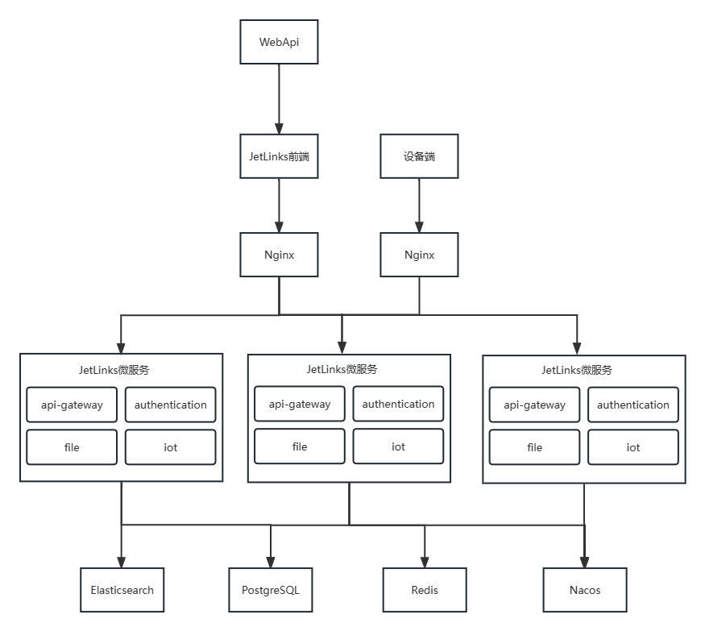

# JetLinks-Cloud集群部署

## 概述

本文档提供jetlinks-cloud集群部署的详细步骤。

## 文档推荐

<table>
   <tr>
       <td><a href="/dev-guide/colony-deploy.html">jetlinks-pro集群部署</a></td>

[//]: # (       <td><a href="">ES集群部署</a></td>)
   </tr>

[//]: # (   <tr>)

[//]: # (       <td><a href="">Redis集群部署</a></td>)

[//]: # (       <td><a href="">PG/Mysql集群部署</a></td>)

[//]: # (   </tr>)
</table>

## 集群架构图



## JetLinks-Cloud集群部署

#### 材料准备

1. 拉取`jetlinks-cloud`源码,具体操作可参考<a target="_blank" href="/dev-guide/pull-code.html#源码获取">源码获取</a>。
2. 修改配置文件，配置文档参数修改参考<a target="_blank" href="/dev-guide/config-info.html#配置文件常见修改说明">常见参数说明</a>。
3. 源码打`jar`包或`docker`镜像请移步<a target="_blank" href="/dev-guide/java-deploy.html">部署文档指引</a>，选择对应的打包方式并按指引操作。
4. 上传部署文件（jar、基础服务组件安装包及镜像等）。

<div class='explanation info'>
  <p class='explanation-title-warp'> 
    <span class='iconfont icon-tishi explanation-icon'></span>
    <span class='explanation-title font-weight'>提示</span>
  </p>

   <p>如需使用docker方式部署，需自行安装docker环境，<a target="_blank" href="/install-deployment/docker-start.html#安装docker">安装docker</a>。</p>

</div>

#### 各服务器上传jar、镜像等操作

相关材料上传及<a target="_blank" href="/dev-guide/middleware-deploy.html">部署基础服务</a>（Redis、ES、PG/Mysql）完成后，需在启动前修改部分参数。

<div class='explanation error'>
  <p class='explanation-title-warp'> 
    <span class='iconfont icon-jinggao explanation-icon'></span>
    <span class='explanation-title font-weight'>重要</span>
  </p>

   <p>部署集群需要修改  <span class='explanation-title font-weight'>jetlinks.server-id</span>或者
<span class='explanation-title font-weight'>jetlinks.cluster.id</span>两者中任一值，该值<span class='explanation-title font-weight'>必须不一致且固定</span>，不可设置动态随机值。</p>
<p><span class='explanation-title font-weight'>jetlinks.cluster.id</span>一致会导致集群内在某些场景下无法进行数据广播通知其余服务节点。</p>
<p><span class='explanation-title font-weight'>jetlinks.cluster.id</span>不一致启动时随机会导致在某些场景下后端应用根据此参数从缓存中拿不到历史信息。</p>

</div>

| 参数                               | 说明                                                   | 
|----------------------------------|------------------------------------------------------|
| `jetlinks.server-id`             | 当前后端应用的唯一id，该参数已被注解过时，建议使用`jetlinks.cluster.id`      | 
| `jetlinks.cluster.id`            | 引用`jetlinks.server-id`的值,和`jetlinks.server-id`二选一即可。 |
| `jetlinks.cluster.external-host` | 集群节点通信对外暴露的host                                      |
| `jetlinks.cluster.external-port` | 集群节点通信对外暴露的端口                                        | 
| `jetlinks.cluster.seeds`         | 集群种子节点,集群时,配置为集群节点的 external-host:external-port      | 
| `spring.config.location`         | 指定配置文件路径，使用该参数可以指定spring使用外置配置文件，而非jar包内部打包配置文件      | 

#### jar启动

`jetlinks-cloud`打包后会生成4个jar包，jar包路径如下:

```
micro-services/api-gateway-service/target/applicatione.jar
micro-services/authentication-service/target/applicatione.jar
micro-services/file-service/target/applicatione.jar
micro-services/iot-service/target/applicatione.jar
```

<div class='explanation primary'>
  <p class='explanation-title-warp'>
    <span class='iconfont icon-bangzhu explanation-icon'></span>
    <span class='explanation-title font-weight'>说明</span>
  </p>

打包生成的四个服务jar包名都为`applicatione.jar`，为了区分建议将jar包重命名。

</div>

在各服务器上执行以下命令，该命令携带了两个动态参数指定了集群相关信息，需在各应用启动时指定不同的`cluster.id`。
`seeds`则需要将所有种子节点的通信地址填入，包括当前节点地址信息。

```shell

java -jar api-gateway-service.jar --jetlinks.cluster.id=api-gateway:node1 --jetlinks.cluster.seeds=192.168.66.171:18800,192.168.66.177:18800,192.168.66.178:18800
java -jar authentication-service.jar --jetlinks.cluster.id=authentication:node1 --jetlinks.cluster.seeds=192.168.66.171:18800,192.168.66.177:18800,192.168.66.178:18800
java -jar file-service.jar --jetlinks.cluster.id=file:node1 --jetlinks.cluster.seeds=192.168.66.171:18800,192.168.66.177:18800,192.168.66.178:18800
java -jar iot-service.jar --jetlinks.cluster.id=iot:node1 --jetlinks.cluster.seeds=192.168.66.171:18800,192.168.66.177:18800,192.168.66.178:18800

```

#### docker启动

1. 上传`docker-compose`容器编排文件至各服务器（该文件以下简称`DC文件`），文件路径`jetlinks-pro\dist\docker-compose.yml`。

DC文件示例:
```shell
version: '2'
services:
    api-gateway-service:
    image: registry.cn-hangzhou.aliyuncs.com/jetlinks-cloud/api-gateway-service:2.0.0-SNAPSHOT
    ports:
      - 8800:8800 # 使用docker部署需要开放以下端口，否则会导致服务节点之间无法正常通信
      - 18800:18800 # 集群通信通信本地端口
      - 28800:28800 # 集群节点本地RPC端口
    environment:
      ... # 此处省略的参数与jetlinks-cloud单机版一致，详情参考单机版DC文件
      - "jetlinks.cluster.id=api-gateway-service:node1" # 后端应用的唯一id，请保持每个节点之间id不同
      - "jetlinks.cluster.external-host=192.168.66.171" # 集群节点通信对外暴露的host
      - "jetlinks.cluster.seeds[0]=192.168.66.171:18800" # 集群种子节点1
      - "jetlinks.cluster.seeds[1]=192.168.66.177:18800" # 集群种子节点2
      - "jetlinks.cluster.seeds[1]=192.168.66.178:18800" # 集群种子节点3
  authentication-service:
    image: registry.cn-hangzhou.aliyuncs.com/jetlinks-cloud/authentication-service:2.0.0-SNAPSHOT
    ports:
      - 8100:8100 # 使用docker部署需要开放以下端口，否则会导致服务节点之间无法正常通信
      - 18100:18100 # 集群通信通信本地端口
      - 28100:28100 # 集群节点本地RPC端口
    environment:
      ... # 此处省略的参数与jetlinks-cloud单机版一致，详情参考单机版DC文件
      - "jetlinks.cluster.id=authentication-service:node1" # 后端应用的唯一id，请保持每个节点之间id不同
      - "jetlinks.cluster.external-host=192.168.66.171" # 集群节点通信对外暴露的host
      - "jetlinks.cluster.seeds[0]=192.168.66.171:18100" # 集群种子节点1
      - "jetlinks.cluster.seeds[1]=192.168.66.177:18100" # 集群种子节点2
      - "jetlinks.cluster.seeds[1]=192.168.66.178:18100" # 集群种子节点3
  file-service:
    image: registry.cn-hangzhou.aliyuncs.com/jetlinks-cloud/file-service:2.0.0-SNAPSHOT
    ports:
      - 8300:8300 # 使用docker部署需要开放以下端口，否则会导致服务节点之间无法正常通信
      - 18300:18300 # 集群通信通信本地端口
      - 28300:28300 # 集群节点本地RPC端口
    environment:
      ... # 此处省略的参数与jetlinks-cloud单机版一致，详情参考单机版DC文件
      - "jetlinks.cluster.id=file-service:node1" # 后端应用的唯一id，请保持每个节点之间id不同
      - "jetlinks.cluster.external-host=192.168.66.171" # 集群节点通信对外暴露的host
      - "jetlinks.cluster.seeds[0]=192.168.66.171:18300" # 集群种子节点1
      - "jetlinks.cluster.seeds[1]=192.168.66.177:18300" # 集群种子节点2
      - "jetlinks.cluster.seeds[1]=192.168.66.178:18300" # 集群种子节点3
    volumes:
      - "./data/upload:/application/upload"
  iot-service:
    image: registry.cn-hangzhou.aliyuncs.com/jetlinks-cloud/iot-service:2.0.0-SNAPSHOT
    ports:
      - 8200:8200 # 使用docker部署需要开放以下端口，否则会导致服务节点之间无法正常通信
      - 18200:18200 # 集群通信通信本地端口
      - 28200:28200 # 集群节点本地RPC端口
    environment:
      ... # 此处省略的参数与jetlinks-cloud单机版一致，详情参考单机版DC文件
      - "jetlinks.cluster.id=iot-service:node1" # 后端应用的唯一id，请保持每个节点之间id不同
      - "jetlinks.cluster.external-host=192.168.66.171" # 集群节点通信对外暴露的host
      - "jetlinks.cluster.seeds[0]=192.168.66.171:18200" # 集群种子节点1
      - "jetlinks.cluster.seeds[1]=192.168.66.177:18200" # 集群种子节点2
      - "jetlinks.cluster.seeds[1]=192.168.66.178:18200" # 集群种子节点3
    volumes:
      - "./data/dumps:/dumps"
      
```

3. 在`DC文件`所在目录执行`docker-compose up -d`命令创建并启动容器，使用`docker ps -a`命令并查看`STATUS`为`UP`则表示启动成功。

```shell
$ docker ps -a
CONTAINER ID   IMAGE                                                                                    COMMAND                  CREATED          STATUS    
                    PORTS                                            NAMES
06f023229b31   registry.cn-hangzhou.aliyuncs.com/jetlinks-cloud/api-gateway-service:2.0.0-SNAPSHOT      "./docker-entrypoint…"   34 seconds ago   Up 2 hours     
                                                    micro-services-api-gateway-service
3e22eddeb8a1   registry.cn-hangzhou.aliyuncs.com/jetlinks-cloud/iot-service:2.0.0-SNAPSHOT              "./docker-entrypoint…"   34 seconds ago   Up 2 hours  
                                                    micro-services-iot-service
44f7f46fc291   registry.cn-hangzhou.aliyuncs.com/jetlinks-cloud/file-service:2.0.0-SNAPSHOT             "./docker-entrypoint…"   34 seconds ago   Up 2 hours  
                                                    micro-services-file-service
ccaefa0d4c72   registry.cn-hangzhou.aliyuncs.com/jetlinks-cloud/authentication-service:2.0.0-SNAPSHOT   "./docker-entrypoint…"   34 seconds ago   Up 2 hours  
                                                    micro-services-authentication-service
```


#### 启动前端

1. 配置nginx.conf文件，示例如下

```bash
events {
  worker_connections  1024;
}

http{

  upstream iotserver {
      server 192.168.66.171:18800 weight=1; #轮询地址，请根据实际部署后端地址进行替换
      server 192.168.66.177:18800 weight=1;
      server 192.168.66.178:18800 weight=1;
  }

   server {
      listen 9000; #监听端口号
      listen [::]:9000;
      gzip on;
      gzip_min_length 1k;
      gzip_comp_level 9;
      gzip_types text/plain text/css text/javascript application/json application/javascript application/x-javascript application/xml;
      gzip_vary on;
      gzip_disable "MSIE [1-6]\.";
      root /usr/local/nginx/html/dist;  # 替换为dist文件上传路径
      location / {
        index  index.html;
      }

      location ^~/api/ {
         proxy_pass http://iotserver/;
         proxy_set_header X-Forwarded-Proto $scheme;
         proxy_set_header Host $host;
         proxy_set_header X-Real-IP  $remote_addr;
         proxy_set_header X-Forwarded-For $proxy_add_x_forwarded_for;
         proxy_http_version 1.1;
         proxy_set_header Upgrade $http_upgrade;
         proxy_set_header Connection "upgrade";
         proxy_connect_timeout   1;
         proxy_buffering off;
         chunked_transfer_encoding off;
         proxy_cache off;
         proxy_send_timeout      30m;
         proxy_read_timeout      30m;
         client_max_body_size    500m;
      }
   }
}

```

2. 启动nginx

```shell
# 在nginx可执行程序所在目录下执行下方命令 -c 指定配置文件
./nginx -c /usr/local/nginx/conf/nginx.conf #启动nginx
```
