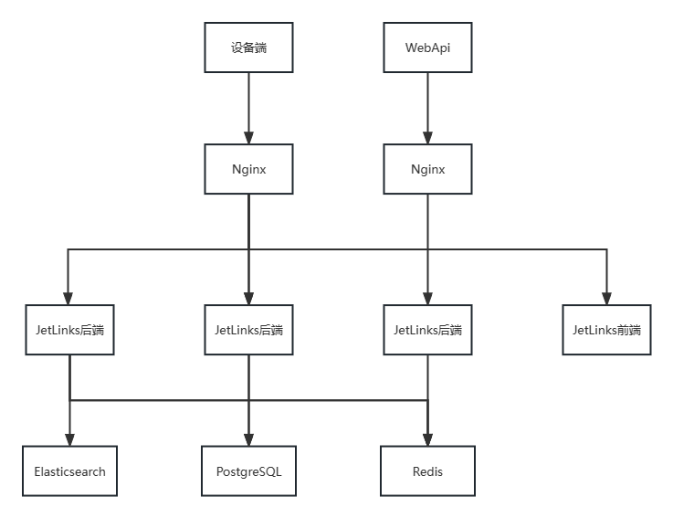
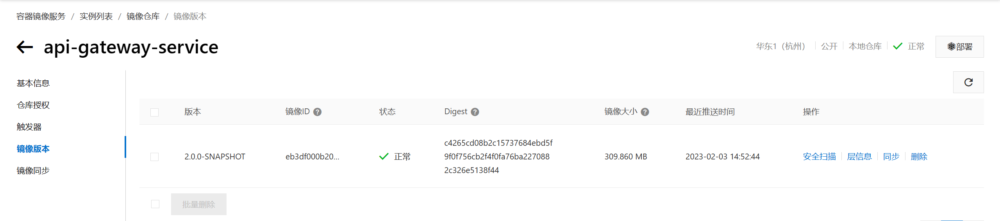

# 集群部署

## 概述

本文档提供jetlinks-pro集群部署的详细步骤。

## 文档推荐

<table>
   <tr>
       <td><a href="">集群模式下jetlinks-pro前端nginx配置</a></td>
       <td><a href="">jetlinks-cloud集群部署</a></td>

[//]: # (       <td><a href="">ES集群部署</a></td>)
   </tr>

[//]: # (   <tr>)

[//]: # (       <td><a href="">Redis集群部署</a></td>)

[//]: # (       <td><a href="">PG/Mysql集群部署</a></td>)

[//]: # (   </tr>)
</table>

## 集群架构图



## JetLinks-Pro集群部署

#### 材料准备

1. 拉取`JetLinks pro`源码,具体操作可参考<a target="_blank" href="/dev-guide/pull-code.html#源码获取">源码获取</a>。
2. 修改配置文件，配置文档参数修改参考<a target="_blank" href="/dev-guide/config-info.html#配置文件常见修改说明">常见参数说明</a>。
3. 源码打`jar`包或`docker`镜像请移步<a target="_blank" href="/dev-guide/java-deploy.html">部署文档指引</a>，选择对应的打包方式并按指引操作。
4. 上传部署文件（jar、基础服务组件安装包及镜像等）。

<div class='explanation info'>
  <p class='explanation-title-warp'> 
    <span class='iconfont icon-tishi explanation-icon'></span>
    <span class='explanation-title font-weight'>提示</span>
  </p>

   <p>如需使用docker方式部署，需自行安装docker环境，<a target="_blank" href="/install-deployment/docker-start.html#安装docker">安装docker</a></p>。

</div>

#### 各服务器上传jar、镜像等操作

相关材料上传及部署基础服务（Redis、ES、PG/Mysql）完成后，需在启动前修改部分参数。

<div class='explanation error'>
  <p class='explanation-title-warp'> 
    <span class='iconfont icon-jinggao explanation-icon'></span>
    <span class='explanation-title font-weight'>重要</span>
  </p>

   <p>部署集群需要修改  <span class='explanation-title font-weight'>jetlinks.server-id</span>或者
<span class='explanation-title font-weight'>jetlinks.cluster.id</span>两者中任一值，该值<span class='explanation-title font-weight'>必须不一致且固定</span>，不可设置动态随机值。</p>
<p><span class='explanation-title font-weight'>jetlinks.cluster.id</span>一致会导致集群内在某些场景下无法进行数据广播通知其余服务节点。</p>
<p><span class='explanation-title font-weight'>jetlinks.cluster.id</span>不一致启动时随机会导致在某些场景下后端应用根据此参数从缓存中拿不到历史信息。</p>

</div>

| 参数                               | 说明                                                   | 
|----------------------------------|------------------------------------------------------|
| `jetlinks.server-id`             | 当前后端应用的唯一id，该参数已被注解过时，建议使用`jetlinks.cluster.id`      | 
| `jetlinks.cluster.id`            | 引用`jetlinks.server-id`的值,和`jetlinks.server-id`二选一即可。 |
| `jetlinks.cluster.external-host` | 集群节点通信对外暴露的host                                      |
| `jetlinks.cluster.external-port` | 集群节点通信对外暴露的端口                                        | 
| `jetlinks.cluster.seeds`         | 集群种子节点,集群时,配置为集群节点的 external-host:external-port      | 
| `spring.config.location`         | 指定配置文件路径，使用该参数可以指定spring使用外置配置文件，而非jar包内部打包配置文件      | 

#### jar启动

在各服务器上执行以下命令，该命令携带了两个动态参数指定了集群相关信息，需在各应用启动时指定不同的`cluster.id`。
`seeds`则需要将所有种子节点的通信地址填入，包括当前节点地址信息。

```shell

java -jar jetlinks-standalone.jar --jetlinks.cluster.id=jetlinks:node1 --jetlinks.cluster.seeds=127.0.0.1:18844,127.0.0.1:18845

```

#### docker启动

1. 上传`docker-compose`容器编排文件至各服务器（该文件以下简称`DC文件`），文件路径`jetlinks-pro\dist\docker-compose.yml`。

2. 在`DC文件`所在目录执行`docker-compose up -d`命令创建并启动容器，使用`docker ps -a`命令并查看`STATUS`为`UP`则表示启动成功。

```shell
$ docker ps -a
CONTAINER ID   IMAGE                                                                                COMMAND                  CREATED          STATUS        
               PORTS                                                                                                                NAMES
f303fc2fbd67   registry.cn-hangzhou.aliyuncs.com/jetlinks-demo/jetlinks-standalone:2.0.0-SNAPSHOT   "./docker-entrypoint…"   23 seconds ago   Up 16 seconds 
               0.0.0.0:1883->1883/tcp, 0.0.0.0:8100-8110->8100-8110/tcp, 0.0.0.0:8845->8845/tcp, 0.0.0.0:8200-8210->8200-8210/udp   jetlinks-pro
4e883fed1d0d   registry.cn-shenzhen.aliyuncs.com/jetlinks/jetlinks-ui-pro:2.0.0                     "/docker-entrypoint.…"   4 days ago       Up 7 minutes  
               0.0.0.0:9000->80/tcp                                                                                                 jetlinks-pro-ui
84a9379e3944   kibana:7.17.3                                                                        "/bin/tini -- /usr/l…"   3 weeks ago      Up 8 minutes  
               0.0.0.0:5601->5601/tcp                                                                                               jetlinks-kibana      
6366d9063dd0   elasticsearch:7.17.3                                                                 "/bin/tini -- /usr/l…"   3 weeks ago      Up 7 minutes  
               0.0.0.0:9200->9200/tcp, 0.0.0.0:9300->9300/tcp                                                                       jetlinks-elasticsearch
7bc603f1e897   postgres:11-alpine                                                                   "docker-entrypoint.s…"   6 weeks ago      Up 7 minutes  
               0.0.0.0:5432->5432/tcp                                                                                               jetlinks-postgres       
4bdba77584ce   redis:5.0.4                                                                          "docker-entrypoint.s…"   2 months ago     Up 7 minutes  
               0.0.0.0:6379->6379/tcp                                                                                               jetlinks-redis
```
3. 启动前端服务

```shell
docker run -it --rm -p 9000:80 -e "API_BASE_PATH=http://xxx:8844/" registry.cn-shenzhen.aliyuncs.com/jetlinks/jetlinks-ui-pro:2.0.0
```

<div class='explanation primary'>
  <p class='explanation-title-warp'>
    <span class='iconfont icon-bangzhu explanation-icon'></span>
    <span class='explanation-title font-weight'>说明</span>
  </p>

`API_BASE_PATH`配置为后端服务的Ipv4地址和应用端口号，请根据具体部署的后端地址配置,请勿使用`127.0.0.1`及`localhost`，docker可能无法正确连接这两个特殊域名及ip。

</div>

#### 启动nginx

1. 配置nginx.conf文件，示例如下

```yaml
events {
  worker_connections  1024;
}

  http {
  # api接口服务(后端)
  upstream apiserver {
  server 192.168.66.171:8844;
  server 192.168.66.177:8844;
  server 192.168.66.178:8844;
}

  # 前端服务
  upstream webserver {
  server 192.168.66.171:9000;
}

  # 文件服务
  upstream fileserver {
  server 192.168.66.171:8844;
}

  server {

  listen       8080;
  server_name  localhost;

  location ^~/upload/ {
  proxy_pass http://fileserver;
  proxy_set_header Host $host:$server_port;
  proxy_set_header X-Real-IP  $remote_addr;
  proxy_set_header X-Forwarded-For $proxy_add_x_forwarded_for;
  }

  location ^~/jetlinks/file/static {
  proxy_pass http://fileserver/file/static;
  proxy_set_header X-Forwarded-Proto $scheme;
  proxy_set_header Host $host:$server_port;
  proxy_set_header X-Real-IP  $remote_addr;
  proxy_set_header X-Forwarded-For $proxy_add_x_forwarded_for;
  proxy_send_timeout      30m;
  proxy_read_timeout      30m;
  client_max_body_size    100m;
  }

  location ^~/jetlinks/ {
  proxy_pass http://apiserver/;
  proxy_set_header X-Forwarded-Proto $scheme;
  proxy_set_header Host $host:$server_port;
  proxy_set_header X-Real-IP  $remote_addr;
  proxy_set_header X-Forwarded-For $proxy_add_x_forwarded_for;
  proxy_http_version 1.1;
  proxy_set_header Upgrade $http_upgrade;
  proxy_set_header Connection "upgrade";
  proxy_connect_timeout   1;
  proxy_buffering off;
  chunked_transfer_encoding off;
  proxy_cache off;
  proxy_send_timeout      30m;
  proxy_read_timeout      30m;
  client_max_body_size    100m;
  }

  location / {
  proxy_pass http://webserver/;
  proxy_set_header Host $host:$server_port;
  proxy_set_header X-Real-IP  $remote_addr;
  proxy_set_header X-Forwarded-For $proxy_add_x_forwarded_for;
  }
}
}
```

2. 启动nginx

```shell
whereis nginx #查询nginx文件夹具体位置
cd ./usr/local/sbin #切换到sbin目录下
./nginx #启动nginx
```

## JetLinks-Cloud集群部署

#### 拉取源码

1. 拉取`JetLinks Cloud`源码

```shell
 $ git clone -b master --recurse-submodules git@github.com:jetlinks-v2/jetlinks-cloud.git
```

具体操作可参考<a href="/dev-guide/pull-code.html#源码获取">源码获取</a>。

2. 修改配置文件

修改示例可参考<a href="/dev-guide/config-info.html#jetlinks-pro-单机版集群">配置文件示例</a>。

#### 构建、推送镜像

1. 修改`jetlinks-pro\build-and-push-docker.sh` 路径下的脚本文件，修改示例如下

```shell
#!/usr/bin/env bash
servers="$1"
if [ -z "$servers" ]||[ "$servers" = "all" ];then
servers="api-gateway-service,authentication-service,iot-service,file-service"
fi

IFS=","
arr=($a)

version=$(mvn help:evaluate -Dexpression=project.version -q -DforceStdout)
echo "start build : $servers : $version"
## 使用maven打包
./mvnw -Dmaven.test.skip=true \
-Dmaven.build.timestamp="$(date "+%Y-%m-%d %H:%M:%S")" \
-Dgit-commit-id="$(git rev-parse HEAD)" \
-Pmedia -T 12 \
clean package
if [ $? -ne 0 ];then
    echo "构建失败!"
else

#四个微服务分别构建镜像并推送到仓库
for s in ${servers}
do
 cd "./micro-services/${s}" || exit
 dockerImage="registry.cn-hangzhou.aliyuncs.com/jetlinks-ljs/$s:$version"
 echo "build $s docker image $dockerImage"
 docker build -t "$dockerImage" . && docker push "$dockerImage"
 cd ../../
done
fi
```

2. 执行脚本

```shell
./build-and-push-docker.sh
```

3. 检查每个服务本地生成的digest和镜像仓库中的digest是否一致,此处以api服务为例

```shell
The push refers to repository [registry.cn-hangzhou.aliyuncs.com/jetlinks-cloud/authentication-service]
a621ee2c27a7: Preparing
be8c43150f09: Preparing
22678f43f6e5: Pushed
5c446ffd104b: Pushed
e6b1f13d4d74: Pushed
5c45d38be933: Pushed
b5445123c81c: Mounted from jetlinks-cloud/api-gateway-service
29c7de453b8e: Layer already exists
144903481aa9: Layer already exists
849ea2764450: Layer already exists
f49d20b92dc8: Layer already exists
fe342cfe5c83: Layer already exists
630e4f1da707: Layer already exists
9780f6d83e45: Layer already exists
2.0.0-SNAPSHOT: digest: sha256:beefbf403ff1533975e8185e08927a4c3e2c307fbbd2c0f06fd39489352f4cb7 size: 3259
```



#### 启动项目

1. 创建docker-compose文件

   docker-compose文件示例可参考<a href="/dev-guide/dc-info.html#jetlinks-cloud示例">docker-compose文件示例</a>。

2. 将docker-compose配置文件分别上传到每台服务器
3. 使用docker-compose up -d命令创建并启动容器，使用docker ps -a命令验证容器是否启动成功
   <a target="" href="../install-deployment/docker-start.html#docker常用命令">docker常用命令</a>

```shell
$ docker ps -a
CONTAINER ID   IMAGE                                                                                    COMMAND                  CREATED          STATUS    
                    PORTS                                            NAMES
06f023229b31   registry.cn-hangzhou.aliyuncs.com/jetlinks-cloud/api-gateway-service:2.0.0-SNAPSHOT      "./docker-entrypoint…"   34 seconds ago   Up 2 hours     
                                                    micro-services-api-gateway-service
3e22eddeb8a1   registry.cn-hangzhou.aliyuncs.com/jetlinks-cloud/iot-service:2.0.0-SNAPSHOT              "./docker-entrypoint…"   34 seconds ago   Up 2 hours  
                                                    micro-services-iot-service
44f7f46fc291   registry.cn-hangzhou.aliyuncs.com/jetlinks-cloud/file-service:2.0.0-SNAPSHOT             "./docker-entrypoint…"   34 seconds ago   Up 2 hours  
                                                    micro-services-file-service
ccaefa0d4c72   registry.cn-hangzhou.aliyuncs.com/jetlinks-cloud/authentication-service:2.0.0-SNAPSHOT   "./docker-entrypoint…"   34 seconds ago   Up 2 hours  
                                                    micro-services-authentication-service
```

<div class='explanation primary'>
  <p class='explanation-title-warp'>
    <span class='iconfont icon-bangzhu explanation-icon'></span>
    <span class='explanation-title font-weight'>说明</span>
  </p>
  STATUS为up为容器启动成功，STATUS为Exited为容器启动失败。

容器启动失败示例如下

```shell
06f023229b31   registry.cn-hangzhou.aliyuncs.com/jetlinks-cloud/api-gateway-service:2.0.0-SNAPSHOT      "./docker-entrypoint…"   4 days ago       Exited (137) 2days ago     
                                                    micro-services-api-gateway-service                                         
```

</div>

7. 启动前端服务

```shell
docker run -it --rm -p 9000:80 -e "API_BASE_PATH=http://xxx:8844/" registry.cn-shenzhen.aliyuncs.com/jetlinks/jetlinks-ui-pro:2.0.0
```

<div class='explanation primary'>
  <p class='explanation-title-warp'>
    <span class='iconfont icon-bangzhu explanation-icon'></span>
    <span class='explanation-title font-weight'>说明</span>
  </p>

`API_BASE_PATH`中的ip地址和端口号，请根据具体部署的后端地址配置。

</div>

8. 配置`nginx.config`文件

```yaml
events {
  worker_connections  1024;
}

  http {
  # api接口服务(后端)
  upstream apiserver {
  server 192.168.66.171:8800;
  server 192.168.66.177:8800;
  server 192.168.66.178:8800;
}

  # 前端服务
  upstream webserver {
  server 192.168.66.171:9000;
}

  # 文件服务
  upstream fileserver {
  server 192.168.66.171:8800;
}

  server {

  listen       8080;
  server_name  localhost;

  location ^~/upload/ {
  proxy_pass http://fileserver;
  proxy_set_header Host $host:$server_port;
  proxy_set_header X-Real-IP  $remote_addr;
  proxy_set_header X-Forwarded-For $proxy_add_x_forwarded_for;
  }

  location ^~/jetlinks/file/static {
  proxy_pass http://fileserver/file/static;
  proxy_set_header X-Forwarded-Proto $scheme;
  proxy_set_header Host $host:$server_port;
  proxy_set_header X-Real-IP  $remote_addr;
  proxy_set_header X-Forwarded-For $proxy_add_x_forwarded_for;
  proxy_send_timeout      30m;
  proxy_read_timeout      30m;
  client_max_body_size    100m;
  }

  location ^~/jetlinks/ {
  proxy_pass http://apiserver/;
  proxy_set_header X-Forwarded-Proto $scheme;
  proxy_set_header Host $host:$server_port;
  proxy_set_header X-Real-IP  $remote_addr;
  proxy_set_header X-Forwarded-For $proxy_add_x_forwarded_for;
  proxy_http_version 1.1;
  proxy_set_header Upgrade $http_upgrade;
  proxy_set_header Connection "upgrade";
  proxy_connect_timeout   1;
  proxy_buffering off;
  chunked_transfer_encoding off;
  proxy_cache off;
  proxy_send_timeout      30m;
  proxy_read_timeout      30m;
  client_max_body_size    100m;
  }

  location / {
  proxy_pass http://webserver/;
  proxy_set_header Host $host:$server_port;
  proxy_set_header X-Real-IP  $remote_addr;
  proxy_set_header X-Forwarded-For $proxy_add_x_forwarded_for;
  }
}
}
```

8. 启动nginx

```shell
whereis nginx #查询nginx文件夹具体位置
cd ./usr/local/sbin #切换到sbin目录下
./nginx #启动nginx
```