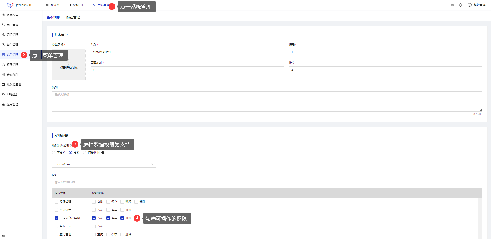
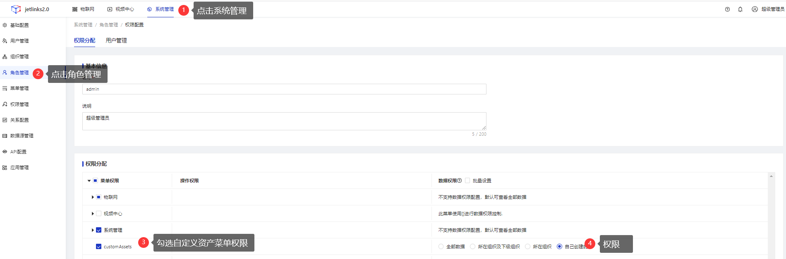
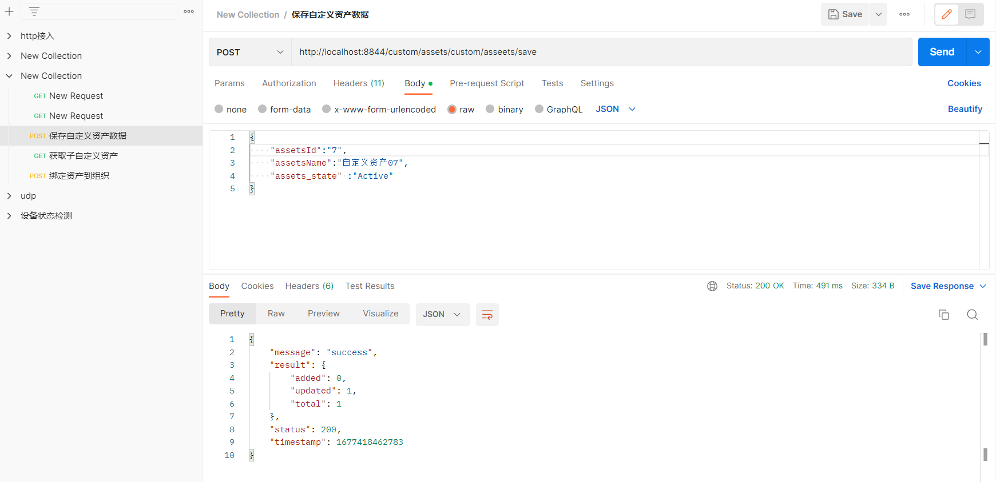
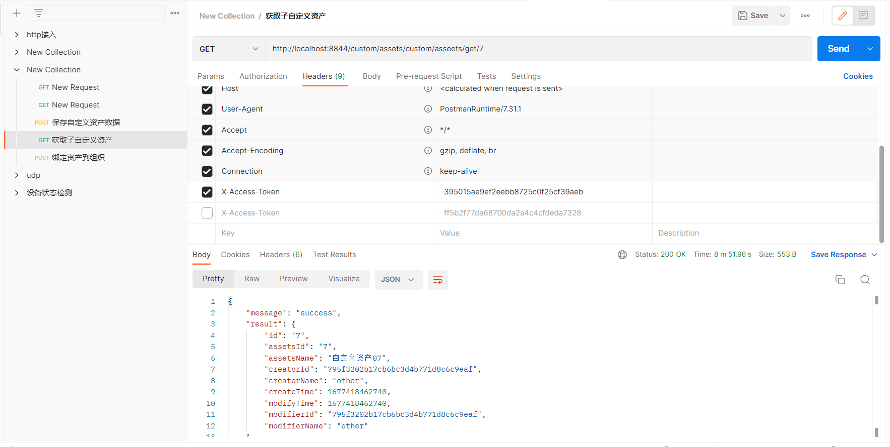
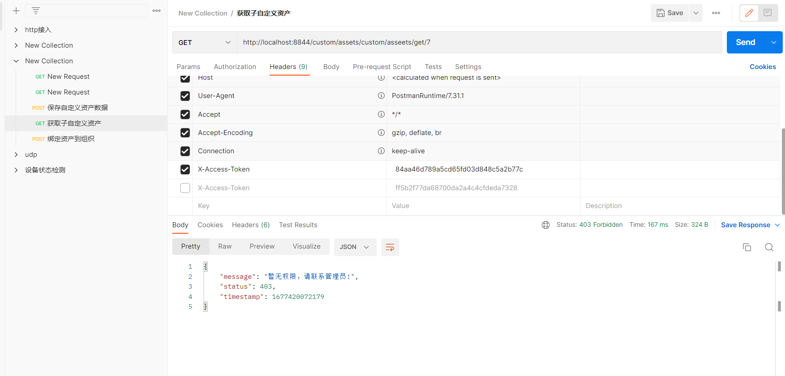
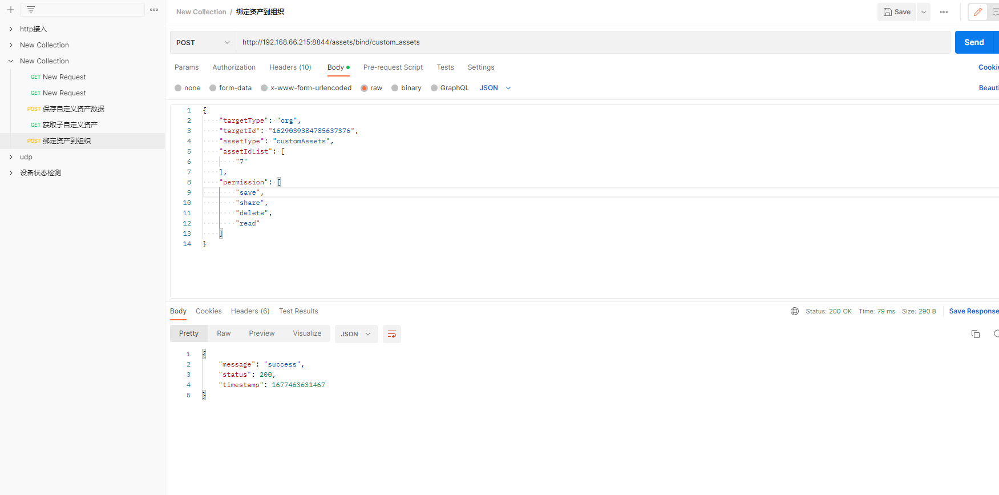
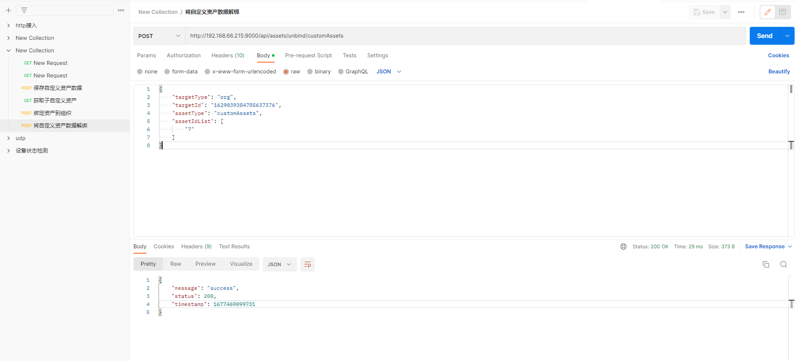

# 在JetLinks平台自定义资产

<div class='explanation primary'>
  <p class='explanation-title-warp'>
    <span class='iconfont icon-bangzhu explanation-icon'></span>
    <span class='explanation-title font-weight'>说明</span>
  </p>
用户可以根据自己业务的需要，自定义资产并加入JetLinks平台

</div>

## 指导介绍
  <p>1. <a href="/dev-guide/custom_assets.html#在jetlinks平台构建自定义资产">在JetLinks平台构建自定义资产</a></p>
  <p>2. <a href="/dev-guide/custom_assets.html#将菜单数据绑定-让自定义资产加入管控">菜单数据绑定，让自定义资产加入管控</a></p>
  <p>3. <a href="/dev-guide/custom_assets.html#给角色赋予自定义资产的操作权限">给角色赋予自定义资产的操作权限</a></p>
  <p>4. <a href="/dev-guide/custom_assets.html#管控自定义资产示例">管控自定义资产示例</a></p>
  <p>5. <a href="/dev-guide/custom_assets.html#资产绑定到组织">资产绑定到组织</a></p>


## 问题指引

<table>
  <tr>
   <td>
    <a href="/dev-guide/custom_assets.html#自定义注解的required-值为true时-用户自己创建的用户自己无法根基资产id查看资产信息" >自定义注解的required()值为true时，用户自己创建的用户自己无法根基资产ID查看资产信息</a>
   </td>
   <td>
     <a href="/dev-guide/custom_assets.html#当前用户无法查看受自定义的资产管控的数据">当前用户无法查看受自定义的资产管控的数据</a>
   </td>
  </tr>

</table>

## 在JetLinks平台构建自定义资产
1.在JetLinks上构建自定义模块
  <div class='explanation primary'>
  <p class='explanation-title-warp'>
    <span class='iconfont icon-bangzhu explanation-icon'></span>
    <span class='explanation-title font-weight'>提示</span>
  </p>
  <p>在定义自定义资产时，controller层需要实现接口<code>AssetsHolderCrudController</code></p>
<p><code>AssetsHolderCrudController:</code>支持数据权限控制的通用增删改查控制器</p>

</div>
示例：

```java
public class CustomAssetsController implements
        AssetsHolderCrudController<MyCustomAssetsEntity, String>
```
  更多自定义模块细节参考:[自定义模块项目](/dev-guide/custom-code-guide.html#自定义模块项目)
  
2.构建自定义资产注解
<div class='explanation primary'>
  <p class='explanation-title-warp'>
    <span class='iconfont icon-bangzhu explanation-icon'></span>
    <span class='explanation-title font-weight'>说明</span>
  </p>
  <p>自定义的资产资产注解需要继承JetLinks平台注解<code>AssetsController</code></p>
<p><code>AssetsController:</code>在需要资产权限控制的<code>Controller</code>类和方法上标记此注解,实现相关数据权限控制. 仅支持响应式的方法: 
返回值为<code>Mono</code>或者<code>Flux</code></p>

</div>
自定义的示例资产注解：`@CustomAsset`，继承注解`@AssetsController`

```java
@Target({ElementType.TYPE, ElementType.METHOD})
@Retention(RetentionPolicy.RUNTIME)
@Inherited
@Documented
@AssetsController(type = "customAssets")
public @interface CustomAsset {
    /**
     * @see AssetsController#assetIdIndex()
     */
    @AliasFor(annotation = AssetsController.class)
    int assetIdIndex() default 0;

    /**
     * @see AssetsController#assetObjectIndex()
     */
    @AliasFor(annotation = AssetsController.class)
    int assetObjectIndex() default -1;

    /**
     * @see AssetsController#property()
     */
    @AliasFor(annotation = AssetsController.class)
    String property() default "id";

    /**
     * @see AssetsController#required()
     */
    @AliasFor(annotation = AssetsController.class)
    boolean required() default false;

    /**
     * @see AssetsController#autoBind()
     */
    @AliasFor(annotation = AssetsController.class)
    boolean autoBind() default false;

    /**
     * @see AssetsController#ignore()
     */
    @AliasFor(annotation = AssetsController.class)
    boolean ignore() default false;

    /**
     * @see AssetsController#ignoreQuery()
     */
    @AliasFor(annotation = AssetsController.class)
    boolean ignoreQuery() default false;

    /**
     * @see AssetsController#validate()
     */
    @AliasFor(annotation = AssetsController.class)
    boolean validate() default true;

    /**
     * @see  AssetsController#allowAssetNotExist()
     */
    @AliasFor(annotation = AssetsController.class)
    boolean allowAssetNotExist() default false;

    @AliasFor(annotation = AssetsController.class)
    String[] permission() default {};
}
```

平台注解`@AssetsController`字段属性说明

| 属性名    | 返回值    | 描述                                                                 |
|-----|--------|--------------------------------------------------------------------|
|  type()   | String | 资产类型,类和方法上的注解不能同时为空                                                |
|  assetIdIndex()   | int    | 方法参数中,资产ID对应的索引,从0开始. 通常用于 根据id进行某个操作时.比如:根据id查询,根据id修改.           |
|   assetObjectIndex()     |  int      | 方法参数中,资产对象的索引,默认为-1,表示不使用对象来进行租户相关控制,而使用assetIdIndex()来处理          |
|  property()      |  String      | 在资产对象里表示资产ID的字段，默认值"id"                                                |
|    required()    |   boolean     | 要求当前用户必须是资产相关持有者,比如租户,机构等,当设置为true时,没有分配资产持有信息的用户将无法访问此功能，默认值false |
|   autoBind()     |    boolean    | 是否自动绑定资产, 通用用于新增数据的时候将新增的实体类自动绑定到用户资产下，默认值false                    |
|    autoUnbind()    | boolean       | 是否自动解绑, 通用用于删除数据的时候,将资产解绑 ，默认值false                                |
|   unbindAll()     |    boolean    | 是否解绑所有的资产,当删除数据时,解绑对应权限维度的资产。默认值true                               |
|    validate()    |    boolean    | 是否执行校验,通常用于新增数据的时候,设置为false则不校验传入的数据.默认值true                       |
|  ignore()      |     boolean   | 忽略处理租户权限信息，默认值true                                                 |
|   ignoreQuery()     |  boolean      | 忽略处理动态查询条件，默认值false                                                |
|    allowAssetNotExist()    |   boolean     | 当资产不存在时是否通过检查 ，默认值false                                            |
|    permission()    |   String[]     | 控制数据操作权限,如果没有设置则只要有对应的资产就认为有权限                                     |
|     merge()    |    boolean    | 当注解在方法上时，是否合并类上的注解，默认值true                                         |
3.自定义枚举类，实现JetLinks平台接口`EnumAssetType`，定义自定义枚举值，其中
`permissions`表示资产操作权限信息，包含read("查看"), save("编辑"), delete("删除"), share("共享")
```java
@Getter
@AllArgsConstructor
public enum CustomAssetsType implements EnumAssetType {

    customAssets("customAssets", Arrays.asList(CrudAssetPermission.values()));

    private final String name;

    private final List<AssetPermission> permissions;

    @Override
    public String getId() {
        return name();
    }
    
}
```

4.自定义`CustomAssetsProvider`类实现JetLinks平台接口`AssetSupplier`
JetLinks后端程序启动时会将`AssetSupplier`接口实现类加入`jetlinks-pro\jetlinks-components\assets-component\src\main\java\org\jetlinks
\pro\assets\impl\DefaultAssetManager\`的`assetSuppliers`属性中，用于后续资产数据的查取

自定义`CustomAssetsProvider`类
```java
@Component
public class CustomAssetsProvider implements AssetSupplier {

    private final CustomAssetsService customAssetsService;

    public CustomAssetsProvider(CustomAssetsService customAssetsService) {
        this.customAssetsService = customAssetsService;
    }

    @Override
    public List<? extends AssetType> getTypes() {
        return Arrays.asList(CustomAssetsType.customAssets);
    }

    @Override
    public Flux<? extends Asset> getAssets(AssetType type, Collection<?> assetId) {
        return customAssetsService
            .findById((Collection<String>)assetId)
            .map(instance -> new DefaultAsset(instance.getId(), instance.getAssetsName(),CustomAssetsType.customAssets)
                .withOption(Asset.OPTION_CREATOR_ID, instance.getCreatorId())
            );
    }
}
```
5.实现自定义`controller`类方法实现，本文档以保存自定义资产数据和获取自定义资产数据为例
```java
    //保存自定义资产数据
    @PostMapping("/custom/asseets/save")
    public Mono<SaveResult> customAssetsSave(@RequestBody MyCustomAssetsEntity entity){
        return customAssetsService.save(entity);
    }
    //获取自定义资产数据
    @GetMapping("/custom/asseets/get/{assetsId}")
    //自定义资产注解
    @CustomAsset(required=true)
    public Mono<MyCustomAssetsEntity> customAssetsSave(@PathVariable String assetsId) {
        return customAssetsService.findById(assetsId);
    }
```
### 菜单数据绑定，让自定义资产加入管控
登录JetLinks平台，选择**系统管理**，**菜单管理**，**新增菜单**，在权限配置处，选择数据权限控制，并勾选自定义资产权限，如图所示：

### 给角色赋予自定义资产的操作权限
选择**系统管理**，**角色管理**，点击**编辑**，给角色选择操作菜单权限，如图所示：


### 管控自定义资产示例
1.使用自定义`controller`接口，创建并保存自定义资产数据
  
接口地址：`http://{ip}:{port}/custom/assets/custom/asseets/save`


2.根据资产ID，查看资产信息

接口地址：`http://{ip}:{port}/custom/assets/custom/asseets/get/{id}`

1.根据资产ID，查看资产信息，请求头中携带有该资产查看权限的用户`token`


2.根据资产ID，查看资产信息，请求头中携带没有该资产查看权限的用户`token`


### 资产绑定到组织

接口地址：`http://{ip}:{port}/assets/bind/{资产类型}`

示例：

body参数说明
```java
{
    "targetType": "org",//组织类型
    "targetId": "1629039384785637376",//组织ID
    "assetType": "customAssets",//自定义资产类型
    "assetIdList": [
        "7"//由自定义资产类型管控的数据ID
    ],
    //资产数据绑定到该组织的数据权限    
    "permission": [
        "save",
        "share",
        "delete",
        "read"
    ]
}
```

## 将自定义资产从组织中解绑
接口地址：`http://{ip}:{port}/assets/unbind/{资产类型}`

示例：

body参数说明
```java
{
        "targetType": "org",//组织类型
        "targetId": "1629039384785637376",//组织ID
        "assetType": "customAssets",//自定义的资产类型
        "assetIdList": [
        "7" //由自定义资产类型管控的数据ID
        ]
        }
```

## 流程图
//todo

[//]: # (## 往`s_dimension_assets_bind`数据库表中添加绑定数据)

[//]: # (<div class='explanation primary'>)

[//]: # (  <p class='explanation-title-warp'>)

[//]: # (    <span class='iconfont icon-bangzhu explanation-icon'></span>)

[//]: # (    <span class='explanation-title font-weight'>说明</span>)

[//]: # (  </p>)

[//]: # (  <p>在往数据库表<code>s_dimension_assets_bind</code>存放绑定数据之前，需要按照如下操作开启权限数据控制</p>)

[//]: # (  <p>如下操作会改变数据表<code>s_menu</code>中的<code>access_support</code>字段为<code>support</code>以及<code>AssetsType</code>)

[//]: # (字段为对应的资产类型,<code>AssetsType</code>常见值：<code>certificate</code><code>role</code>、<code>user</code>、<code>device</code)

[//]: # (>、<code)

[//]: # (>product</code)

[//]: # (>、<code>org</code></p>)

[//]: # (  <p>AssetsType资产类型详情参考：<code>jetlinks-pro\jetlinks-components\assets-component\src\main\java\org\jetlinks\pro\assets)

[//]: # (\AssetType</code>接口实现类的枚举值</p>)

[//]: # (</div>)

[//]: # ()
[//]: # (![]&#40;./images/custom_assets_07.png&#41;)

[//]: # (示例：)

[//]: # ()
[//]: # (1.certificate：CA证书)

[//]: # (登录JetLinks平台,选择**物联网**，点击**运维管理**,点击**证书管理**，新增平台证书)

[//]: # (<p>在JetLinks平台证书上传时,会将证书资产数据添加到数据表<code>s_dimension_assets_bind</code>中</p>)

[//]: # (<p>新增证书时调用<code>jetlinks-pro\jetlinks-components\assets-component\src\main\java\org\jetlinks\pro\assets\crud)

[//]: # (\AssetsHolderCrudController</code>的<code>add</code>方法</p>)

[//]: # ()
[//]: # (```java)

[//]: # (//注解)

[//]: # (@AssetsController&#40;assetObjectIndex = 0, validate = false, autoBind = true&#41;)

[//]: # (//方法)

[//]: # (default Mono<E> add&#40;@RequestBody Mono<E> payload&#41; {)

[//]: # (return ReactiveServiceCrudController.super.add&#40;payload&#41;;)

[//]: # (})

[//]: # (```)

[//]: # (<p>绑定时机：根据注解上的autobind参数值，在<code>jetlinks-pro\jetlinks-components\assets-component\src\main\java\org\jetlinks)

[//]: # (\pro\assets\aop\AopAssetsControllerHandler</code>中进行方法调用</p>)

[//]: # (2.role：角色)

[//]: # (登录JetLinks平台,选择**系统管理**，点击**用户管理**,点击**编辑**，给用户绑定角色)

[//]: # (<p>再绑定角色时，会将角色绑定数据添加到数据表<code>s_dimension_assets_bind</code>中</p>)

[//]: # ()
[//]: # (![]&#40;./images/custom_assets_09.png&#41;)

[//]: # (<p>绑定时机：在用户绑定时，<code>org.hswebframework.web.system.authorization.defaults.service.)

[//]: # (DefaultDimensionUserService</code>类中推送事件<code>DimensionBindEvent</code>,)

[//]: # (在<code>jetlinks-pro\jetlinks-manager\authentication-manager\src\main\java\org\jetlinks\pro\auth\assets)

[//]: # (\UserAssetsAutoBinder</code>类中监听，从而将资产绑定数据添加到数据表<code>s_dimension_assets_bind</code>中</p>)

[//]: # ()
[//]: # (```java)

[//]: # ( @EventListener)

[//]: # (    public void dispatchDimensionBind&#40;EntityCreatedEvent<DimensionUserEntity> event&#41; {)

[//]: # (        event.async&#40;)

[//]: # (                this.publishEvent&#40;Flux.fromIterable&#40;event.getEntity&#40;&#41;&#41;, DimensionBindEvent::new&#41;)

[//]: # (        &#41;;)

[//]: # (    })

[//]: # (```)

[//]: # (3.org：组织)

[//]: # ()
[//]: # (登录JetLinks平台,选择**系统管理**，点击**组织管理**,点击**新增**，新增组织)

[//]: # (<p>新增组织调用<code>jetlinks-pro\jetlinks-components\assets-component\src\main\java\org\jetlinks\pro\assets\crud)

[//]: # (\AssetsHolderCrudController</code>的<code>add</code>方法</p>)

[//]: # ()
[//]: # (```java)

[//]: # (//注解)

[//]: # (@AssetsController&#40;assetObjectIndex = 0, validate = false, autoBind = true&#41;)

[//]: # (//方法)

[//]: # (default Mono<E> add&#40;@RequestBody Mono<E> payload&#41; {)

[//]: # (return ReactiveServiceCrudController.super.add&#40;payload&#41;;)

[//]: # (})

[//]: # (```)

[//]: # (<p>绑定时机：根据注解上的autobind参数值，在<code>jetlinks-pro\jetlinks-components\assets-component\src\main\java\org\jetlinks)

[//]: # (\pro\assets\aop\AopAssetsControllerHandler</code>中进行方法调用</p>)

[//]: # ()
[//]: # (```java)

[//]: # (    if &#40;ann.autoBind&#41; { //绑定)

[//]: # (        return new MonoAutoBindHandler&#40;index, ann, returnMono, returnFlux,)

[//]: # (            Optional::of,)

[//]: # (               &#40;tenant, objects&#41; -> tenant.bindAssets&#40;ann.type, objects&#41;)

[//]: # (             &#41;;)

[//]: # (```)

## 常见问题

### 自定义注解的required()值为true时，用户自己创建的用户自己无法根基资产ID查看资产信息
<div class='explanation warning'>
  <p class='explanation-title-warp'>
    <span class='iconfont icon-bangzhu explanation-icon'></span>
    <span class='explanation-title font-weight'>问题1</span>
  </p>
    <p>
        Q：自定义注解的required()值为true时，用户自己创建的用户自己无法根基资产ID查看资产信息？
    </p>
    <p>
        A：检查<code>org\jetlinks\pro\assets\AssetSupplier</code>接口的自定义实现类中<code>getAssets</code>方法
是否重写或重写的<code>getAssets</code>方法是否能从数据库中查询到对应的资产信息
    </p>
  </p>
</div>

###  当前用户无法查看受自定义的资产管控的数据
<div class='explanation warning'>
  <p class='explanation-title-warp'>
    <span class='iconfont icon-bangzhu explanation-icon'></span>
    <span class='explanation-title font-weight'>问题2</span>
  </p>
    <p>
        Q：当前用户无法查看受自定义的资产管控的数据？
    </p>
    <p>
        A：在角色管理处，检查当前用户角色是否赋予了该资产对应的操作权限
    </p>
  </p>
</div>