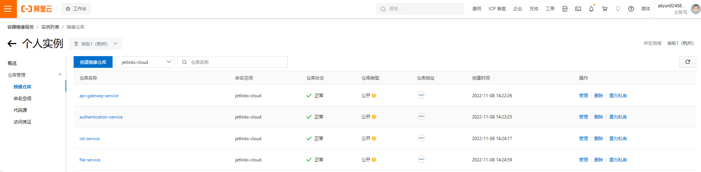

# jetlinks-cloud 部署
### jetlinks-cloud Jar包部署

1. 拉取`jetlinks pro`源码
```shell
git clone -b 2.0 --recurse-submodules git@github.com:jetlinks-v2/jetlinks-cloud.git
```
具体操作可参考<a href="/dev-guide/pull-code.html#源码获取">源码获取</a>

2. 修改配置文件

配置文件示例可参考<a href="/dev-guide/config-info.html#源码获取">配置文件</a>


3. 修改打包脚本

修改`/jetlinks-cloud/build-and-push-docker.sh`路径下的打包脚本，修改内如如下：
```shell
#!/usr/bin/env bash
servers="$1"
if [ -z "$servers" ]||[ "$servers" = "all" ];then
servers="api-gateway-service,authentication-service,iot-service,file-service"
fi

IFS=","
arr=($a)

version=$(mvn help:evaluate -Dexpression=project.version -q -DforceStdout)
echo "start build : $servers : $version"
./mvnw -Dmaven.test.skip=true \
-Dmaven.build.timestamp="$(date "+%Y-%m-%d %H:%M:%S")" \
-Dgit-commit-id="$(git rev-parse HEAD)" \
-Pmedia -T 12 \
clean package
if [ $? -ne 0 ];then
    echo "构建失败!"
fi
```
4. 执行打包脚本

在项目根路径执行
```shell
$ ./build.sh 
```


5. 将四个服务的jar包上传到需要部署的服务器上。

jar包文件地址:
```
micro-services/api-gateway-service/target/applicatione.jar
micro-services/authentication-service/target/applicatione.jar
micro-services/file-service/target/applicatione.jar
micro-services/iot-service/target/applicatione.jar
```


6. 使用java命令运行jar包，以api-gateway为例
```shell
cd ./micro-services/api-gateway-service/target/
#启动时，使用默认配置文件
java -jar jetlinks-applicatione.jar 
# 启动时，修改配置文件中的参数，格式如下
java -jar jetlinks-applicatione.jar {--配置文件中的参数}
#命令示例
java -jar jetlinks-applicatione.jar --spring.elasticsearch.embedded.enabled=true
#启动时，指定外部配置文件，格式如下
java -jar jetlinks-applicatione.jar --spring.config.location={外部配置文件全路径}
#命令示例
java -jar -Dspring.config.location=/data/application.yml jetlinks-applicatione.jar
```


### jetlinks-cloud Docker部署


1. 修改打包脚本

修改`/jetlinks-cloud/build-and-push-docker.sh`路径下的打包脚本，修改内如如下：
```shell
#!/usr/bin/env bash
servers="$1"
if [ -z "$servers" ]||[ "$servers" = "all" ];then
servers="api-gateway-service,authentication-service,iot-service,file-service"
fi

IFS=","
arr=($a)

version=$(mvn help:evaluate -Dexpression=project.version -q -DforceStdout)
echo "start build : $servers : $version"
## 使用maven打包
./mvnw -Dmaven.test.skip=true \
-Dmaven.build.timestamp="$(date "+%Y-%m-%d %H:%M:%S")" \
-Dgit-commit-id="$(git rev-parse HEAD)" \
-Pmedia -T 12 \
clean package
if [ $? -ne 0 ];then
    echo "构建失败!"
else

#四个微服务分别构建镜像并推送到仓库
for s in ${servers}
do
 cd "./micro-services/${s}" || exit
 dockerImage="registry.cn-hangzhou.aliyuncs.com/jetlinks-demo/$s:$version"
 echo "build $s docker image $dockerImage"
 docker build -t "$dockerImage" . && docker push "$dockerImage"
 cd ../../
done

fi
```

<div class='explanation info'>
  <p class='explanation-title-warp'> 
    <span class='iconfont icon-tishi explanation-icon'></span>
    <span class='explanation-title font-weight'>提示</span>
  </p>
请自行准备存放docker镜像的镜像仓库，此处以<a href="https://cr.console.aliyun.com/cn-shenzhen/instances">阿里云仓库</a>为例。

</div>

3. 查看是否推送成功
   

4. 修改`jetlinks-cloud/micro-services/docker-compose.yml`路径下的docker-compose文件

修改示例可参考<a href="/dev-guide/dc-info.html#jetlinks-cloud示例">docker-compose文件示例</a>


5. 将docker-compose文件分别上传到服务器
6. 使用docker-compose up -d命令创建并启动容器，使用docker ps -a命令验证容器是否启动成功
   docker常用命令请参考<a target="" href="../install-deployment/docker-start.html#docker常用命令">docker常用命令</a>

```shell
$ docker ps -a
CONTAINER ID   IMAGE                                                                                    COMMAND                  CREATED          STATUS    
                    PORTS                                            NAMES
06f023229b31   registry.cn-hangzhou.aliyuncs.com/jetlinks-cloud/api-gateway-service:2.0.0-SNAPSHOT      "./docker-entrypoint…"   34 seconds ago   Up 2 hours     
                                                    micro-services-api-gateway-service
3e22eddeb8a1   registry.cn-hangzhou.aliyuncs.com/jetlinks-cloud/iot-service:2.0.0-SNAPSHOT              "./docker-entrypoint…"   34 seconds ago   Up 2 hours  
                                                    micro-services-iot-service
44f7f46fc291   registry.cn-hangzhou.aliyuncs.com/jetlinks-cloud/file-service:2.0.0-SNAPSHOT             "./docker-entrypoint…"   34 seconds ago   Up 2 hours  
                                                    micro-services-file-service
ccaefa0d4c72   registry.cn-hangzhou.aliyuncs.com/jetlinks-cloud/authentication-service:2.0.0-SNAPSHOT   "./docker-entrypoint…"   34 seconds ago   Up 2 hours  
                                                    micro-services-authentication-service
```
<div class='explanation primary'>
  <p class='explanation-title-warp'>
    <span class='iconfont icon-bangzhu explanation-icon'></span>
    <span class='explanation-title font-weight'>说明</span>
  </p>
  STATUS为up为容器启动成功，STATUS为Exited为容器启动失败。

容器启动失败示例如下
```shell
06f023229b31   registry.cn-hangzhou.aliyuncs.com/jetlinks-cloud/api-gateway-service:2.0.0-SNAPSHOT      "./docker-entrypoint…"   4 days ago       Exited (137) 2days ago     
                                                    micro-services-api-gateway-service                                         
```
</div>


### docker离线部署
在根目录创建镜像打包脚本build-docker.sh，脚本内容如下
```shell
#!/usr/bin/env bash
servers="$1"
if [ -z "$servers" ]||[ "$servers" = "all" ];then
servers="api-gateway-service,authentication-service,iot-service,file-service"
fi

IFS=","
arr=($a)

version=$(mvn help:evaluate -Dexpression=project.version -q -DforceStdout)
echo "start build : $servers : $version"
## 使用maven打包
./mvnw -Dmaven.test.skip=true \
-Dmaven.build.timestamp="$(date "+%Y-%m-%d %H:%M:%S")" \
-Dgit-commit-id="$(git rev-parse HEAD)" \
-Pmedia -T 12 \
clean package
if [ $? -ne 0 ];then
    echo "构建失败!"
else

#四个微服务分别构建镜像并推送到仓库
for s in ${servers}
do
 cd "./micro-services/${s}" || exit
 #定义镜像名
 dockerImage="jetlinks-$s:$version"
 echo "build $s docker image $dockerImage"
 docker build -t "$dockerImage" .
 cd ../../
done
fi
```
在根目录执行脚本`./build-docker.sh`

#### 导出镜像
导出的镜像会到源码根目录下，命令格式如下:
```shell
docker save -o [命名].tar [镜像名:版本号]
```
命令示例如下:
```shell
docker save -o jetlinks-api-gateway-service.tar jetlinks-api-gateway-service:2.0.0-SNAPSHOT
docker save -o jetlinks-authentication-service.tar jetlinks-authentication-service:2.0.0-SNAPSHOT
docker save -o jetlinks-iot-service.tar jetlinks-iot-service-service:2.0.0-SNAPSHOT
docker save -o jetlinks-file-service.tar jetlinks-file-service:2.0.0-SNAPSHOT
```


2. 将docker-compose文件分别上传到每台服务器

3. 导入镜像
   使用以下命令将镜像导入服务器
```shell
#导入命令格式
docker load -i [镜像名.tar]
#导入命令示例
docker load -i jetlinks-api-gateway-service.tar 
docker load -i jetlinks-authentication-service.tar 
docker load -i jetlinks-iot-service.tar 
docker load -i jetlinks-file-service.tar 
```

4. 使用docker-compose up -d命令创建并启动容器，使用docker ps -a命令验证容器是否启动成功
   docker常用命令请参考<a target="" href="../install-deployment/docker-start.html#docker常用命令">docker常用命令</a>

```shell
$ docker ps -a
CONTAINER ID   IMAGE                                                                                    COMMAND                  CREATED          STATUS    
                    PORTS                                            NAMES
06f023229b31   jetlinks-api-gateway-service:2.0.0-SNAPSHOT      "./docker-entrypoint…"   34 seconds ago   Up 2 hours     
                                                    micro-services-api-gateway-service
3e22eddeb8a1   jetlinks-iot-service:2.0.0-SNAPSHOT              "./docker-entrypoint…"   34 seconds ago   Up 2 hours  
                                                    micro-services-iot-service
44f7f46fc291   jetlinks-file-service:2.0.0-SNAPSHOT             "./docker-entrypoint…"   34 seconds ago   Up 2 hours  
                                                    micro-services-file-service
ccaefa0d4c72   jetlinks-authentication-service:2.0.0-SNAPSHOT   "./docker-entrypoint…"   34 seconds ago   Up 2 hours  
                                                    micro-services-authentication-service
```
<div class='explanation primary'>
  <p class='explanation-title-warp'>
    <span class='iconfont icon-bangzhu explanation-icon'></span>
    <span class='explanation-title font-weight'>说明</span>
  </p>
  STATUS为up为容器启动成功，STATUS为Exited为容器启动失败。

容器启动失败示例如下：
```shell
06f023229b31   registry.cn-hangzhou.aliyuncs.com/jetlinks-cloud/api-gateway-service:2.0.0-SNAPSHOT      "./docker-entrypoint…"   4 days ago       Exited (137) 2days ago     
                                                    micro-services-api-gateway-service                                         
```
</div>

