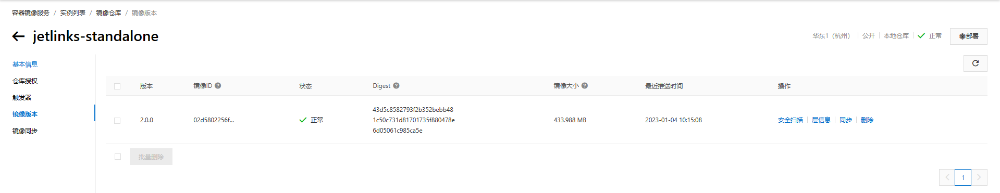

# jetlinks-pro部署

### jetlinks-pro Jar包部署

#### 拉取源码
1. 拉取`JetLinks pro`源码
```shell
git clone -b 2.0 --recurse-submodules git@github.com:jetlinks-v2/jetlinks-pro.git
```
具体操作可参考<a href="/dev-guide/pull-code.html#源码获取">源码获取</a>

2. 修改配置文件

配置文件示例可参考<a href="/dev-guide/config-info.html">配置文件</a>


3. 使用maven命令将项目打包，在代码根目录执行：

linux或者macOS环境下打包:
```shell script
./mvnw clean package -Dmaven.test.skip=true
```
windows环境下打包:
```shell script
mvn clean package '-Dmaven.test.skip=true'
```


4. 将jar包上传到需要部署的服务器上。

jar包文件地址: `jetlinks-standalone/target/jetlinks-standalone.jar`

5. 使用java命令运行jar包

 ```shell
#启动时，使用默认配置文件
java -jar jetlinks-standalone.jar
```

 ```shell
# 启动时，修改配置文件中的参数，格式如下
java -jar jetlinks-standalone.jar {--配置文件中的参数}
#命令示例
java -jar jetlinks-standalone.jar --spring.elasticsearch.embedded.enabled=true
 ``` 

 ```shell
#启动时，指定外部配置文件，格式如下
java -jar jetlinks-standalone.jar --spring.config.location={外部配置文件全路径}
#命令示例
java -jar -Dspring.config.location=/data/application.yml jetlinks-standalone.jar
```


### jetlinks-pro Docker部署

<div class='explanation primary'>
  <p class='explanation-title-warp'>
    <span class='iconfont icon-bangzhu explanation-icon'></span>
    <span class='explanation-title font-weight'>说明</span>
  </p>

在线部署和离线部署的区别:

在线部署：服务器在有网络环境，能够获取到镜像仓库中的镜像时，推荐使用在线部署，在dc配置文件中填写镜像仓库的地址就能直接拉取镜像到服务器上使用。

离线部署：服务器在无网络环境，无法获取到镜像仓库中的镜像时，只有使用离线部署，镜像就只能将镜像手动上传到服务器才能使用。

</div>

#### docker在线部署
1. 执行 `jetlinks-pro\build-and-push-docker.sh`路径下的脚本，脚本具体内容如下

```shell
#!/usr/bin/env bash
# 这个的镜像仓库地址需要替换为自己的镜像仓库地址
dockerImage="registry.cn-hangzhou.aliyuncs.com/jetlinks-demo/jetlinks-standalone:$(./mvnw help:evaluate -Dexpression=project.version -q -DforceStdout)"
./mvnw -Dmaven.test.skip=true \
#以下的子模块若不需要打包可自行删除
-Pmedia -Pedge -Pctwing -Ponenet -Pdueros -Paliyun-bridge -Popc-ua -Pmodbus \
-Dmaven.build.timestamp="$(date "+%Y-%m-%d %H:%M:%S")" \
-Dgit-commit-id="$(git rev-parse HEAD)" \
-Pmedia -T 12 \
clean package
if [ $? -ne 0 ];then
    echo "构建失败!"
else
  cd ./jetlinks-standalone || exit
  docker build -t "$dockerImage" . && docker push "$dockerImage"
fi
```
<div class='explanation info'>
  <p class='explanation-title-warp'> 
    <span class='iconfont icon-tishi explanation-icon'></span>
    <span class='explanation-title font-weight'>提示</span>
  </p>
请自行准备存放docker镜像的镜像仓库，此处以<a href="https://cr.console.aliyun.com/cn-shenzhen/instances">阿里云仓库</a>为例。

</div>

2. 查看镜像是否推送成功

比较本地生成的digest和镜像仓库推送的digest是否一致，若保持一致则说明推送成功。

```shell
$ docker push registry.cn-hangzhou.aliyuncs.com/jetlinks-demo/jetlinks-standalone:2.0.0
The push refers to repository [registry.cn-hangzhou.aliyuncs.com/jetlinks-demo/jetlinks-standalone]
187cb63c5a7d: Layer already exists
29c7de453b8e: Layer already exists
144903481aa9: Layer already exists
849ea2764450: Layer already exists
f49d20b92dc8: Layer already exists
fe342cfe5c83: Layer already exists
630e4f1da707: Layer already exists
9780f6d83e45: Layer already exists
2.0.0: digest: sha256:43d5c8582793f2b352bebb481c50c731d81701735f880478e6d05061c985ca5e size: 3259
```



#### docker离线部署

1. 在根目录创建镜像打包脚本`build-docker.sh`，脚本内容如下:
```shell
#!/usr/bin/env bash
#定义镜像名
dockerImage="jetlinks-standalone:$(./mvnw help:evaluate -Dexpression=project.version -q -DforceStdout)"
#下列组件若不需要打包可自行刪去
-Pmedia -Pedge -Pctwing -Ponenet -Pdueros -Paliyun-bridge -Popc-ua -Pmodbus \
./mvnw -Dmaven.test.skip=true \
-Dmaven.build.timestamp="$(date "+%Y-%m-%d %H:%M:%S")" \
-Dgit-commit-id="$(git rev-parse HEAD)" \
-Pmedia -T 12 \
clean package
if [ $? -ne 0 ];then
    echo "构建失败!"
else
  cd ./jetlinks-standalone || exit
  docker build -t "$dockerImage" . 
fi
```
2. 在根目录执行脚本`./build-docker.sh`

3. 导出镜像
   在本地导出，导出的镜像会到源码根目录下，命令格式如下:
```shell
docker save -o [命名].tar [镜像名:版本号]
```
代码示例如下:
```shell
docker save -o jetlinks-standalone.tar jetlinks-standalone:2.0.0
```

4. 导入镜像
   将导出的镜像传入服务器，再使用以下命令将镜像导入服务器
```shell
#导入命令格式
docker load -i [镜像名.tar]
#导入命令示例
docker load -i jetlinks-standalone.tar 
```

#### 使用docker-compose文件启动容器
1. 修改docker-compose文件

修改示例可参考<a href="/dev-guide/dc-info.html#JetLinks-pro示例">docker-compose文件</a>


2. 运行docker-compose文件

将docker-compose文件分别上传到每台服务器，再使用`docker-compose up -d`命令创建并启动容器，最后使用`docker ps -a`命令验证容器是否启动成功

```shell
$ docker ps -a
CONTAINER ID   IMAGE                                                                                COMMAND                  CREATED          STATUS        
               PORTS                                                                                                                NAMES
f303fc2fbd67   registry.cn-hangzhou.aliyuncs.com/jetlinks-demo/jetlinks-standalone:2.0.0-SNAPSHOT   "./docker-entrypoint…"   23 seconds ago   Up 16 seconds 
               0.0.0.0:1883->1883/tcp, 0.0.0.0:8100-8110->8100-8110/tcp, 0.0.0.0:8845->8845/tcp, 0.0.0.0:8200-8210->8200-8210/udp   jetlinks-pro
4e883fed1d0d   registry.cn-shenzhen.aliyuncs.com/jetlinks/jetlinks-ui-pro:2.0.0                     "/docker-entrypoint.…"   4 days ago       Up 7 minutes  
               0.0.0.0:9000->80/tcp                                                                                                 jetlinks-pro-ui
84a9379e3944   kibana:7.17.3                                                                        "/bin/tini -- /usr/l…"   3 weeks ago      Up 8 minutes  
               0.0.0.0:5601->5601/tcp                                                                                               jetlinks-kibana      
6366d9063dd0   elasticsearch:7.17.3                                                                 "/bin/tini -- /usr/l…"   3 weeks ago      Up 7 minutes  
               0.0.0.0:9200->9200/tcp, 0.0.0.0:9300->9300/tcp                                                                       jetlinks-elasticsearch
7bc603f1e897   postgres:11-alpine                                                                   "docker-entrypoint.s…"   6 weeks ago      Up 7 minutes  
               0.0.0.0:5432->5432/tcp                                                                                               jetlinks-postgres       
4bdba77584ce   redis:5.0.4                                                                          "docker-entrypoint.s…"   2 months ago     Up 7 minutes  
               0.0.0.0:6379->6379/tcp                                                                                               jetlinks-redis
```

<div class='explanation primary'>
  <p class='explanation-title-warp'>
    <span class='iconfont icon-bangzhu explanation-icon'></span>
    <span class='explanation-title font-weight'>说明</span>
  </p>
  STATUS为up为容器启动成功，STATUS为Exited为容器启动失败。

容器启动失败示例如下：
```shell
c0ac281c2877   registry.cn-hangzhou.aliyuncs.com/synbop/emqttd:2.3.6          "/opt/emqttd/start.sh"   4 days ago       Exited (137) 2days ago        emq                                         
```

</div>