# HTTP接入

## 应用场景

  

    
    说明
  

    

        适用于HTTP设备接入平台
    

## 指导介绍

1. <a href='/dev-guide/device-access-http.html#新增接入协议'>新增接入协议</a> 
2. <a href='/dev-guide/device-access-http.html#新增网络组件'>新增网络组件</a> 
3. <a href='/dev-guide/device-access-http.html#新增设备接入网关'>新增设备接入网关</a> 
4. <a href='/dev-guide/device-access-http.html#新增产品'>新增产品</a> 
5. <a href='/dev-guide/device-access-http.html#新增设备'>新增设备</a> 
6. <a href='/dev-guide/device-access-http.html#配置产品物模型'>配置产品物模型</a> 
7. <a href='/dev-guide/device-access-http.html#设备接入'>设备接入</a> 

## 新增接入协议

  

    
    说明
  

    

        设备与平台进行通信需要有协议包的支持，平台支持基于HTTP、MQTT、UDP、TCP透传等协议通过自定义协议包的方式，以解析不同厂家、不同设备上报的数据。
    

 1、 <b>登录</b>JetLinks平台，选择上方<b>物联网</b>>>>左侧<b>运维管理</b>>>><b>协议管理</b>

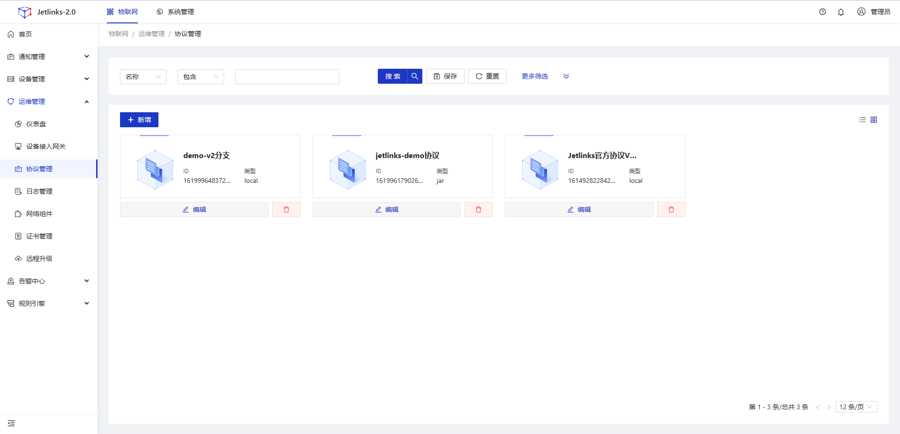

2、下载协议包，此示例使用的为<a href='https://github.com/jetlinks/jetlinks-official-protocol' target='_blank'>JetLinks官方设备接入协议</a>V3分支。在本地磁盘内创建文件夹后<code>shift+鼠标右键</code>选择<b>在终端打开</b>，输入指令<code>git clone {复制的GitHub协议包地址}</code>，回车并等待协议包下载完成，如果出现错误可以参考<a href='./pull-code.html#配置ssh-key' target='_blank'>如何配置ssh-key</a>。

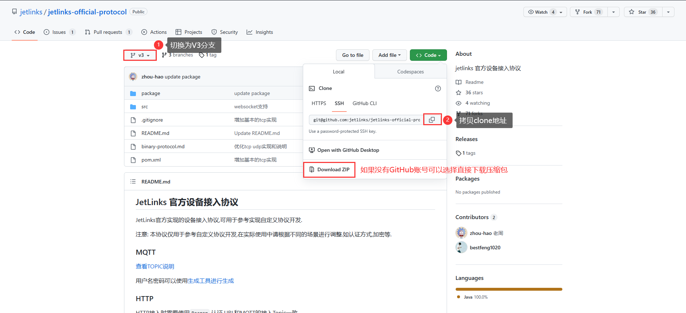

完成后的协议包目录如下，如果选择直接下载压缩包，则解压后目录下没有`.git`文件夹

3、在JetLinks平台<b>协议管理</b>内选择<b>新增</b>

  

    
    说明
  

    

        <code>jar包</code>和<code>local</code>方式新增协议的区别主要在于调试协议包时，<code>jar包</code>在每次更新完协议包代码后需要手动进行打包并重新上传<code>Jar包</code>，<code>Local</code>只需要重新编译生成<code>classes</code>文件夹即可
    

通过<b>Jar包</b>的方式新增，选择下载的协议包内的Jar包进行上传

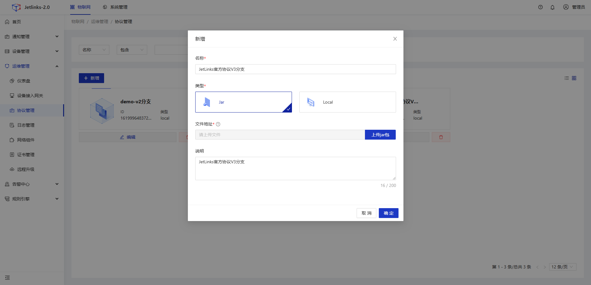

Jar包路径：步骤2中下载的协议包内的`package`文件夹下的`jetlinks-official-protocol-3.0-SNAPSHOT.jar`

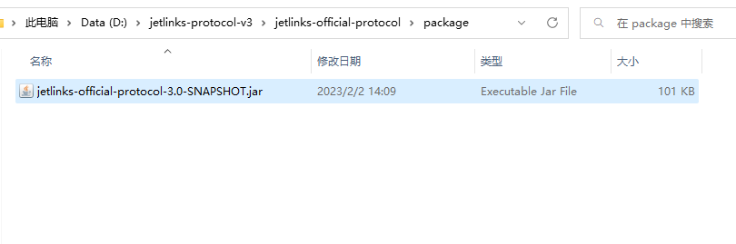

新增完成后平台显示新增的协议如下

 

通过<b>Local</b>方式新增协议

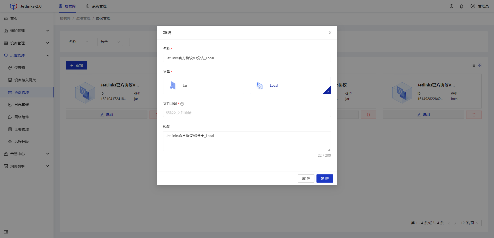

协议包为一个基于`Maven`的Java项目，如果您安装有`IDEA`则直接打开项目

点击右侧的`Maven`->`compile`等待编译完成，目录下会生成一个`target`文件夹

复制刚才生成的`target`文件夹内的`classes`路径，填入平台新增协议的<b>文件地址</b>内，点击确认

您也可以直接安装<a href='https://maven.apache.org/download.cgi' target='_blank'>Maven</a>进行编译，其中配置`Maven`环境变量可以参考<a href='https://www.runoob.com/maven/maven-setup.html' target='_blank'>Maven环境变量配置</a>。配置好`Maven`环境后可以在下载的协议包目录内通过`Maven`命令方式进行编译生成`target`目录

同样的复制生成的`target`文件夹下的`classes`文件夹路径填入平台新增协议的<b>文件地址</b>内，点击确认

## 新增网络组件

  

    
    说明
  

    

        网络组件是用于管理各种网络服务(如HTTP、MQTT、TCP、UDP等)动态配置、启停，只负责接收、发送报文，不负责任何处理逻辑。
    

    1、 <b>登录</b>JetLinks平台，选择上方<b>物联网</b>>>>左侧<b>运维管理</b>>>><b>网络组件</b>

2、填入配置参数，点击<b>保存</b>按钮

| 填写参数 | 说明                                                         |
| -------- | ------------------------------------------------------------ |
| 名称     | 必填项，该网络组件的名称                                     |
| 类型     | 必选项，此处选择HTTP服务                                     |
| 集群     | 必选项，共享配置：集群下所有节点共用同一配置 独立配置：集群下不同节点使用不同配置 |
| 本地地址 | 绑定到服务器上的网卡地址，此处固定为0.0.0.0，表示接收所有请求 |
| 本地端口 | 必填项，监听指定端口的请求                                   |
| 公网地址 | 必填项，对外提供访问的地址，内网环境时填写服务器的内网IP地址 |
| 公网端口 | 必填项，对外提供访问的端口                                   |
| 开启TLS  | 必选项，是否开启tls加密，如果选择开启则需要配置证书，配置详情可以参考<a href='/Mocha_ITOM/certificate_management.html#使用平台脚本生成证书' target='_blank'>证书配置</a> |
| 说明     | 选填项，该网络组件的备注说明                                 |

  

    
    说明
  

    

        本地端口内可选择的端口号范围可以在代码<code>jetlinks-standalone</code>模块内的<code>application.yml</code>配置文件中通过修改<code>network.resources</code>的值进行指定
    

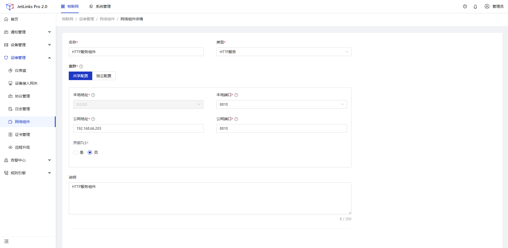

## 新增设备接入网关

  

    
    说明
  

    

        负责平台侧统一的设备接入，使用网络组件处理对应的请求以及报文，使用配置的协议解析为平台统一的设备消息(DeviceMessage)，然后推送到事件总线。
    

    1、 <b>登录</b>JetLinks平台，选择上方<b>物联网</b>>>>左侧<b>运维管理</b>>>><b>设备接入网关</b>

2、点击<b>新增</b>>>><b>HTTP推送接入</b>，选择配置好的<b>HTTP网络组件</b>，<b>JetLinks官方协议</b>，命名后点击<b>保存</b>

## 新增产品

  

    
    说明
  

    

        对某一型设备的分类，通常是已经存在的某一个设备型号。
    

    1、 <b>登录</b>JetLinks平台，选择上方<b>物联网</b>>>>左侧<b>设备管理</b>>>><b>产品</b>

2、点击<b>新增</b>，填写产品<b>名称</b>，选择<b>设备类型</b>，之后点击<b>确定</b>

3、点击创建好的产品进入产品详情页，选择<b>设备接入</b>，点击<b>选择</b>并在弹出的设备接入配置中选择先前配置好的<b>HTTP接入网关</b>，点击确定

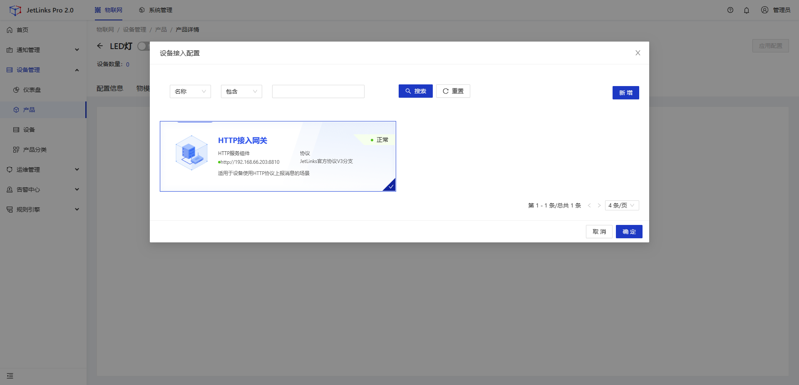

4、继续在此页面的底端找到<b>HTTP认证配置</b>，填入<b>Token</b>值，然后到页面的顶端<b>启用</b>产品

  

    
    说明
  

    

        <code>Token</code>是设备连接到平台时的身份验证，可以在协议包中进行配置一型一密还是一机一密。
    

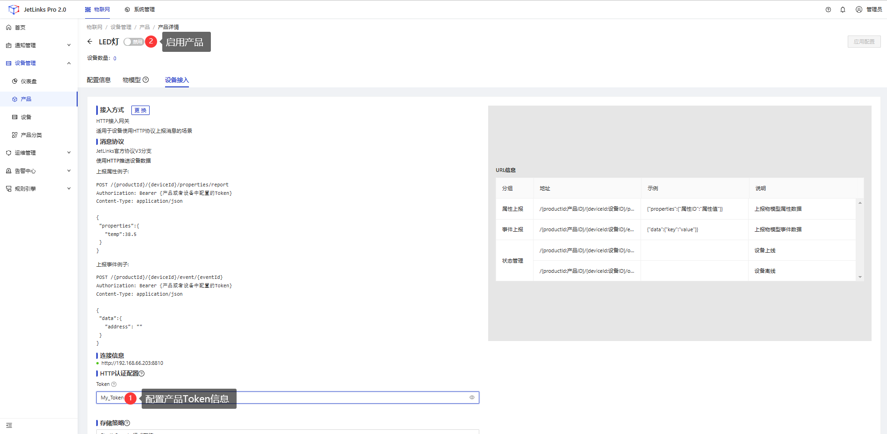

## 新增设备

    1、 <b>登录</b>JetLinks平台，选择上方<b>物联网</b>>>>左侧<b>设备管理</b>>>><b>设备</b>

2、点击<b>新增</b>，填写设备<b>名称</b>，选择<b>所属产品</b>，此处选择之后点击<b>确定</b>，并在此页面<b>启用</b>刚才新增的设备

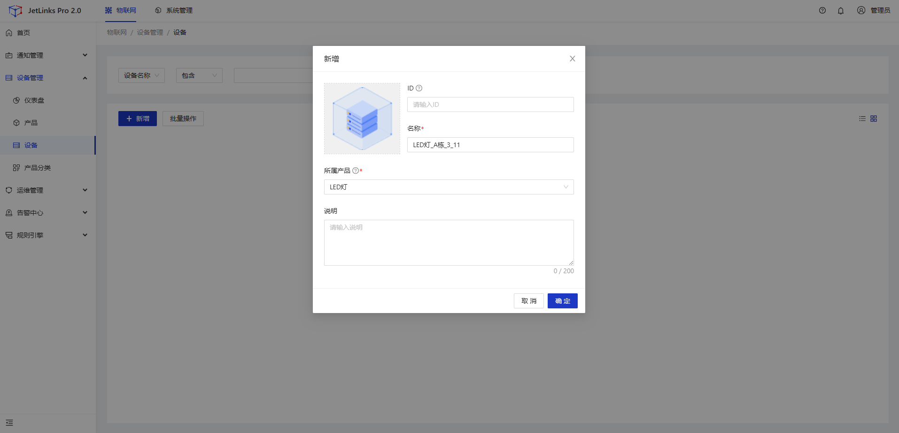

## 配置产品物模型

  

    
    说明
  

    

        <a href='/Device_access/Configuration_model3.4.html' target='_blank'>物模型</a>是对某一类产品自身功能的一种抽象，在平台可表述为属性、功能、事件和标签。当在产品中配置物模型后，该类型下的设备都会继承该产品的物模型。但如果在设备中单独进行配置，即使未对继承的物模型进行更改，该设备的物模型也会脱离产品，需要独自进行维护。
    

    1、 进入<b>物联网</b>>>><b>设备管理</b>>>><b>产品</b>页面，点击上文创建的产品，进入该产品的产品详情页，选择<b>物模型</b>

2、在<b>物模型</b>>>><b>属性定义</b>内点击右侧的<b>新增</b>来新增<b>属性定义</b>

| 填写参数 | 说明                                                         |
| -------- | ------------------------------------------------------------ |
| 标识     | 必填项，该属性的标识                                         |
| 名称     | 必填项，该属性的名称                                         |
| 数据类型 | 必选项，该字段的数据类型                                     |
| 最大长度 | 选填项，最大字节数                                           |
| 来源     | 必选项，选择为设备时表示该属性来源与设备 选择为手动时表示属性来源于手动设置 选择为规则时表示该属性来源于某种计算规则 |
| 读写类型 | 必选项，读表示平台可以下发读取属性的指令，要求设备回复当前的属性值 写表示平台可以修改该属性的值，当数据来源为设备时，填写的值将下发到设备 上报表示设备可以上报该属性到平台 |
| 其他配置 | 可选项，可以选择是否存储，默认为存储                         |
| 指标配置 | 选填项，场景联动页面可引用指标配置作为触发条件               |
| 说明     | 选填项，该属性的说明                                         |

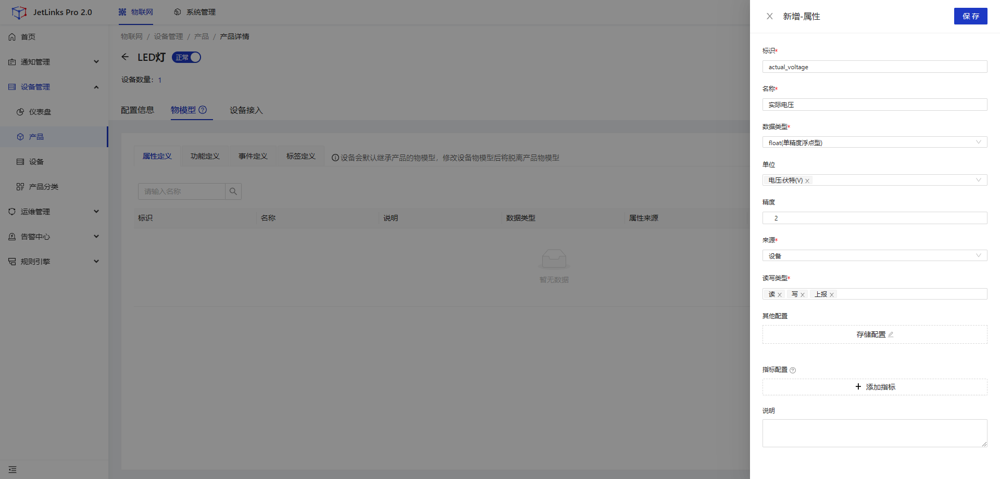

3、选择<b>事件定义</b>>>>右侧<b>新增</b>，填入参数后右上角选择<b>保存</b>

| 填写参数 | 说明                                               |
| -------- | -------------------------------------------------- |
| 标识     | 必填项，该事件的标识                               |
| 名称     | 必填项，该事件的名称                               |
| 级别     | 必选项，危险程度                                   |
| 输出参数 | 默认为结构体，需要在下方的JSON对象中配置具体的参数 |
| 说明     | 选填项，该事件的说明                               |

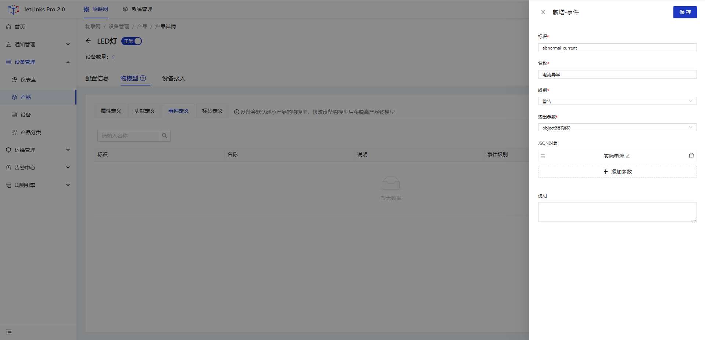

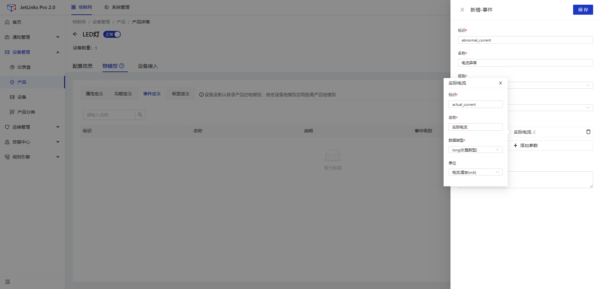

4、配置完成后可以选择<b>设备</b>并找到对应产品下的设备，点击查看设备详情，选择<b>运行状态</b>，可以直观的看到配置完成的属性和事件

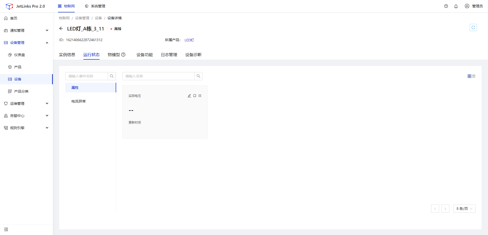

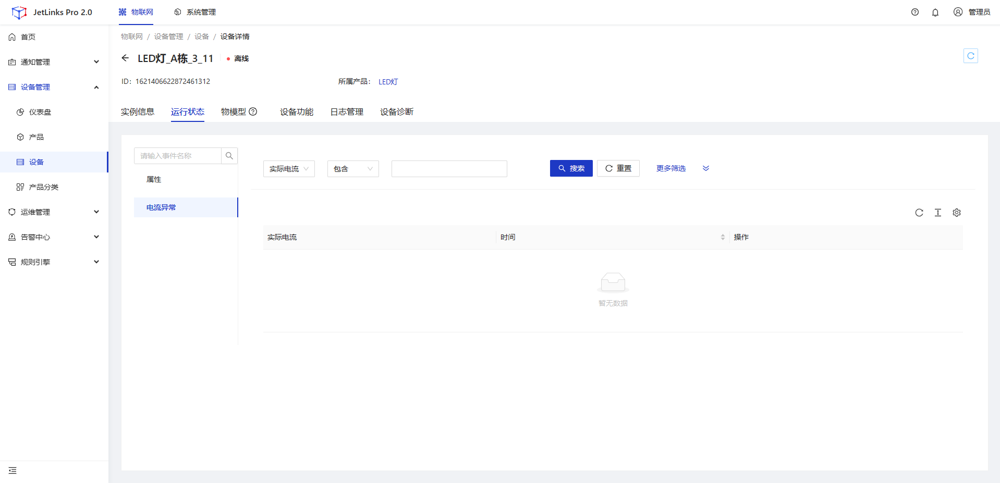

## 设备接入

  

    
    说明
  

    

        本示例将使用<code>Postman</code>模拟设备进行连接平台以及属性和事件上报。
    

### 设备上线

    1、 下载<a href='https://www.postman.com/downloads/' target='_blank'>Postman</a>，安装完成后打开。</b>

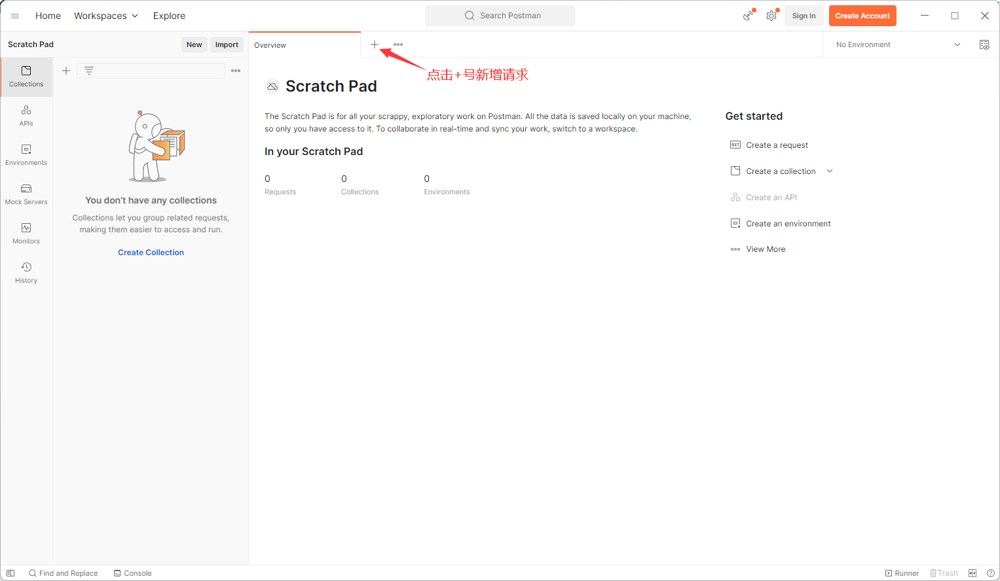

2、填写连接参数

配置`url`

| 参数     | 说明                                                         |
| -------- | ------------------------------------------------------------ |
| POST     | 本次请求为POST                                               |
| 连接地址 | `http://{产品详情页里设备接入页面中的连接信息ip:端口号}/{指定的topic}`，具体的`Topic`信息，可以查看<a href="/dev-guide/jetlinks-protocol-support.html#topic列表" target='_blank'>官方协议Topic列表</a>。此处为设备上线消息`/{产品id}/{设备id}/online` |

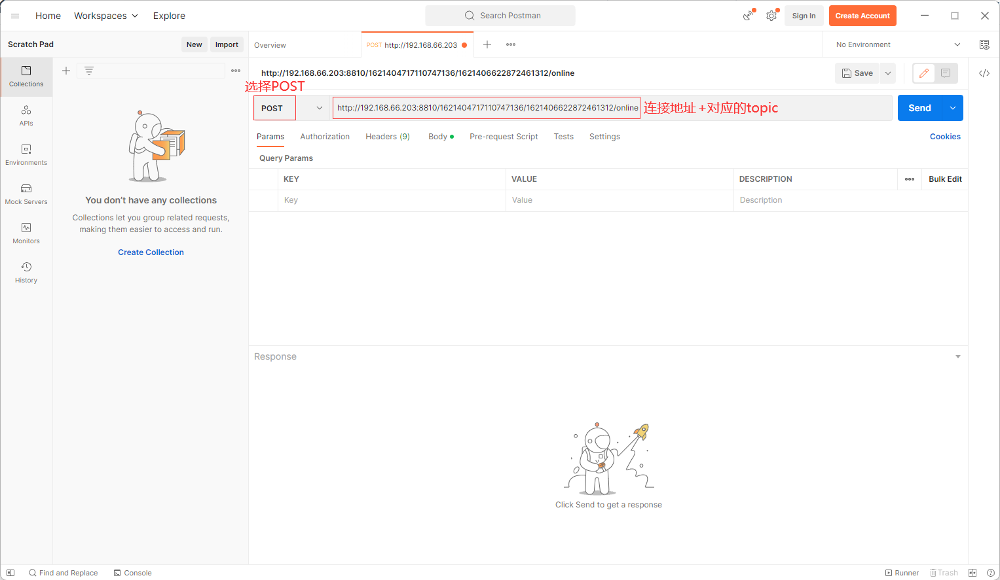配置`Headers`参数

| 参数              | 说明                                                         |
| ----------------- | ------------------------------------------------------------ |
| `Authorization`   | 固定填写Authorization                                        |
| `Bearer My_Token` | `Bearer`为固定值，<b>注意中间有一个空格</b>，`My_Token`为在产品的设备接入页面配置的`Token`值 |

配置`Body`参数

| 参数   | 说明                                                         |
| ------ | ------------------------------------------------------------ |
| `raw`  | 可以上传任意格式的文本，可以上传text、json、xml、html等，此处选择JSON |
| `JSON` | 选择上传JSON格式的文本                                       |
| 消息体 | 想要上传的文本内容，此处由于为设备上线，所以消息体可以不写   |

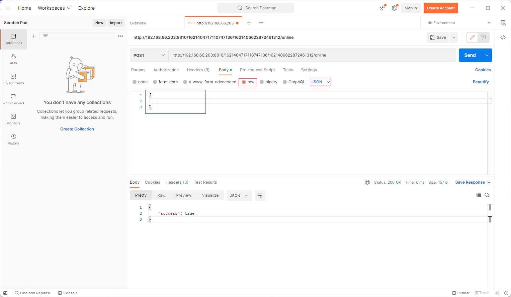

配置完成后点击<b>Send</b>按钮，发送本次请求，可以看到下方收到的消息`"success": true`，表示设备上线成功，可以在平台看到<b>设备</b>为上线状态

### 设备上报属性

<b>上报属性</b>只需要在`Postman`中修改`url`以及对应的消息体就可以了，注意消息体内的注释应该删除。

| 参数   | 说明                                                         |
| ------ | ------------------------------------------------------------ |
| topic  | 具体的`Topic`信息，可以查看<a href="/dev-guide/jetlinks-protocol-support.html#topic列表" target='_blank'>官方协议Topic列表</a>。此处为设备属性上报消息`/{产品id}/{设备id}/properties/report` |
| 消息体 | `actual_voltage`为产品物模型中配置的属性，如果配置有多个属性，则按照此规则键对应值写入`properties`内即可 |

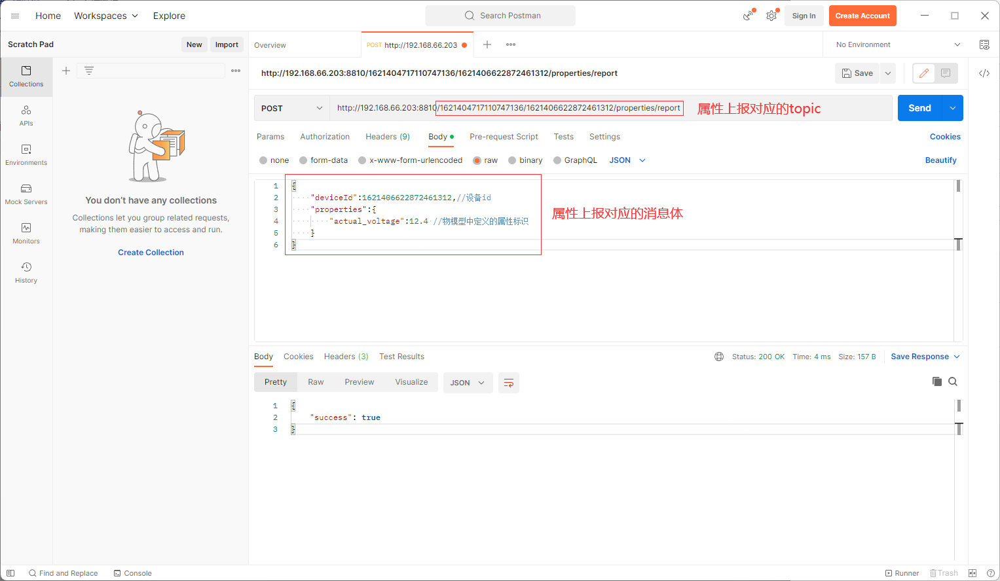

配置完成后点击<b>Send</b>按钮，发送本次请求，收到的消息`"success": true`，表示此次属性上报成功，可以在平台看到<b>设备</b>的<b>运行状态</b>内有上报的属性值

### 设备事件上报

<b>事件上报</b>只需要在`Postman`中修改`url`以及对应的消息体就可以了，注意消息体内的注释应该删除。

| 参数   | 说明                                                         |
| ------ | ------------------------------------------------------------ |
| topic  | 具体的`Topic`信息，可以查看<a href="/dev-guide/jetlinks-protocol-support.html#topic列表" target='_blank'>官方协议Topic列表</a>。此处为设备事件上报消息`/{产品id}/{设备id}/event/{事件id}`，`事件id`为物模型的事件定义中的事件标识 |
| 消息体 | `actual_current`为产品物模型中事件定义内配置的输出参数，配置的结构体中如果有多个JSON对象，则按照此规则键对应值写入`data`内即可 |

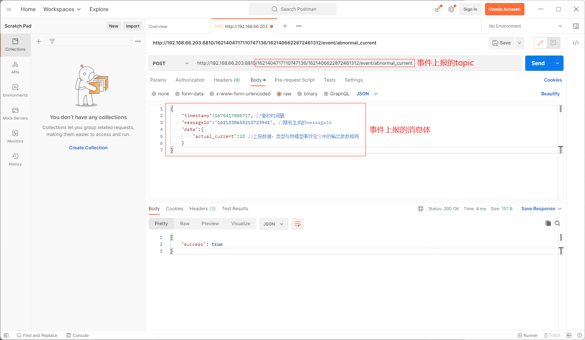

配置完成后点击<b>Send</b>按钮，发送本次请求，收到的消息`"success": true`，表示此次事件上报成功，可以在平台看到<b>设备</b>的<b>运行状态</b>内有事件上报的值

