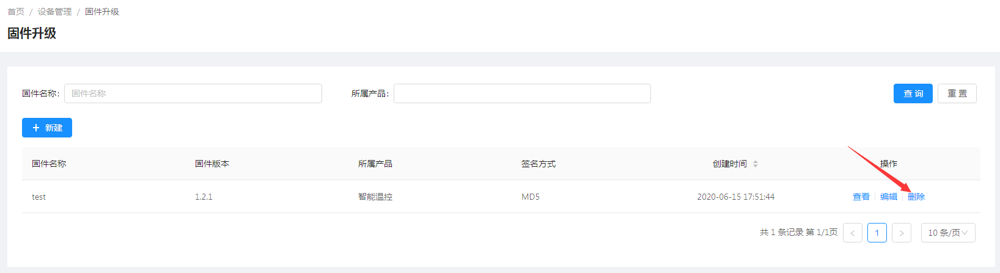
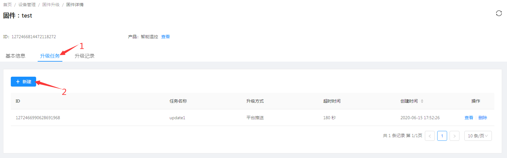
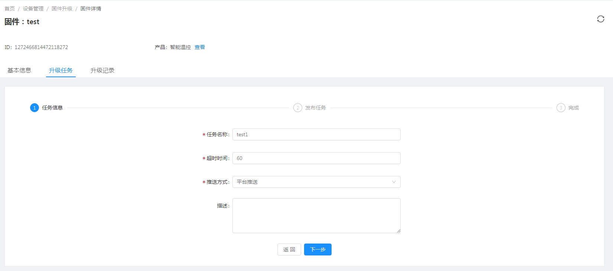
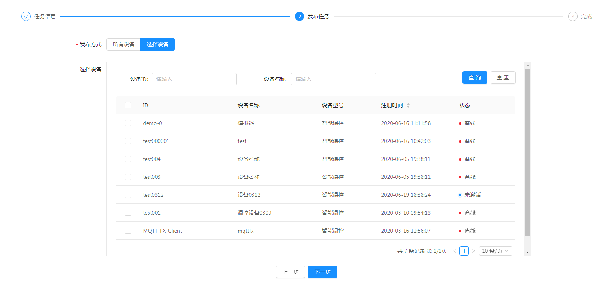

# 设备固件管理

jetlinks企业版在`>=1.2`中提供了固件管理功能,提供对设备固件升级,以及获取固件信息等操作.


## 固件管理
用于设备固件新建、编辑、查看、删除、发布升级任务、推送固件消息。

### 新增
**操作步骤**
1. 进入系统: `设备管理`-`固件升级`-`新建`。  

2. 输入固件版本信息。  

3. 点击`确定`进行保存。  


### 编辑
**操作步骤**
1. 进入系统: `设备管理`-`固件升级`，在操作列点击`编辑`。  
2. 编辑固件版本信息。  
3. 点击`确定`进行保存。  
  

### 删除
**操作步骤**
进入系统: `设备管理`-`固件升级`，在操作列点击`删除`。  
  
  


## 操作流程 

### 创建固件信息 
1. 进入系统: `设备管理`-`固件升级`-`新建`。  

2. 输入固件版本信息。  

3. 点击`确定`进行保存。  
  


### 发布升级任务 
1.在固件升级列表页选择需要升级的固件，单击操作列中`查看`。    
    

2.在固件详情页面单击`升级任务`-`新建`。  
    

3.创建任务信息  
  

4. 发布任务
  

::: tip 注意：
发布任务时可以选择所有设备或者指定部分设备。
:::

### 推送固件消息
1. 在发布任务界面，`等待升级`框中选择`推送升级`。   
  
2. 任务将自动跳转到`升级中`。  
  

可在此框中点击`查看`各升级任务详情  
 

3. 升级完成或升级失败。  
升级完成后任务会跳转到`升级完成`框，升级失败的任务则跳转到`升级失败`中。  

### 自定义协议解析发送到设备 
推送的升级任务通过协议解析后发送到设备，参考[自定义协议开发](../advancement-guide/custom-protocol.md)  

### 平台修改进度信息
设备收到升级任务指令后发起并推送更新进度。  
任务升级完成或升级失败后，在任务升级界面任务会跳转到`升级完成`框，升级失败的任务则跳转到`升级失败`中。 

  

## 推送更新

## 固件相关消息

`消息协议`解析`设备上报`的消息为指定的类型即触发对应的操作.

### 上报固件信息

消息类型: `ReportFirmwareMessage`

```json
{
    "deviceId":"设备ID",
    "version":"固件版本号",
    "properties":{"key":"value"}, //其他拓展信息
    "timestampe":"毫秒时间戳",
}
```

上报固件信息后,会更新设备固件信息记录.

### 设备拉取固件更新

前提: 消息协议解析设备上报的消息为:`RequestFirmwareMessage`.

```js
{
	"headers":{
		"force":false, //是否强制拉取更新. 为true时强制拉取固件更新信息
		"latest":false //是否拉取最新的固件,false为从头开始拉取
	},
    "deviceId":"设备ID",
    "timestampe":"毫秒时间戳",
    "messageId":"消息ID",
    "requestVersion":"请求更新的版本"//可留空
}

```

平台收到此消息后, 会获取更新任务中对应的固件更新记录.找出对应设备`等待升级`的固件信息.
并发送消息`RequestFirmwareMessageReply`给协议包解析并发送到设备.

```json
{
	"sign": "文件签名",
	"signMethod": "文件签名方式",
	"messageId": "消息ID",//与拉取固件中到消息ID一致
	"deviceId": "设备ID",
	"version": "版本号",
	"url": "固件文件下载地址",
	"parameters": {},//其他拓展参数
	"timestamp": 1589277368209 //毫秒时间戳
}
```

### 平台推送固件更新

平台可推送固件更新给设备,需要消息协议处理消息:`UpgradeFirmwareMessage`.

```json
{
	"sign": "文件签名",
	"signMethod": "文件签名方式",
	"deviceId": "设备ID",
	"version": "版本号",
	"url": "固件文件下载地址",
	"success": true,
	"parameters": {},//其他拓展参数
	"timestamp": 1589277368209 //毫秒时间戳
}
```


### 设备上报固件更新结果

设备可以上报固件更新进度以及更新结果.
消息类型:`UpgradeFirmwareProgressMessage`


更新结果(进度)消息:

```json
{
	"success": true, //是否成功
    "message":"失败时传的消息",
	"progress": 10, //更新进度: 0-100
	"complete": false,//是否完成,如果只是上报进度,则设置为false,完成更新则设置为true
	"deviceId": "设备ID",
	"version": "1.0", //更新的版本号(必填)
	"timestamp": 1589277369268
}
```