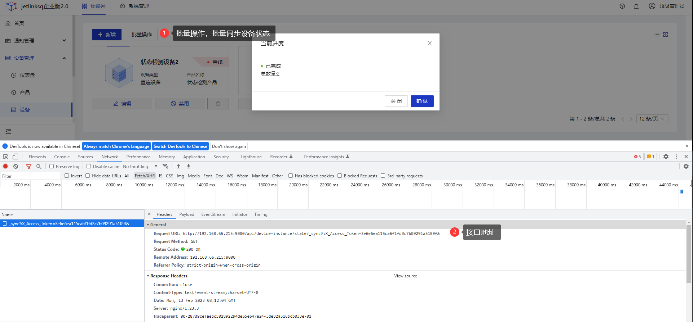
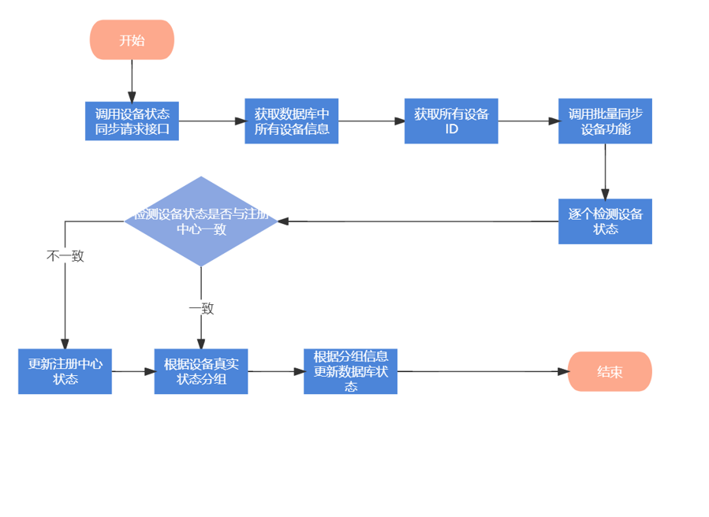

# 设备真实状态检测

<div class='explanation primary'>
  <p class='explanation-title-warp'>
    <span class='iconfont icon-bangzhu explanation-icon'></span>
    <span class='explanation-title font-weight'>说明</span>
  </p>
  JetLinks提供了接口可以批量检测并同步设备真实状态
</div>

## 指导介绍
  <p>1. <a href="/dev-guide/device_real_state_check.html#设备真实状态同步接口">设备真实状态同步接口</a></p>
  <p>2. <a href="/dev-guide/device_real_state_check.html#设备真实状态同步接口核心代码">设备真实状态同步接口核心代码</a></p>
  <p>3. <a href="/dev-guide/device_real_state_check.html#同步设备真实状态调用流程">同步设备真实状态调用流程</a></p>


## 设备真实状态同步接口
`org.jetlinks.pro.device.web.DeviceInstanceController`类的`syncDeviceState(@Parameter(hidden = true) QueryParamEntity 
query)`方法作为平台同步设备真实状态的接口

QueryParamEntity:查询条件类，在设备同步时，未传入任何条件

接口地址：`http://{ip}:{后端服务端口}/device/instance/state/_sync`


## 设备真实状态同步接口核心代码
获取所有设备id，每200个设备批量同步
```java
    public Flux<Integer> syncDeviceState(@Parameter(hidden = true) QueryParamEntity query) {
        //Paging：表示查询结果不分页
        query.setPaging(false);
        return service
            .query(query.includes("id"))//查询数据库表中所有设备信息,等价于：select dev_device_instance.`id` as `id` from `数据库`.
        dev_device_instance dev_device_instance
            .map(DeviceInstanceEntity::getId)//获取查询结果的ID集
            .buffer(200)//每200个设备批量同步
            .publishOn(Schedulers.single())
            .concatMap(flux -> service.syncStateBatch(Flux.just(flux), true).map(List::size))//批量同步设备状态
            .defaultIfEmpty(0);
    }
```
获取设备并检测设备状态，并通过设备真实分组，更新数据库设备状态值
```java
public Flux<List<DeviceStateInfo>> syncStateBatch(Flux<List<String>> batch, boolean force) {

        return batch
            .concatMap(list -> Flux
                .fromIterable(list)
                .publishOn(Schedulers.parallel())
               //通过ID获取设备
                .flatMap(id -> registry
                    .getDevice(id)
                    .flatMap(operator -> {
                         //force为true时，强制获取设备真实状态
                         //force为false时，从注册中心获取设备信息
                        Mono<Byte> state = force
                            ? operator
                            .checkState()
                            .onErrorResume(err -> operator.getState())
                            : operator.getState();
                        return Mono
                            .zip(
                                state.defaultIfEmpty(org.jetlinks.core.device.DeviceState.offline),//状态
                                Mono.just(operator.getDeviceId()), //设备id
                                operator.getConfig(DeviceConfigKey.isGatewayDevice).defaultIfEmpty(false)//是否为网关设备
                            );
                    })
                    //注册中心里不存在设备就认为是未激活.
                    .defaultIfEmpty(Tuples.of(org.jetlinks.core.device.DeviceState.noActive, id, false)))
                .collect(Collectors.groupingBy(Tuple2::getT1))//通过设备状态分组
                .flatMapIterable(Map::entrySet)
                .flatMap(group -> {
                    List<String> deviceIdList = group
                        .getValue()
                        .stream()
                        .map(Tuple3::getT2)
                        .collect(Collectors.toList());
                    DeviceState state = DeviceState.of(group.getKey());
                    return
                        //批量修改设备数据库状态
                        getRepository()
                            .createUpdate()
                            .set(DeviceInstanceEntity::getState, state)
                            .where()
                            .in(DeviceInstanceEntity::getId, deviceIdList)
                            .when(state != DeviceState.notActive, where -> where.not(DeviceInstanceEntity::getState, DeviceState.notActive))
                            .execute()
                            .thenReturn(group.getValue().size())
                            .then(Mono.just(
                                deviceIdList
                                    .stream()
                                    .map(id -> DeviceStateInfo.of(id, state))
                                    .collect(Collectors.toList())
                            ));
                }))
            //更新状态不触发事件
            .as(EntityEventHelper::setDoNotFireEvent);
    }
```
核心方法

| 核心方法    | 参数                       |   返回值   |   描述  |
|---------|--------------------------|------|------|
|getDevice(String deviceId) | String deviceId-设备ID     | `Mono<DeviceOperator>` | 获取设备操作接口.如果设备未注册或者注册已失效(缓存丢失).则回返回Mono.empty() |
|   checkState()      | 无                        |  `Mono<Byte>`        |  检查设备的真实状态,此操作将检查设备真实的状态. 如果设备协议中指定了ProtocolSupport.getStateChecker(),则将调用指定的状态检查器进行检查.     |
|   checkState(@NotNull DeviceOperator device)      | DeviceOperator device-设备 |   `Mono<Byte>`      | 检查设备状态      |
|  getConfig(String key)       | String key-key           |  `Mono<Value>`       | 获取配置,如果值不存在则返回Mono.empty()      |


## 同步设备真实状态调用流程

