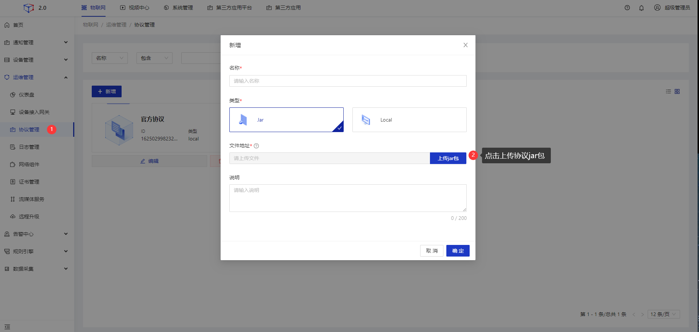
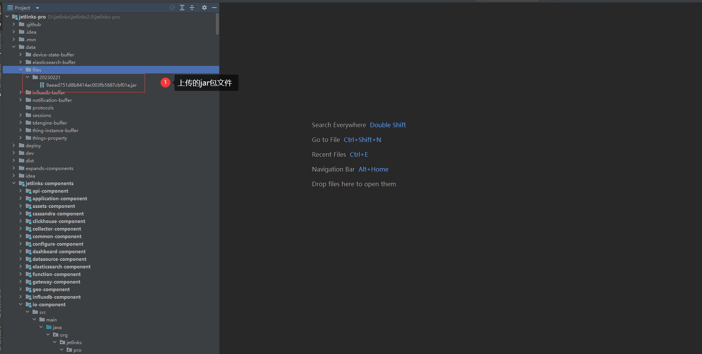
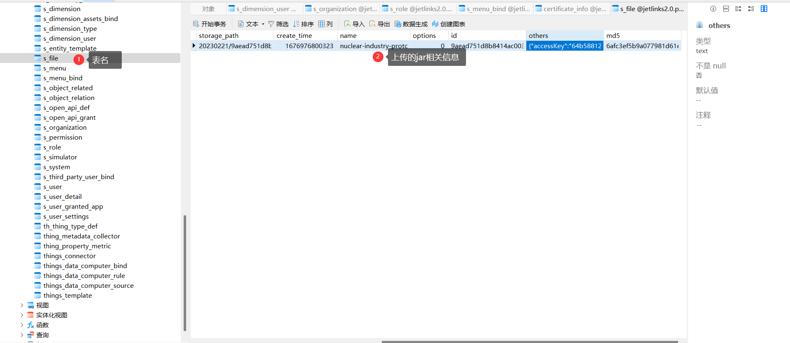
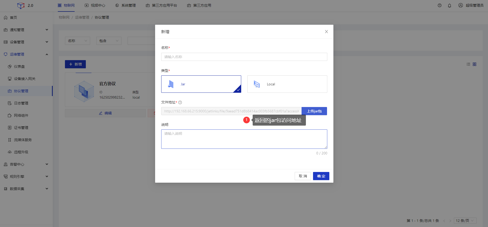
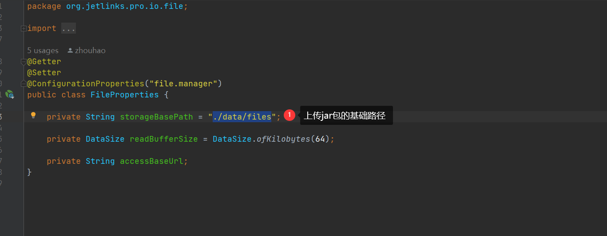

# 文件管理

<div class='explanation primary'>
  <p class='explanation-title-warp'>
    <span class='iconfont icon-bangzhu explanation-icon'></span>
    <span class='explanation-title font-weight'>说明</span>
  </p>

  JetLinks平台提供了文件管理器，用于上传文件

</div>

## 指导介绍
  <p>1. <a href="/dev-guide/file_manager.html#协议jar包上传流程说明">协议jar包上传流程说明</a></p>
  <p>2. <a href="/dev-guide/file_manager.html#协议jar包上传核心代码说明">协议jar包上传核心代码说明</a></p>

## 协议jar包上传流程说明

本文档以协议管理上传jar包为例
1.上传jar

2.JetLinks平台会自动创建目录，存放上传的jar包文件

3.JetLinks平台后端会将上传jar包的相关文件信息存放到数据库`s_file`表

4.JetLinks平台后端将jar的访问地址返回



## 协议jar包上传核心代码说明
1.上传协议jar时调用JetLinks平台`jetlinks-pro\jetlinks-components\io-component\src\main\java\org\jetlinks
\pro\io\file\web\FileManagerController\file\upload`接口进行文件上传

2.调用类`jetlinks-pro\jetlinks-components\io-component\src\main\java\org\jetlinks\pro\io\file
\ClusterFileManager`的`doSaveFile`做文件上相应处理

3.`doSaveFile`方法的核心代码说明

根据上传jar包时的当前时间戳和JetLinks平台后端设定的基础存储路径值，创建上传jar文件的存放路径
<div class='explanation primary'>
  <p class='explanation-title-warp'>
    <span class='iconfont icon-bangzhu explanation-icon'></span>
    <span class='explanation-title font-weight'>说明</span>
  </p>
   <p>存储路径值在类<code>jetlinks-pro\jetlinks-components\io-component\src\main\java\org\jetlinks\pro\io\file
\FileProperties.java</code>中设定，默认值为：<code>./data/files</code></p>
</div>



```java
        //当前时间戳
        LocalDate now = LocalDate.now();  
        FileInfo fileInfo = new FileInfo();
        fileInfo.setId(IDGenerator.MD5.generate());
        fileInfo.withFileName(name);
       //创建文件存放路径
        String storagePath = now.format(DateTimeFormatter.BASIC_ISO_DATE)
            + "/" + fileInfo.getId() + "." + fileInfo.getExtension();
        
         MessageDigest md5 = DigestUtils.getMd5Digest();
         MessageDigest sha256 = DigestUtils.getSha256Digest();
         //返回'./data/files'
         String storageBasePath = properties.getStorageBasePath();
         //获取请求服务节点
         String serverNodeId = rpcManager.currentServerId();
         //文件最终的存放位置
         Path path = Paths.get(storageBasePath, storagePath);
         path.toFile().getParentFile().mkdirs();
```

将上传jar包的相关数据存放到数据库,并设置访问该jar包的返回值地址
<div class='explanation primary'>
  <p class='explanation-title-warp'>
    <span class='iconfont icon-bangzhu explanation-icon'></span>
    <span class='explanation-title font-weight'>说明</span>
  </p>
   <p>返回值地址说明</p>
   <p>协议jar包文件上传时：取系统中<code>sso.base-path</code>参数拼接<code>"file/" + id + "?accessKey=" + 
xxx</code>作为返回值路径</p>
<p><code>accessKey</code>在JetLinks平台类<code>jetlinks-pro\jetlinks-components\io-component\src\main\java\org\jetlinks
\pro\io\file\FileInfo.java</code>类的<code>withAccessKey</code>中设置为：MD5加密后的字符串</p>
<p><code>sso.base-path</code>参数在JetLinks平台有两种配置方式，任选其一即可</p>
<p>方式1：在<code>jetlinks-pro\jetlinks-standalone\src\main\resources
\application.yml</code>配置文件中配置<code>sso.base-path</code>参数</p>
<p>方式2：在`Jetlinks`平台页面配置<code>sso.base-path</code>参数</p>
</div>

`accessKey`
```java
//方法调用
 fileInfo.withAccessKey(IDGenerator.MD5.generate());

//设置key
public FileInfo withAccessKey(String accessKey) {

        withOther(OTHER_ACCESS_KEY, accessKey);
        return this;
        }
public synchronized FileInfo withOther(String key, Object value) {
        if (others == null) {
        others = new HashMap<>();
        }
        others.put(key, value);
        return this;
        }
```

`sso.base-path`的两种配置方式

方式1：在`jetlinks-pro\jetlinks-standalone\src\main\resources\application.yml`文件中配置


方式2：在`Jetlinks`平台配置方式


```java
   //设置OTHER_ACCESS_KEY="accessKey"
    fileInfo.withAccessKey(IDGenerator.MD5.generate());
    fileInfo.setMd5(ByteBufUtil.hexDump(md5.digest()));
    fileInfo.setSha256(ByteBufUtil.hexDump(sha256.digest()));
    fileInfo.setLength(savedFile.length());
    fileInfo.setCreateTime(System.currentTimeMillis());
    fileInfo.setOptions(options);
    FileEntity entity = FileEntity.of(fileInfo, storagePath, serverNodeId);
    //将上传jar包的相关数据存放到数据库
    return repository
        .insert(entity)
        .then(Mono.defer(() -> {
            FileInfo response = entity.toInfo();
            //设置返回值地址，返回到前端
            return this
                .getApiBasePath().doOnNext(response::withBasePath)
                .thenReturn(response);
        }));
```

