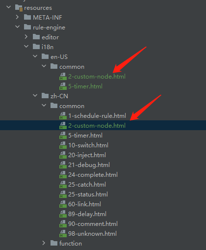

# 国际化

在`1.10.0`版本`后端`增加了国际化支持

<div class='explanation primary'>
  <p class='explanation-title-warp'>
    <span class='iconfont icon-bangzhu explanation-icon'></span>
    <span class='explanation-title font-weight'>提示</span>
  </p>
    window11无法切换时区环境，需要自己在java中配置jvm参数进行时区切换 :
    <p>-Duser.language=en -Duser.region=US</p>
</div>

### 一.自定义规则引擎节点帮助文档国际化

##### 1.新建类实现TaskExecutorProvider接口

```java
public class CustomTaskExecutorProvider implements TaskExecutorProvider {

    private final EventBus eventBus;

    @Override
    public String getExecutor() {
        return "custom";
    }

    @Override
    public Mono<TaskExecutor> createTask(ExecutionContext context) {
        return Mono.just(new DeviceSceneTaskExecutor(context));
    }
    class DeviceSceneTaskExecutor extends FunctionTaskExecutor {

        private String id;

        private String deviceId;
        private String deviceName;


        private String productId;

        private String productName;


        public DeviceSceneTaskExecutor(ExecutionContext context) {
            super("场景联动", context);

            reload();
        }

        @Override
        public void reload() {
            //从任务配置中获取配置
            this.deviceName = (String) getContext().getJob().getConfiguration().get("deviceName");
            this.id = (String) getContext().getJob().getConfiguration().get("id");
            this.deviceId = (String) getContext().getJob().getConfiguration().get("deviceId");
            this.deviceName = (String) getContext().getJob().getConfiguration().get("deviceName");
            this.productId = (String) getContext().getJob().getConfiguration().get("productId");
            this.productName = (String) getContext().getJob().getConfiguration().get("productName");

        }

        @Override
        protected Publisher<RuleData> apply(RuleData input) {
            Map<String, Object> data = new HashMap<>();
            data.put("deviceName", deviceName);

            data.put("id", id);
            data.put("deviceId", deviceId);
            data.put("deviceName", deviceName);
            data.put("productId", productId);
            data.put("productName", productName);

            input.acceptMap(data::putAll);

            return eventBus
                .publish(String.join("/", "device", id), data)
                //转换新的数据
                .thenReturn(context.newRuleData(input.newData(data)));
        }
    }
}

```

2.在类上加上注解

```
@EditorResource(
    id = "custom",
    name = "自定义组件",
    editor = "rule-engine/editor/common/30-custom-engine.html",
    helper = "rule-engine/i18n/{locale}/common/30-custom-engine.html",
    order = 30
)

```
<div class='explanation primary'>
  <p class='explanation-title-warp'>
    <span class='iconfont icon-bangzhu explanation-icon'></span>
    <span class='explanation-title font-weight'>说明</span>
  </p>
   helper = "rule-engine/i18n/{language}/common/30-custom-engine.html"中的{locale}在程序启动时会在org.jetlinks.pro.rule.engine.editor.resolve替换成真正的路劲，如被zh-CN或者en-US替代
</div>

<div class='explanation primary'>
  <p class='explanation-title-warp'>
    <span class='iconfont icon-bangzhu explanation-icon'></span>
    <span class='explanation-title font-weight'>说明案例</span>
  </p>
     <p>@EditorResource注解的helper路劲中可代替参数有3种，要与resources下文档路劲匹配</p>
     <p>文档示例的三种写法应该为：</p>
     <p>1. {language}启动时会被en或者zh替代，对应的资源路劲应为：rule-engine/i18n/en(或者zh)/common/30-custom-engine.html</p>
     <p>2. {country}启动时会被CN或者US替代，对应的资源路劲应为：rule-engine/i18n/US(或者CN)/common/30-custom-engine.html</p>
     <p>3. {locale}启动时会被zh-CN或者en-US替代，对应的资源路劲应为：rule-engine/i18n/en-US(或者zh-CN)/common/30-custom-engine.html</p>
</div>


3.创建自定义规则节点html文件


```html
<script type="text/html" data-template-name="custom">

    <div class="form-row">
        <label for="node-input-name"><i class="fa fa-tag"></i> <span data-i18n="common.label.name"></span></label>
        <input type="text" id="node-input-name" data-i18n="[placeholder]common.label.name">
    </div>

    <div class="form-row">
        <label for="node-input-id"><i class="fa fa-tag"></i> <span >自定义节点ID</span></label>
        <input type="text" id="node-input-id" data-i18n="[placeholder]自定义节点ID">
    </div>

    <div class="form-row">
        <label for="node-input-deviceId"><i class="fa fa-tag"></i> <span>设备ID</span></label>
        <input type="text" id="node-input-deviceId" data-i18n="[placeholder]设备ID">
    </div>

    <div class="form-row">
        <label for="node-input-deviceName"><i class="fa fa-tag"></i> <span >设备名称</span></label>
        <input type="text" id="node-input-deviceName" data-i18n="[placeholder]设备名称">
    </div>

    <div class="form-row">
        <label for="node-input-productId"><i class="fa fa-tag"></i> <span>产品ID</span></label>
        <input type="text" id="node-input-productId" data-i18n="[placeholder]产品ID">
    </div>

    <div class="form-row">
        <label for="node-input-productName"><i class="fa fa-tag"></i> <span >产品名称</span></label>
        <input type="text" id="node-input-productName" data-i18n="[placeholder]产品名称">
    </div>

</script>

<script type="text/javascript">
    (function () {
        RED.nodes.registerType('custom', {
            category: 'common',
            name: "自定义组件",
            color: "#E6E0F8",
            defaults: {
                name:{name:""},
                id:{id:""},
                deviceId:{deviceId:""},
                deviceName:{deviceName:""},
                productId:{productId:""},
                productName:{productName:""}
            },
            inputs: 1,
            outputs: 1,
            icon: "timer.svg",
            label: function () {
                return this.name || "custom";
            },
            labelStyle: function () {
                return this.name ? "node_label_italic" : "";
            },
            oneditprepare: function () {

            },
            oneditsave: function () {

            }
        });
    })()
</script>
```


4.需要创建2个I18n相关的html文件，系统会根据时区语言进行加载

英文：

rule-engine-component\src\main\resources\rule-engine\i18n\en-US\common\30-custom-engine.html

```html
<script type="text/html" data-help-name="custom">
    <p>custom node</p>
    <h3>example</h3>
    <code>
    <pre>
    node name:custom
    id:d1257d60.3add8
    deviceId:1
    deviceName:Example of international equipment
    productId:1
    productName:Examples of international products
    </pre>
    </code>
</script>
```

中文：

rule-engine-component\src\main\resources\rule-engine\i18n\zh-CN\common\30-custom-engine.html

```html
<script type="text/html" data-help-name="custom">
    <p>自定义节点</p>
    <h3>例子</h3>
    <code>
    <pre>
    节点名称:自定义
    id:d1257d60.3add8
    设备ID:1
    设备名称:国际化设备示例
    产品ID:1
    产品名称:国际化产品示例
    </pre>
    </code>
</script>
```


5.上述html文件整体结构图如下：




### 二.异常

在API请求抛出异常时，`message`设置为对应的`key`，如:

```java
throw new IllegalArgumentException("org.jetlinks.pro.standalone.taskexecutor.notSupport");
```

在需要参数化动态生成消息的时候,需要使用实现`I18nSupportException`的接口.并传入`args`，如:

```java
throw new I18nSupportException("org.jetlinks.pro.standalone.taskexecutor.code","org.jetlinks.pro.standalone.taskexecutor.notSupport");
```

```java
public I18nSupportException(String code, Object... args) {
        super(code);
        this.i18nCode = code;
        this.args = args;
    }
```

## 三.枚举

在API调用时,平台会将实现了`EnumDict`接口的枚举序列化为一个对象:

```json
{
    "value":"枚举标识",
    "num":"匹配值",
    "text":"说明"
}
```

`text`支持使用国际化来展示.

使用: 枚举实现接口`I18nEnumDict`即可.在序列化时,会使用`{className}.{enumName}`作为`key`进行转换.
例如:

1.在`org.jetlinks.pro.standalone.taskexecutor`建立枚举类

```java
package org.jetlinks.pro.standalone.taskexecutor;
public enum CustomTaskExecutorI18n implements I18nEnumDict<String> {
    notActive(1,"未启用"),
    offline(2,"离线"),
    online(3,"在线");
    //枚举匹配值
    private final int num;
    //枚举值说明
    private final String text;

    @Override
    public String getValue() {
        return name();
    }

    public static String check(int num) {
        for (CustomTaskExecutorI18n value : values()) {
            if (value.getNum()==num){
                return value.text;
            }
        }
        return null;
    }
}

```

2.构建controller根据传入值进行返回

```java

@RequestMapping("/I18n")
@RestController
@Tag(name = "枚举值返回")
@Authorize(ignore = true)
public class CustomController {
    @PostMapping("/{_num}")
    public String getI18n(@PathVariable int _num) {
        String text = CustomTaskExecutorI18n.check(_num);
        if (text == null) {
            throw new I18nSupportException("org.jetlinks.pro.standalone.taskexecutor.CustomTaskExecutorI18n.notSupport",_num);
        }
        return text;
    }
}
```


### 4.配置

在每个maven模块的`resources`下增加文件`i18n/{path}/{name}_{lang}_{region}.properties`:

1. {path}为子目录名,可建立多级.
2. {name}为文件名,不能包含下划线(_)
3. {lang}为语言,如: zh,en
4. {region}为地区,如: CN,US

例:

```s
--resources
-----|---i18n
-----|----|---module1
-----|----|----|--messages_zh_CN.properties
-----|----|----|--messages_en_US.properties
```

::: warning
不同的模块使用的`路径+文件名`不能相同.
:::

 文件内容格式:

`resources/I18n/messages_en_US.properties`

```s
org.jetlinks.pro.standalone.taskexecutor.CustomTaskExecutorI18n.notSupport=data_num_does_not_support：{0}
```

## jsr303

正常使用jsr303相关注解即可.

如果注解中指定了`message`,并且没有使用jsr303的国际化,则会使用这个message作为key进行国际化.
如果没有指定`message`,则使用`validation.property_validate_failed={0}{1}`进行国际化提示.
`{0}`为实体类属性名,`{1}`为jsr303的消息.

如果需要将实体类属性名也进行国际化,需要在启动参数中添加`-Di18n.validation.property.enabled=true`.
然后在`国际化配置文件`中增加`{className}.{property}`的key即可.

## 编程式使用

具体查看工具类 [LocaleUtils](https://github.com/hs-web/hsweb-framework/blob/master/hsweb-core/src/main/java/org/hswebframework/web/i18n/LocaleUtils.java).