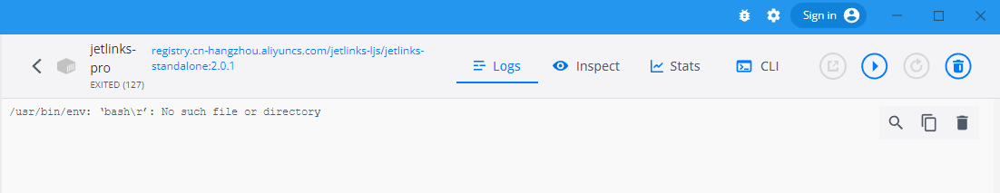
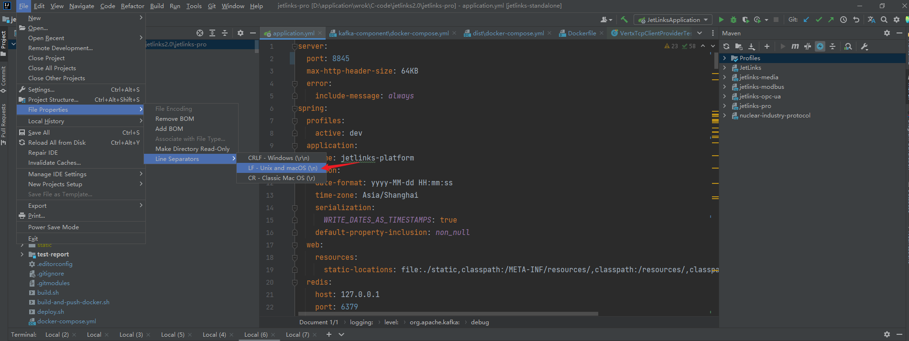
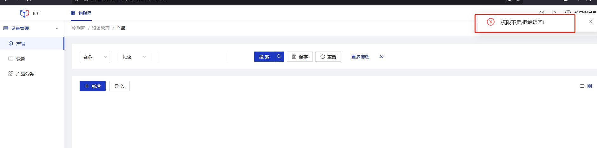

#   部署到服务器
<div class='explanation primary'>
  <p class='explanation-title-warp'>
    <span class='iconfont icon-bangzhu explanation-icon'></span>
    <span class='explanation-title font-weight'>说明</span>
  </p>
  
本文档部署的服务器版本为`centos7`，项目编译打包用到了`jdk 1.8.0_333`和`maven 3.6.3`，构建、推送镜像用到了`docker 20.10.17`。

在后端部署之前请先完成中间件的部署，部署详细可以参考 <a href="/dev-guide/middleware-deploy.html">中间件部署</a>

</div>


## 文档指引
<table>
<tr>
   <td><a href="/dev-guide/deploy-communtiy.html#jetlinks-communtiy部署">jetlinks-communtiy部署</a></td>
   <td><a href="/dev-guide/deploy-pro.html#jetlinks-pro部署">jetlinks-pro部署</a></td>
   <td><a href="/dev-guide/deploy-cloud.html#jetlinks-cloud部署">jetlinks-clod部署</a></td>
</tr>

</table>


## 问题指引
<table>
<tr>
    <td><a href="/dev-guide/java-deploy.html#未指定maven版本导致打包出错">未指定maven版本导致打包出错</a></td>
      <td><a href="/dev-guide/java-deploy.html#镜像启动报错">镜像启动报错</a></td>
</tr>
<tr>
    <td><a href="/dev-guide/java-deploy.html#权限管理中权限数据不完整">权限管理中权限数据不完整</a></td>
    <td><a href="/dev-guide/java-deploy.html#点击登录按钮无法进入首页，跳转到登录页面">点击登录按钮无法进入首页</a></td>
</tr>
</table>


## 常见问题

### maven打包报错
<div class='explanation warning'>
  <p class='explanation-title-warp'>
    <span class='iconfont icon-bangzhu explanation-icon'></span>
    <span class='explanation-title font-weight'>问题1</span>
  </p>
Q:jdk和maven环境变量配置问题

```shell
[ERROR] Failed to execute goal org.apache.maven.plugins:maven-compiler-plugin:3.1:compile (default-compile) on project common-component: Compilation failure
[ERROR] No compiler is provided in this environment. Perhaps you are running on a JRE rather than a JDK?
```
A:配置环境变量，示例如下
```shell
JAVA_HOME   C:\Program Files\Java\jdk1.8.0_333
MAVEN_HOME  D:\work\apache-maven-3.6.3
Path        %MAVEN_HOME%\bin,%JAVA_HOME%\bin
```
</div>

### 未指定maven版本导致打包出错
<div class='explanation warning'>
  <p class='explanation-title-warp'>
    <span class='iconfont icon-bangzhu explanation-icon'></span>
    <span class='explanation-title font-weight'>问题1</span>
  </p>
项目打包失败并出现以下错误:

```shell
[WARNING] Error injecting: org.springframework.boot.maven.RepackageMojo
java.lang.TypeNotPresentException: Type org.springframework.boot.maven.RepackageMojo not present
```
解决:指定`api-gateway-service`、`authentication-service`、`iot-service`和`file-service`四个模块`pom`文件中`maven`的版本，使`maven`版本和`spring boot`版本保持一致，例如:
```shell
<plugin>
   <groupId>org.springframework.boot</groupId>
   <artifactId>spring-boot-maven-plugin</artifactId>
   <version>${spring.boot.version}</version>
</plugin>
```
</div>

### 镜像启动报错 
<div class='explanation warning'>
  <p class='explanation-title-warp'>
    <span class='iconfont icon-bangzhu explanation-icon'></span>
    <span class='explanation-title font-weight'>问题2</span>
  </p>

Q: `/usr/bin/env: ‘bash\r’: No such file or directory`



A: 执行打包命令之前，需要检查整个项目换行符，需将换行符换为LF，否则运行镜像时会报以下错

</div>


选中JetLinks-pro项目，修改整个项目换行符：


### 权限管理中权限数据不完整
<div class='explanation warning'>
  <p class='explanation-title-warp'>
    <span class='iconfont icon-bangzhu explanation-icon'></span>
    <span class='explanation-title font-weight'>问题3</span>
  </p>

Q: 非admin用户访问设备相关页面报错无权限。




A: 在device-manager目录和things-manager目录下的pom文件中添加以下内容。

```yaml
        <dependency>
            <groupId>org.hswebframework.web</groupId>
            <artifactId>hsweb-system-authorization-default</artifactId>
            <version>${hsweb.framework.version}</version>
        </dependency>
```

</div>

### 点击登录按钮无法进入首页，跳转到登录页面
<div class='explanation warning'>
  <p class='explanation-title-warp'>
    <span class='iconfont icon-bangzhu explanation-icon'></span>
    <span class='explanation-title font-weight'>问题4</span>
  </p>
Q: 点击登录按钮无法进入首页，跳转到登录页面

A: 检查每个节点、每个服务是否连接同一个redis服务或redis集群服务，redis服务是否持久化成功。

</div>
