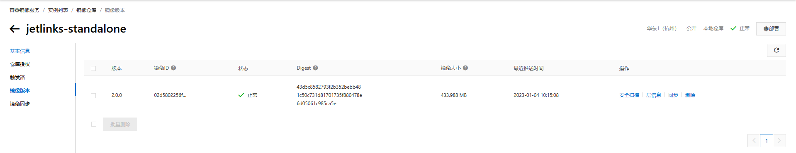

#   后端部署及相关问题
<div class='explanation primary'>
  <p class='explanation-title-warp'>
    <span class='iconfont icon-bangzhu explanation-icon'></span>
    <span class='explanation-title font-weight'>说明</span>
  </p>
  <p>Jetlinks的单机版和微服务版的后端部署会存在一些差异，本文档会分别说明两者部署的流程及遇到的问题。</p>
</div>

## 问题指引
<table>
<tr>
   <td><a href="/dev-guide/pull-code.html#镜像启动报错 `/usr/bin/env: ‘bash\r’: No such file or directory`">镜像启动报错 `/usr/bin/env: ‘bash\r’: No such file or directory`</a></td>
    <td><a href="/dev-guide/pull-code.html#打包命令导致打包出错">打包命令导致打包出错</a></td>

</tr>
<tr>
    <td><a href="/dev-guide/pull-code.html#未指定maven版本导致打包出错">未指定maven版本导致打包出错</a></td>
</tr>
</table>

## 文档指引
<table>
<tr>
   <td><a href="/dev-guide/java-deploy.html#单机版jar包部署">JetLinks单机版jar包部署</a></td>
    <td><a href="/dev-guide/java-deploy.html#单机版docker在线部署">JetLinks单机版docker在线部署</a></td>
    <td><a href="/dev-guide/java-deploy.html#单机版docker离线部署">JetLinks单机版docker离线部署</a></td>
    <td><a href="/dev-guide/java-deploy.html#单机版集群部署">JetLinks单机版集群部署</a></td>

</tr>
<tr>
    <td><a href="/dev-guide/java-deploy.html#微服务版jar包部署">JetLinks微服务版jar包部署</a></td>
    <td><a href="/dev-guide/java-deploy.html#微服务版docker在线部署">JetLinks微服务版docker在线部署</a></td>
    <td><a href="/dev-guide/java-deploy.html#微服务版docker离线部署">JetLinks微服务版docker离线部署</a></td>
    <td><a href="/dev-guide/java-deploy.html#微服务版集群部署">JetLinks微服务版集群部署</a></td>
</tr>
</table>

## JetLinks Pro(单机版)

### 单机版jar包部署

#### 配置文件

配置文件地址:`jetlinks-standalone/src/main/resources/application.yml`

常见配置说明

```yml
spring:
  redis: 
    host: 192.168.66.171 #需要修改这个ip，为部署中间件服务器的ipv4地址
    port: 6379
  r2dbc:
    url: r2dbc:postgresql://192.168.66.171:5432/jetlinks  # 数据库postgresql数据库配置
    #url: r2dbc:mysql://127.0.0.1:3306/jetlinks # 支持切换到mysql数据库，若切换数据库同时也要修改`easyorm.dialect`以及`easyorm.default-schema`配置.
    username: postgres  # 数据库用户名
    password: jetlinks  # 数据库密码
easyorm:
  default-schema: public # 数据库名 修改了数据库请修改这里,mysql为数据库名
  dialect: postgres # 数据库方言，支持 postgres,mysql,h2
elasticsearch:
  embedded:
    enabled: false 
    data-path: ./data/elasticsearch
    port: 9200
    host: 192.168.66.171 #需要修改这个ip，为部署中间件服务器的ipv4地址
hsweb:
  file:
    upload:
      static-file-path: ./static/upload   
      static-location: http://192.168.66.171:${server.port}/upload # 上传文件后,将使用此地址来访问文件,在部署到服务器后需要修改这个地址为服务器的ip

```

<div class='explanation primary'>
  <p class='explanation-title-warp'>
    <span class='iconfont icon-bangzhu explanation-icon'></span>
    <span class='explanation-title font-weight'>说明</span>
  </p>

   1. 若使用默认配置文件启动项目则需要优先修改配置文件，若使用外部配置文件启动项目可之后再修改配置文件

   2. 上面文件有注释了的内容需要根据实际部署情况进行修改，若更换了数据库同时也需要修改easyorm.dialect以及easyorm.default-schema配置的参数

</div>


#### 使用maven命令打包

1. 使用maven命令将项目打包，在代码根目录执行：

linux或者macOS环境下打包:
```shell script
./mvnw clean package -Dmaven.test.skip=true
```
windows环境下打包:
```shell script
mvn clean package '-Dmaven.test.skip=true'
```


2. 将jar包上传到需要部署的服务器上。

jar包文件地址: `jetlinks-standalone/target/jetlinks-standalone.jar`

3. 使用java命令运行jar包


 ```shell
#启动时，使用默认配置文件
java -jar jetlinks-standalone.jar
# 启动时，修改配置文件中的参数，格式如下
java -jar jetlinks-standalone.jar {--配置文件中的参数}
#命令示例
java -jar jetlinks-standalone.jar --spring.elasticsearch.embedded.enabled=true
#启动时，指定外部配置文件，格式如下
java -jar jetlinks-standalone.jar --spring.config.location={外部配置文件全路径}
#命令示例
java -jar jetlinks-standalone.jar --spring.config.location=D:\code\jetlinks-pro\jetlinks-standalone\src\main\resources\application.yml
```


### 单机版docker在线部署

<div class='explanation primary'>
  <p class='explanation-title-warp'>
    <span class='iconfont icon-bangzhu explanation-icon'></span>
    <span class='explanation-title font-weight'>说明</span>
  </p>
  构建docker镜像有两种方式，第一种使用命令分别进行打包，构建及推送，第二种使用脚本进行统一的打包，构建和推送
</div>


#### 使用命令构建、推送镜像
1. 使用maven命令将项目打包，在代码根目录执行：

Linux或者macOS环境下打包:

```shell script
./mvnw clean package -Dmaven.test.skip=true
```
Windows环境下打包:
```shell script
mvn clean package '-Dmaven.test.skip=true'
```


2. 使用docker构建镜像

<div class='explanation info'>
  <p class='explanation-title-warp'> 
    <span class='iconfont icon-tishi explanation-icon'></span>
    <span class='explanation-title font-weight'>提示</span>
  </p>
请自行准备docker镜像仓库，此处以阿里云仓库为例。
</div>

```shell script
$ cd ./jetlinks-standalone
#注意:命令末尾的 . 不要遗漏了
$ docker build -t registry.cn-shenzhen.aliyuncs.com/jetlinks-demo/jetlinks-standalone:2.0.0 .
```

3. 推送镜像

```bash
#登录阿里云镜像仓库，此处会让你输密码，就是创建镜像服务时自己设置的密码
docker login --username=[username] registry.cn-shenzhen.aliyuncs.com
#设置tag
docker tag [ImageId] registry.cn-shenzhen.aliyuncs.com/jetlinks-demo/jetlinks-standalone:2.0.0
#推送到阿里云镜像仓库
$ docker push registry.cn-shenzhen.aliyuncs.com/jetlinks-demo/jetlinks-standalone:2.0.0
```
4. 查看镜像是否推送成功

比较本地生成的digest和镜像仓库推送的digest是否一致，若保持一致则说明推送成功。

```shell
$ docker push registry.cn-hangzhou.aliyuncs.com/jetlinks-demo/jetlinks-standalone:2.0.0
The push refers to repository [registry.cn-hangzhou.aliyuncs.com/jetlinks-demo/jetlinks-standalone]
187cb63c5a7d: Layer already exists
29c7de453b8e: Layer already exists
144903481aa9: Layer already exists
849ea2764450: Layer already exists
f49d20b92dc8: Layer already exists
fe342cfe5c83: Layer already exists
630e4f1da707: Layer already exists
9780f6d83e45: Layer already exists
2.0.0: digest: sha256:43d5c8582793f2b352bebb481c50c731d81701735f880478e6d05061c985ca5e size: 3259
```

   

#### 使用脚本构建、推送镜像

1. 登录到阿里云仓库
```shell
#请自行准备docker镜像仓库，这里以阿里云镜像仓库为例
$ docker login --username={usrname} registry.cn-hangzhou.aliyuncs.com
Password: 
Login Succeeded
```

2. 脚本在项目的根目录下`build-and-push-docker.sh`，具体内容如下
```shell
#!/usr/bin/env bash
# 这个的镜像仓库地址需要替换为自己的镜像仓库地址
dockerImage="registry.cn-hangzhou.aliyuncs.com/jetlinks-demo/jetlinks-standalone:$(./mvnw help:evaluate -Dexpression=project.version -q -DforceStdout)"
./mvnw -Dmaven.test.skip=true \
#以下的子模块若不需要打包可自行删除
-Pmedia -Pedge -Pctwing -Ponenet -Pdueros -Paliyun-bridge -Popc-ua -Pmodbus \
-Dmaven.build.timestamp="$(date "+%Y-%m-%d %H:%M:%S")" \
-Dgit-commit-id="$(git rev-parse HEAD)" \
-Pmedia -T 12 \
clean package
if [ $? -ne 0 ];then
    echo "构建失败!"
else
  cd ./jetlinks-standalone || exit
  docker build -t "$dockerImage" . && docker push "$dockerImage"
fi
```
执行脚本`./build-and-push-docker.sh`

3. 查看镜像是否推送成功

比较本地生成的digest和镜像仓库推送的digest是否一致，若保持一致则说明推送成功。

本地digest:`2.0.0-SNAPSHOT: digest: sha256:50f11e067b1dee64a5369d6da08e07b0e46980a05f3a189485bb1d28f7961e8e size: 3259`

镜像仓库digest: 


#### 使用docker启动项目

1. 修改docker-compose文件

替换后端的镜像仓库地址，修改中间件 
```bash
version: '2'
services:
  jetlinks:
    image: registry.cn-shenzhen.aliyuncs.com/jetlinks-demo/jetlinks-standalone:2.0.0 #需要更改，更改为自己推送的镜像仓库
    container_name: jetlinks-pro
    ports:
      - 8844:8844 # API端口
      - 1883:1883 # MQTT端口
      - 11883:11883 # 通过openAPI使用mqtt订阅平台消息
      - 8100-8110:8100-8110 # 预留端口
      - 8200-8210:8200-8210/udp # 预留指定udp端口
    volumes:
      - "./data:/application/data" # 临时保存协议目录
      - "./data/upload:/application/static/upload"  # 持久化上传的文件
    environment:
        - "TZ=Asia/Shanghai"
        - "JAVA_OPTS=-Xms2G -Xmx2G -XX:+UseG1GC -XX:+HeapDumpOnOutOfMemoryError -XX:HeapDumpPath=/application/static/upload/dump.hprof"  # jvm参数，根据情况调整
        - "hsweb.file.upload.static-location=http://192.168.66.171:9000/upload"  #需要更改，上传的静态文件访问根地址,为本机的IP或者域名。需要前后端都能访问。
        - "spring.r2dbc.url=r2dbc:postgresql://192.168.66.171:5432/jetlinks-v2" #需要更改，数据库连接地址
        - "spring.profiles.active:dev"
        - "spring.r2dbc.username=postgres" #需要更改，部署数据库的用户名
        - "spring.r2dbc.password=jetlinks" #需要更改，部署数据库的密码
        - "spring.elasticsearch.urls=192.168.66.171:9200" #需要更改，部署es的ipv4地址和es端口号
        - "spring.reactor.debug-agent.enabled=false"
        - "spring.redis.host=192.168.66.171" #需要更改，部署redis的ipv4地址
        - "spring.redis.port=6379"
        - "spring.redis.password=JetLinks@redis" # redis密码，按照实际部署的redis更改
```


2. 运行docker-compose文件

将docker-compose文件传入服务器，在使用下面命令运行docker-compose文件
```shell script
docker-compose up -d
```

### 单机版docker离线部署

<div class='explanation primary'>
  <p class='explanation-title-warp'>
    <span class='iconfont icon-bangzhu explanation-icon'></span>
    <span class='explanation-title font-weight'>说明</span>
  </p>
  <p>服务器在无网络的环境时，无法获取到镜像仓库中的镜像，此时就可以通过docker离线部署来部署Jetlinks项目</p>
</div>

#### 使用脚本打包镜像

在根目录创建镜像打包脚本`build-docker.sh`，脚本内容如下:
```shell
#!/usr/bin/env bash
#定义镜像名
dockerImage="jetlinks-standalone:$(./mvnw help:evaluate -Dexpression=project.version -q -DforceStdout)"
#下列组件若不需要打包可自行刪去
-Pmedia -Pedge -Pctwing -Ponenet -Pdueros -Paliyun-bridge -Popc-ua -Pmodbus \
./mvnw -Dmaven.test.skip=true \
-Dmaven.build.timestamp="$(date "+%Y-%m-%d %H:%M:%S")" \
-Dgit-commit-id="$(git rev-parse HEAD)" \
-Pmedia -T 12 \
clean package
if [ $? -ne 0 ];then
    echo "构建失败!"
else
  cd ./jetlinks-standalone || exit
  docker build -t "$dockerImage" . 
fi
```
在根目录执行脚本`./build-docker.sh`

#### 导出镜像
导出的镜像会到源码根目录下，命令格式如下:
```shell
docker save -o [命名].tar [镜像名:版本号]
```
代码实例如下:
```shell
docker save -o jetlinks-standalone.tar jetlinks-standalone:2.0.0
```
#### 创建docker-compose文件
```yaml
version: '2'
services:
  jetlinks:
    image: jetlinks-standalone:2.0.0 #需要更改，改为本地打包的镜像名
    container_name: jetlinks-pro
    ports:
      - 8844:8844 # API端口
      - 1883:1883 # MQTT端口
      - 11883:11883 # 通过openAPI使用mqtt订阅平台消息
      - 8100-8110:8100-8110 # 预留端口
      - 8200-8210:8200-8210/udp # 预留指定udp端口
    volumes:
      - "./data:/application/data" # 临时保存协议目录
      - "./data/upload:/application/static/upload"  # 持久化上传的文件
    environment:
        - "TZ=Asia/Shanghai"
        - "JAVA_OPTS=-Xms2G -Xmx2G -XX:+UseG1GC -XX:+HeapDumpOnOutOfMemoryError -XX:HeapDumpPath=/application/static/upload/dump.hprof"  # jvm参数，根据情况调整
        - "hsweb.file.upload.static-location=http://192.168.66.171:9000/upload"  #需要更改，上传的静态文件访问根地址,为本机的IP或者域名。需要前后端都能访问。
        - "spring.r2dbc.url=r2dbc:postgresql://192.168.66.171:5432/jetlinks-v2" #需要更改，数据库连接地址
        - "spring.profiles.active:dev"
        - "spring.r2dbc.username=postgres" #需要更改，部署数据库的用户名
        - "spring.r2dbc.password=jetlinks" #需要更改，部署数据库的密码
        - "spring.elasticsearch.urls=192.168.66.171:9200" #需要更改，部署es的ipv4地址和es端口号
        - "spring.reactor.debug-agent.enabled=false"
        - "spring.redis.host=192.168.66.171" #需要更改，部署redis的ipv4地址
        - "spring.redis.port=6379"
        - "spring.redis.password=JetLinks@redis" # 需要更改，redis密码，按照实际部署的redis更改
```

#### 将镜像和配置文件传入服务器
导入镜像文件
```shell
#导入命令格式
docker load -i [镜像名.tar]
#导入命令示例
docker load -i jetlinks-standalone.tar 
```

使用命令启动项目 `docker-compose up -d`

### 单机版集群部署

1. 拉取`JetLinks pro`源码
```shell
 $ git clone -b master --recurse-submodules git@github.com:jetlinks-v2/jetlinks-pro.git
```
具体操作可参考<a href="/dev-guide/pull-code.html#源码获取">源码获取</a>

2. 修改配置文件

 修改示例可参考<a href="/dev-guide/config-info.html#jetlinks-pro-单机版集群">配置文件示例</a>

3. 构造镜像并推送到镜像仓库
使用项目根路径下的`build-and-push-docker.sh`脚本来构建、推送镜像，脚本具体内容如下
```shell
#!/usr/bin/env bash
# 这个的镜像仓库地址需要替换为自己的镜像仓库地址
dockerImage="registry.cn-hangzhou.aliyuncs.com/jetlinks-demo/jetlinks-standalone:$(./mvnw help:evaluate -Dexpression=project.version -q -DforceStdout)"
./mvnw -Dmaven.test.skip=true \
#以下的子模块若不需要打包可自行删除
-Pmedia -Pedge -Pctwing -Ponenet -Pdueros -Paliyun-bridge -Popc-ua -Pmodbus \
-Dmaven.build.timestamp="$(date "+%Y-%m-%d %H:%M:%S")" \
-Dgit-commit-id="$(git rev-parse HEAD)" \
-Pmedia -T 12 \
clean package
if [ $? -ne 0 ];then
    echo "构建失败!"
else
  cd ./jetlinks-standalone || exit
  docker build -t "$dockerImage" . && docker push "$dockerImage"
fi
```
4. 检查本地生成的dist和镜像仓库中的dist是否一致
```shell
$ docker push registry.cn-hangzhou.aliyuncs.com/jetlinks-demo/jetlinks-standalone:2.0.0
The push refers to repository [registry.cn-hangzhou.aliyuncs.com/jetlinks-demo/jetlinks-standalone]
187cb63c5a7d: Layer already exists
29c7de453b8e: Layer already exists
144903481aa9: Layer already exists
849ea2764450: Layer already exists
f49d20b92dc8: Layer already exists
fe342cfe5c83: Layer already exists
630e4f1da707: Layer already exists
9780f6d83e45: Layer already exists
2.0.0: digest: sha256:43d5c8582793f2b352bebb481c50c731d81701735f880478e6d05061c985ca5e size: 3259
```


5. 修改docker-compose配置文件
配置文件在源码`/dist`路径下，详细配置如下
```yaml
version: '2'
services:
  redis:
    image: redis:5.0.4
    container_name: jetlinks-redis
    ports:
      - "6379:6379"
    volumes:
      - "./data/redis:/data"
    command: redis-server --appendonly yes --requirepass "JetLinks@redis"
    environment:
      - TZ=Asia/Shanghai
  elasticsearch:
    image: elasticsearch:6.8.10
    container_name: jetlinks-elasticsearch
    environment:
      ES_JAVA_OPTS: "-Djava.net.preferIPv4Stack=true -Xms2g -Xmx2g"
      TZ: Asia/Shanghai
      transport.host: 0.0.0.0
      discovery.type: single-node
      bootstrap.memory_lock: "true"
      discovery.zen.minimum_master_nodes: 1
      discovery.zen.ping.unicast.hosts: elasticsearch
    volumes:
      - ./data/elasticsearch:/usr/share/elasticsearch/data
    ports:
      - "9200:9200"
      - "9300:9300"
  kibana:
    image: kibana:6.8.10
    container_name: jetlinks-kibana
    environment:
      ELASTICSEARCH_URL: http://elasticsearch:9200
    links:
      - elasticsearch:elasticsearch
    ports:
      - "5601:5601"
    depends_on:
      - elasticsearch
  postgres:
    image: postgres:11-alpine
    container_name: jetlinks-postgres
    ports:
      - "5432:5432"
    volumes:
      - "./data/postgres:/var/lib/postgresql/data"
    environment:
      POSTGRES_PASSWORD: jetlinks
      POSTGRES_DB: jetlinks
      TZ: Asia/Shanghai
  ui:
    image: registry.cn-shenzhen.aliyuncs.com/jetlinks/jetlinks-ui-pro:2.0.0
    container_name: jetlinks-pro-ui
    ports:
      - 9000:80
    environment:
      - "API_BASE_PATH=http://jetlinks:8844/" #API根路径
    volumes:
      - "./data/upload:/usr/share/nginx/html/upload"
    depends_on:
      - jetlinks
  jetlinks:
#    image: registry.cn-shenzhen.aliyuncs.com/jetlinks-pro/jetlinks-standalone:2.0.0-SNAPSHOT
    image: registry.cn-hangzhou.aliyuncs.com/jetlinks-demo/jetlinks-standalone:2.0.0-SNAPSHOT
    container_name: jetlinks-pro
    ports:
      - 8844:8844 # API端口
      - 1883:1883 # MQTT端口
      - 11883:11883 # 通过openAPI使用mqtt订阅平台消息
      - 8100-8110:8100-8110 # 预留端口
      - 8200-8210:8200-8210/udp # udp端口
    volumes:
      - "./data:/application/data" # 临时保存协议目录
      - "./data/upload:/application/static/upload"  # 持久化上传的文件
    environment:
      - "TZ=Asia/Shanghai"
#      - "JAVA_OPTS=-Xms4G -Xmx4G -XX:+UseG1GC -XX:+HeapDumpOnOutOfMemoryError -XX:HeapDumpPath=/application/static/upload/dump.hprof"  # jvm参数，根据情况调整
      - "hsweb.file.upload.static-location=http://127.0.0.1:9000/upload"  #上传的静态文件访问根地址,为本机的IP或者域名。需要前后端都能访问。
      - "spring.r2dbc.url=r2dbc:postgresql://postgres:5432/jetlinks" #数据库连接地址
      - "spring.r2dbc.username=postgres"
      - "spring.r2dbc.password=jetlinks"
      - "spring.elasticsearch.uris=elasticsearch:9200"
      #        - "spring.elasticsearch.username=admin"
      #        - "spring.elasticsearch.password=admin"
      - "spring.reactor.debug-agent.enabled=false" #设置为false能提升性能
      - "spring.redis.host=redis"
      - "spring.redis.port=6379"
      - "spring.redis.password=JetLinks@redis"
      - "logging.level.io.r2dbc=warn"
      - "logging.level.org.springframework.data=warn"
      - "logging.level.org.springframework=warn"
      - "logging.level.org.jetlinks=warn"
      - "logging.level.org.hswebframework=warn"
      - "logging.level.org.springframework.data.r2dbc.connectionfactory=warn"
    links:
      - redis:redis
      - postgres:postgres
      - elasticsearch:elasticsearch
    depends_on:
      - elasticsearch
      - postgres
      - redis
```
常见修改说明

| 标识名                         | 更改示例                                                                               | 说明               |
|-----------------------------|------------------------------------------------------------------------------------|------------------|
| jetlinks.image              | registry.cn-hangzhou.aliyuncs.com/jetlinks-demo/jetlinks-standalone:2.0.0-SNAPSHOT | 镜像仓库地址请自行更换      |
| jetlinks.environment        | - "hsweb.file.upload.static-location=http://192.168.66.171:9000/upload"            | 换为后端部署服务器的ipv4地址 |

7. 将docker-compose配置文件分别上传到每台服务器
8. 使用`docker-compose up -d`命令创建并启动容器
9. 验证是否启动成功`docker ps -a`

STATUS为up为容器启动成功，STATUS为Exited为容器启动失败
```shell
$ docker ps -a
CONTAINER ID   IMAGE                                                                                COMMAND                  CREATED          STATUS        
               PORTS                                                                                                                NAMES
f303fc2fbd67   registry.cn-hangzhou.aliyuncs.com/jetlinks-demo/jetlinks-standalone:2.0.0-SNAPSHOT   "./docker-entrypoint…"   23 seconds ago   Up 16 seconds 
               0.0.0.0:1883->1883/tcp, 0.0.0.0:8100-8110->8100-8110/tcp, 0.0.0.0:8845->8845/tcp, 0.0.0.0:8200-8210->8200-8210/udp   jetlinks-pro
4e883fed1d0d   registry.cn-shenzhen.aliyuncs.com/jetlinks/jetlinks-ui-pro:2.0.0                     "/docker-entrypoint.…"   4 days ago       Up 7 minutes  
               0.0.0.0:9000->80/tcp                                                                                                 jetlinks-pro-ui
84a9379e3944   kibana:7.17.3                                                                        "/bin/tini -- /usr/l…"   3 weeks ago      Up 8 minutes  
               0.0.0.0:5601->5601/tcp                                                                                               jetlinks-kibana      
6366d9063dd0   elasticsearch:7.17.3                                                                 "/bin/tini -- /usr/l…"   3 weeks ago      Up 7 minutes  
               0.0.0.0:9200->9200/tcp, 0.0.0.0:9300->9300/tcp                                                                       jetlinks-elasticsearch
7bc603f1e897   postgres:11-alpine                                                                   "docker-entrypoint.s…"   6 weeks ago      Up 7 minutes  
               0.0.0.0:5432->5432/tcp                                                                                               jetlinks-postgres       
4bdba77584ce   redis:5.0.4                                                                          "docker-entrypoint.s…"   2 months ago     Up 7 minutes  
               0.0.0.0:6379->6379/tcp                                                                                               jetlinks-redis
```

容器启动失败示例如下
```shell
c0ac281c2877   registry.cn-hangzhou.aliyuncs.com/synbop/emqttd:2.3.6          "/opt/emqttd/start.sh"   4 days ago       Exited (137) 2days ago        emq                                         
```
11. 配置nginx.conf文件，示例如下
```yaml
events {
    worker_connections  1024;
}

http {
# api接口服务(后端)
upstream apiserver {
    server 192.168.66.171:8844;
    server 192.168.66.177:8844
    server 192.168.66.178:8844
}

# 前端服务
upstream webserver {
  server 192.168.66.171:9000;
}

# 文件服务
upstream fileserver {
  server 192.168.66.171:8844;
}

server {

  listen       8080;
  server_name  localhost;

  location ^~/upload/ {
    proxy_pass http://fileserver;
    proxy_set_header Host $host:$server_port;
    proxy_set_header X-Real-IP  $remote_addr;
    proxy_set_header X-Forwarded-For $proxy_add_x_forwarded_for;
  }

  location ^~/jetlinks/file/static {
    proxy_pass http://fileserver/file/static;
    proxy_set_header X-Forwarded-Proto $scheme;
    proxy_set_header Host $host:$server_port;
    proxy_set_header X-Real-IP  $remote_addr;
    proxy_set_header X-Forwarded-For $proxy_add_x_forwarded_for;
    proxy_send_timeout      30m;
    proxy_read_timeout      30m;
    client_max_body_size    100m;
  }

  location ^~/jetlinks/ {
    proxy_pass http://apiserver/;
    proxy_set_header X-Forwarded-Proto $scheme;
    proxy_set_header Host $host:$server_port;
    proxy_set_header X-Real-IP  $remote_addr;
    proxy_set_header X-Forwarded-For $proxy_add_x_forwarded_for;
    proxy_http_version 1.1;
    proxy_set_header Upgrade $http_upgrade;
    proxy_set_header Connection "upgrade";
    proxy_connect_timeout   1;
    proxy_buffering off;
    chunked_transfer_encoding off;
    proxy_cache off;
    proxy_send_timeout      30m;
    proxy_read_timeout      30m;
    client_max_body_size    100m;
  }

  location / {
    proxy_pass http://webserver/;
    proxy_set_header Host $host:$server_port;
    proxy_set_header X-Real-IP  $remote_addr;
    proxy_set_header X-Forwarded-For $proxy_add_x_forwarded_for;
  }
}
}
```

12. 启动nginx
```shell
whereis nginx #查询nginx文件夹具体位置
cd ./usr/local/sbin #切换到sbin目录下
./nginx #启动nginx
```

13. 验证是否集群成功

在网络组件-独立配置下拉框中是否有两个节点，有则说明配置成功


## JetLinks Cloud(微服务版)

### 微服务版jar包部署

1. 修改配置文件
```yaml
#api-gateway-service服务无需修改
#authentication-service、iot-service和file-service三个服务修改内容相同，示例如下
spring:
   redis:
      host: 192.168.66.171 #此处需要修改，改为redis部署服务器ip地址
      port: 6379
      database: 0
      lettuce:
         pool:
            max-active: 1024
      timeout: 20s
      password: iot@cloud #redis密码根据实际部署情况更改
      r2dbc:
         url: r2dbc:postgresql://192.168.66.171:5432/jetlinks #此处需要修改，改为pg库部署服务器ip地址
         #url: r2dbc:mysql://127.0.0.1:3306/jetlinks # 支持切换到mysql数据库，若切换数据库同时也要修改`easyorm.dialect`以及`easyorm.default-schema`配置.
         username: postgres #ps库用户名密码，根据部署实际情况修改
         password: jetlinks
         pool:
            max-size: 32
      codec:
         max-in-memory-size: 50MB
      reactor:
         debug-agent:
            enabled: true # 开启调试代理,在打印异常时将会生成调用踪栈信息
      elasticsearch:
         uris: 192.168.66.171:9200 #ps库用户名密码，根据部署实际情况修改
         socket-timeout: 10s
         connection-timeout: 15s
         webclient:
            max-in-memory-size: 100MB
   easyorm:
      default-schema: public # 数据库名 修改了数据库请修改这里,mysql为数据库名
      dialect: postgres # 数据库方言，支持 postgres,mysql,h2
```

<div class='explanation primary'>
  <p class='explanation-title-warp'>
    <span class='iconfont icon-bangzhu explanation-icon'></span>
    <span class='explanation-title font-weight'>说明</span>
  </p>
若使用默认配置文件启动项目则需要优先修改配置文件，若使用外部配置文件启动项目可之后再修改配置文件
</div>


3. 创建打包脚本

在项目根路径创建打包脚本`build.sh `脚本内容如下：
```shell
#!/usr/bin/env bash
servers="$1"
if [ -z "$servers" ]||[ "$servers" = "all" ];then
servers="api-gateway-service,authentication-service,iot-service,file-service"
fi

IFS=","
arr=($a)

version=$(mvn help:evaluate -Dexpression=project.version -q -DforceStdout)
echo "start build : $servers : $version"
./mvnw -Dmaven.test.skip=true \
-Dmaven.build.timestamp="$(date "+%Y-%m-%d %H:%M:%S")" \
-Dgit-commit-id="$(git rev-parse HEAD)" \
-Pmedia -T 12 \
clean package
if [ $? -ne 0 ];then
    echo "构建失败!"
fi
```
4. 执行打包脚本

在项目根路径执行
```shell
$ ./build.sh 
```


5. 将四个服务的jar包上传到需要部署的服务器上。

jar包文件地址:
```
micro-services/api-gateway-service/target/applicatione.jar
micro-services/authentication-service/target/applicatione.jar
micro-services/file-service/target/applicatione.jar
micro-services/iot-service/target/applicatione.jar
```


6. 使用java命令运行jar包，以api-gateway为例
```shell
cd ./micro-services/api-gateway-service/target/
#启动时，使用默认配置文件
java -jar jetlinks-applicatione.jar 
# 启动时，修改配置文件中的参数，格式如下
java -jar jetlinks-applicatione.jar {--配置文件中的参数}
#命令示例
java -jar jetlinks-applicatione.jar --spring.elasticsearch.embedded.enabled=true
#启动时，指定外部配置文件，格式如下
java -jar jetlinks-applicatione.jar --spring.config.location={外部配置文件全路径}
#命令示例
java -jar jetlinks-applicatione.jar --spring.config.location=D:\code\jetlinks-cloud-2.0\micro-services\api-gateway-service\src\main\resources\application.yml
```


### 微服务版docker在线部署

1. 登录到阿里云仓库
```shell
#请自行准备docker镜像仓库，这里以阿里云镜像仓库为例
$ docker login --username={usrname} registry.cn-hangzhou.aliyuncs.com
Password: 
Login Succeeded
```

2. 运行打包脚本

在项目根路径执行
```shell
$ ./build-and-push-docker.sh 
```
脚本文件具体内容如下
```shell
#!/usr/bin/env bash
servers="$1"
if [ -z "$servers" ]||[ "$servers" = "all" ];then
servers="api-gateway-service,authentication-service,iot-service,file-service"
fi

IFS=","
arr=($a)

version=$(mvn help:evaluate -Dexpression=project.version -q -DforceStdout)
echo "start build : $servers : $version"
## 使用maven打包
./mvnw -Dmaven.test.skip=true \
-Dmaven.build.timestamp="$(date "+%Y-%m-%d %H:%M:%S")" \
-Dgit-commit-id="$(git rev-parse HEAD)" \
-Pmedia -T 12 \
clean package
if [ $? -ne 0 ];then
    echo "构建失败!"
else

#四个微服务分别构建镜像并推送到仓库
for s in ${servers}
do
 cd "./micro-services/${s}" || exit
 dockerImage="registry.cn-hangzhou.aliyuncs.com/jetlinks-demo/$s:$version"
 echo "build $s docker image $dockerImage"
 docker build -t "$dockerImage" . && docker push "$dockerImage"
 cd ../../
done

fi
```
3. 查看是否推送成功
   


5. 创建docker-compose文件

将每个服务的镜像地址替换为之前推送的镜像仓库地址

将中间件的host地址替换为服务器的ip地址

```shell
version: '2'
services:
  nacos:
    image: nacos/nacos-server:v2.1.0
    container_name: jetlinks-nacos
    environment:
      - PREFER_HOST_MODE=hostname
      - MODE=standalone
    volumes:
      - ./data/nacos/logs/:/home/nacos/logs
    #      - ./data/nacos/custom.properties:/home/nacos/init.d/custom.properties
    ports:
      - "8848:8848"
  api-gateway-service:
    image: registry.cn-hangzhou.aliyuncs.com/jetlinks-demo/api-gateway-service:2.0.0-SNAPSHOT #此处需要更改，改为自己镜像仓库地址
      ports:
         - 8801:8801
      environment:
         - "spring.cloud.nacos.discovery.server-addr=192.168.66.171:8848" #此处需要更改，改为nacos服务ip地址
         - "spring.cloud.nacos.discovery.register-enabled=true"
         - "TZ=Asia/Shanghai"
         - "JAVA_OPTS=-Xms1g -Xms1g -XX:+UseG1GC -XX:+HeapDumpOnOutOfMemoryError -XX:HeapDumpPath=/application/static/upload/dump.hprof"  # jvm参数，根据情况调整
         - "hsweb.file.upload.static-location=http://192.168.66.171:9000/upload"  #上传的静态文件访问根地址,此处需要更改，为本机的IP或者域名。需要前后端都能访问。
         - "spring.r2dbc.url=r2dbc:postgresql://192.168.66.171:5432/jetlinks" #数据库连接地址，此处需要更改，改为pg库部署服务器ip地址
         - "spring.r2dbc.username=postgres" # ps库用户名密码，根据部署实际情况修改
         - "spring.r2dbc.password=jetlinks"
         - "spring.elasticsearch.urls=192.168.66.171:9200" #此处需要更改，改为es部署服务器ip地址
         - "spring.reactor.debug-agent.enabled=false" #设置为false能提升性能
         - "spring.redis.host=192.168.66.171" #此处需要更改，改为redis部署服务器ip地址
         - "spring.redis.port=6379"
         - "spring.redis.password=" #redis密码，根据部署实际情况修改
         - "logging.level.io.r2dbc=warn" #定义日志级别
         - "logging.level.org.springframework.data=warn"
         - "logging.level.org.springframework=warn"
         - "logging.level.org.jetlinks=debug"
         - "logging.level.org.hswebframework=warn"
         - "logging.level.org.springframework.data.r2dbc.connectionfactory=warn"
   authentication-service:
      image: registry.cn-hangzhou.aliyuncs.com/jetlinks-demo/authentication-service:2.0.0-SNAPSHOT #此处需要更改，改为自己镜像仓库地址
      
      ports:
         - 8100:8100
      environment:
         ...... #与api-gateway-service服务一致，参考api-gateway-service服务配置
   file-service:
      image: registry.cn-hangzhou.aliyuncs.com/jetlinks-demo/file-service:2.0.0-SNAPSHOT #此处需要更改，改为自己镜像仓库地址
      ports:
         - 8300:8300
      environment:
         ...... #与api-gateway-service服务一致，参考api-gateway-service服务配置
      volumes:
         - "./data/upload:/application/upload"
   iot-service:
      image: registry.cn-hangzhou.aliyuncs.com/jetlinks-demo/iot-service:2.0.0-SNAPSHOT #此处需要更改，改为自己镜像仓库地址
      ports:
         - 8200:8200
      environment:
         ...... #与api-gateway-service服务一致，参考api-gateway-service服务配置
      volumes:
         - "./data/dumps:/dumps"
```
6.运行docker-compose文件

```shell script
# 进入docker compose文件路径下
cd ./micro-services/
docker-compose up -d
```

### 微服务版docker离线部署
在根目录创建镜像打包脚本build-docker.sh，脚本内容如下
```shell
#!/usr/bin/env bash
servers="$1"
if [ -z "$servers" ]||[ "$servers" = "all" ];then
servers="api-gateway-service,authentication-service,iot-service,file-service"
fi

IFS=","
arr=($a)

version=$(mvn help:evaluate -Dexpression=project.version -q -DforceStdout)
echo "start build : $servers : $version"
## 使用maven打包
./mvnw -Dmaven.test.skip=true \
-Dmaven.build.timestamp="$(date "+%Y-%m-%d %H:%M:%S")" \
-Dgit-commit-id="$(git rev-parse HEAD)" \
-Pmedia -T 12 \
clean package
if [ $? -ne 0 ];then
    echo "构建失败!"
else

#四个微服务分别构建镜像并推送到仓库
for s in ${servers}
do
 cd "./micro-services/${s}" || exit
 #定义镜像名
 dockerImage="jetlinks-$s:$version"
 echo "build $s docker image $dockerImage"
 docker build -t "$dockerImage" .
 cd ../../
done
fi
```
在根目录执行脚本`./build-docker.sh`

#### 导出镜像
导出的镜像会到源码根目录下，命令格式如下:
```shell
docker save -o [命名].tar [镜像名:版本号]
```
命令示例如下:
```shell
docker save -o jetlinks-api-gateway-service.tar jetlinks-api-gateway-service:2.0.0-SNAPSHOT
docker save -o jetlinks-authentication-service.tar jetlinks-authentication-service:2.0.0-SNAPSHOT
docker save -o jetlinks-iot-service.tar jetlinks-iot-service-service:2.0.0-SNAPSHOT
docker save -o jetlinks-file-service.tar jetlinks-file-service:2.0.0-SNAPSHOT
```
#### 创建docker-compose文件
```yaml
version: '2'
services:
   nacos: #nacos服务
      image: nacos/nacos-server:v2.1.0
      container_name: jetlinks-nacos
      environment:
         - PREFER_HOST_MODE=hostname
         - MODE=standalone
      volumes:
         - ./data/nacos/logs/:/home/nacos/logs
      #      - ./data/nacos/custom.properties:/home/nacos/init.d/custom.properties
      ports:
         - "8848:8848"
   api-gateway-service:
      image: jetlinks-api-gateway-service:2.0.0-SNAPSHOT #替换为本地镜像名
      ports:
         - 8801:8801
      environment:
         - "spring.cloud.nacos.discovery.server-addr=192.168.66.171:8848" #此处需要更改，改为nacos服务ip地址
         - "spring.cloud.nacos.discovery.register-enabled=true"
         - "TZ=Asia/Shanghai"
         - "JAVA_OPTS=-Xms1g -Xms1g -XX:+UseG1GC -XX:+HeapDumpOnOutOfMemoryError -XX:HeapDumpPath=/application/static/upload/dump.hprof"  # jvm参数，根据情况调整
         - "hsweb.file.upload.static-location=http://192.168.66.171:9000/upload"  #上传的静态文件访问根地址,此处需要更改，为本机的IP或者域名。需要前后端都能访问。
         - "spring.r2dbc.url=r2dbc:postgresql://192.168.66.171:5432/jetlinks" #数据库连接地址，此处需要更改，改为pg库部署服务器ip地址
         - "spring.r2dbc.username=postgres" # ps库用户名密码，根据部署实际情况修改
         - "spring.r2dbc.password=jetlinks"
         - "spring.elasticsearch.urls=192.168.66.171:9200" #此处需要更改，改为es部署服务器ip地址
         - "spring.reactor.debug-agent.enabled=false" #设置为false能提升性能
         - "spring.redis.host=192.168.66.171" #此处需要更改，改为redis部署服务器ip地址
         - "spring.redis.port=6379"
         - "spring.redis.password=" #redis密码，根据部署实际情况修改
         - "logging.level.io.r2dbc=warn" #定义日志级别
         - "logging.level.org.springframework.data=warn"
         - "logging.level.org.springframework=warn"
         - "logging.level.org.jetlinks=debug"
         - "logging.level.org.hswebframework=warn"
         - "logging.level.org.springframework.data.r2dbc.connectionfactory=warn"
   authentication-service:
      image: jetlinks-authentication-service:2.0.0-SNAPSHOT #替换为本地镜像名
      ports:
         - 8100:8100
      environment:
         ...... #与api-gateway-service服务一致，参考api-gateway-service服务配置
   file-service:
      image: jetlinks-file-service:2.0.0-SNAPSHOT #替换为本地镜像名
      ports:
         - 8300:8300
      environment:
         ...... #与api-gateway-service服务一致，参考api-gateway-service服务配置
      volumes:
         - "./data/upload:/application/upload"
   iot-service:
      image: jetlinks-iot-service:2.0.0-SNAPSHOT #替换为本地镜像名
      ports:
         - 8200:8200
      environment:
         ...... #与api-gateway-service服务一致，参考api-gateway-service服务配置
      volumes:
         - "./data/dumps:/dumps"
```

#### 将镜像和配置文件传入服务器

使用命令启动项目 `docker-compose up -d`

### 微服务版集群部署

1. 拉取`JetLinks Cloud`源码
```shell
 $ git clone -b master --recurse-submodules git@github.com:jetlinks-v2/jetlinks-cloud.git
```
具体操作可参考<a href="/dev-guide/pull-code.html#源码获取">源码获取</a>

2. 修改配置文件

修改示例可参考<a href="/dev-guide/config-info.html#jetlinks-pro-单机版集群">配置文件示例</a>

3. 构造镜像并推送到镜像仓库
   使用项目根路径下的`build-and-push-docker.sh`脚本来构建、推送镜像，脚本具体内容如下
```shell
#!/usr/bin/env bash
servers="$1"
if [ -z "$servers" ]||[ "$servers" = "all" ];then
servers="api-gateway-service,authentication-service,iot-service,file-service"
fi

IFS=","
arr=($a)

version=$(mvn help:evaluate -Dexpression=project.version -q -DforceStdout)
echo "start build : $servers : $version"
## 使用maven打包
./mvnw -Dmaven.test.skip=true \
-Dmaven.build.timestamp="$(date "+%Y-%m-%d %H:%M:%S")" \
-Dgit-commit-id="$(git rev-parse HEAD)" \
-Pmedia -T 12 \
clean package
if [ $? -ne 0 ];then
    echo "构建失败!"
else

#四个微服务分别构建镜像并推送到仓库
for s in ${servers}
do
 cd "./micro-services/${s}" || exit
 dockerImage="registry.cn-hangzhou.aliyuncs.com/jetlinks-ljs/$s:$version"
 echo "build $s docker image $dockerImage"
 docker build -t "$dockerImage" . && docker push "$dockerImage"
 cd ../../
done
fi
```
4. 检查本地生成的dist和镜像仓库中的dist是否一致

2. 配置nginx.config文件
```yaml
events {
    worker_connections  1024;
}

http {
# api接口服务(后端)
upstream apiserver {
    server 192.168.66.171:8800;
    server 192.168.66.177:8800;
}

# 前端服务
upstream webserver {
  server 192.168.66.171:9000;
}

# 文件服务
upstream fileserver {
  server 192.168.66.171:8800;
}

server {

  listen       8080;
  server_name  localhost;

  location ^~/upload/ {
    proxy_pass http://fileserver;
    proxy_set_header Host $host:$server_port;
    proxy_set_header X-Real-IP  $remote_addr;
    proxy_set_header X-Forwarded-For $proxy_add_x_forwarded_for;
  }

  location ^~/jetlinks/file/static {
    proxy_pass http://fileserver/file/static;
    proxy_set_header X-Forwarded-Proto $scheme;
    proxy_set_header Host $host:$server_port;
    proxy_set_header X-Real-IP  $remote_addr;
    proxy_set_header X-Forwarded-For $proxy_add_x_forwarded_for;
    proxy_send_timeout      30m;
    proxy_read_timeout      30m;
    client_max_body_size    100m;
  }

  location ^~/jetlinks/ {
    proxy_pass http://apiserver/;
    proxy_set_header X-Forwarded-Proto $scheme;
    proxy_set_header Host $host:$server_port;
    proxy_set_header X-Real-IP  $remote_addr;
    proxy_set_header X-Forwarded-For $proxy_add_x_forwarded_for;
    proxy_http_version 1.1;
    proxy_set_header Upgrade $http_upgrade;
    proxy_set_header Connection "upgrade";
    proxy_connect_timeout   1;
    proxy_buffering off;
    chunked_transfer_encoding off;
    proxy_cache off;
    proxy_send_timeout      30m;
    proxy_read_timeout      30m;
    client_max_body_size    100m;
  }

  location / {
    proxy_pass http://webserver/;
    proxy_set_header Host $host:$server_port;
    proxy_set_header X-Real-IP  $remote_addr;
    proxy_set_header X-Forwarded-For $proxy_add_x_forwarded_for;
  }
}
}
```
6. 启动nginx
```shell
whereis nginx #查询nginx文件夹具体位置
cd ./usr/local/sbin #切换到sbin目录下
./nginx #启动nginx
```

## 常见问题

### 打包命令导致打包出错
<div class='explanation warning'>
  <p class='explanation-title-warp'>
    <span class='iconfont icon-bangzhu explanation-icon'></span>
    <span class='explanation-title font-weight'>问题1</span>
  </p>
执行打包命令时出现下面的错误，是因为打包命令不正确导致的，请检查打包命令和文档是否一致

```shell
[ERROR] Unknown lifecycle phase " -Dmaven.test.skip=true". You must specify a valid lifecycle phase or a goal in the format <plugin-prefix>:<goal> or <plugin-group-id>:<plugin-artifact-id>[:<plugin-version>]:<goal>. Available lifecycle phases are: validate, initialize, generate-sources, process-sources, generate-resources, process-resources, compile, process-classes, generate-test-sources, process-test-sources, generate-test-resources, process-test-resources, test-compile, process-test-classes, test, prepare-package, package, pre-integration-test, integration-test, post-integration-test, verify, install, deploy, pre-clean, clean, post-clean, pre-site, site, post-site, site-deploy. -> [Help 1]
org.apache.maven.lifecycle.LifecyclePhaseNotFoundException: Unknown lifecycle phase " -Dmaven.test.skip=true". You must specify a valid lifecycle phase or a goal in the format <plugin-prefix>:<goal> or <plugin-group-id>:<plugin-artifact-id>[:<plugin-version>]:<goal>. Available lifecycle phases are: validate, initialize, generate-sources, process-sources, generate-resources, process-resources, compile, process-classes, generate-test-sources, process-test-sources, generate-test-resources, process-test-resources, test-compile, process-test-classes, test, prepare-package, package, pre-integration-test, integration-test, post-integration-test, verify, install, deploy, pre-clean, clean, post-clean, pre-site, site, post-site, site-deploy.
```

</div>

### 未指定maven版本导致打包出错
<div class='explanation warning'>
  <p class='explanation-title-warp'>
    <span class='iconfont icon-bangzhu explanation-icon'></span>
    <span class='explanation-title font-weight'>问题2</span>
  </p>
项目打包失败并出现以下错误:

```shell
[WARNING] Error injecting: org.springframework.boot.maven.RepackageMojo
java.lang.TypeNotPresentException: Type org.springframework.boot.maven.RepackageMojo not present
```
解决:指定`api-gateway-service`、`authentication-service`、`iot-service`和`file-service`四个模块`pom`文件中`maven`的版本，使`maven`版本和`spring boot`版本保持一致，例如:
```shell
<plugin>
   <groupId>org.springframework.boot</groupId>
   <artifactId>spring-boot-maven-plugin</artifactId>
   <version>${spring.boot.version}</version>
</plugin>
```
</div>

### 镜像启动报错 `/usr/bin/env: ‘bash\r’: No such file or directory`
<div class='explanation warning'>
  <p class='explanation-title-warp'>
    <span class='iconfont icon-bangzhu explanation-icon'></span>
    <span class='explanation-title font-weight'>问题3</span>
  </p>
执行打包命令之前，需要检查整个项目换行符，需将换行符换为LF，否则运行镜像时会报以下错
</div>


选中JetLinks-pro项目，修改整个项目换行符：


### 权限管理中权限数据不完整
<div class='explanation warning'>
  <p class='explanation-title-warp'>
    <span class='iconfont icon-bangzhu explanation-icon'></span>
    <span class='explanation-title font-weight'>问题4</span>
  </p>
执行打包命令时出现下面的错误，是因为打包命令不正确导致的，请检查打包命令和文档是否一致
</div>

### 点击登录按钮无法进入首页，跳转到登录页面
<div class='explanation warning'>
  <p class='explanation-title-warp'>
    <span class='iconfont icon-bangzhu explanation-icon'></span>
    <span class='explanation-title font-weight'>问题5</span>
  </p>
解决: 检查每个节点、每个服务是否连接的同一个redis服务，redis服务是否持久化成功。
</div>
