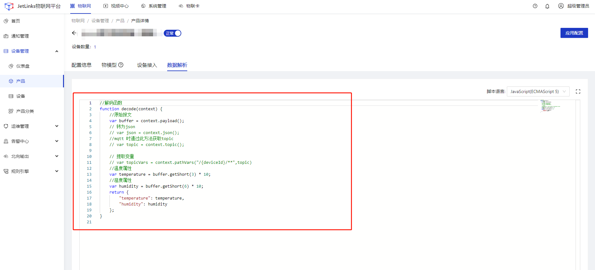
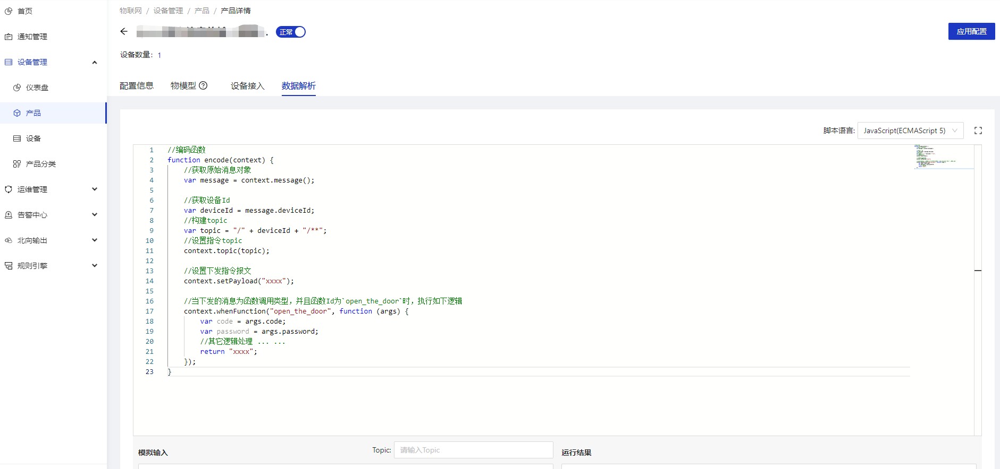

# 透传协议

直接将设备消息转为透传消息，在平台中通过订阅`/device/*/*/message/direct`来处理上报的透传消息


<div class='explanation warning'>
  <p class='explanation-title-warp'>
    <span class='iconfont icon-jinggao explanation-icon'></span>
    <span class='explanation-title font-weight'>注意</span>
  </p>

透传协议目前仅支持MQTT的传输类型

</div>


## 获取透传协议

可前往[github](https://github.com/jetlinks/transparent-protocol)下载透传协议源码

## 消息解析


<div class='explanation primary'>
  <p class='explanation-title-warp'>
    <span class='iconfont icon-bangzhu explanation-icon'></span>
    <span class='explanation-title font-weight'>说明</span>
  </p>

解析设备透传到平台的消息，需要在产品或设备详情-数据解析tab页中的脚本输入框中定义函数为`function decode(context){xxx}`

</div>




**context API说明**

|  名称      | 参数说明 |  说明   |  示例  | 
| --------   | -----: | -----:  | :----:  |
|  topic    | 无 | 获取消息topic    | `context.topic()`   |  
|  payload    | 无 |  获取原始报文。原始报文为io.netty.buffer.ByteBuf类型    | `context.payload()`   |  
|  json    | 无 |  获取可转换为json的报文    | `context.json()`   |  
|  pathVars    | pattern:字符串类型的变量格式<br />path:字符串类型的变量参数 |  提取路径中的参数    | `context.pathVars("/{deviceId}/**","/test/**")`   |  


**解码后的数据转换为平台消息**

```javascript
//解码函数
function decode(context) {
    
    /**
     * 设备上报消息
     */
    var reportMessage =  {
        "messageType": "REPORT_PROPERTY",
        "deviceId":"设备ID",
        "properties": {
            "属性ID": "属性值"
        }
    }

    /**
     * 读取属性回复消息
     */
    var readMessageReply =  {
        "messageType": "READ_PROPERTY_REPLY",
        "deviceId":"设备ID",
        "properties": {
            "属性ID": "属性值"
        }
    }

    /**
     * 修改属性回复消息
     */
    var writeMessageReply =  {
        "messageType": "WRITE_PROPERTY_REPLY",
        "deviceId":"设备ID",
        "properties": {
            "属性ID": "属性值"
        }
    }
    
    /**
     * 功能调用回复消息
     */
    var invokeMessageReply =  {
        "messageType":"INVOKE_FUNCTION_REPLY",
        "deviceId":"设备ID",
        "functionId":"功能Id",
        "output":"功能返回结果对象"
    }

    /**
     * 事件上报
     */
    var invokeMessage =  {
        "messageType":"EVENT",
        "event":"事件Id",
        "data":"事件对象"
    }

    //return xxxMesage;
}
```
**完整示例**

```javascript

//解码函数
function decode(context) {
    //原始报文
    var buffer = context.payload();
    // 转为json
    // var json = context.json();
    //mqtt 时通过此方法获取topic
    // var topic = context.topic();

    // 提取设备Id
    var deviceId = context.pathVars("/{deviceId}/**",topic)
    
    //温度属性
    var temperature = buffer.getShort(3) * 10;
    //湿度属性
    var humidity = buffer.getShort(6) * 10;
    return {
        "messageType": "REPORT_PROPERTY",
        "deviceId": deviceId,
        "properties": {
            "temperature": temperature,
            "humidity": humidity
        }
    };
}


```


## 消息编码

<div class='explanation primary'>
  <p class='explanation-title-warp'>
    <span class='iconfont icon-bangzhu explanation-icon'></span>
    <span class='explanation-title font-weight'>说明</span>
  </p>

编码平台指令下发消息，需要在产品或设备详情-数据解析tab页中的脚本输入框中定义函数为`function encode(context){xxx}`

</div>




**context API说明**

|  名称      | 参数说明 |  说明   |  示例  | 
| --------   | -----: | -----:  | :----:  |
|  topic    | topic：字符串类型的指令topic | 设置指令topic    | `context.topic("/xxxx/**")`   |  
|  message    | 无 | 获取下发指令的原始消息对象    | `context.message()`   |   
|  setPayload    | strOrHex:字符串类型或16进制的报文<br /> charset：报文字符集 |  设置下发指令报文    | `context.message("0x01654","UTF-8")`   |  
|  setPayload    | strOrHex:字符串类型或16进制的报文 | 设置下发指令报文,默认UTF-8字符集    |`context.message("0x01654","UTF-8")`   |   
|  setPayload    | data:报文对象，目前支持字符串类型和byte数组类型 | 设置下发指令报文   | `context.message("0x01654","UTF-8")`   |   
|  whenFunction    | functionId：String类型的功能Id<br /> supplier：可执行函数类型，入参为功能输入参数。返回值为对象类型 | 当原始指令为功能调用消息并且函数Id为functionId或`*`时执行supplier逻辑，并将supplier返回值添加到下发指令报文| `context.whenFunction("functionId", function(args){ return  xxx  })`   |   
|  whenWriteProperty    | property：String类型的属性Id<br /> supplier：可执行函数类型，入参为属性值。返回值为对象类型 | 当原始指令为修改属性消息且修改的属性集合Id包含property或property为`*`时执行supplier逻辑，并将supplier返回值添加到下发指令报文| `context.whenWriteProperty("temperature", function(value) { return  xxx  })`   |   
|  whenReadProperties    | supplier：可执行函数类型，入参为读取属性的集合。返回值为对象类型 | 当原始指令为读取属性消息时执行，并将supplier返回值添加到下发指令报文| `context.whenReadProperties("*", function(list){ return  xxx  })`   |   
|  whenReadProperty    | property：String类型的属性Id<br /> supplier：可执行函数类型，返回值为对象类型 | 当原始指令为读取属性消息且读取的属性集合Id包含property或property为`*`时执行supplier逻辑，并将supplier返回值添加到下发指令报文| `context.whenReadProperty("temperature", function(){ return  xxx  })`   |   


**完整示例**

```javascript

//编码函数
function encode(context) {
    //获取原始消息对象
    var message = context.message();
    
    //获取设备Id
    var deviceId = message.deviceId;
    //构建topic
    var topic = "/" + deviceId + "/**";
    //设置指令topic
    context.topic(topic);
    
    //设置下发指令报文
    context.setPayload("xxxx");
    
    //当下发的消息为函数调用类型，并且函数Id为`open_the_door`时，执行如下逻辑
    context.whenFunction("open_the_door", function (args){
        var code = args.code;
        var password = args.password;
        //其它逻辑处理 ... ...
        return "xxxx";
    });
}

```


<div class='explanation warning'>
  <p class='explanation-title-warp'>
    <span class='iconfont icon-jinggao explanation-icon'></span>
    <span class='explanation-title font-weight'>注意</span>
  </p>

下发指令目前仅支持`DirectDeviceMessage`.消息类型

</div>
