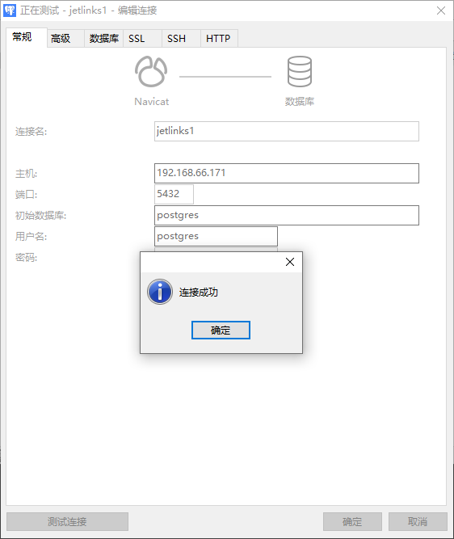

# 中间件部署及常见问题
本文档部署环境为Centos7，提供了两种部署中间件方法分别为离线包部署和docker部署，可根据实际情况选择对应的部署方式。


## 问题指引
<table>
   <tr>
       <td><a href="/dev-guide/middleware-deploy.html#redis安装时make编译报错">redis安装时make编译报错</a></td>
       <td><a href="/dev-guide/middleware-deploy.html#项目启动报错es权限不足">项目启动报错es权限不足</a></td>
   </tr>
   <tr>
       <td><a href="/dev-guide/middleware-deploy.html#es最大同时打开文件数太少">es最大同时打开文件数太少</a></td>
       <td><a href="/dev-guide/middleware-deploy.html#es最大线程个数太少">es最大线程个数太少</a></td>
   </tr>
</table>

## 文档指引
<table>
   <tr>
       <td><a href="/dev-guide/middleware-deploy.html#离线包部署">离线包部署</a></td>
       <td><a href="/dev-guide/middleware-deploy.html#docker部署">docker部署</a></td>
   </tr>
</table>

### 版本说明
| 中间件 | 版本号 |  是否必装 | 下载地址 |
|----------------|-----|-----|--------|---------------------------|
| Redis |5.0.4   | 是   |<a href='http://www.redis.cn/download.html'>点击下载</a>  |
| JDK |1.8.0_341 | 是   |<a href='https://www.oracle.com/java/technologies/downloads/#java8'>点击下载</a> |
| ElasticSearch |6.8.11  | 是   |<a href='https://artifacts.elastic.co/downloads/elasticsearch/elasticsearch-6.8.11.tar.gz'>点击下载</a> |
| Kibana |6.8.11  | 否   |<a href='https://artifacts.elastic.co/downloads/kibana/kibana-6.8.11-linux-x86_64.tar.gz'>点击下载</a> |
| PostgreSQL |11.12  | 是   |<a href='https://www.postgresql.org/ftp/source'>点击下载</a> |


### 离线包方式部署
#### 部署Redis
1. 上传离线包至服务器`/usr/local`目录下。

2. 使用`cd /usr/local`命令进入该目录，使用`tar -xzvf redis-5.0.4.tar.gz`命令进行解压，解压完成之后会生成`redis-5.0.4`文件夹。

3. 安装相应编译器及开发包
```shell
  yum -y install gcc-c++
  yum install zlib-devel
  yum -y install readline-devel
```

4. 安装Redis
```shell
   cd ./redis-5.0.4
   make
   #PREFIX参数表示指定安装路径
   make install PREFIX=/usr/local/redis 
```
5. 将原有的配置文件复制一份到新目录
 ```shell
cp /usr/local/redis-5.0.4/redis.conf /usr/local/redis/bin/
 ```
6. 修改`redis.config`文件
   修改以下参数：
```shell
#注释掉，只允许来自指定网卡的Redis请求。如果没有指定，就说明可以接受来自任意一个网卡的Redis请求
bind 127.0.0.1 --> 改成 #bind 127.0.0.1
#是否允许后台运行
daemonize no -- > 改成 daemonize yes 
#关闭保护模式
protected-mode yes  -- > 改成 protected-mode no
```
<div class='explanation error'>
  <p class='explanation-title-warp'>
    <span class='iconfont icon-jinggao explanation-icon'></span>
    <span class='explanation-title font-weight'>危险</span>
  </p>

protected-mode no 表示关闭保护模式，不建议在生产环境关闭保护模式</br>
保护模式的生效条件：保护模式已打开且未指定bind且未指定密码,例如：

```shell
protected-mode yes // 打开保护模式
#bind 127.0.0.1 //不绑定任何网络接口
#requirepass xiaoyi //不设置密码 
```

</div>


7. 启动Redis
```shell
/usr/local/redis/bin/redis-server /usr/local/redis/bin/redis.conf
```

8. 查看Redis是否启动`ps -ef|grep redis`

```shell
root@localhost bin]#  ps -ef|grep redis  
root      34853  0.1  0.0 153984  7628 ?        Ssl  18:19   0:00 /usr/local/bin/redis-server 127.0.0.1:6379
root      35139  0.0  0.0 112824   976 pts/2    S+   18:24   0:00 grep --color=auto redis
```

9. 防火墙开放端口<br/>
```shell
firewall-cmd --zone=public --add-port=6379/tcp --permanent
firewall-cmd --reload
```


```shell
gcc -v                                              #查看gcc版本
yum install -y centos-release-scl scl-utils-build   #安装scl 源
yum -y install devtoolset-9-gcc*                    #安装9版本的 gcc gcc-c++ gdb 
scl enable devtoolset-9 bash                        #临时覆盖系统原有的gcc 引用
gcc -v                                              #查看gcc版本
```


#### 部署JDK

<div class='explanation primary'>
  <p class='explanation-title-warp'>
    <span class='iconfont icon-bangzhu explanation-icon'></span>
    <span class='explanation-title font-weight'>说明</span>
  </p>
Elasticsearch是基于Java开发是一个Java程序，运行在Jvm中，所以第一步要安装JDK
</div>

1. 上传离线包至服务器`/usr/local`目录下
2. 进入该目录，使用`tar -xzvf jdk-8u341-linux-x64.tar.gz`命令进行解压，解压完成之后会生成`jdk1.8.0_341`文件夹
3. 设置环境变量，使用`vi /etc/profile`命令进入文件，在文件末尾添加以下内容
```shell
export JAVA_HOME=/usr/local/jdk1.8.0_341 #JDK所在路径
export JRE_HOME=${JAVA_HOME}/jre
export CLASSPATH=.:${JAVA_HOME}/lib:${JRE_HOME}/lib
export PATH=${JAVA_HOME}/bin:$PATH
```
4. 使用`source /etc/profile`命令，使环境变量生效
5. 查看是否安装成功 `java -version`
```shell
[root@localhost local]# java -version
java version "1.8.0_341"
Java(TM) SE Runtime Environment (build 1.8.0_341-b10)
Java HotSpot(TM) 64-Bit Server VM (build 25.341-b10, mixed mode)
```


#### 部署ElasticSearch
1. 上传离线包至服务器`/usr/local`目录下

2. 进入该目录，使用`tar -xzvf elasticsearch-6.8.11.tar.gz`命令进行解压，解压完成之后会生成`elasticsearch-6.8.11`文件夹
3. 修改es配置文件 `vi /usr/local/elasticsearch-6.8.11/config/elasticsearch.yml`
```
# 绑定本机IP地址或直接设置为0.0.0.0
#network.host: 192.168.0.1 --> 改成 network.host: 0.0.0.0
#http.port: 9200 --> 改成 http.port: 9200
```

4. 修改jvm参数，`vi /usr/local/elasticsearch-6.8.11/config/jvm.options`
```shell
## JVM configuration

####################################################
## IMPORTANT: JVM heap size
####################################################
##
## You should always set the min and max JVM heap
## size to the same value. For example, to set
## the heap to 4 GB, set:
##
## -Xms4g
## -Xmx4g
##
## See https://www.elastic.co/guide/en/elasticsearch/reference/current/heap-size.html
## for more information
##
####################################################

# Xms represents the initial size of total heap space
# Xmx represents the maximum size of total heap space

# 修改这里的配置，根据自身配置的内存大小进行分配，最大为32g
-Xms1g 
-Xmx1g 
```
5.  创建es用户

创建用户组：`groupadd es`<br/>
创建用户并添加至用户组：`useradd es -g es` <br/>

<div class='explanation primary'>
  <p class='explanation-title-warp'>
    <span class='iconfont icon-bangzhu explanation-icon'></span>
    <span class='explanation-title font-weight'>说明</span>
  </p>
 Elasticsearch默认是不允许在root用户下进行安装的，在安装之前，应创建一个用户
</div>

7. 切换到es用户`su es`，进入bin目录`cd /usr/local/elasticsearch-6.8.11/bin/`
8. 启动es`./elasticsearch`
9. 防火墙开放端口<br/>
```shell
firewall-cmd --zone=public --add-port=9200/tcp --permanent
firewall-cmd --reload
```
10. 在浏览器输入`IP地址：9200`来验证elasticsearch是否配置成功，若出现以下字样说明配置成功
```shell
{
  "name" : "3CBfLD\_",
  "cluster\_name" : "elasticsearch",
  "cluster\_uuid" : "Hszg4mFkRuugIAN0golMNw",
  "version" : {
    "number" : "6.8.11",
    "build\_flavor" : "default",
    "build\_type" : "tar",
    "build\_hash" : "00bf386",
    "build\_date" : "2020-07-09T19:08:08.940669Z",
    "build\_snapshot" : false,
    "lucene\_version" : "7.7.3",
    "minimum\_wire\_compatibility\_version" : "5.6.0",
    "minimum\_index\_compatibility\_version" : "5.0.0"
  },
  "tagline" : "You Know, for Search"
}
```


#### 部署Kibana
1. 上传离线包至服务器`/usr/local`目录下
2. 使用`cd /usr/local`命令进入该目录，使用`tar -xzvf kibana-6.8.11.tar.gz`命令进行解压，解压完成之后会生成`kibana-6.8.11-linux-x86_64`文件夹
3. 给es用户授权
```shell
chown -R es:es /usr/local/kibana-6.8.11-linux-x86_64
```
4. 修改配置文件`vi /usr/local/kibana-6.8.11-linux-x86_64/config/kibana.yml`,修改内容如下
```shell
server.port: 5601
server.host: "0.0.0.0"
#修改为自己es的端口
elasticsearch.url: "http://localhost:9200"
```
5. 启动kibana
```shell
#切换到es用户
su es
#进入bin目录
cd /usr/local/kibana-6.8.11-linux-x86_64/bin
#启动kibana
./kibana
```
6. 防火墙开放端口<br/>
```shell
firewall-cmd --zone=public --add-port=5601/tcp --permanent
firewall-cmd --reload
```

7. 验证是否配置成功，在浏览器输入`服务器ip地址：端口号`，例如192.168.166.134:5601，如果能够加载出kibanna页面即为配置成功


#### 部署PostgreSQL
1. 上传离线包至服务器`/usr/local`目录下
2. 使用`cd /usr/local`命令进入该目录，使用`# tar -xzvf postgresql-11.12.tar.gz`命令进行解压，解压完成之后会生成`postgresql-11.12`文件夹
3. 安装PostgreSQL <br/>
```shell
cd ./postgresql-11.12
#PREFIX参数表示指定安装路径
./configure --prefix=/usr/local/postgresql
make && make install
```

4. 创建目录`data`<br/>
```shell
mkdir /usr/local/postgresql/data
```
5. 加入系统环境变量`vi /etc/profile`<br/>
   在文件最后写入如下内容：<br/>
```shell
PGHOME=/usr/local/postgresql
export PGHOME
PGDATA=/usr/local/postgresql/data
export PGDATA
PATH=$PATH:$HOME/.local/bin:$HOME/bin:$PGHOME/bin
export PATH
```
使配置文件生效`source /etc/profile`<br/>

6. 增加用户`postgres`并赋权<br/>
```shell
adduser postgres
chown -R postgres:root /usr/local/postgresql/
```


7. 初始化数据库<br/>
```shell
#切换到postgres用户
su postgres
/usr/local/postgresql/bin/initdb -D /usr/local/postgresql/data/
```

8. 修改配置文件
   `vi /usr/local/postgresql/data/postgresql.conf`,修改参数如下：<br/>
```shell
listen_addresses = '*'
port = 5432
```

9. 修改配置文件`vi /usr/local/postgresql/data/pg_hba.conf`,在文件末尾添加如下参数：<br/>

```shell
  # 在 IPv4 local connections 区域中添加如下一行 ：
  host    all             all             0.0.0.0/0            trust
```

<div class='explanation error'>
  <p class='explanation-title-warp'>
    <span class='iconfont icon-jinggao explanation-icon'></span>
    <span class='explanation-title font-weight'>危险</span>
  </p>

trust表示使用数据库和用户名就能登录，安全性低建议不要在生产环境中使用，生产环境建使用password或md5。

</div>

9. 启动数据库`pg_ctl start -l /usr/local/postgresql/log/pg_server.log`
```shell
[postgres@localhost postgresql-10.11]$ pg_ctl start -l /usr/local/postgresql/log/pg_server.log
waiting for server to start.... done
server started
```

10. 防火墙开放端口<br/>
```shell
firewall-cmd --zone=public --add-port=5432/tcp --permanent
firewall-cmd --reload
```
11. 验证部署是否成功,使用第三方工具测试连接
    


#### docker部署

<div class='explanation info'>
  <p class='explanation-title-warp'> 
    <span class='iconfont icon-tishi explanation-icon'></span>
    <span class='explanation-title font-weight'>提示</span>
  </p>
<p>JetLinks提供了很多中间件docker部署的配置文件，下方的表格提供了中间件配置文件的路径地址，可根据实际需求选择对应中间件部署</p>
</div>

| 中间件 | 是否必须部署 | 文件位置 |
|----------------| -------------------------- |--------|---------------------------|
| Redis | 是 |jetlinks-pro/docker-compose.yml|
| ElasticSearch| 是 |jetlinks-pro/docker-compose.yml|
| Kibana| 是 |jetlinks-pro/docker-compose.yml|
| PostgreSQL| 是 |jetlinks-pro/docker-compose.yml|
| ClickHouse| 否 |jetlinks-pro/jetlinks-components/clickhouse-component/docker-compose.yml|
| Cassandra| 否 |jetlinks-pro/jetlinks-components/cassandra-component/docker-compose.yml|
| InfluxDB| 否 |jetlinks-pro/jetlinks-components/influxdb-component/docker-compose.yml|
| TDengine| 否 |jetlinks-pro/jetlinks-components/tdengine-component/docker-compose.yml|
| ZLMediaKit| 否 |jetlinks-pro/expands-components/jetlinks-media/zlm/docker-compose.yml|
| Kafka| 否 |jetlinks-pro/expands-components/messaging-component/kafka-component/docker-compose.yml|
| RabbitMQ| 否 |jetlinks-pro/expands-components/messaging-component/rabbitmq-component/docker-compose.yml|


#### 配置文件说明

```shell
version: '2'
services:
  redis:
    #镜像名
    image: redis:5.0.4
    #容器名
    container_name: jetlinks-redis
    #端口号
    ports:
      - "6379:6379"
    #卷挂载
    volumes:
      - "./data/redis:/data"
    #开启redis持久化
    command: redis-server --appendonly yes
    #docker容器时区
    environment:
      - TZ=Asia/Shanghai
  elasticsearch:
    image: elasticsearch:6.8.10
    container_name: jetlinks-elasticsearch
    environment:
      #jvm参数
      ES_JAVA_OPTS: -Djava.net.preferIPv4Stack=true -Xms1g -Xmx1g
      #对外暴露的host
      transport.host: 0.0.0.0
      #单节点
      discovery.type: single-node
      #锁定物理内存地址，防止es内存频繁交换，导致IOPS变高
      bootstrap.memory_lock: "true"
      #抑制脑裂参数
      discovery.zen.minimum_master_nodes: 1
      #单播节点
      discovery.zen.ping.unicast.hosts: elasticsearch
      TZ: Asia/Shanghai
#    volumes:
#      - ./data/elasticsearch:/usr/share/elasticsearch/data
    ports:
      - "9200:9200"
      - "9300:9300"
  kibana:
    image: kibana:6.8.10
    container_name: jetlinks-kibana
    environment:
      ELASTICSEARCH_URL: http://elasticsearch:9200
      TZ: Asia/Shanghai
    links:
      - elasticsearch:elasticsearch
    ports:
      - "5601:5601"
    depends_on:
      - elasticsearch
  postgres:
    image: postgres:11-alpine
    container_name: jetlinks-postgres
    ports:
      - "5432:5432"
    volumes:
      - "./data/postgres:/var/lib/postgresql/data"
    environment:
      #数据库密码
      POSTGRES_PASSWORD: jetlinks
      #数据库名
      POSTGRES_DB: jetlinks
      TZ: Asia/Shanghai
```
#### 创建并运行容器

1. 将`docker-compose.yml`文件上传到服务器`/usr/local`目录下，进入该目录`cd ./usr/local`

2. 使用`docker-compose up -d`命令创建并运行容器

```shell

[root@localhost docker-compose]# docker-compose up -d
[+] Running 6/6
Container jetlinks-postgres       Started                                       1.0s
Container jetlinks-redis          Started                                       1.0s
Container jetlinks-elasticsearch  Started                                       0.9s                                                                
Container jetlinks-kibana         Started                                       6.4s       
         
```

3. 查看是否创建/运行成功 `docker ps -a`

```shell

[root@localhost docker-compose]# docker ps -a
CONTAINER ID   IMAGE                               COMMAND                  CREATED          STATUS          PORTS                                                                                                                                                                     NAMES
045b6c06cf81   kibana:6.8.11                 "/usr/local/bin/kiba…"   35 seconds ago      Up 32 seconds   0.0.0.0:5601->5601/tcp, :::5601->5601/tcp                                                                                                                              jetlinks-ce-kibana
0399d3741730   redis:5.0.4                   "docker-entrypoint.s…"   35 seconds ago      Up 34 seconds   0.0.0.0:6379->6379/tcp, :::6379->6379/tcp                                                                                                                              jetlinks-ce-redis
aeaf46fe55c0   elasticsearch:6.8.11          "/usr/local/bin/dock…"   35 seconds ago      Up 34 seconds   0.0.0.0:9200->9200/tcp, :::9200->9200/tcp, 0.0.0.0:9300->9300/tcp, :::9300->9300/tcp                                                                                   jetlinks-ce-elasticsearch
6af987ad063d   postgres:11-alpine            "docker-entrypoint.s…"   35 seconds ago      Up 34 seconds   0.0.0.0:5432->5432/tcp, :::5432->5432/tcp                                                                                                                              jetlinks-ce-postgres

```
#### redis安装时make编译报错
<div class='explanation warning'>
  <p class='explanation-title-warp'>
    <span class='iconfont icon-bangzhu explanation-icon'></span>
    <span class='explanation-title font-weight'>问题1</span>
  </p>
Q：若redis版本为6.0以上会出现，gcc版本和redis版本不符合的问题,在使用make编译的时候会报错
A：CentOS7默认安装的是4.8.5，而redis6.0只支持5.3以上版本，这里将gcc升级到9，安装指令如下
</div>


#### 项目启动报错es权限不足
<div class='explanation warning'>
  <p class='explanation-title-warp'>
    <span class='iconfont icon-bangzhu explanation-icon'></span>
    <span class='explanation-title font-weight'>问题2</span>
  </p>
Q：启动项目源码报错,访问权限不足,报错内容如下：

```shell
Exception in thread "main" java.nio.file.AccessDeniedException: /usr/local/elasticsearch-6.8.11/config/jvm.options
	at sun.nio.fs.UnixException.translateToIOException(UnixException.java:84)
	at sun.nio.fs.UnixException.rethrowAsIOException(UnixException.java:102)
	at sun.nio.fs.UnixException.rethrowAsIOException(UnixException.java:107)
	at sun.nio.fs.UnixFileSystemProvider.newByteChannel(UnixFileSystemProvider.java:214)
	at java.nio.file.Files.newByteChannel(Files.java:361)
	at java.nio.file.Files.newByteChannel(Files.java:407)
	at java.nio.file.spi.FileSystemProvider.newInputStream(FileSystemProvider.java:384)
	at java.nio.file.Files.newInputStream(Files.java:152)
	at org.elasticsearch.tools.launchers.JvmOptionsParser.main(JvmOptionsParser.java:60)
```

A：使用`chown \-R es:es /usr/local/elasticsearch\-6.8.11`命令进行赋权(切换到root用户操作)

</div>


#### es最大同时打开文件数太少 


<div class='explanation warning'>
  <p class='explanation-title-warp'>
    <span class='iconfont icon-bangzhu explanation-icon'></span>
    <span class='explanation-title font-weight'>问题3</span>
  </p>

Q：es最大同时打开文件数太少
```shell
[1]: max file descriptors [4096] for elasticsearch process is too low, increase to at least [65535]
```


A：`vi /etc/security/limits.conf`，在limits.conf文件中新增以下参数

```shell

#*               soft    core            0
#*               hard    rss             10000
#@student        hard    nproc           20
#@faculty        soft    nproc           20
#@faculty        hard    nproc           50
#ftp             hard    nproc           0
#@student        -       maxlogins       4
#下面两行为添加内容
*            soft    nofile          65536
*            hard    nofile          65536
# End of file

```

</div>

#### es最大线程个数太少


<div class='explanation warning'>
  <p class='explanation-title-warp'>
    <span class='iconfont icon-bangzhu explanation-icon'></span>
    <span class='explanation-title font-weight'>问题3</span>
  </p>
Q：es最大线程个数太少

```shell
[2]: max virtual memory areas vm.max_map_count [65530] is too low, increase to at least [262144]
```


A：`vi /etc/sysctl.conf`，在sysctl.con文件末尾新增`vm.max_map_count=262144`参数<br/>

```shell

# sysctl settings are defined through files in
# /usr/lib/sysctl.d/, /run/sysctl.d/, and /etc/sysctl.d/.
#
# Vendors settings live in /usr/lib/sysctl.d/.
# To override a whole file, create a new file with the same in
# /etc/sysctl.d/ and put new settings there. To override
# only specific settings, add a file with a lexically later
# name in /etc/sysctl.d/ and put new settings there.
#
# For more information, see sysctl.conf(5) and sysctl.d(5).

vm.max_map_count=262144

```
 新增完成之后使用`sysctl -p`命令使配置生效

 </div>