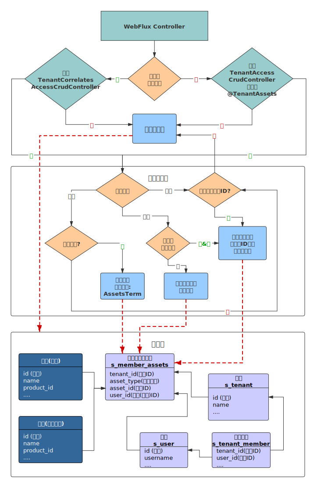

# 多租户

在企业版`1.3`版本中增加了多租户管理功能,能实现细粒度的基于多租户的权限控制.
使用中间表方式来实现租户数据隔离（共享程度最高、隔离级别最低）,最大限度降低对现有功能的侵入.控制租户数据权限仅需要在`Controller`上注解
或者少量的编程即可实现. 


## 典型场景

1. 不同部门只能管理自己部门下的数据.
2. 同一个租户下,不同成员对同一个资产有不同的操作权限.
3. 给OpenAPI划分租户,控制数据访问权限.

## 名词说明

租户: 租户指使用系统的组织,如: 厂商,企业部门等. 

资产类型: 系统内的各个资源即资产,如: 产品,设备,规则配置等.

资产: 资产类型下某个具体的数据则为租户的资产,资产最终需要绑定到成员,成员则有对应资产的操作权限.

间接资产: 与另外的资产进行间接绑定的数据,如: 网关设备,设备固件等.

成员: 具体使用系统的用户,一个租户下可以有多个成员,不同的成员可以有不同的权限.
成员类型分为管理员和普通成员,管理员可以管理租户下所有成员的资产.其他成员只能管理分配给自己的资产.

## 权限控制



在多租户模块`jetlinks-components/tenant-component`中提供了获取当前登录的租户成员信息的接口:`TenantMember`.
可通过此接口获取租户成员信息以及判断租户的资产权限.

例:

```java

public Flux<MyData> getTenantData(){
 return TenantMember
        .current()
        .flatMapMany(member->{
            return this.service.findTenantData(member.getTenant().getId());
        });
}

```

更多API请查看`TenantMember`接口定义.

::: tip 注意
当前用户没有绑定租户信息时,会忽略租户权限控制.
:::

### 声明式控制

在`Controller`上添加注解`@TenantAssets(type="资产类型ID")` (推荐使用`注解继承`的方式,参照:`@DeviceAsset`).
如果之前使用了通用增删改查(`ReactiveServiceCrudController`).则需要重新实现接口:`TenantAccessCrudController`.

如果类上和方法上都有注解,会合并注解. 如果想要关闭控制,注解:`@TenantAssets(ignore=true)`即可

例:

```java
@RestController
@RequestMapping("/device/instance")
@DeviceAsset //使用注解继承了@TenantAssets
public class DeviceInstanceController implements TenantAccessCrudController<DeviceInstanceEntity, String> {
 
}

```

约束:

1. 如果当前不是动态查询,则会默认第一个参数作为资产ID进行权限控制,支持`reactor`类型参数.
2. 如果参数是对象时,需要设置注解属性:`@TenantAssets(assetObjectIndex = 参数索引 ,property="id")`,将获取对象中的id属性作为资产ID进行权限控制.支持`reactor`类型参数

::: tip 注意
以上方式仅适用直接与租户成员绑定的资产数据.
:::

关联资产权限控制.

例:

```java
@RestController
@RequestMapping("/firmware")
@Resource(id = "firmware-manager", name = "固件管理")
public class FirmwareController implements TenantCorrelatesAccessCrudController<FirmwareEntity, String> {
 
    @Nonnull
    @Override
    public AssetType getAssetType() {//关联的资产类型
        return DeviceAssetType.product;
    }

    @Nonnull
    @Override
    public Function<FirmwareEntity, ?> getAssetIdMapper() {
        //关联资产ID映射器
        return FirmwareEntity::getProductId;
    }

    @Nonnull
    @Override
    public String getAssetProperty() {
        //关联字段
        return "productId";
    }
}

```

### 编程式控制

`TenantMember`提供了判断资产权限的接口.

例:

```java

    @PostMapping("/{gatewayId}/bind/{deviceId}")
    @SaveAction
    @DeviceAsset
    public Mono<GatewayDeviceInfo> bindDevice(@PathVariable String gatewayId,
                                              @PathVariable String deviceId) {
        return TenantMember
            .assertPermission(
                Flux.just(gatewayId, deviceId), //资产列表
                DeviceAssetType.device, //资产类型
                Function.identity() //资产列表转换为资产ID
            )
            //验证通过后的逻辑
            .then(service.doBind(gatewayId,deviceId));
    }

```

