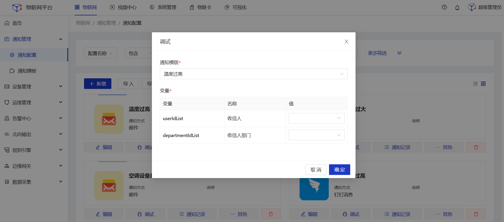

# 通知配置

## 应用场景

  

    
    说明
  

    配置适合业务系统的通知方式，可在场景联动的执行动作中被引用，也可通过统一的接口发送短信、邮件、微信消息、钉钉消息等消息通知。

## 指导介绍

  
1. <a href="/dev-guide/notification-config.html#通知方式">通知方式</a> 

  
2. <a href="/dev-guide/notification-config.html#新增配置">新增配置</a> 

  
3. <a href="/dev-guide/notification-config.html#配置参数说明">配置参数说明</a>

  
4. <a href="/dev-guide/notification-config.html#编辑配置">编辑配置</a>

  
5. <a href="/dev-guide/notification-config.html#调试配置">调试配置</a>
 
  
6. <a href="/dev-guide/notification-config.html#同步用户">同步用户</a>

## 通知方式

| 通知方式 | 类型                                         |
| -------- | -------------------------------------------- |
| 钉钉     | 钉钉消息群 机器人消息                     |
| 微信     | 企业消息                                     |
| 邮件     | 内置163、126、qq等类型 自定义其他邮件类型 |
| 语音     | 阿里云语音                                   |
| 短信     | 阿里云短信                                   |
| Webhook  | 自定义Webhook地址                            |

## 新增配置

1.<b>登录</b>Jetlinks物联网平台。 
2.在左侧导航栏，选择<b>通知管理>通知配置</b>，进入卡片页。

3.点击<b>新增</b>按钮，在详情页中填写通知配置信息，然后点击<b>保存</b>。

## 配置参数说明

#### 钉钉通知配置

| 参数      | 说明                                                         |
| --------- | ------------------------------------------------------------ |
| 名称      | 为通知模板命名，最多可输入64个字符                           |
| 类型      | 定义通知类型，根据类型的不同展示关联的配置参数项。现支持钉钉消息和群机器人消息。使用钉钉群机器人消息通知时需在钉钉开放平台中创建好对应的机器人，再到钉钉客户端对应的群中绑定智能机器人。 |
| AppKey    | 企业内部应用的唯一身份标识。在钉钉开发者后台创建企业内部应用后，系统会自动生成一对AppKey和AppSecret。获取路径：“钉钉开放平台”--“应用开发”--“应用信息” |
| AppSecret | 钉钉应用对应的调用密钥，获取路径：“钉钉开放平台”--“应用开发”--“应用信息” |

#### 微信通知配置

| 参数       | 说明                                                         |
| ---------- | ------------------------------------------------------------ |
| 名称       | 为通知模板名称，最多可输入64个字符。                         |
| 类型       | 定义通知类型，现只支持企业消息。                             |
| corpId     | 企业号的唯一专属编号。获取路径：“企业微信”管理后台--“我的企业”--“企业ID” |
| corpSecret | 应用的唯一secret,一个企业微信中可以有多个corpSecret。获取路径：“企业微信”--“应用与小程序”--“自建应用”中获取 |

#### 邮件通知配置

| 参数       | 说明                                                         |
| ---------- | ------------------------------------------------------------ |
| 名称       | 为通知模板命名，最多可输入64个字符                           |
| 服务器地址 | 下拉可选择国内常用的邮箱服务配置，也支持手动输入其他地址。系统使用POP协议。POP允许电子邮件客户端下载服务器上的邮件，但是您在电子邮件客户端的操作（如：移动邮件、标记已读等），这时不会反馈到服务器上。 |
| 发件人     | 用于发送邮件时“发件人“信息的显示                             |
| 用户名     | 登录邮箱时的账号，用该账号进行发送邮件。                     |
| 密码       | 如果为邮箱，则需要在163邮箱页面设置->开启POP3/SMTP服务，配置授权密码并使用 |
| 说明       | 通知配置备注说明信息，非必填。                               |

#### 语音通知配置

| 参数        | 说明                                                         |
| ----------- | ------------------------------------------------------------ |
| 名称        | 为通知模板命名，最多可输入64个字符。                         |
| 类型        | 定义通知类型，现支持阿里云语音。                             |
| RegionId    | 阿里云服务地域与对应的RegionID。请根据购买的阿里云服务器地域进行选择。 |
| AccessKeyId | 用于程序通知方式调用云服务费API的用户标识和秘钥获取路径：“阿里云管理控制台”--“用户头像”--“”--“AccessKey管理”--“查看” |
| Secret      | 阿里云内部分配的secret。                                     |
| 说明        | 通知配置备注说明信息，非必填。                               |

#### 短信通知配置

| 参数        | 说明                                                         |
| ----------- | ------------------------------------------------------------ |
| 名称        | 为通知模板命名，最多可输入64个字符。                         |
| 类型        | 定义通知类型，现支持阿里云语音。                             |
| RegionId    | 阿里云内部给每台机器设置的唯一编号。请根据购买的阿里云服务器地址进行填写。阿里云地域和可用区对照表地址：https://help.aliyun.com/document_detail/40654.html?spm=a2c6h.13066369.0.0.54a174710O7rWH |
| AccessKeyId | 用于程序通知方式调用云服务费API的用户标识和秘钥。获取路径：“阿里云管理控制台”--“用户头像”--“”--“AccessKey管理”--“查看” |
| Secret      | 阿里云内部分配的secret。                                     |
| 说明        | 通知配置备注说明信息，非必填。                               |

#### Webhook通知配置

| 参数    | 说明                                                         |
| ------- | ------------------------------------------------------------ |
| 名称    | 为通知模板命名，最多可输入64个字符。                         |
| 类型    | 定义通知类型，现支持Webhook。                                |
| Webhook | Webhook地址。                                                |
| 请求头  | 支持根据系统提供的接口设置不同的请求头。如 Accept-Language 、Content-Type |
| 说明    | 通知模板备注说明信息，非必填。                               |

## 编辑配置

1.<b>登录</b>Jetlinks物联网平台。 
2.在左侧导航栏，选择<b>通知管理>通知配置</b>，进入卡片页。 
3.点击具体数据的<b>编辑</b>按钮，在详情页中编辑通知配置信息，然后点击<b>保存</b>。

4.在详情页中编辑通知配置信息，然后点击<b>保存</b>。

## 调试配置

1.<b>登录</b>Jetlinks物联网平台。 
2.在左侧导航栏，选择<b>通知管理>通知配置</b>，进入卡片页。 
3.点击具体数据的<b>调试</b>按钮，在弹框中填写调试信息，然后点击<b>确定</b>。

## 删除配置

1.<b>登录</b>Jetlinks物联网平台。 
2.在左侧导航栏，选择<b>通知管理>通知配置</b>，进入卡片页。 
3.点击具体数据的<b>删除</b>按钮，然后点击<b>确定</b>。

## 同步用户

  

    
    说明
  

    

        当通知配置所选方式为<b>企业微信、钉钉消息</b>时，对应的配置卡片将出现<b>同步用户</b>按钮。该功能主要目的为将平台内的用户与钉钉、企业微信用户进行关联，实现在通知时通过选择平台内的用户、角色，即可将消息发送给关联的企业微信、钉钉用户。
    

