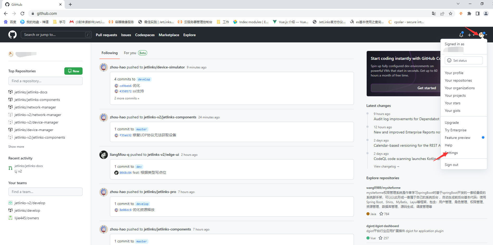
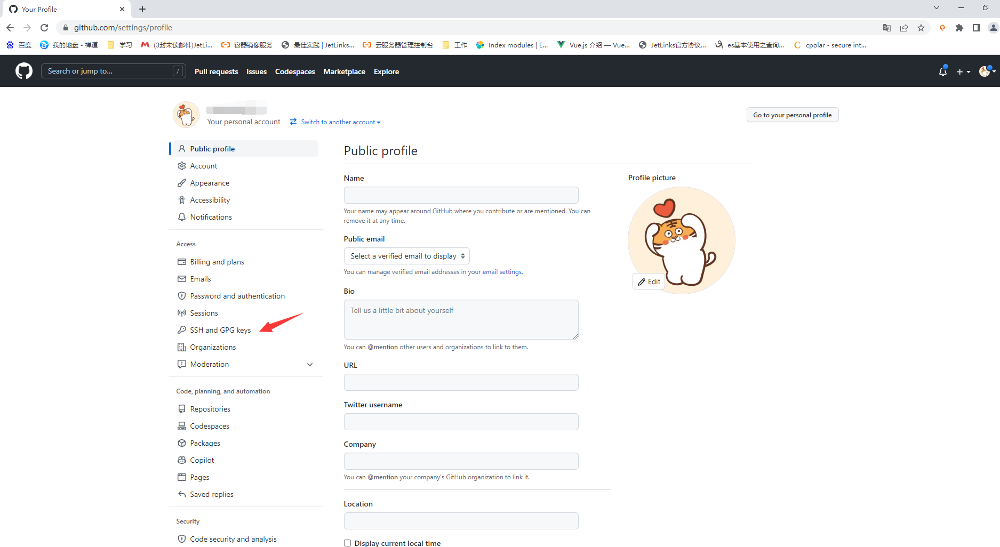
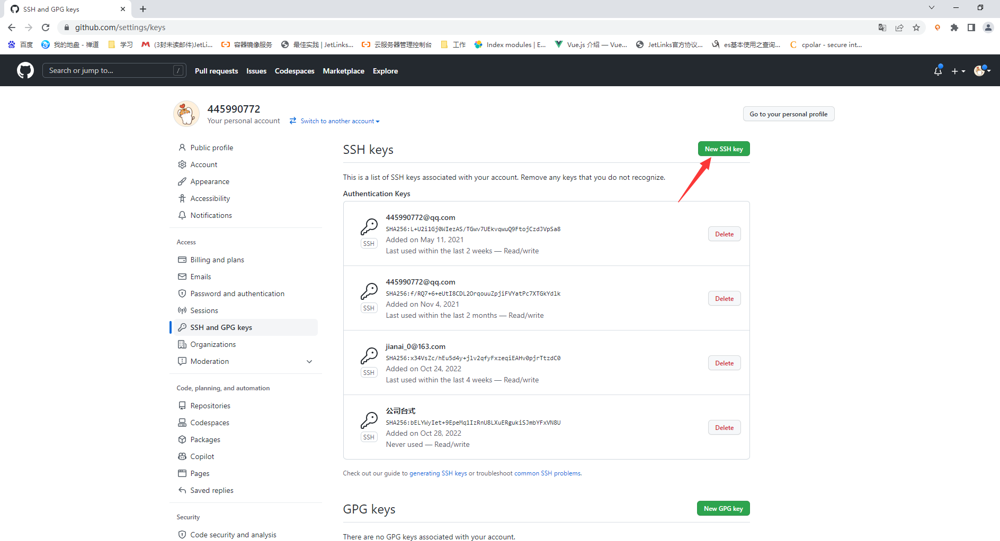
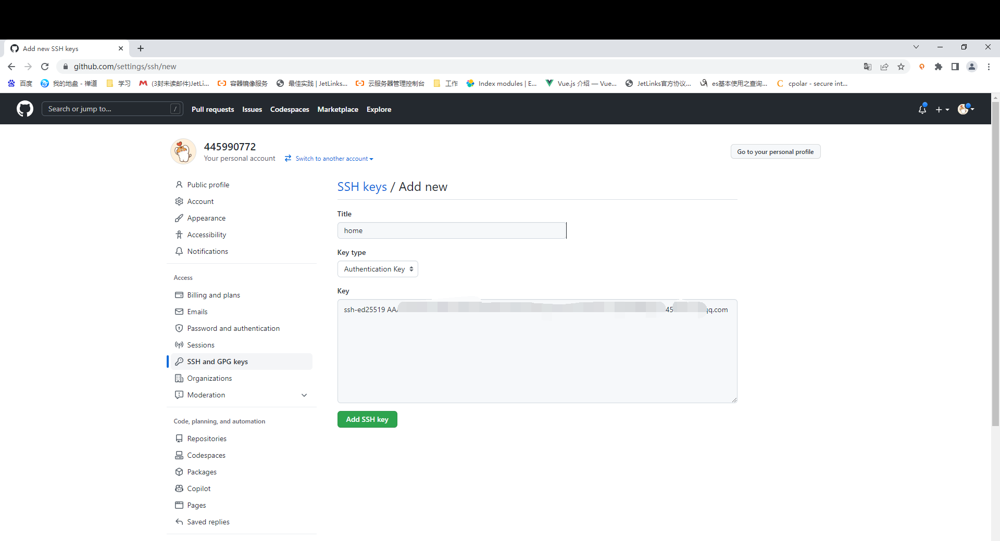
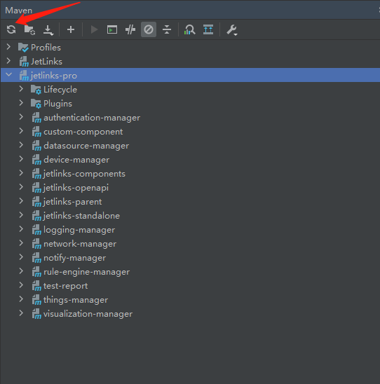
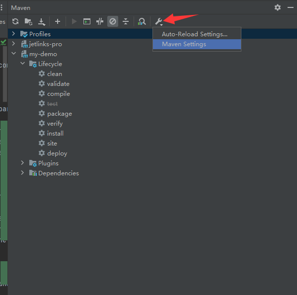
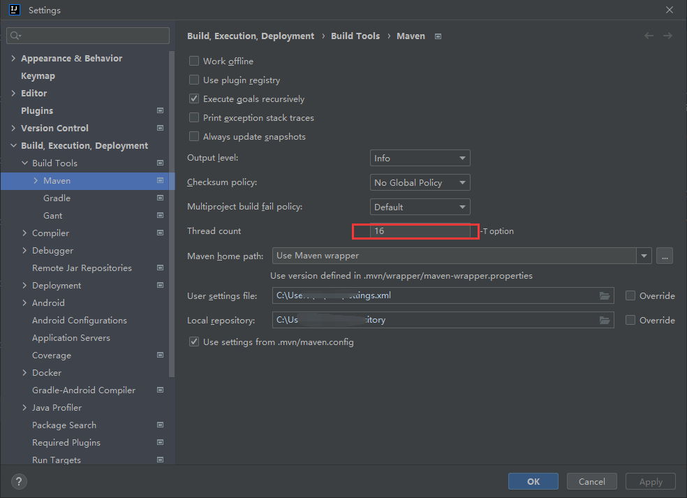

# 源码拉取及子模块更新指南

## 指导介绍

<div class='explanation primary'>
  <p class='explanation-title-warp'>
    <span class='iconfont icon-bangzhu explanation-icon'></span>
    <span class='explanation-title font-weight'>说明</span>
  </p>

  <p>1. 该指南提供首次拉取代码的用户配置SSH Key操作步骤，以及拉取代码后如何更新子模块的代码。</p>
  <p>2. 将更新后的代码提交到自己的仓库内。</p>
  <p>3. 如何更新源仓库代码并同步至自己的仓库内。</p>

</div>

## 问题指引
<table>
<tr>
    <td><a href="/dev-guide/pull-code.html#permission-denied-please-try-again">SSH配置成功后仍旧Permission denied, please try again</a></td>
    <td><a href="/dev-guide/pull-code.html#拉取代码git抛出无权限异常">拉取代码git抛出无权限异常</a></td>
</tr>
<tr>
   <td><a href="/dev-guide/pull-code.html#上传协议包抛出无法加载协议异常">上传协议包抛出无法加载协议异常</a></td>
    <td><a href="/dev-guide/pull-code.html#下载完源码后maven编译失败">下载完源码后maven编译失败</a></td>
</tr>
</table>


## 操作步骤

<div class='explanation info'>
  <p class='explanation-title-warp'>
    <span class='iconfont icon-tishi explanation-icon'></span>
    <span class='explanation-title font-weight'>说明</span>
  </p>
  <p>在2021年8月13日Github停止了对https用户名及验证码的支持，因此本文档建议您使用SSH连接的方式拉取代码。</p>

</div>

### 配置SSH Key

1. 在电脑的空闲磁盘上创建目录，并且安装Git客户端程序。

安装Git客户端程序不在此处进行详述，可自行百度搜索安装Git。

2. 登录Github，进入个人中心->`Settings`->选择`SSH and GPG keys`




3. 创建SSH key
   

在第一步新建的目录内，右键空白处弹出菜单`git bash here`，在弹出的shell控制台内执行下方命令：

该命令需要修改邮箱地址为您自己的邮箱地址。
```shell
$ ssh-keygen -t ed25519 -C "your_email@example.com"
```

示例如下:
```shell
$ ssh-keygen -t ed25519 -C "445990772@qq.com"
Generating public/private ed25519 key pair.
#回车
Enter file in which to save the key (/c/Users/LJ/.ssh/id_ed25519): 
#回车 
Enter passphrase (empty for no passphrase):
#回车
Enter same passphrase again:
# 提示生成了公钥和身份信息
Your identification has been saved in id_ed25519
Your public key has been saved in id_ed25519.pub
The key fingerprint is:
SHA256:IBctEwVoRajdZLE29buxRlpxPDW5E4z453215tgUqcTQIrUrs 445990772@qq.com
The key's randomart image is:
+--[ED25519 256]--+
|     =O*+o.+.=o. |
|    +.==.o+o+.*. |
|   +o+Oo..o.+. + |
|  . .=.=  .+ .+  |
|      E S =    . |
|         + +     |
|        . +      |
|         .       |
|                 |
|                 |
|                 |
+----[SHA256]-----+

```

<div class='explanation info'>
  <p class='explanation-title-warp'> 
    <span class='iconfont icon-tishi explanation-icon'></span>
    <span class='explanation-title font-weight'>提示</span>
  </p>
<p>注意: 如果您使用的遗留系统不支持 Ed25519算法，请使用下方命令并替换邮箱地址:</p>

```shell

$ ssh-keygen -t rsa -b 4096 -C "your_email@example.com"

```

</div>


4. 将生成的ssh key添加至github内。

创建完成后使用下方命令复制公钥内容，

```shell
$ clip < ~/.ssh/id_ed25519.pub

```

<div class='explanation info'>
  <p class='explanation-title-warp'> 
    <span class='iconfont icon-tishi explanation-icon'></span>
    <span class='explanation-title font-weight'>提示</span>
  </p>
<p>如果clip命令不起作用，您可以找到隐藏的.ssh 文件夹，隐藏的.ssh 文件夹一般在<b class='explanation-title font-weight'>C:\Users\{PC机名称}</b>目录下，
找到该目录下的<b class='explanation-title font-weight'>.pub</b>文件，复制该内容粘贴至github的添加SSH Key输入框内，如下图。</p>

</div>



5. 拉取代码

进入第一步创建的文件夹内执行拉取代码及子模块

- 拉取`jetlinks-pro`

```shell
 $ git clone -b master --recurse-submodules git@github.com:jetlinks-v2/jetlinks-pro.git
```

- 拉取`jetlinks-cloud`

```shell
 $ git clone -b master --recurse-submodules git@github.com:jetlinks-v2/jetlinks-cloud.git
```

6. 更新基础子模块

<div class='explanation info'>
  <p class='explanation-title-warp'> 
    <span class='iconfont icon-tishi explanation-icon'></span>
    <span class='explanation-title font-weight'>提示</span>
  </p>
<p>JetLinks物联网平台只包含基础模块，扩展模块添加请参考第7步，未购买扩展模块可以跳过第7步。</p>
<p>非首次拉取代码但需要更新代码时也可以使用下方命令更新全部子模块，但更新过后仍需执行<span class='explanation-title font-weight'>reimport</span>。</p>
<p>下方命令如手动复制执行，可以使用jetlinks-pro根路径下的update.sh脚本自动更新子模块代码。</p>
</div>

```shell
$ git pull && git submodule init && git submodule update && git submodule foreach git checkout master && git submodule foreach git pull origin master
```

7. 首次更新添加JetLinks扩展子模块

执行下方命令添加子模块

```shell
$ git submodule add --force [git仓库地址] [下载文件路径]
```

此处使用电信ctwing模块作为示例命令，其余模块同理:

```shell
$ git submodule add --force git@github.com:jetlinks-v2/jetlinks-ctwing.git expands-components/jetlinks-ctwing
```

其他仓库信息

| 模块名称                        | 仓库名称 | 仓库地址                            |
| ---------------------------- | ------ |---------------------------------|
| 阿里云平台接入                | jetlinks-aliyun-bridge-gateway      |  git@github.com:jetlinks-v2/jetlinks-aliyun-bridge-gateway          |
| 电信CTWing平台接入            | jetlinks-ctwing     | git@github.com:jetlinks-v2/jetlinks-ctwing.git               |
| 小度平台接入               | jetlinks-dueros      | git@github.com:jetlinks-v2/jetlinks-dueros.git                   |
| 移动OneNet平台接入              | jetlinks-onenet      | git@github.com:jetlinks-v2/jetlinks-onenet.git           |
| GBT/28181视频设备接入       | jetlinks-media      | git@github.com:jetlinks-v2/jetlinks-media.git |
| Modbus/TCP           | jetlinks-modbus      | git@github.com:jetlinks-v2/jetlinks-modbus.git                |
| OPC UA            | jetlinks-opc-ua      | git@github.com:jetlinks-v2/jetlinks-opc-ua.git                    |

8. 代码拉取完毕后`reimport`



由于首次拉取代码下载的依赖包较多请耐心等待。 下载完成后IDEA会自动进入maven编译，可以自行配置Maven多线程参数加快编译，具体线程数根据自己的电脑情况填写。




9. 扩展子模块加入Maven多模块项目

<div class='explanation info'>
  <p class='explanation-title-warp'> 
    <span class='iconfont icon-tishi explanation-icon'></span>
    <span class='explanation-title font-weight'>提示</span>
  </p>
<p>如无扩展模块，该步骤可跳过。</p>
</div>

在项目根目录下的`pom.xml`中的modules节点中添加模块

```xml

<modules>
    <module>expands-components/jetlinks-ctwing</module>
</modules>
```

#### jetlinks-pro添加子模块依赖

在启动模块(jetlinks-standalone/pom.xml)中引入依赖

```xml

<dependency>
    <groupId>org.jetlinks.pro</groupId>
    <artifactId>jetlinks-ctwing</artifactId>
    <version>${project.version}</version>
</dependency>

```

#### jetlinks-cloud添加子模块依赖

在启动模块(iot-service/pom.xml)中引入依赖

```xml

<dependency>
    <groupId>org.jetlinks.pro</groupId>
    <artifactId>jetlinks-ctwing</artifactId>
    <version>${project.version}</version>
</dependency>

```

其余模块同理。

10. 提交代码至自建仓库

```shell
$  git remote add gitee "git@gitee.com:/jetlinks-v2/$(echo ${PWD##*/}).git"
$  git submodule foreach 'git remote add gitee "git@gitee.com:/jetlinks-v2/$(echo ${PWD##*/}).git"'
$  git push gitee master
$  git submodule foreach git push gitee master 
```

11. 更新源仓库代码并同步自建仓库

查看远程仓库信息

```shell
$  git remote -v
# gitee 是上一步remote add声明的自建仓库名
gitee   git@gitee.com:/jetlinks-v2/jetlinks-v2.git (fetch)
gitee   git@gitee.com:/jetlinks-v2/jetlinks-v2.git (push)
#origin 一般是源原仓库
origin  git@github.com:jetlinks-v2/jetlinks-pro.git (fetch)
origin  git@github.com:jetlinks-v2/jetlinks-pro.git (push)

```

执行完更新子模块命令后执行下方命令同步至自建仓库

```shell
# gitee代表推送至自建仓库名为gitee的远程仓库， master为分支名
$ git push gitee master

```

## 常见问题
### Permission denied, please try again
<div class='explanation warning'>
  <p class='explanation-title-warp'>
    <span class='iconfont icon-bangzhu explanation-icon'></span>
    <span class='explanation-title font-weight'>问题1</span>
  </p>

  <p>Q：配置完SSH Key如果仍提示需要输入git@github.com‘s password，且尝试了所有密码均提示:Permission denied, please try again。</p>
  <p>A：Github官网给出的说法是：防火墙拒绝完全允许SSH连接。如果不能使用带有凭据缓存的HTTPS克隆，可以尝试使用通过HTTPS端口建立的SSH连接进行克隆。
大多数防火墙规则应该允许这样做，但是代理服务器可能会干扰。可以参照下方步骤解决该问题。</p>

</div>


1. 要测试是否可以通过 HTTPS 端口使用 SSH，请运行以下 SSH 命令。

```shell
$ ssh -T -p 443 git@ssh.github.com
> Hi USERNAME! You've successfully authenticated, but GitHub does not
> provide shell access.
```

2. 在`~/.ssh`目录下编辑或创建`config`文件，并添加下方内容。

`~/.ssh`目录在第四步的提示内有说明。

```shell
Host github.com
Hostname ssh.github.com
Port 443
User git
```

3. 在切换到端口443后第一次与 GitHub 交互时，您可能会收到一条警告消息。

此处在配置公钥过后选择`yes`即可

```shell
> The authenticity of host '[ssh.github.com]:443 ([140.82.112.36]:443)' can't be established.
> ED25519 key fingerprint is SHA256:+DiY3wvvV6TuJJhbpZisF/zLDA0zPMSvHdkr4UvCOqU.
> This host key is known by the following other names/addresses:
>     ~/.ssh/known_hosts:32: github.com
> Are you sure you want to continue connecting (yes/no/[fingerprint])?
```

4. 配置好上述内容后，执行拉取命令即可。

### 上传协议包抛出无法加载协议异常
<div class='explanation warning'>
  <p class='explanation-title-warp'>
    <span class='iconfont icon-bangzhu explanation-icon'></span>
    <span class='explanation-title font-weight'>问题2</span>
  </p>
  <p>目录名称应以英文命名，不要使用中文进行命名！</p>
  <p>使用中文命名可能会导致文件上传时，查找中文目录名称转义失败，抛出无法加载协议的异常。</p>
</div>

### 拉取代码git抛出无权限异常

<div class='explanation warning'>
  <p class='explanation-title-warp'>
    <span class='iconfont icon-bangzhu explanation-icon'></span>
    <span class='explanation-title font-weight'>问题3</span>
  </p>

  <p>Q：拉取代码的时候出现 <b class='explanation-title font-weight'> Please make sure you have the correct access rights and the repository exists</b>？</p>
  <p>A：确认是否购买该模块或者账户未被添加进仓库，请联系商务。</p>

</div>

### 下载完源码后maven编译失败
<div class='explanation warning'>
  <p class='explanation-title-warp'>
    <span class='iconfont icon-bangzhu explanation-icon'></span>
    <span class='explanation-title font-weight'>问题4</span>
  </p>

  <p>Q：Maven项目启动过程中出现jar包引入失败。</p>
  <p>A：一般是由于自行设置了配置文件的mirrors镜像加速地址，注释或者使用纯净的<b class='explanation-title font-weight'>settings.xml</b>配置文件。</p>

</div>