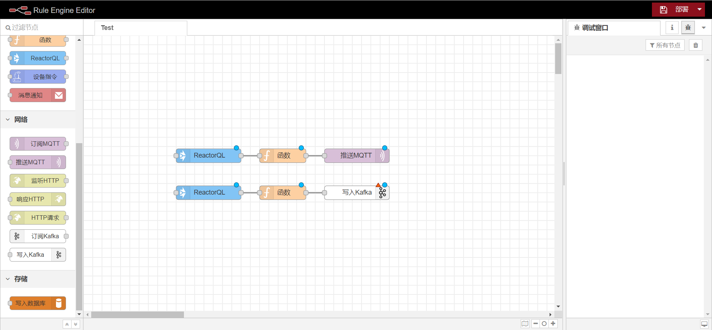
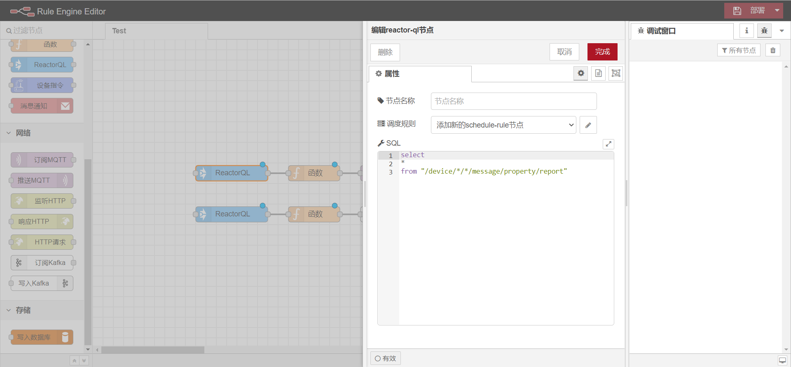
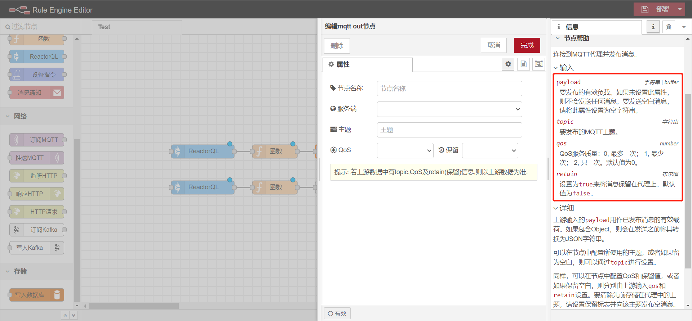
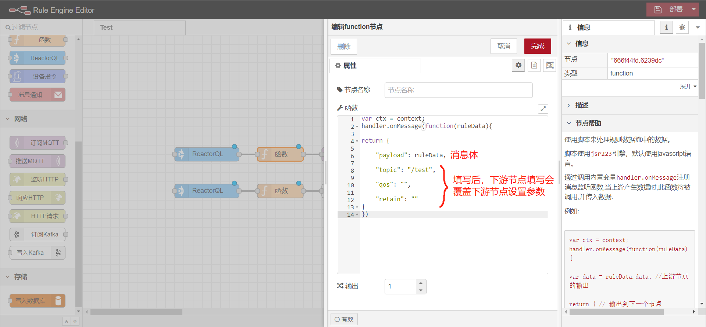
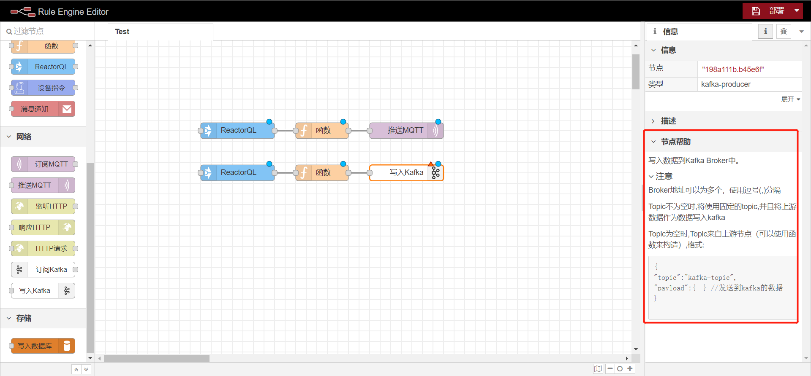

### 设备相关数据推送到消息中间件

#### 应用场景

<div class='explanation primary'>
  <p class='explanation-title-warp'>
    <span class='iconfont icon-bangzhu explanation-icon'></span>
    <span class='explanation-title font-weight'>说明</span>
  </p>设备相关数据需要对接到其他平台或者自己的业务系统，此时需要将数据推送到消息中间件，目前支持的方式有规则引擎推送以及编程式实现
</div>


**推送方式**

1.通过规则引擎推送




配置实时订阅平台设备数据




<br>


下游节点接收参数

<div class='explanation info'>
  <p class='explanation-title-warp'> 
    <span class='iconfont icon-tishi explanation-icon'></span>
    <span class='explanation-title font-weight'>提示</span>
  </p>
现规则引擎内未实现推送到rabbitmq的下游节点功能，此处只举例对MQTT与kafka进行举例<br>
</div>


**MQTT**

选择服务端，服务端需要在网络组件内配置<code>MQTT客户端</code>

<div class='explanation info'>
  <p class='explanation-title-warp'> 
    <span class='iconfont icon-tishi explanation-icon'></span>
    <span class='explanation-title font-weight'>提示</span>
  </p>
配置客户端的原因是：此处平台创建一个MQTT客户端将上游reactorQL订阅到平台消息总线内的实时数据通过客户端推送给EMQ服务，由EMQ来做数据分发，达到数据转发的目的。此时其他MQTT客户端订阅平台推送时填写的<code>{topic}</code>即可收到消息<br>
</div>




可接收的参数为上图红框圈出内容，`topic`,`qos`,`retain`参数可以在mqtt推送配置页面进行配置，而`payload`则必须由`函数(function)`节点配置。

<div class='explanation info'>
  <p class='explanation-title-warp'> 
    <span class='iconfont icon-tishi explanation-icon'></span>
    <span class='explanation-title font-weight'>提示</span>
  </p>
函数的配置需要取决于下游节点接收参数是什么？ 下游节点即与函数连接的下一个node节点。 举例：在转发方式内，函数的下游节点是订阅MQTT和写入Kafka。中间连接函数节点配置下游节点接受的参数信息来完成数据的转发。<br>
</div>




<br><br>


**写入Kafka**

订阅实时数据同上，函数配置同MQTT订阅一致

<div class='explanation info'>
  <p class='explanation-title-warp'> 
    <span class='iconfont icon-tishi explanation-icon'></span>
    <span class='explanation-title font-weight'>提示</span>
  </p>
Kafka存在集群配置，只需要在broker地址填入多个服务器地址并用逗号分隔<br>
</div>




<br>


2.通过开启配置文件的kafka和rabbitmq推送

<div class='explanation error'>
  <p class='explanation-title-warp'>
    <span class='iconfont icon-jinggao explanation-icon'></span>
    <span class='explanation-title font-weight'>危险</span>
  </p>
    producer和consumer的配置不能同时开启，否则会出现重复写入时序库内
</div>


<br>


kafka的使用

```yaml
device:
  message:
    writer:
      time-series:
        enabled: true #直接写出设备消息数据到elasticsearch        
      kafka:
        enabled: true # 推送设备消息到kafka
        consumer: true # 设置为true会从kafka订阅消息并写入到时序数据库
        topic-name: device.message
        
spring:
  kafka: # 开启了device.message.writer.kafka.enabled=true时生效
    consumer: #消費者相关配置
      client-id: ${spring.application.name}-consumer:${server.port}
      group-id: ${spring.application.name}
      max-poll-records: 1000
    producer: #生产者相关配置
      client-id: ${spring.application.name}-producer:${server.port}
      acks: 1
      retries: 3 #重试次数
    bootstrap-servers: [ "127.0.0.1:9092" ] #如果配置多个ip则为Kafka集群
```

```java
//Kafka生产者使用
@Data
public class UseProducer(){
	//此处演示为 使用注入的方式取得在application.yml中配置的kafka相关配置信息
    @Autowired
    private KafkaProperties kafkaProperties ;
    
    //创建并初始化生产者
    private KafkaProducer producer = new ReactorKafkaProducer(properties);
    
    /**
    * 此处从事件总线org.jetlinks.core.event.EventBus中订阅消息并执行注解的方法,
	* 事件总线的输出数据可以作为方法参数,如果类型不一致会自动转换。
	* 也可以通过方法参数直接获取事件总线的原始数据:org.jetlinks.core.event.TopicPayload
	* 也可以自定义消息来源之后推送到kafka
    **/
    @Subscribe(topics = "/device/**", id = "device-message-kafka-writer")
    public Mono<Void> writeDeviceMessageToTs(TopicPayload payload) {
		
        ByteBuf topic = Unpooled.wrappedBuffer(payload.getTopic().getBytes());
        DeviceMessage message = payload.decode(DeviceMessage.class);
        ByteBuf messageBuf = Unpooled.wrappedBuffer(JSON.toJSONBytes(message.toJson()));
        if (!type.match(message.getMessageType())) {
            return Mono.empty();
        }
        producer.sendAsync(SimpleMessage.of(topicName, topic, messageBuf));
        return Mono.empty();
    }
}
```


<br>


**ReactorKafkaProducer**

<div class='explanation primary'>
  <p class='explanation-title-warp'>
    <span class='iconfont icon-bangzhu explanation-icon'></span>
    <span class='explanation-title font-weight'>说明</span>
  </p>
    kafka生产者，该类实现了KafkaProducer接口，重写了send和sendAsync方法
</div>

| 方法                                 | 参数                     | 返回值       | 说明     |
| ------------------------------------ | ------------------------ | ------------ | -------- |
| `send(Publisher<Message> publisher)` | publisher - 消息流       | `Mono<Void>` | 推送消息 |
| `sendAsync(Message message)`         | message - 需要推送的消息 | 无           | 推送消息 |


<br>


```java
//Kafka消费者使用
@Data
public class UseConsumer(){
    //此处演示为 使用注入的方式取得在application.yml中配置的kafka相关配置信息
    @Autowired
    private KafkaProperties kafkaProperties ;
    
    //创建并初始化消费者,topicName为配置中的topic-name
    private KafkaConsumer consumer = new ReactorKafkaConsumer(Collections.singleton(topicName), properties);
    
    public void use(){
        //开始订阅
    	consumer.subscribe()
           //定义消息如何处理
          .flatMap(msg->doSomething(msg))
          .subscribe();
    }
}
```


<br>


**ReactorKafkaConsumer**

<div class='explanation primary'>
  <p class='explanation-title-warp'>
    <span class='iconfont icon-bangzhu explanation-icon'></span>
    <span class='explanation-title font-weight'>说明</span>
  </p>
    kafka消费者，该类实现了KafkaConsumer接口，定义其中的subscribe方法去如何订阅消息
</div>

| 方法        | 参数 | 返回值 | 说明                                                         |
| ----------- | ---- | ------ | ------------------------------------------------------------ |
| `doStart()` | 无   | 无     | 实现自KafkaConsumer接口，内部调用doStart方法进行处理，返回订阅的消息 |


<br>


rabbitmq的使用

```yaml
device:
  message:
    writer:
      time-series:
        enabled: true #直接写出设备消息数据到elasticsearch
      rabbitmq:
        enabled: true # 推送设备消息到rabbitMq
        consumer: true # 设置为true则从rabbitMQ订阅消息并写入到时序数据库
        thread-size: 4 # 消费线程数
        auto-ack: true # 自动应答,为true可能导致数据丢失，但性能最高
        topic-name: device.message # exchange名称
      
spring:
  rabbitmq: # 开启了device.message.writer.rabbitmq.enabled=true时生效
    host: localhost
    port: 5672
    username: admin
    password: jetlinks
```

```java
//rabbitMQ生产者的使用示例
@Data
public class UseProducer{
    
    //此处演示为 使用注入的方式取得在application.yml中配置的rabbitmq相关配置信息
    @Autowired
    private RabbitProperties rabbitProperties ;
    
    //生产者
    private RabbitMQProducer producer ;
    
    @PostConstruct
    public void init(){
        //根据配置创建连接工厂
        ConnectionFactory connectionFactory = RabbitUtils.createConnectionFactory(rabbitProperties);
        //指定使用异步方式
        connectionFactory.useNio();
        
        //初始化生产者
        producer = new ReactorRabbitMQProducer(connectionFactory).init();
    }
    
    /**
    * 此处从事件总线org.jetlinks.core.event.EventBus中订阅消息并执行注解的方法,
	* 事件总线的输出数据可以作为方法参数,如果类型不一致会自动转换。
	* 也可以通过方法参数直接获取事件总线的原始数据:org.jetlinks.core.event.TopicPayload
	* 也可以自定义消息来源之后推送到rabbitmq
    **/
    @Subscribe(topics = "/device/**", id = "device-message-rabbitmq-writer")
    public Mono<Void> writeDeviceMessageToTs(TopicPayload payload) {
		
        //获取设备消息
        DeviceMessage message = payload.decode(DeviceMessage.class);

        if (!type.match(message.getMessageType())) {
            return Mono.empty();
        }
        ByteBuf messageBuf = Unpooled.wrappedBuffer(JSON.toJSONBytes(message.toJson()));
        return producer
            //推送消息
            .publish(SimpleAmqpMessage.of(topicName, producerRouteKey, null, messageBuf))
            .subscribeOn(Schedulers.boundedElastic());
    }
}
```


<br>


**ReactorRabbitMQProducer**

<div class='explanation primary'>
  <p class='explanation-title-warp'>
    <span class='iconfont icon-bangzhu explanation-icon'></span>
    <span class='explanation-title font-weight'>说明</span>
  </p>
   实现了RabbitMQProducer接口，定义其中的publish方法如何去推送消息
</div>

| 方法                                                | 参数                               | 返回值       | 说明     |
| --------------------------------------------------- | ---------------------------------- | ------------ | -------- |
| `publish(Publisher<AmqpMessage> amqpMessageStream)` | amqpMessageStream - rabbitMQ消息流 | `Mono<Void>` | 推送消息 |
| `publish(AmqpMessage message)`                      | message - rabbitMQ消息             | `Mono<Void>` | 推送消息 |


<br>


```java
//rabbitMQ消费者的使用示例
@Data
public class UseConsumer{
    
    //此处演示为 使用注入的方式取得在application.yml中配置的rabbitmq相关配置信息
    @Autowired
    private RabbitProperties rabbitProperties ;
    
    //生产者
    private RabbitMQConsumer consumer;
    
    @PostConstruct
    public void init(){
        //根据配置创建连接工厂
        ConnectionFactory connectionFactory = RabbitUtils.createConnectionFactory(rabbitProperties);
        //指定使用异步方式
        connectionFactory.useNio();
        
        //初始化消费者
        this.consumer = new ReactorRabbitMQConsumer(topicName, true, connectionFactory)
             .consumerGroup(group)
             .consumerRouteKey(consumerRouteKey)
             .consumerThread(threadSize)
             .autoAck(autoAck)
             .init();
    }
    
    public void use(){
        if(this.consumer == null){
            return ;
        }
        //开始订阅
        this.consumer.subscribe()
            //将订阅到的消息进行自定义处理
            .flatMap(msg->doSomething(msg))
            .subscribe();
    }
}
```


<br>


核心类说明

**ReactorRabbitMQConsumer**

<div class='explanation primary'>
  <p class='explanation-title-warp'>
    <span class='iconfont icon-bangzhu explanation-icon'></span>
    <span class='explanation-title font-weight'>说明</span>
  </p>
   实现了RabbitMQConsumer接口，定义其中的subscribe方法去如何订阅消息
</div>

| 方法          | 参数 | 返回值          | 说明                                                         |
| ------------- | ---- | --------------- | ------------------------------------------------------------ |
| `subscribe()` | 无   | `Flux<Message>` | 实现自RabbitMQConsumer接口，内部调用doStart方法进行处理，之后会返回订阅到的消息 |


<br>