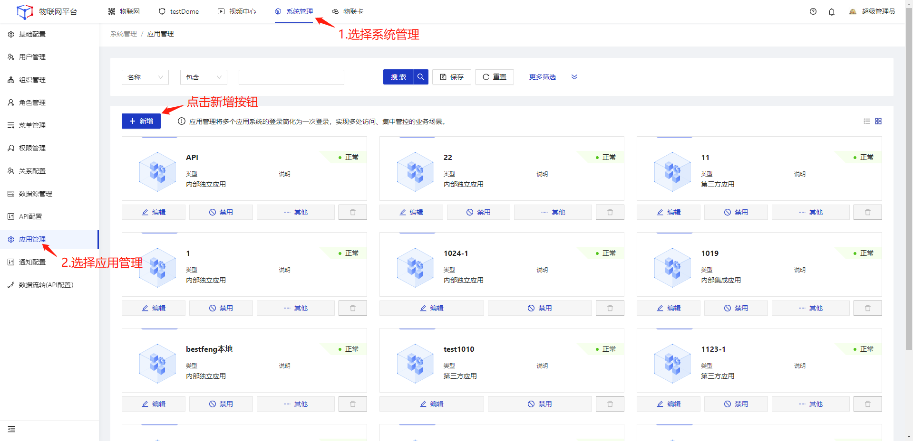
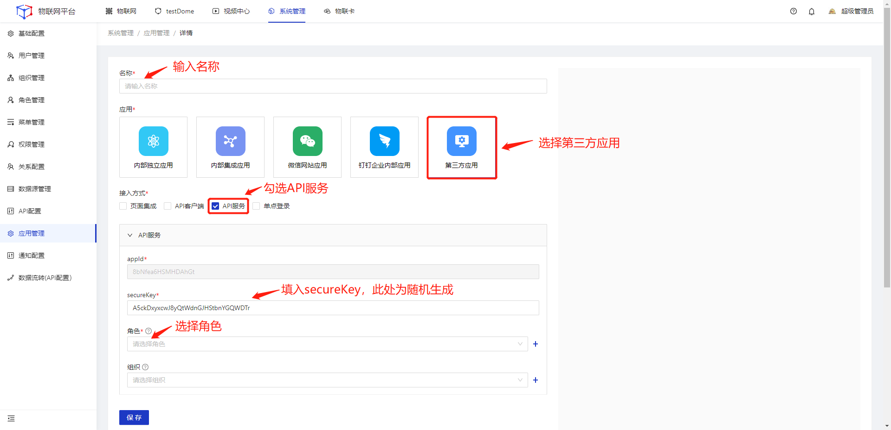
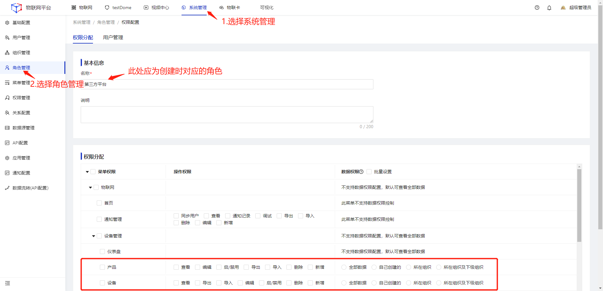
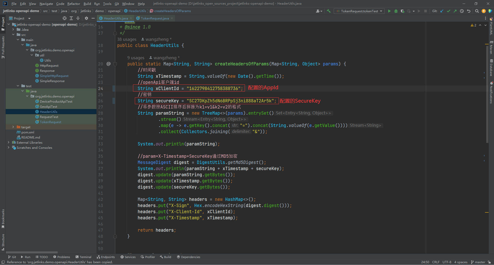
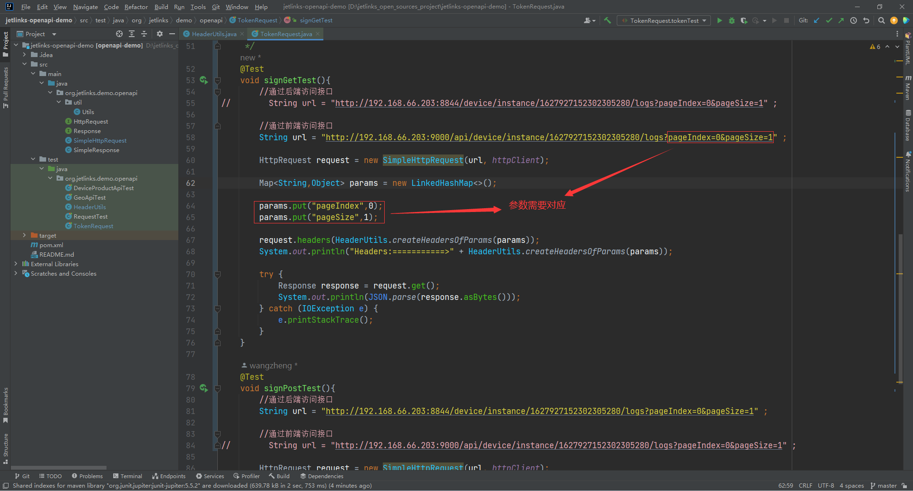
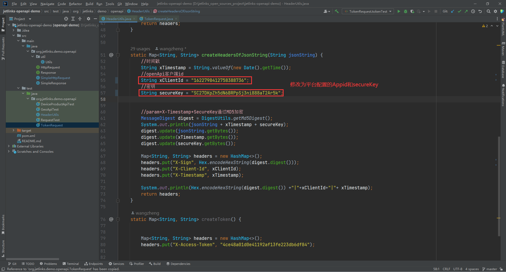
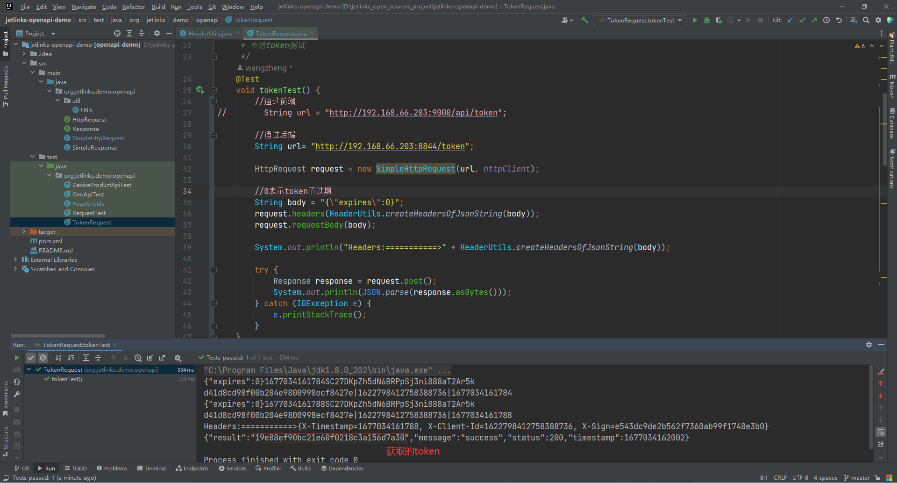

# 第三方平台请求JetLinks服务接口

## 应用场景

<div class='explanation primary'>
  <p class='explanation-title-warp'>
    <span class='iconfont icon-bangzhu explanation-icon'></span>
    <span class='explanation-title font-weight'>说明</span>
  </p>
    第三方平台通过api请求JetLinks服务接口获取相关数据
</div>


## 指导介绍

  <p>1. <a href='/dev-guide/request-jetlinks-interface.html#创建第三方平台'>创建第三方平台。</a></p>
  <p>2. <a href='/dev-guide/request-jetlinks-interface.html#获取平台签名及token'>获取平台签名及Token。</a></p>


## 创建第三方平台

首先进入平台：选择平台顶部导航栏的[系统管理]---选择左侧菜单栏[应用管理]---点击新增按钮



选择第三方应用，接入方式只勾选API服务，填入名称、secureKey，选择角色，点击保存

<div class='explanation primary'>
  <p class='explanation-title-warp'>
    <span class='iconfont icon-bangzhu explanation-icon'></span>
    <span class='explanation-title font-weight'>说明</span>
  </p>
    <p>
       appId和secureKey需要提供给客户端开发者，角色是多个用户的集合，角色中创建的用户可以使用用户名密码登录到系统中。IP白名单是只允许填写的ip进行访问
    </p>
</div>



<div class='explanation primary'>
  <p class='explanation-title-warp'>
    <span class='iconfont icon-bangzhu explanation-icon'></span>
    <span class='explanation-title font-weight'>说明</span>
  </p>
  大部分情况下只需要勾选设备相关权限即可
</div>
赋权操作在[系统管理]---[角色管理]---选择对应的角色后在页面内进行权限分配




## 获取平台签名及Token

1、使用签名的方式

验证流程

<div class='explanation primary'>
  <p class='explanation-title-warp'>
    <span class='iconfont icon-bangzhu explanation-icon'></span>
    <span class='explanation-title font-weight'>说明</span>
  </p>
         <p>
             1. 图中Signature函数为客户端设置的签名方式，支持MD5和SHA256<br>
             2. 发起请求的签名信息都需要放到请求头中，而不是请求体<br>
             3. OpenApi对开发是透明的，开发只需要关心权限控制即可。OpenAPI和后台接口使用的是相同的权限控制API，因此开发一个OpenAPI接口就是写一个WebFlux Controller。<a href='https://doc.jetlinks.cn/dev-guide/crud.html#web' target='_blank'>查看使用方式</a>
    </p>
</div>


<div class='explanation primary'>
  <p class='explanation-title-warp'>
    <span class='iconfont icon-bangzhu explanation-icon'></span>
    <span class='explanation-title font-weight'>说明</span>
  </p>
  <p>
      平台使用签名来校验客户端请求的完整性以及合法性。
    </p>
</div>


当请求平台接口的方式为GET或者DELETE请求

<p>appId为<code>1622798412758388736</code>，SecureKey为：<code>SC27DKpZh5dN6BRPpSj3ni888aT2Ar5k</code>，客户端请求接口: <code>/device/instance/1627927152302305280/logs</code>，参数为<code>pageSize=1&pageIndex=0</code>，签名方式为<code>md5</code>。</p>

<p>1. 将参数key按ascii排序得到: <code>pageIndex=0&pageSize=1</code></p>

<p>2. 使用拼接时间戳以及密钥得到: <code>pageIndex=0&pageSize=11676974022937SC27DKpZh5dN6BRPpSj3ni888aT2Ar5k</code></p>

<p>3 .使用<code>md5("pageIndex=0&pageSize=11676974022937SC27DKpZh5dN6BRPpSj3ni888aT2Ar5k")</code>后计算出<code>X-Sign</code>为<code>32a74e780bce7d3269cb09559687a278</code></p>

示例：

```kotlin
//(GET)查询设备日志数据
GET /device/instance/1627927152302305280/logs?pageSize=1&pageIndex=0

//本次请求的Headers
X-Client-Id: 1622798412758388736
X-Timestamp: 1676974572427
X-Sign: 32a74e780bce7d3269cb09559687a278
```

响应结果

```json
{
	"result": {
		"total": 22,
		"data": [{
			"createTime": 1676967412260,
			"id": "F4ZzDAIkU3L6YNePxGYJVgNIaJ49ObkB",
			"type": {
				"text": "离线",
				"value": "offline"
			},
			"deviceId": "1627927152302305280",
			"content": {
				"headers": {
					"serverId": "jetlinks-platform:8844",
					"deviceName": "网关子设备",
					"productName": "网关子设备",
					"connectTime": 1676966421807,
					"from": "session",
					"productId": "1627926922437668864",
					"_uid": "F4ZzDAIkU3L6YNePxGYJVgNIaJ49ObkB",
					"creatorId": "1199596756811550720",
					"parentId": "1627926865130893312"
				},
				"messageType": "OFFLINE",
				"deviceId": "1627927152302305280",
				"timestamp": 1676967412260
			},
			"timestamp": 1676967412260
		}],
		"pageIndex": 0,
		"pageSize": 1
	},
	"message": "success",
	"status": 200,
	"timestamp": 1676974022988
}
```

<br>

当请求平台接口的方式为POST或者PUT请求

<div class='explanation primary'>
  <p class='explanation-title-warp'>
    <span class='iconfont icon-bangzhu explanation-icon'></span>
    <span class='explanation-title font-weight'>说明</span>
  </p>
  <p>
      如果POST请求的contentType类型为APPLICATION_FORM_URLENCODED（表单数据），则加密方式可以参见GET的方式。
    </p>
</div>
<p>appId为<code>1622798412758388736</code>，SecureKey为：<code>SC27DKpZh5dN6BRPpSj3ni888aT2Ar5k</code>，客户端请求接口<code>/device/instance/1627927152302305280/logs</code>，请求体为<code>{"pageSize":1,"pageIndex":0}</code>，签名方式为<code>md5</code>，计算后得到<code>X-Sign</code>为<code>892b66d9f9e29d44336dae86b8066057</code></p>

示例：

```kotlin
//(POST)查询设备日志数据
POST /device/instance/1627927152302305280/logs

//本次请求的Headers
X-Client-Id: testId
X-Timestamp: 167109938793
X-Sign: 892b66d9f9e29d44336dae86b8066057

//本次请求的requestBody
{"pageIndex":0,"pageSize":1}
```

响应结果：

```json
{
	"result": {
		"total": 22,
		"data": [{
			"createTime": 1676967412260,
			"id": "F4ZzDAIkU3L6YNePxGYJVgNIaJ49ObkB",
			"type": {
				"text": "离线",
				"value": "offline"
			},
			"deviceId": "1627927152302305280",
			"content": {
				"headers": {
					"serverId": "jetlinks-platform:8844",
					"deviceName": "网关子设备",
					"productName": "网关子设备",
					"connectTime": 1676966421807,
					"from": "session",
					"productId": "1627926922437668864",
					"_uid": "F4ZzDAIkU3L6YNePxGYJVgNIaJ49ObkB",
					"creatorId": "1199596756811550720",
					"parentId": "1627926865130893312"
				},
				"messageType": "OFFLINE",
				"deviceId": "1627927152302305280",
				"timestamp": 1676967412260
			},
			"timestamp": 1676967412260
		}],
		"pageIndex": 0,
		"pageSize": 1
	},
	"message": "success",
	"status": 200,
	"timestamp": 1676976528724
}
```

<br>

验签

<div class='explanation primary'>
  <p class='explanation-title-warp'>
    <span class='iconfont icon-bangzhu explanation-icon'></span>
    <span class='explanation-title font-weight'>说明</span>
  </p>
  需要使用使用和签名相同的算法，不需要对响应结果排序
</div>
示例：

```java
String secureKey = ...; //密钥
String responseBody = ...;//服务端响应结果
String timestampHeader = ...;//响应头: X-Timestamp
String signHeader = ...; //响应头: X-Sign

String sign = DigestUtils.md5Hex(responseBody + timestampHeader + secureKey);
if(sign.equalsIgnoreCase(signHeader)){
    //验签通过
}
```

<br>

2、使用token的方式

<div class='explanation primary'>
  <p class='explanation-title-warp'>
    <span class='iconfont icon-bangzhu explanation-icon'></span>
    <span class='explanation-title font-weight'>说明</span>
  </p>
  通过请求接口<code>/token</code>来获取<code>X-Access-Token</code>，之后可以使用此token来发起api请求
</div>


首先请求平台申请token的接口，客户端请求接口`/token`，请求方式post

```http
//获取平台token
POST http://后端服务地址:端口号/token 或者 http://前端服务地址:端口号/api/token

//本次请求的Headers
X-Sign: 99c5134eaa5f365b31ae856c9326885f //通过POST例子计算出的X-Sign
X-Timestamp: 1676976995154 
X-Client-Id: 1622798412758388736
Content-Type: application/json

//本次请求的requestBody
{"expires":7200} //token过期时间，单位秒，如果为0则表示token永不过期

//平台响应结果
{
	"result": "0614f8b1fabe25ebfca8e0f08855726e", //获取到的token
	"message": "success",
	"status": 200,
	"timestamp": 1676976995248
}
```

<br>

使用获取的token发起请求

```http
//(GET)查询设备日志数据
GET /device/instance/1627927152302305280/logs?pageSize=1&pageIndex=0

//本次请求的Headers
X-Access-Token: 0614f8b1fabe25ebfca8e0f08855726e //上一步骤中获取到的token
```

响应结果

```json
{
	"result": {
		"total": 22,
		"data": [{
			"createTime": 1676967412260,
			"id": "F4ZzDAIkU3L6YNePxGYJVgNIaJ49ObkB",
			"type": {
				"text": "离线",
				"value": "offline"
			},
			"deviceId": "1627927152302305280",
			"content": {
				"headers": {
					"serverId": "jetlinks-platform:8844",
					"deviceName": "网关子设备",
					"productName": "网关子设备",
					"connectTime": 1676966421807,
					"from": "session",
					"productId": "1627926922437668864",
					"_uid": "F4ZzDAIkU3L6YNePxGYJVgNIaJ49ObkB",
					"creatorId": "1199596756811550720",
					"parentId": "1627926865130893312"
				},
				"messageType": "OFFLINE",
				"deviceId": "1627927152302305280",
				"timestamp": 1676967412260
			},
			"timestamp": 1676967412260
		}],
		"pageIndex": 0,
		"pageSize": 1
	},
	"message": "success",
	"status": 200,
	"timestamp": 1676977444557
}
```

<p>可以使用平台提供的Demo来获取签名以及申请Token</p>

<div class='explanation primary'>
  <p class='explanation-title-warp'>
    <span class='iconfont icon-bangzhu explanation-icon'></span>
    <span class='explanation-title font-weight'>说明</span>
  </p>
  <p>
      Demo中测试包org.jetlinks.demo.openapi下的测试类已测试通过平台已有的openApi接口，Demo中使用签名的方式接入。<a href='https://github.com/jetlinks/jetlinks-openapi-demo' target='_blank'>下载Demo示例</a>
    </p>
</div>
请求平台接口为GET或DELETE方式

1、找到test目录下的`org.jetlinks.demo.openapi.HeaderUtils`类，修改`createHeadersOfParams`方法中的`xClientId`和`secureKey`为平台配置的`AppId,secureKey`



2、在test目录下的`org.jetlinks.demo.openapi.TokenRequest`类中新增一个测试方法来访问平台内的GET请求接口

```java
	@Test
    void getTest(){
        //通过后端访问接口
        //String url = "http://192.168.66.203:8844/device/instance/1627927152302305280/logs?pageIndex=0&pageSize=1" ;

        //通过前端访问接口
        String url = "http://192.168.66.203:9000/api/device/instance/1627927152302305280/logs?pageIndex=0&pageSize=1" ;

        HttpRequest request = new SimpleHttpRequest(url, httpClient);

        Map<String,Object> params = new LinkedHashMap<>();

        params.put("pageIndex",0);
        params.put("pageSize",1);

        request.headers(HeaderUtils.createHeadersOfParams(params));
        System.out.println("Headers:===========>" + HeaderUtils.createHeadersOfParams(params));

        try {
            Response response = request.get();
            System.out.println(JSON.parse(response.asBytes()));
        } catch (IOException e) {
            e.printStackTrace();
        }
    }
```



<br>

通过POST方式请求平台token

1、找到test目录下的`org.jetlinks.demo.openapi.HeaderUtils`类，修改`createHeadersOfJsonString`方法中的`xClientId`和`secureKey`为平台配置的`AppId,secureKey`



2、运行test目录下的`org.jetlinks.demo.openapi.TokenRequest`类中的tokenTest方法请求token



