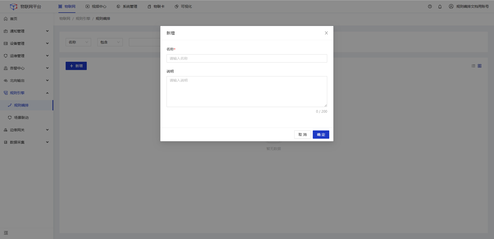
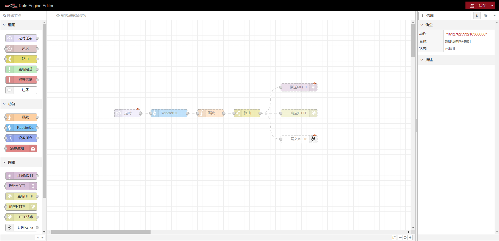
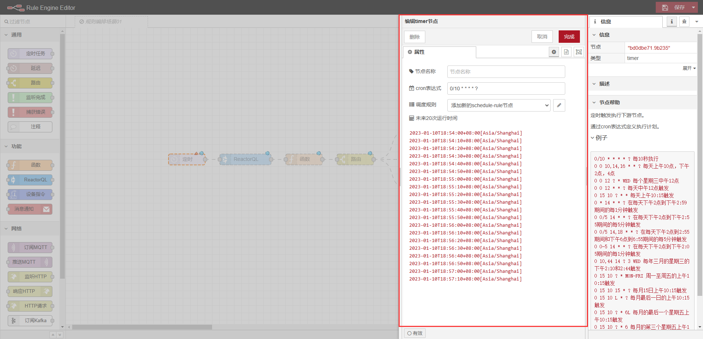
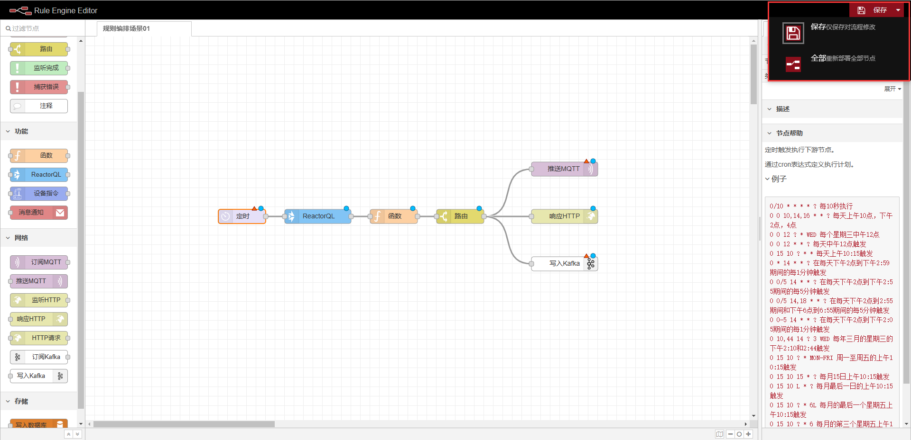
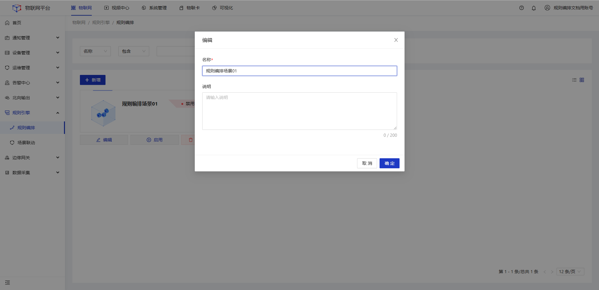
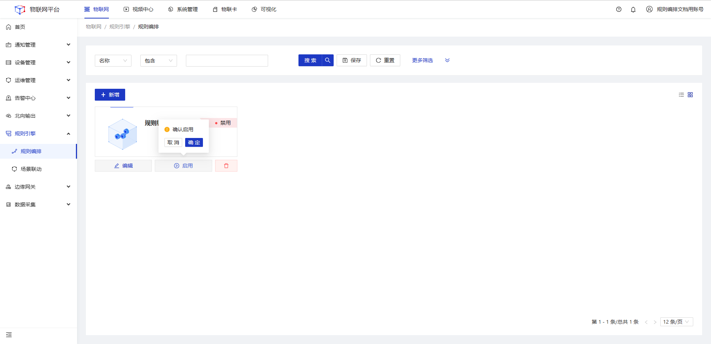
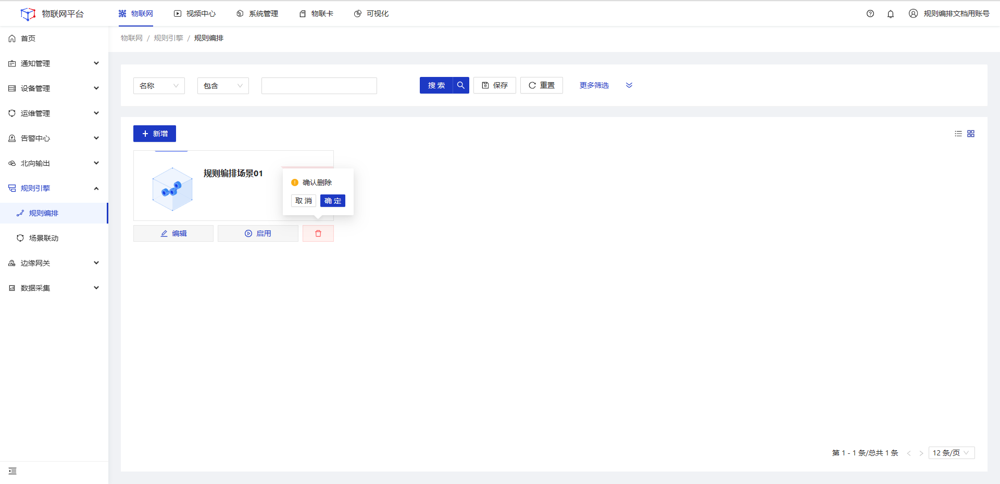

# 规则编排

## 应用场景

  

    
    说明
  

   

     提供可视化,流程化的数据(逻辑)处理工具。支持对实时数据流进行计算，并将计算结果进行推送MQTT、写入Kafka、写入数据库等操作。
    

## 指导介绍

1. <a href='/dev-guide/rule-editor.html#新增'>新增规则编排</a>

2. <a href='/dev-guide/rule-editor.html#编辑'>编辑规则编排</a>

3. <a href='/dev-guide/rule-editor.html#启用-禁用'>启用/禁用规则编排</a>

4. <a href='/dev-guide/rule-editor.html#删除'>删除规则编排</a>

## 新增

#### 具体操作步骤

1、<b>登录</b>JetLinks物联网平台。

2、在左侧导航栏，选择<b>规则引擎>规则编排</b>，进入列表页。

3、点击<b>新增</b>按钮，在弹框页填写名称，然后点击<b>确定</b>按钮。

 

4、点击卡片，进入画布页，<b>拖拽</b>左侧组件到画布页，并<b>双击</b>组件，填写相关配置。

右侧为该组件的**配置详情** 

5、多个组件之间，通过<b>连线</b>进行连接，上游的数据会通过<b>连线</b>流到下游。

 

6、配置完节点后点击页面右上角<b>部署</b>。

## 编辑

#### 操作步骤

1、<b>登录</b>Jetlinks物联网平台。 
2、在左侧导航栏，选择<b>规则引擎>规则编排</b>，进入列表页。 
3、点击具体数据的<b>编辑</b>按钮，在弹框页编辑名称，然后点击<b>确定</b>按钮。

## 启用/禁用

#### 操作步骤

1、<b>登录</b>Jetlinks物联网平台。 
2、在左侧导航栏，选择<b>规则引擎>规则编排</b>，进入列表页。 
3、点击具体数据的<b>启用/禁用</b>按钮，然后点击<b>确定</b>。

## 删除

#### 操作步骤

1、<b>登录</b>Jetlinks物联网平台。 
2、在左侧导航栏，选择<b>规则引擎>规则编排</b>，进入列表页。 
3、点击具体数据的<b>删除</b>按钮，在弹框页编辑名称，然后点击<b>确定</b>按钮。

