# 规则引擎

## 概述
<div class='explanation primary'>
  <p class='explanation-title-warp'>
    <span class='iconfont icon-bangzhu explanation-icon'></span>
    <span class='explanation-title font-weight'>说明</span>
  </p>
    <p>规则引擎是使用预定义的语义模块编写业务决策。接受数据输入，解释业务规则，并根据业务规则做出业务决策，
对于处理复杂的事件具有灵活配置和高度定制化的。
通过规则可以让项目下的设备相互联动，以设备上报数据或者定时器作为触发器并通过一些过滤及计算模块进行业务判断，最终控制其他设备进行联动操作。
JetLinks平台在此基础上还扩展了一些网络节点，方便开发者使用这些节点订阅外部数据或转发平台内部数据。
</p>
</div>

## 名词说明

<table>
    <tr>
        <td>RuleModel(规则模型)</td>
        <td>由多个RuleNode(规则节点),RuleLink(规则连线)组成</td>
    </tr>
     <tr>
        <td>RuleNode(规则节点)</td>
        <td>规则节点描述具体执行的逻辑</td>
    </tr>
     <tr>
        <td>RuleLink(规则连线)</td>
        <td>用于将多个节点连接起来,将上一个节点的输出结果作为下一个节点的输入结果.</td>
    </tr>
     <tr>
        <td>Input(输入)</td>
        <td>规则节点的数据输入,可以是上游节点的输出数据，也可以是通过自身html配置的数据</td>
    </tr>
     <tr>
        <td>Output(输出)</td>
        <td>规则节点的数据输出,将数据流向下游节点</td>
    </tr>
     <tr>
        <td>Scheduler(调度器)</td>
        <td>负责将模型转为任务(Job),并进行任务调度到Worker</td>
    </tr>
     <tr>
        <td>Worker(工作器)</td>
        <td>负责执行,维护任务.</td>
    </tr>
     <tr>
        <td>ExecutionContext(执行上下文)</td>
        <td>启动任务时的上下文,通过上下文获取输入输出配置信息等进行任务处理.</td>
    </tr>
   <tr>
        <td>TaskExecutor(任务执行器)</td>
        <td>具体执行任务逻辑的实现</td>
    </tr>
   <tr>
        <td>TaskExecutorProvider(任务执行器提供商)</td>
        <td>用于根据模型配置以及上下文创建任务执行器.</td>
    </tr>
   <tr>
        <td>RuleData(规则数据)</td>
        <td>任务执行过程中的数据实例</td>
    </tr>
</table>

## 规则模型数据结构

//todo 结构是否变更查阅代码后修改

```text
//规则模型
RuleModel{ 
    events:[ RuleLink ]     # 事件连接点,用于自定义规则事件的处理规则
    nodes:[ RuleNodeModel ] # 所有节点信息，包含事件节点
}
//节点模型
RuleNodeModel{
    executor: ""            # 节点执行器标识
    configuration: { Map }  # 节点配置
    events:[ RuleLink ]     # 事件连接点,用于自定义节点事件的处理规则
    inputs:[ RuleLink ]     # 输入连接点
    outputs:[ RuleLink ]    # 输出连接点
}
//连接点，将2个规则节点关联
RuleLink{
    type: ""                # 类型，为事件节点连接时值为对应当事件标识
    condition: Condition    # 连接条件
    source: RuleNodeModel   # 连接节点
    target: RuleNodeModel   # 被连接节点
}
//条件
Condition{
    type: ""                # 条件类型。如: expression
    configuration: { Map }  # 条件配置
}
```

## 指导介绍

  <p>1. <a href="/dev-guide/rule-engine.html#自定义规则节点">自定义规则节点</a> </p>
  <p>2. <a href="/dev-guide/rule-engine.html#配置自定义规则web节点">配置自定义规则web节点</a></p>
  <p>3. <a href="/dev-guide/rule-engine.html#规则编排使用自定义规则节点">规则编排使用自定义规则节点</a></p>
  <p>4. <a href="/dev-guide/rule-engine.html#自定义规则节点实现i18n国际化支持">自定义规则节点实现i18n国际化支持</a></p>
  <p>5. <a href="/dev-guide/rule-engine.html#内置规则节点">内置规则节点</a></p>

## 问题指引

<table>
<tr>
    <td><a href="/dev-guide/rule-engine.html#配置完成后规则引擎编辑器内未显示该节点">配置完成后规则引擎编辑器内未显示该节点</a></td>
    <td><a href="/dev-guide/rule-engine.html#自定义内部类customtaskexecutor无法取得node-red中自定义规则节点配置的参数信息">自定义内部类CustomTaskExecutor无法取得NODE-RED中自定义规则节点配置的参数信息</a></td>
</tr>
<tr>
   <td><a href="/dev-guide/rule-engine.html#在规则实例中启动规则实例时-提示no-scheduler-for-custom">在规则实例中启动规则实例时,提示no scheduler for custom</a></td>
    <td><a href="/dev-guide/rule-engine.html#editorresource注解中的helper参数路径动态化时如何使用">@EditorResource注解中的helper参数路径动态化时如何使用</a></td>
</tr>
<tr>
   <td><a href="/dev-guide/rule-engine.html#创建好自定义规则节点后-启动jetlinks-pro后端程序提示-nested-exception-is-java-lang
-nullpointerexception">启动jetlinks-pro后端程序提示:nested exception is java.lang.nullpointerexception</a></td>
<td></td>
</tr>

</table>

## 自定义规则节点

1、创建一个类实现接口<code>TaskExecutorProvider</code>,提供自定义规则节点的任务执行器

<div class='explanation primary'>
  <p class='explanation-title-warp'>
    <span class='iconfont icon-bangzhu explanation-icon'></span>
    <span class='explanation-title font-weight'>说明</span>
  </p>
   <p>需要使用<code>@Component</code>注解将任务执行器的自定义实现类加入容器</p>
   <p>在任务执行器的自定义实现类中，需要提供一个内部类实现<code>FunctionTaskExecutor</code>,用于执行自定义规则节点任务</p>
</div>

```java
@AllArgsConstructor
@Component
@EditorResource(
    id = "custom",
    name = "自定义组件",
    //节点显示需要填入的数据
    editor = "rule-engine/editor/common/2-custom-node.html",
    //该节点的说明页面
    helper = "rule-engine/i18n/zh-CN/common/2-custom-node.html",
    order = 2
)
public class MyCustomExecutorProvider implements TaskExecutorProvider {

    private final EventBus eventBus;

    //定义执行器标识
    @Override
    public String getExecutor() {
        return "custom";
    }

    //创建执行任务
    @Override
    public Mono<TaskExecutor> createTask(ExecutionContext context) {
        return Mono.just(new CustomTaskExecutor(context));
    }
	
    //定义一个内部类继承FunctionTaskExecutor
    class CustomTaskExecutor extends FunctionTaskExecutor {

        private String id;

        private String name;

        public CustomTaskExecutor(ExecutionContext context) {
            super("自定义执行器", context);
            reload();
        }

        //定义节点重新加载时执行的方法
        @Override
        public void reload() {
          //根据context上下文，获取自定义规则节点html文件中的id值，get("属性名")：属性名自定义html中的属性名相对应
          this.id = (String) getContext().getJob().getConfiguration().get("id");
          this.name = (String) getContext().getJob().getConfiguration().get("name");
        }

        //定义节点具体功能的方法，在此处实现自己系统的业务方法
       @Override
        protected Publisher<RuleData> apply(RuleData input) {
            return this.doSomething(input);
        }
        
        //此处为简单的例子
        //拿到配置中的id和name封装为map，再通过eventBus将数据发布到topic为/custom/id事件总线中
        public Publisher<RuleData> doSomething(RuleData input){
            Map<String, Object> data = new HashMap<>();
            data.put("id", id);
            data.put("name", name);
            data.put("executeTime", System.currentTimeMillis());

            input.acceptMap(data::putAll);

            return eventBus
                .publish(String.join("/", "custom", id), data)
                //转换新的数据
                .thenReturn(context.newRuleData(input.newData(data)));
        }
    }
}
```
2、上述示例一些简单说明

<table>
  <tr>
    <td>ExecutionContext context</td>
    <td>context – 上下文</td>
  </tr>
 <tr>
    <td><code>this.id = (String) getContext().getJob().getConfiguration().get("id")</code></td>
    <td>根据context上下文，获取自定义规则节点html文件中的id值</td>
  </tr>
 <tr>
    <td>RuleData input</td>
    <td>规则数据</td>
  </tr>
</table>

<div class='explanation primary'>
  <p class='explanation-title-warp'>
    <span class='iconfont icon-bangzhu explanation-icon'></span>
    <span class='explanation-title font-weight'>说明</span>
  </p>
    RuleData:规则数据
</div>

| 核心参数|类型|描述|
|--|-------|------|
|  id |   String   |  数据ID    |
|  contextId |   String   |  上下文ID,在一条数据创建时生成,在传递过程中此ID不变    |
|  data |   Object   |  真实数据   |

##  配置自定义规则web节点

1、在resources资源路径下<code>rule-engine.editor.common</code>下创建一个<code>2-custom-node.html</code>文件

2、配置节点所需填写内容

<div class='explanation primary'>
  <p class='explanation-title-warp'>
    <span class='iconfont icon-bangzhu explanation-icon'></span>
    <span class='explanation-title font-weight'>说明</span>
  </p>
    <p>
       <p>该节点需要配置的内容可以使用<code>input</code>标签声明，其中标签的<code>id</code>需要以<code>node-input-</code>为前缀</p>
       <p>如本例中的<code>id="node-input-name"</code></p>
       <p>在后端可以通过<code>getContext().getJob().getConfiguration().get("name")</code>获取对应的输入值</p>
    </p>
</div>


``` html
<script type="text/html" data-template-name="custom">
    <div class="form-row">
        <label for="node-input-name"><i class="fa fa-tag"></i> <span data-i18n="common.label.name"></span></label>
        <input type="text" placeholder="节点名称" id="node-input-name" data-i18n="[placeholder]common.label.name">
    </div>

    <div class="form-row">
        <label for="node-input-id"><i class="fa fa-server"></i> <span>id</span></label>
        <input type="text" id="node-input-id" placeholder="节点id">
    </div>
</script>

<script type="text/javascript">
    (function () {
        RED.nodes.registerType('custom', {
            category: 'common',
            name: "自定义",
            color: "#66ccff",
            defaults: {
                 name: {name:""},
                 id: {id:""}
            },
            inputs: 1,
            outputs: 1,
            icon: "timer.svg",
            label: function () {
                return this.name || "自定义";
            },
            labelStyle: function () {
                return this.name ? "node_label_italic" : "";
            },
            oneditprepare: function () {
            },
        });
    })()
</script>

```

3、在resources资源路径下<code>rule-engine.i18n.zh-CN.common</code>创建<code>2-custom-node.html</code>并配置节点说明（可选）

```html
<script type="text/html" data-help-name="custom">
  <p>自定义规则节点</p>
  <p>需要填入id</p>
  <p>需要填入name</p>
</script>
```

<br>

以上配置完成后可以在规则引擎编辑器中看到自定义的节点

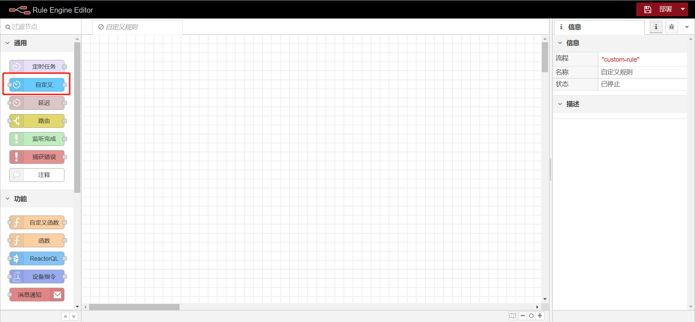


##  规则编排使用自定义规则节点

<div class='explanation primary'>
  <p class='explanation-title-warp'>
    <span class='iconfont icon-bangzhu explanation-icon'></span>
    <span class='explanation-title font-weight'>说明</span>
  </p>
    <p>
     以如下图规则模型所示：
      <p>定时任务(配置cron表达式)--->自定义规则节点(配置数据)--->reactorQl(订阅自定义规则节点数据)--->函数(打印日志)</p>
    </p>
</div>
1、在规则引擎编辑器中放置如下组件

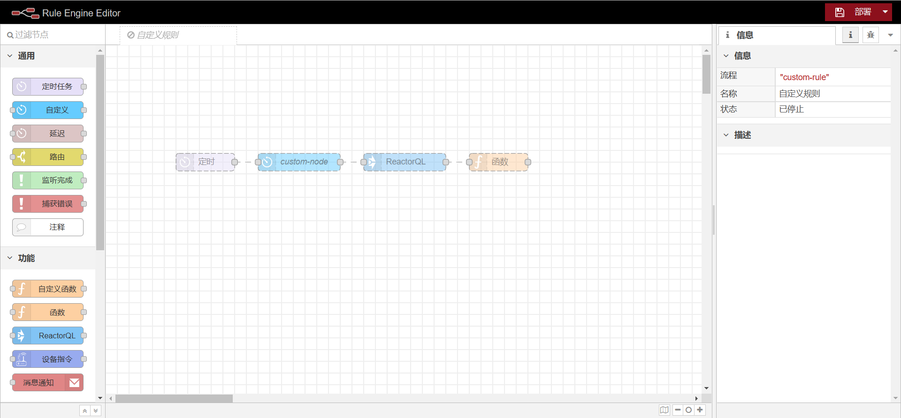

2、节点内容分别如下

定时任务配置

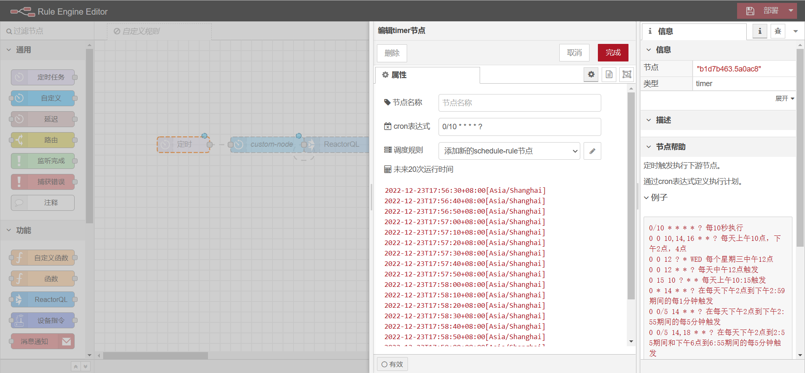

自定义规则节点配置

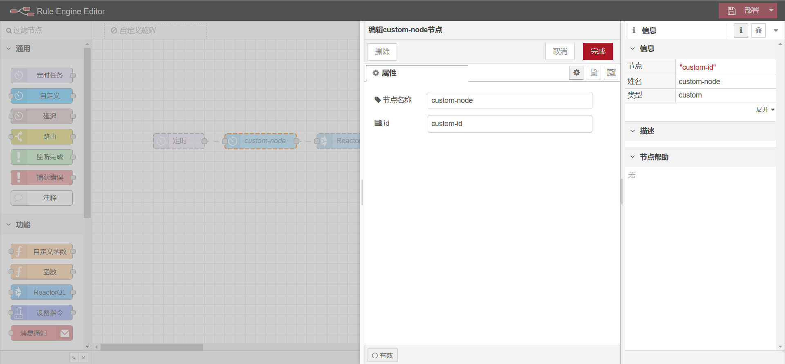

reactorQL配置

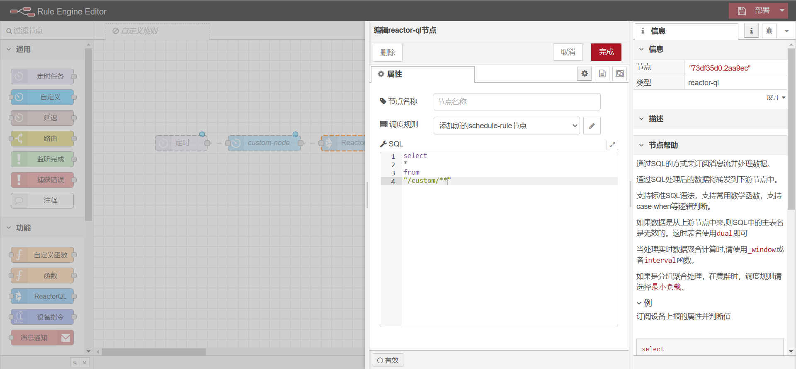

函数配置

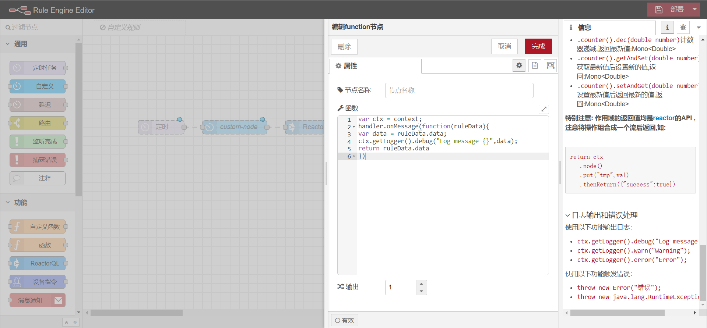

全部配置完成后点击右上角的部署保存

3、启动自定义规则，右侧点击<code>debug</code>按钮，执行效果如下


##  自定义规则节点实现i18n国际化支持

参考：[规则引擎相关国际化配置](/dev-guide/i18n.html#规则引擎相关国际化)


## 内置规则节点

### 定时任务

```js
{
    executor: "timer", //执行器标识
    configuration:{"cron":"cron表达式"} //配置信息,不同的执行器,配置信息不同
}
```

jetlinks平台使用的executor和configuration参见：`org.jetlinks.pro.rule.engine.executor.TimerTaskExecutorProvider`
```java
   //executor
     @Override
     public String getExecutor() {
        return "timer";
        }
        
   //configuration
    RuleNodeModel model = new RuleNodeModel();
    Map<String, Object> config = new HashMap<>();
    config.put("cron", nodeJson.getString("cron"));
    model.setConfiguration(config);

```
上述代码`nodeJson.getString("cron")`获取的值为规则编排-规则引擎编辑器-规则引擎节点配置的参数值，如下图所示：

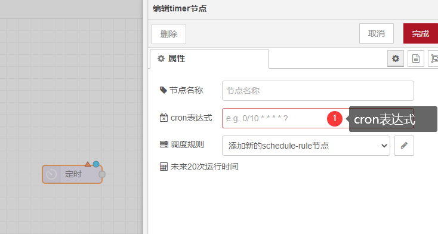


### 延迟(限流)执行

```js
{
    executor: "delay",
    configuration:{
        pauseType:"延迟类型: delayv(上游节点指定固定延迟),delay(固定延迟),random(随机延迟),rate(速率限制),group(分组速率限制)",
        //延迟类型为delay时,使用以下配置
        timeout:10,//延迟时间
        timeoutUnits: "延迟时间单位:Seconds(秒),Millis(毫秒)",
        //延迟类型为random时,使用以下配置
        randomFirst: 100, //最小延迟时间
        randomLast: 1000 //最大延迟时间
        randomUnits: "随机延迟时间单位:Seconds(秒),Millis(毫秒)",
        //延迟类型为rate或者group时使用以下配置
        rate:10,//速率，如: 10条
        nbRateUnits:10,//速率时间单位,如: 1秒
        rateUnits:"速率时间单位:Seconds(秒),Millis(毫秒)",
        //延迟类型为group时使用以下配置
        groupExpression:"deviceId" //分组表达式,表达式语言为jsonata
    }
}
```
上述配置详情参见：`org.jetlinks.pro.rule.engine.executor.DelayTaskExecutorProvider`中枚举类`PauseType`，该枚举类定义了5种延迟类型


### 函数(脚本)节点

```js
{
    executor:"script",
    configuration:{
        "lang":"脚本语言: js,groovy",
        "script":"基本内容,见说明"
    }
}
```

#### 脚本说明

脚本使用jsr223引擎,
通过调用内置变量handler.onMessage注册消息监听函数,当上游产生数据时,此函数将被调用,并传入数据.

例如:

```js
var ctx = context;
handler.onMessage(function(ruleData){

var data = ruleData.data; //上游节点的输出

return { // 输出到下一个节点
        "key":"value"
    }
});

```
使用案例：

使用reactorQl节点获取设备上报的数据，流向下游函数节点，由函数节点将数据推送到emqx中

  规则模型
  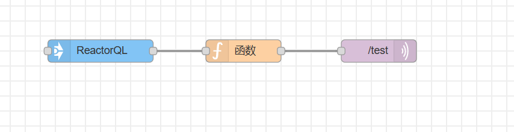

  reactor节点配置
  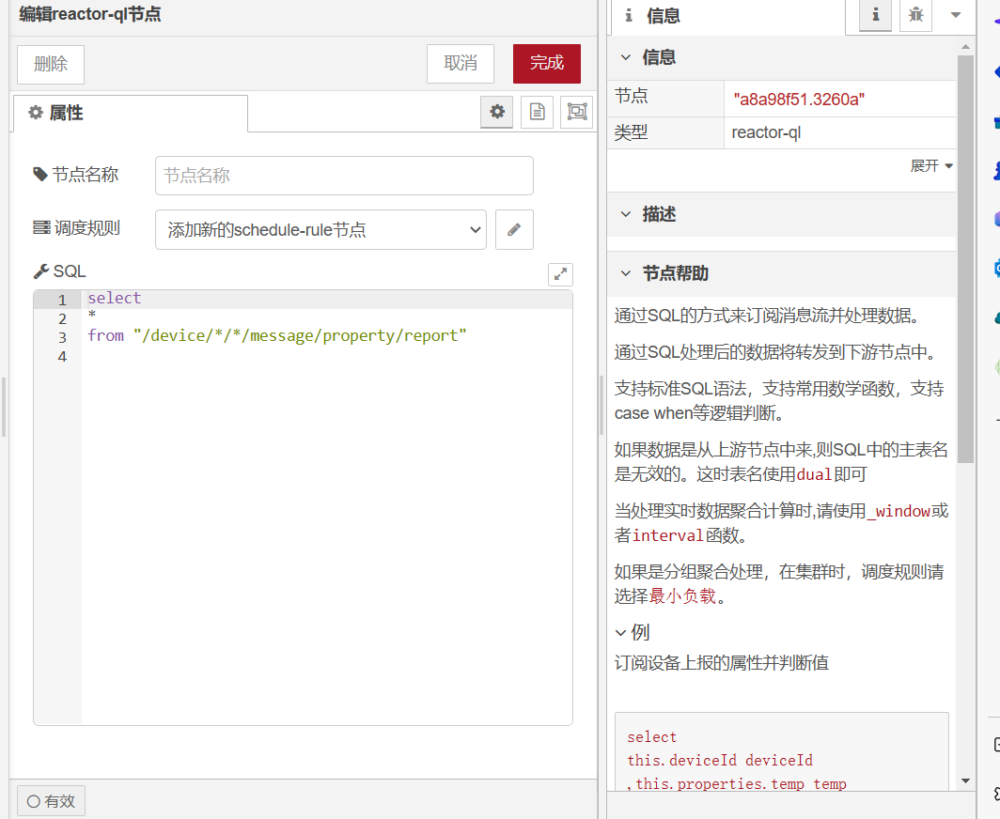

  函数节点配置
  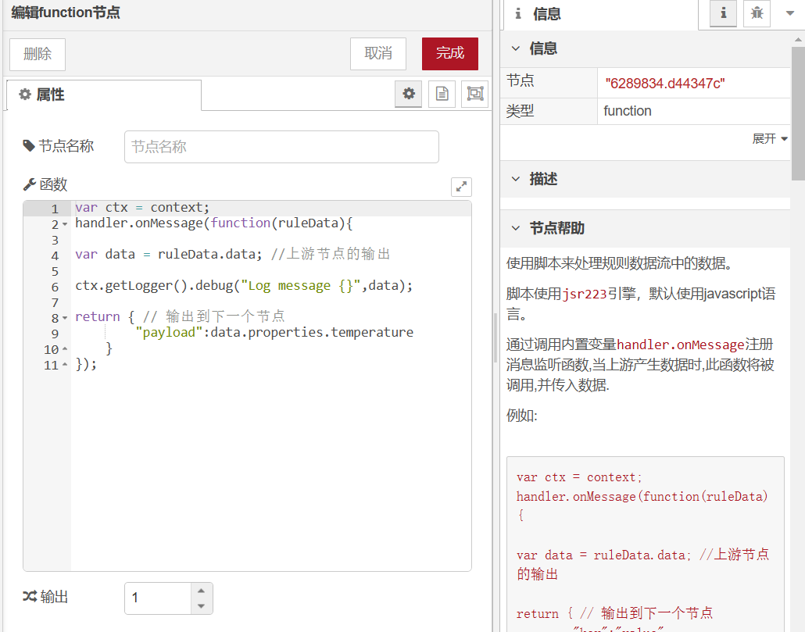

<div class='explanation primary'>
  <p class='explanation-title-warp'>
    <span class='iconfont icon-bangzhu explanation-icon'></span>
    <span class='explanation-title font-weight'>说明</span>
  </p>
     <p>如果下一个节点是推送到mqtt服务端，流下去的数据需要携带payload、topic、qos</p>
     <p>topic和qos可以在下游节点中配置，如果上游节点数据中携带topic、qos,下游mqtt节点又配置了topic、qos，数据中的topic、qos会被覆盖</p>
</div>

  mqtt节点配置
 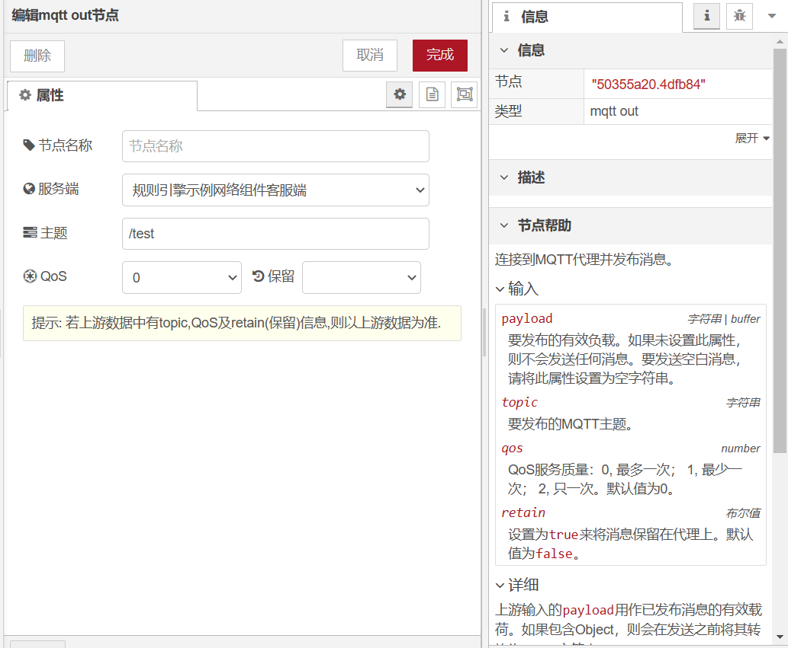
  
  使用mqttx工具订阅mqtt服务器(示例中使用的是emqx)，可以订阅到mqtt规则节点中的数据
 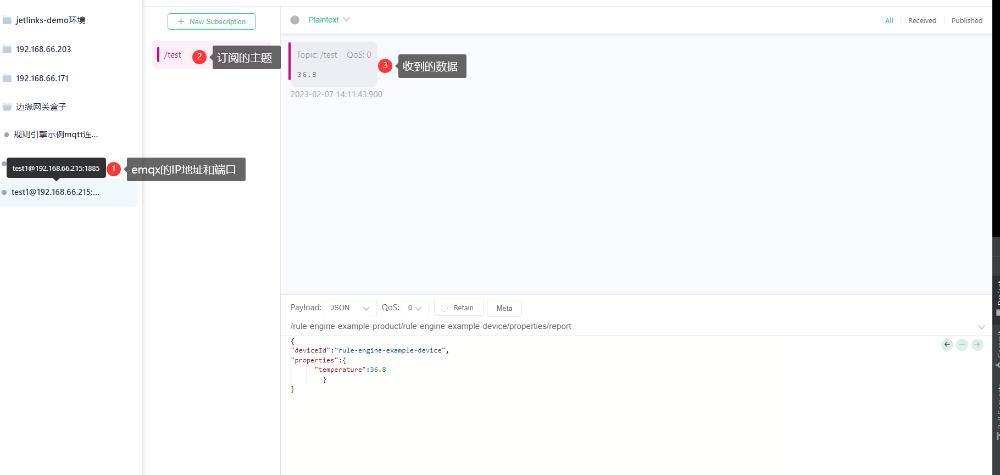
 
通过指定输出数量值,可以控制输出到指定的节点,如:
<div class='explanation primary'>
  <p class='explanation-title-warp'>
    <span class='iconfont icon-bangzhu explanation-icon'></span>
    <span class='explanation-title font-weight'>说明</span>
  </p>
     <p>to表示参数key，node1、node2表示输出到下游节点的数据</p>
</div>

```js
var ctx = context;
handler.onMessage(function(ruleData){

return [
    {"to":"node1"}, //输出到第一个节点
    {"to":"node2"}  //输出到第二个节点
    ];
});
```
节点配置示例，用户使用过程中可以按照自己的实际需要配置
规则模型
 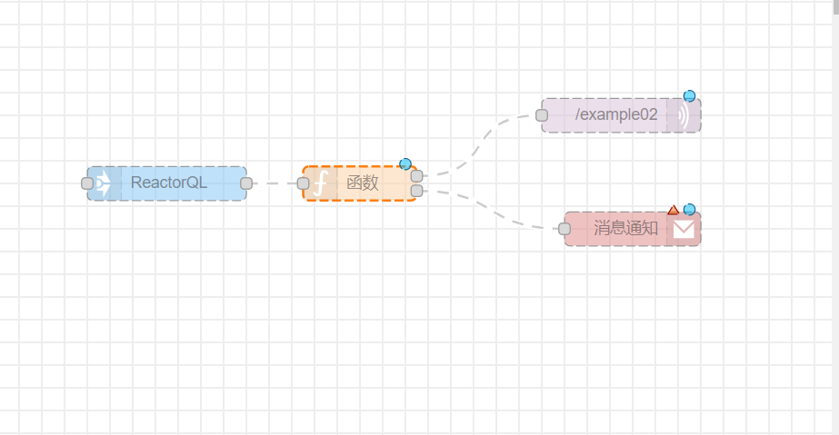
函数节点配置
 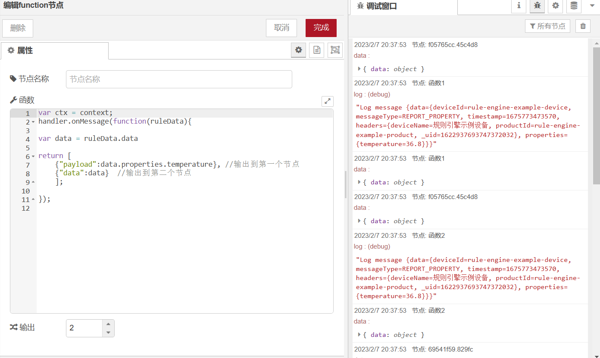

你还可以通过上下文作用域保存,获取数据.
```js
var ctx = context;
handler.onMessage(function(ruleData){

var data = ruleData.data;

return ctx.node()
        .counter()
        .inc(data.value) // 获取当前节点的计数器并递增
        .map(function(i){
           return {
              "total":i;
           }
        })
```

#### 作用域

* ctx.scope(String id)或者ctx.scope(RuleData ruleData)上下文作用域,根据ruleData.contextId决定.
* ctx.node()当前节点作用域
* ctx.node(String id)指定节点作用域
* ctx.flow()当前流程作用域
* ctx.flow(String id)指定流程作用域
* ctx.flow(String id).node(String id)指定流程指定节点的作用域
* ctx.global()全局作用域

作用域支持方法:

* .all(String... key)获取指定key的数据,如果未指定这返回全部,类型为Mono&lt;Map&lt;String,Object&gt;&gt;
* .get(String key)获取指定key的数据,返回类型为Mono&lt;Object&gt;
* .put(String key,Object value)设置值,返回类型为Mono&lt;Void&gt;
* .putAll(Map&lt;String,Object&gt;)设置多个值,参数为Map,返回类型为Mono&lt;Void&gt;
* .clear()清空作用域,返回类型为Mono&lt;Void&gt;
* .counter()获取计数器
* .counter(String name)获取指定名字的计数器
* .counter().inc(double number)计数器递增,返回最新值:Mono&lt;Double&gt;
* .counter().dec(double number)计数器递减,返回最新值:Mono&lt;Double&gt;
* .counter().getAndSet(double number)获取最新值后设置新的值,返回:Mono&lt;Double&gt;
* .counter().setAndGet(double number)设置最新值后返回最新的值,返回:Mono&lt;Double&gt;

<div class='explanation warning'>
  <p class='explanation-title-warp'>
    <span class='iconfont icon-jinggao explanation-icon'></span>
    <span class='explanation-title font-weight'>警告</span>
  </p>

作用域的返回值均是reactor的API ,注意将操作组合成一个流后返回,如:
```js
return ctx
   .node()
   .set("tmp",val)
   .thenReturn({"success":true})
```

</div>

#### 日志输出和错误处理
使用以下功能输出日志：

ctx.getLogger().debug("Log message {}",data);
ctx.getLogger().warn("Warning");
ctx.getLogger().error("Error");
使用以下功能触发错误：

throw new Error("错误");
throw new java.lang.RuntimeException("错误");

### ReactorQL

```js
{
    executor:"reactor-ql",
    configuration:{
        "sql":"ReactorQL语句"
    }
}
```

<div class='explanation primary'>
  <p class='explanation-title-warp'>
    <span class='iconfont icon-bangzhu explanation-icon'></span>
    <span class='explanation-title font-weight'>说明</span>
  </p>

通过ReactorQL可以订阅设备消息等消息,还可以进行分组聚合计算等操作.
见: <a href='/dev-guide/reactor-ql.html'>ReactorQL说明</a>

</div>

### 设备指令

```js
{
    executor:"device-message-sender",
    configuration:{
        "productId":"产品ID",
        "deviceId":"设备ID,为空时发送到产品下所有设备",
        "selector":"设备选择器",//见设备选择器说明
        "from":"消息来源:pre-node(上游节点),fixed(固定消息)",
        "timeout":"10s",//超时时间
        "message":{ //设备指令内容
            "messageType":"消息类型"
        },
        "waitType":"等待类型:sync(等待设备回复),forget(忽略返回结果)"
    }
}
```

<div class='explanation primary'>
  <p class='explanation-title-warp'>
    <span class='iconfont icon-bangzhu explanation-icon'></span>
    <span class='explanation-title font-weight'>说明</span>
  </p>

设备指令内容见:<a href='/function-description/device_message_description.html'>平台统一设备消息定义</a>

</div>

#### 设备选择器说明

如果下发指令的设备是动态获取的，可使用表达式函数来获取设备并发送到对应到设备。

例如:

* 获取产品ID为demo-device的设备:`product('demo-device')`

* 获取分组为demo-group下的设备:`in_group('demo-group')`

* 获取当前设备相同分组下的设备:`same_group(deviceId)`

* 获取标签supplier为测试厂商下的设备:`tag('supplier','测试厂商')`

* 按状态筛选 :`state('online')`,状态:`online,offline,notActive`

* 函数的参数可以是固定的字符串,如:`product('demo-device')`,也可以是上游节点传递的变量,如: `same_group(deviceId)`

* 多个表达式使用,分隔,例如:`same_group(deviceId),tag('supplier','测试厂商')`


### 消息通知

```js
{
    executor:"notifier",
    configuration:{
        "notifyType":"通知类型:sms(短信),email(邮件),voice(语音),dingTalk(钉钉),weixin(微信);",
        "notifierId":"通知配置ID",
        "templateId":"模版ID"
    }
}
```

### http请求

配置:

```js
{
    executor:"http-request",
    configuration:{
        "method":"GET,POST,PUT,PATCH,DELETE", //http method
        "authType":"basic,bearer,oauth2" ,//认证类型,为null时不认证
        "url":"请求地址",
        "connectTimeout":"连接超时时间,默认10秒",
        "maxHeaderLength":"最大请求头长度,默认10k",
        "useTls":false,//是否开启tls认证
        "tls":"证书ID",//对应设备接入-证书管理里的ID
        //authType为basic时需要以下配置
        "user":"",
        "password":"",
        //authType为bearer时需要以下配置
        "token":"authType为bearer时的token值",
        //authType为oauth2时需要以下配置
        "grantType":"client_credentials",
        "tokenUrl":"申请token的地址",
        "client_id":"",
        "client_secret":"",
        "bodyType":"formBody,jsonBody" //formBody为表单提交，jsonBody为json提交
    }
}
```

<div class='explanation primary'>
  <p class='explanation-title-warp'>
    <span class='iconfont icon-bangzhu explanation-icon'></span>
    <span class='explanation-title font-weight'>节点输入</span>
  </p>

将上游节点输出的结果作为请求内容,可通过函数节点拼接请求内容.

```json5
{
    "url":"如果为null则使用节点配置中的值",
    "method":"如果为null则使用节点配置中的值",
    "contentType":"application/json",
    "headers":{},
    "queryParameters":{},//拼接到url上的参数
    "payload":{}//post请求时的请求体
}
```
</div>

## 常见问题

*对开发过程中出现的问题进行总结*

### 配置完成后规则引擎编辑器内未显示该节点

<div class='explanation warning'>
  <p class='explanation-title-warp'>
    <span class='iconfont icon-bangzhu explanation-icon'></span>
    <span class='explanation-title font-weight'>问题1</span>
  </p>
    <p>
        Q：自定义规则节点配置完成后，规则引擎编辑器内左侧组件中未出现该节点
    </p>
    <p>
        A：确认后台代码自定义的类中<code>@EditorResource</code>注解内的<code>id</code>是否与前端页面中的<code>RED.nodes.registerType</code>第一个参数名对应
    </p>
</div>


### 自定义内部类CustomTaskExecutor无法取得NODE-RED中自定义规则节点配置的参数信息

<div class='explanation warning'>
  <p class='explanation-title-warp'>
    <span class='iconfont icon-bangzhu explanation-icon'></span>
    <span class='explanation-title font-weight'>问题2</span>
  </p>
    <p>
        Q：自定义<code>MyCustomExecutorProvider</code>的内部类<code>CustomTaskExecutor</code>的<code>reload()
</code>方法中无法取得NODE-RED中自定义规则节点配置的参数信息
    </p>

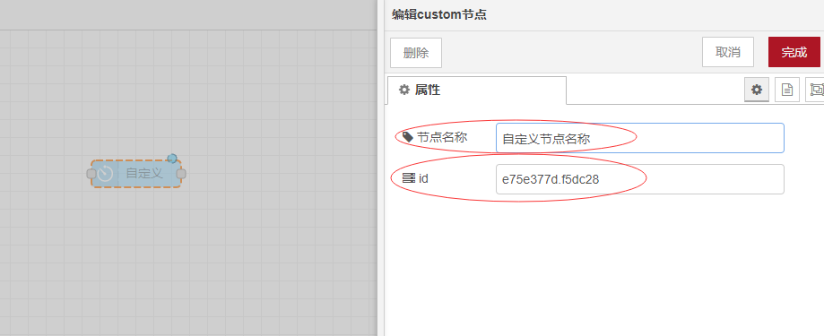

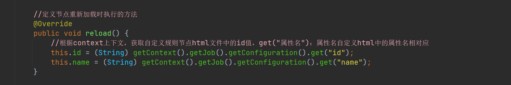
    <p>
        A：首先判断自定义<code>MyCustomExecutorProvider</code>的内部类<code>CustomTaskExecutor</code>的<code>reload()
</code>方法中get("xxxx")的<code>xxx</code>是否
与jetlinks-pro\jetlinks-components\rule-engine-component\src\main\resources\rule-engine\editor\common的自定义2-custom-node.
html中的id对应上，再确认自定义2-custom-node.
html中的<code>id</code>是否添加<code>node-input-</code>作为前缀
    </p>
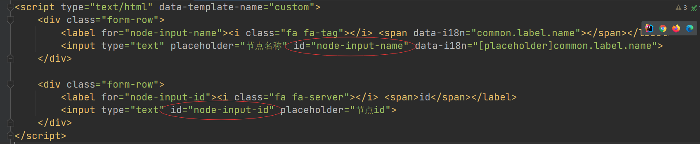


</div>


### 在规则实例中启动规则实例时,提示no scheduler for custom

<div class='explanation warning'>
  <p class='explanation-title-warp'>
    <span class='iconfont icon-bangzhu explanation-icon'></span>
    <span class='explanation-title font-weight'>问题3</span>
  </p>
    <p>
        Q：启动自定义规则时提示<code>no scheduler for custom</code>错误
    </p>
    <p>
        A：在<code>spring</code>服务启动时会将容器中实现了<code>TaskExecutorProvider</code>的类加入到HashMap中，如果出现重名的<code>executor</code>则会出现该错误。此时在后端代码自定义实现了<code>TaskExecutorProvider</code>的类中的<code>getExecutor()</code>方法中，重新编辑一个不重名的即可
    </p>
</div>


### @EditorResource注解中的helper参数路径动态化时如何使用

<div class='explanation warning'>
  <p class='explanation-title-warp'>
    <span class='iconfont icon-bangzhu explanation-icon'></span>
    <span class='explanation-title font-weight'>问题4</span>
  </p>
    <p>
        Q：<code>@EditorResource</code>注解中的<code>helper</code>参数路径动态化时只能用<code>{local}</code>？
    </p>
    <p>
        A：除了使用<code>{local}</code>外，还可以使用<code>{language}</code>和<code>{country}</code>
     <p>1. <code>{language}</code>启动时会被en、zh或者其他语言代码替代，对应的资源路径应为：<code>rule-engine/i18n/{语言}/common/custom-node.html</code></p>
     <p>2. <code>{country}</code>启动时会被CN、US或者其他地区代码替代，对应的资源路径应为：<code>rule-engine/i18n/{地区}/common/custom-node.html</code></p>
     <p>3. <code>{local}</code>启动时会被zh-CN、en-US或者其他语言-地区代码替代，对应的资源路径应为：<code>rule-engine/i18n/{语言-地区}
/common/custom-node.html</code>
</p>
    </p>
</div>


### 创建好自定义规则节点后,启动jetlinks-pro后端程序提示:nested exception is java.lang.NullPointerException
<div class='explanation warning'>
  <p class='explanation-title-warp'>
    <span class='iconfont icon-bangzhu explanation-icon'></span>
    <span class='explanation-title font-weight'>问题5</span>
  </p>
    <p>
        Q：创建好自定义规则节点后,启动jetlinks-pro后端程序提示:<code>`Error creating bean with name 'myCustomExecutorProvider' defined in 
class path resource [org/jetlinks/pro/standalone/mycustom/MyCustomExecutorProvider.class]: Initialization of bean failed; nested exception is java.lang.NullPointerException`</code>？
    </p>
    <p>
     自定义的规则引擎节点的getExecutor返回了null,如：

```java
    public String getExecutor() {
        return null;
    }
```
   </p>
    </p>
</div>


