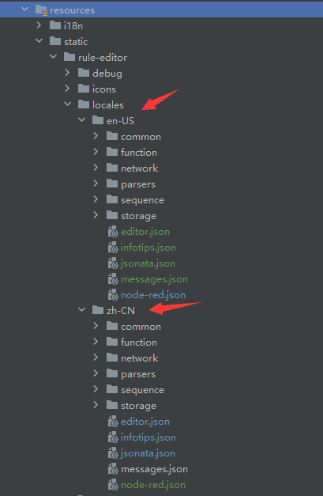

# 自定义规则引擎节点

## 应用场景

<div class='explanation primary'>
  <p class='explanation-title-warp'>
    <span class='iconfont icon-bangzhu explanation-icon'></span>
    <span class='explanation-title font-weight'>说明</span>
  </p>
    当规则引擎中的节点没有适合自身系统业务时，可以通过代码自定义规则引擎节点
</div>

## 指导介绍

  <p>1. <a href="/dev-guide/rule-engine.html#自定义节点">创建自定义节点后端代码，实现业务系统自定义节点功能</a> </p>
  <p>2. <a href="/dev-guide/rule-engine.html#配置自定义节点html">配置自定义节点html</a></p>
  <p>3. <a href="/dev-guide/rule-engine.html#在平台操作使用自定义节点">如何在平台操作使用自定义节点</a></p>
  <p>4. <a href="/dev-guide/rule-engine.html#规则引擎常见名词说明">规则引擎常见名词说明</a></p>
  <p>5. <a href="/dev-guide/rule-engine.html#自定义节点实现国际化支持">自定义节点实现国际化支持</a></p>

## 问题指引

<table>
<tr>
    <td><a href="/dev-guide/rule-engine.html#配置完成后规则引擎编辑器内未显示该节点">配置完成后规则引擎编辑器内未显示该节点</a></td>
    <td><a href="/dev-guide/rule-engine.html#无法取得自定义节点中配置的参数">无法取得自定义节点中配置的参数</a></td>
</tr>
<tr>
   <td><a href="/dev-guide/rule-engine.html#启动自定义规则时提示no-scheduler-for-custom">启动自定义规则时提示no-scheduler-for-custom</a></td>
    <td><a href="/dev-guide/rule-engine.html#editorresource注解中的helper参数路径动态化时如何使用">@EditorResource注解中的helper参数路径动态化时如何使用</a></td>
</tr>
<tr>
   <td><a href="/dev-guide/rule-engine.html#配置了jvm参数-在浏览器中-国际化相关配置不生效">配置了jvm参数-在浏览器中-国际化相关配置不生效</a></td>
</tr>

</table>

## 自定义节点

1、创建一个类实现接口<code>TaskExecutorProvider</code>,提供自定义节点的任务执行器

<div class='explanation primary'>
  <p class='explanation-title-warp'>
    <span class='iconfont icon-bangzhu explanation-icon'></span>
    <span class='explanation-title font-weight'>说明</span>
  </p>
   <p>需要使用<code>@Component</code>注解将任务执行器的自定义实现类加入容器</p>
   <p>在任务执行器的自定义实现类中，需要提供一个内部类实现<code>FunctionTaskExecutor</code>,用于执行自定义节点任务</p>
</div>

```java
@AllArgsConstructor
@Component
@EditorResource(
    id = "custom",
    name = "自定义组件",
    //节点显示需要填入的数据
    editor = "rule-engine/editor/common/2-custom-node.html",
    //该节点的说明页面
    helper = "rule-engine/i18n/zh-CN/common/2-custom-node.html",
    order = 2
)
public class MyCustomExecutorProvider implements TaskExecutorProvider {

    private final EventBus eventBus;

    //定义执行器标识
    @Override
    public String getExecutor() {
        return "custom";
    }

    //创建执行任务
    @Override
    public Mono<TaskExecutor> createTask(ExecutionContext context) {
        return Mono.just(new CustomTaskExecutor(context));
    }
	
    //定义一个内部类继承FunctionTaskExecutor
    class CustomTaskExecutor extends FunctionTaskExecutor {

        private String id;

        private String name;

        public CustomTaskExecutor(ExecutionContext context) {
            super("自定义执行器", context);
            reload();
        }

        //定义节点重新加载时执行的方法
        @Override
        public void reload() {
          //根据context上下文，获取自定义节点html文件中的id值，get("属性名")：属性名自定义html中的属性名相对应
          this.id = (String) getContext().getJob().getConfiguration().get("id");
          this.name = (String) getContext().getJob().getConfiguration().get("name");
        }

        //定义节点具体功能的方法，在此处实现自己系统的业务方法
       @Override
        protected Publisher<RuleData> apply(RuleData input) {
            return this.doSomething(input);
        }
        
        //此处为简单的例子
        //拿到配置中的id和name封装为map，再通过eventBus将数据发布到topic为/custom/id事件总线中
        public Publisher<RuleData> doSomething(RuleData input){
            Map<String, Object> data = new HashMap<>();
            data.put("id", id);
            data.put("name", name);
            data.put("executeTime", System.currentTimeMillis());

            input.acceptMap(data::putAll);

            return eventBus
                .publish(String.join("/", "custom", id), data)
                //转换新的数据
                .thenReturn(context.newRuleData(input.newData(data)));
        }
    }
}
```
2、上述示例一些简单说明

<table>
  <tr>
    <td>ExecutionContext context</td>
    <td>context – 上下文</td>
  </tr>
 <tr>
    <td><code>this.id = (String) getContext().getJob().getConfiguration().get("id")</code></td>
    <td>根据context上下文，获取自定义节点html文件中的id值</td>
  </tr>
 <tr>
    <td>RuleData input</td>
    <td>规则数据</td>
  </tr>
</table>

<div class='explanation primary'>
  <p class='explanation-title-warp'>
    <span class='iconfont icon-bangzhu explanation-icon'></span>
    <span class='explanation-title font-weight'>说明</span>
  </p>
    RuleData:规则数据
</div>

| 核心参数|类型|描述|
|--|-------|------|
|  id |   String   |  数据ID    |
|  contextId |   String   |  上下文ID,在一条数据创建时生成,在传递过程中此ID不变    |
|  data |   Object   |  真实数据   |

##  配置自定义节点html

1、在resources资源路径下<code>rule-engine.editor.common</code>下创建一个<code>2-custom-node.html</code>文件

2、配置节点所需填写内容

<div class='explanation primary'>
  <p class='explanation-title-warp'>
    <span class='iconfont icon-bangzhu explanation-icon'></span>
    <span class='explanation-title font-weight'>说明</span>
  </p>
    <p>
       <p>该节点需要配置的内容可以使用<code>input</code>标签声明，其中标签的<code>id</code>需要以<code>node-input-</code>为前缀</p>
       <p>如本例中的<code>id="node-input-name"</code></p>
       <p>在后端可以通过<code>getContext().getJob().getConfiguration().get("name")</code>获取对应的输入值</p>
    </p>
</div>


``` html
<script type="text/html" data-template-name="custom">
    <div class="form-row">
        <label for="node-input-name"><i class="fa fa-tag"></i> <span data-i18n="common.label.name"></span></label>
        <input type="text" placeholder="节点名称" id="node-input-name" data-i18n="[placeholder]common.label.name">
    </div>

    <div class="form-row">
        <label for="node-input-id"><i class="fa fa-server"></i> <span>id</span></label>
        <input type="text" id="node-input-id" placeholder="节点id">
    </div>
</script>

<script type="text/javascript">
    (function () {
        RED.nodes.registerType('custom', {
            category: 'common',
            name: "自定义",
            color: "#66ccff",
            defaults: {
                 name: {name:""},
                 id: {id:""}
            },
            inputs: 1,
            outputs: 1,
            icon: "timer.svg",
            label: function () {
                return this.name || "自定义";
            },
            labelStyle: function () {
                return this.name ? "node_label_italic" : "";
            },
            oneditprepare: function () {
            },
        });
    })()
</script>

```

3、在resources资源路径下<code>rule-engine.i18n.zh-CN.common</code>创建<code>2-custom-node.html</code>并配置节点说明（可选）

```html
<script type="text/html" data-help-name="custom">
  <p>自定义节点</p>
  <p>需要填入id</p>
  <p>需要填入name</p>
</script>
```

<br>

以上配置完成后可以在规则引擎编辑器中看到自定义的节点


##  在平台操作使用自定义节点

<div class='explanation primary'>
  <p class='explanation-title-warp'>
    <span class='iconfont icon-bangzhu explanation-icon'></span>
    <span class='explanation-title font-weight'>说明</span>
  </p>
    <p>
     以如下图规则模型所示：
      <p>定时任务(配置cron表达式)--->自定义节点(配置数据)--->reactorQl(订阅自定义节点数据)--->函数(打印日志)</p>
    </p>
</div>
1、在规则引擎编辑器中放置如下组件


2、节点内容分别如下

定时任务配置


自定义节点配置


reactorQL配置


函数配置


全部配置完成后点击右上角的部署保存

3、启动自定义规则，右侧点击<code>debug</code>按钮，执行效果如下


##  规则引擎常见名词说明

<table>
    <tr>
        <td>RuleModel(规则模型)</td>
        <td>由多个RuleNode(规则节点),RuleLink(规则连线)组成</td>
    </tr>
     <tr>
        <td>RuleNode(规则节点)</td>
        <td>规则节点描述具体执行的逻辑</td>
    </tr>
     <tr>
        <td>RuleLink(规则连线)</td>
        <td>用于将多个节点连接起来,将上一个节点的输出结果作为下一个节点的输入结果.</td>
    </tr>
     <tr>
        <td>Input(输入)</td>
        <td>规则节点的数据输入,可以是上游节点的输出数据，也可以通过自身html配置</td>
    </tr>
     <tr>
        <td>Output(输出)</td>
        <td>规则节点的数据输出,将数据流向下游节点</td>
    </tr>
     <tr>
        <td>Scheduler(调度器)</td>
        <td>负责将模型转为任务(Job),并进行任务调度到Worker</td>
    </tr>
     <tr>
        <td>Worker(工作器)</td>
        <td>负责执行,维护任务.</td>
    </tr>
     <tr>
        <td>ExecutionContext(执行上下文)</td>
        <td>启动任务时的上下文,通过上下文获取输入输出配置信息等进行任务处理.</td>
    </tr>
   <tr>
        <td>TaskExecutor(任务执行器)</td>
        <td>具体执行任务逻辑的实现</td>
    </tr>
   <tr>
        <td>TaskExecutorProvider(任务执行器提供商)</td>
        <td>用于根据模型配置以及上下文创建任务执行器.</td>
    </tr>
   <tr>
        <td>RuleData(规则数据)</td>
        <td>任务执行过程中的数据实例</td>
    </tr>
</table>


##  自定义节点实现国际化支持

<div class='explanation primary'>
  <p class='explanation-title-warp'>
    <span class='iconfont icon-bangzhu explanation-icon'></span>
    <span class='explanation-title font-weight'>提示</span>
  </p>
    <p>可以配置参数切换主时区</p>
</div>

### 以美国地区示例：
```java
   //en:代表语言
  -Duser.language=en
   //US:代表国家
  -Duser.region=US

```
#### 1.jar方式：
  在启动时加上参数：
```java
-Duser.language=en -Duser.region=US
```
#### 2.docker镜像方式
docker-compose.yaml文件对应镜像的environment参数加上如下配置：
```yaml
 - "JAVA_OPTS=-Duser.language=en -Duser.region=US"
```
 

### editor国际化

#### 获取node-red国际化文件  [node-red国际化文件](https://github.com/node-red/node-red/tree/master/packages/node_modules/%40node-red/editor-client/locales).

#### 将平台的`jetlinks-pro\jetlinks-manager\rule-engine-manager\src\main\resources\static\rule-editor\locales`目录整理成如下结构

<div class='explanation primary'>
  <p class='explanation-title-warp'>
    <span class='iconfont icon-bangzhu explanation-icon'></span>
    <span class='explanation-title font-weight'>提示</span>
  </p>
    <p>文档中的zh-CN目录JSON文件，为原来平台<code>jetlinks-pro\jetlinks-manager\rule-engine-manager\src\main\resources\static
\rule-editor\locales</code>目录下JSON文件</p>
<p>en-US下node-red.json文件是对zh-CN目录node-red.json文件的翻译</p>
</div>




#### 利用代码块中资源加载路劲替换接口中原有加载路劲

1.`org.jetlinks.pro.rule.engine.web.editor.RuleEngineEditorController/locales/editor`
```java
static/rule-editor/locales/"+Locale.getDefault().toString().replace("_","-")+"/editor.json").getInputStream()
```

2.`org.jetlinks.pro.rule.engine.web.editor.RuleEngineEditorController/locales/infotips`
```java
static/rule-editor/locales/"+Locale.getDefault().toString().replace("_","-")+"/infotips.json").getInputStream()
```

3.`org.jetlinks.pro.rule.engine.web.editor.RuleEngineEditorController/locales/jsonata`
```java
static/rule-editor/locales/"+Locale.getDefault().toString().replace("_","-")+"/jsonata.json").getInputStream()
```

4.`org.jetlinks.pro.rule.engine.web.editor.RuleEngineEditorController/locales/node-red`
```java
InputStream stream = new ClassPathResource("static/rule-editor/locales/"+Locale.getDefault().toString().replace("_","-")+"/node-red.json").getInputStream()
```

### helper国际化

#### 1.替换MyCustomExecutorProvider注解中的helper
```java
@EditorResource(
    id = "custom",
    name = "自定义组件",
    //节点显示需要填入的数据
    editor = "rule-engine/editor/common/2-custom-node.html",
    //该节点的说明页面
    helper = "rule-engine/i18n/{local}/common/2-custom-node.html",
    order = 2
)
```
<div class='explanation primary'>
  <p class='explanation-title-warp'>
    <span class='iconfont icon-bangzhu explanation-icon'></span>
    <span class='explanation-title font-weight'>说明</span>
  </p>
   <p><code>helper = "rule-engine/i18n/{language}/common/custom-node.html</code></p>
   <p>{locale}代表一种语言以及国家/地区</p>
   <p>程序启动时会在<code>org.jetlinks.pro.rule.engine.editor.resolve</code>替换成真正的路径，如被zh-CN、en-US或者其他替代</p>
</div>


### 3.创建I18n en-US相关的html文件

`rule-engine/i18n/en-US/common/2-custom-node.html`

```html
<script type="text/html" data-help-name="custom">
    <p>custom node</p>
    <h3>example</h3>
    <code>
    <pre>
    id:d1257d60.3add8
    name:custom i18n
    </pre>
    </code>
</script>
```


### 4.helper国际化html文档结构图如下：


## 常见问题

*对开发过程中出现的问题进行总结*

### 配置完成后规则引擎编辑器内未显示该节点

<div class='explanation warning'>
  <p class='explanation-title-warp'>
    <span class='iconfont icon-bangzhu explanation-icon'></span>
    <span class='explanation-title font-weight'>问题1</span>
  </p>
    <p>
        Q：自定义节点配置完成后，规则引擎编辑器内左侧组件中未出现该节点
    </p>
    <p>
        A：确认后台代码自定义的类中<code>@EditorResource</code>注解内的<code>id</code>是否与前端页面中的<code>RED.nodes.registerType</code>第一个参数名对应
    </p>
</div>


### 无法取得自定义节点中配置的参数

<div class='explanation warning'>
  <p class='explanation-title-warp'>
    <span class='iconfont icon-bangzhu explanation-icon'></span>
    <span class='explanation-title font-weight'>问题2</span>
  </p>
    <p>
        Q：后台无法取得自定义节点中配置的参数
    </p>
    <p>
        A：首先判断与前端页面中规定的名称是否对的上，再确认前端在进行<code>id</code>绑定时是否添加<code>node-input-</code>的前缀
    </p>
</div>


### 启动自定义规则时提示no scheduler for custom

<div class='explanation warning'>
  <p class='explanation-title-warp'>
    <span class='iconfont icon-bangzhu explanation-icon'></span>
    <span class='explanation-title font-weight'>问题3</span>
  </p>
    <p>
        Q：启动自定义规则时提示<code>no scheduler for custom</code>错误
    </p>
    <p>
        A：在<code>spring</code>服务启动时会将容器中实现了<code>TaskExecutorProvider</code>的类加入到HashMap中，如果出现重名的<code>executor</code>则会出现该错误。此时在后端代码自定义实现了<code>TaskExecutorProvider</code>的类中的<code>getExecutor()</code>方法中，重新编辑一个不重名的即可
    </p>
</div>


### @EditorResource注解中的helper参数路径动态化时如何使用

<div class='explanation warning'>
  <p class='explanation-title-warp'>
    <span class='iconfont icon-bangzhu explanation-icon'></span>
    <span class='explanation-title font-weight'>问题4</span>
  </p>
    <p>
        Q：<code>@EditorResource</code>注解中的<code>helper</code>参数路径动态化时只能用<code>{local}</code>？
    </p>
    <p>
        A：除了使用<code>{local}</code>外，还可以使用<code>{language}</code>和<code>{country}</code>
     <p>1. <code>{language}</code>启动时会被en、zh或者其他语言代码替代，对应的资源路径应为：<code>rule-engine/i18n/{语言}/common/custom-node.html</code></p>
     <p>2. <code>{country}</code>启动时会被CN、US或者其他地区代码替代，对应的资源路径应为：<code>rule-engine/i18n/{地区}/common/custom-node.html</code></p>
     <p>3. <code>{local}</code>启动时会被zh-CN、en-US或者其他语言-地区代码替代，对应的资源路径应为：<code>rule-engine/i18n/{语言-地区}
/common/custom-node.html</code>
</p>
    </p>
</div>

### 配置了jvm参数，在浏览器中：国际化相关配置不生效？

<div class='explanation warning'>
  <p class='explanation-title-warp'>
    <span class='iconfont icon-bangzhu explanation-icon'></span>
    <span class='explanation-title font-weight'>问题5</span>
  </p>
    <p>
        Q：配置了jvm参数，在浏览器中：国际化相关配置不生效？
    </p>
    <p>
        A：对应得浏览器也应该设置相应语言才会生效，如chrome浏览器，需要<code>settings-Languages-Preferred languages</code>
设置浏览器首选语言
/common/custom-node.html</code>
</p>
    </p>
</div>
