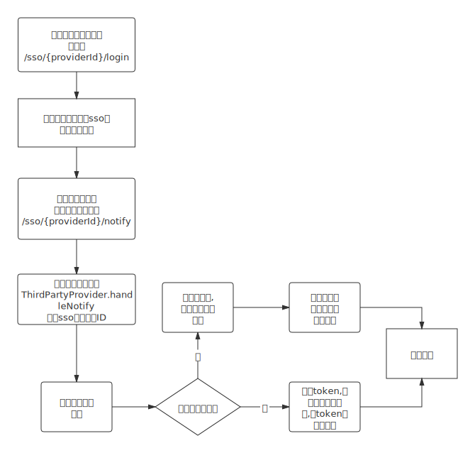

# 统一单点登录

从`1.5.0版本`后,企业版增加来统一到单点登录支持. 默认实现了通用OAuth2方式登录，还可以自定义实现登录方案.

## 流程



## 自定义单点登录

实现接口`ThirdPartyProvider`,并注入到spring即可.

## 配置

```yml
sso:
  token-set-page-url: http://localhost:9000/jetlinks/token-set.html # 设置token的地址,此地址将参数中的token设置到本地,然后跳转到首页
  bind-page-url: http://localhost:9000/#/user/login # 和第三方用户绑定的地址,通常就是登录本平台的地址.
  base-url: http://localhost:9000   #访问平台的根地址
```
## OAuth2

平台实现了通用到OAuth2方式登录，配置方式:

```yml
sso:
  oauth2:
    - id: gitee # 唯一标识
      name: 开源中国    # 名称
      client-id: clientId
      client-secret: clientSecuret
      authorize-url: https://gitee.com/oauth/authorize  # 跳转登录的地址
      token-url: https://gitee.com/oauth/token  # 获取token的接口
      user-info-url: https://gitee.com/api/v5/user  # 获取用户信息的接口
      user-id-property: login   # 用户信息接口返回json中用户id的字段
      redirect-uri: http://localhost:9000/jetlinks/sso/notify/gitee # 申请token时传入的重定向地址,与OAuth2平台配置一致
```