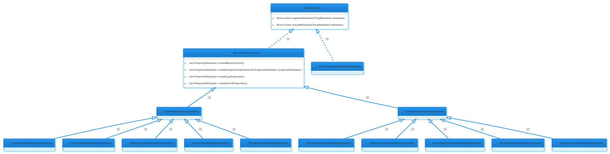
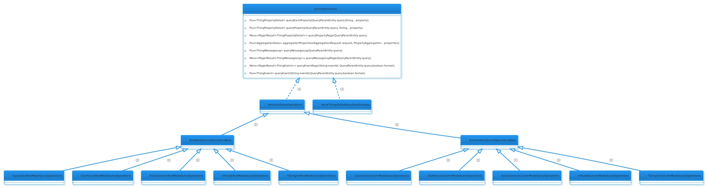

### 关于平台存储的说明

#### 使用场景

  

    
    说明
  

  
平台设备实时数据存储在产品接入选择的存储策略内。

#### 核心类说明

| 类名 | 说明                                                                 |
|----------------|--------------------------------------------------------------------|
| `DeviceDataRepository` | 设备数据仓库,用户存储和查询设备相关历史数据,默认实现`ThingsBridgingDeviceDataService`       |
| `ThingsDataRepository` | 物数据仓库,用于保存和查询物模型相关数据: 属性,事件,以及日志,默认实现`DefaultThingsDataRepository` |
| `ThingsDataRepositoryStrategy` | 物数据仓库存储策略,实现此接口来自定义存储策略，具体存储策略实现类见下表1.                             |
| `ThingsRegistry` | 物注册中心,统一管理物的基础信息以及配置等信息, 具体实现类见下表2.                                |

- 表1.

| 类名 | 说明                                                                      |
|----------------|-------------------------------------------------------------------------|
|`CacheSaveOperationsStrategy` | 缓存操作存储基类 ,所有的存储操作均经过该类，主要是使用cache减少存储操作对象的创建                            |
|`AbstractThingDataRepositoryStrategy` | 物数据存储策略抽象基类，继承`CacheSaveOperationsStrategy`。下列类均继承该类，该类默认封装了数据库的操作对象信息。 |
|`CassandraColumnModeStrategy` | Cassandra-列式存储                                                          |
|`CassandraRowModeStrategy` | Cassandra-行式存储                                                          |
|`ClickhouseColumnModeStrategy` | ClickHouse-列式存储                                                         |
|`ClickhouseRowModeStrategy` | ClickHouse-行式存储                                                         |
|`ElasticSearchColumnModeStrategy` | ElasticSearch-列式存储                                                      |
|`ElasticSearchRowModeStrategy` | ElasticSearch-行式存储                                                      |
|`InfluxdbColumnModeStrategy` | Influxdb-列式存储                                                           |
|`InfluxdbRowModeStrategy` | Influxdb-行式存储                                                           |
|`NoneThingsDataRepositoryStrategy` | 不存储，顾名思义，所有设备数据不进行持久化。                                                  |
|`TDengineColumnModeStrategy` | TDEngine-列式存储                                                           |
|`TDengineRowModeStrategy` | TDEngine-行式存储                                                           |

- 表2.

| 类名 | 说明                                               |
|----------------|--------------------------------------------------|
|`AutoRegisterThingsRegistry` | 自动注册物信息类，在spring组件初始化之后将该实体放置缓存内。                |
|`DefaultThingsRegistry` | 统一的物注册中心默认实现，主要是获取物模板（产品）、物（设备）信息以及注册物和物模版等相关操作。 |

#### 核心方法说明

- `AbstractDDLOperations`

  

    
    说明
  

  
AbstractDDLOperations抽象物数据表DDL操作类,主要用于动态创建表结构或者索引映射。它有两个子类：
  RowModeDDLOperationsBase和
  ColumnModeDDLOperationsBase

  
因行式存储和列式存储的表结构数据存在差异，所以平台重写了父类的createPropertyProperties(List&lt;PropertyMetadata&gt;propertyMetadata)方法。

| 方法名 | 返回值 | 参数值 | 说明                                            |
|------- |--------|----------|-----------------------------------------------|
| `registerMetadata(ThingMetadata metadata)`                          | `ThingMetadata`          | `Mono<Void>`             | 注册物模型，产品发布及更新时会触发注册物模型的操作。                    |
| `reloadMetadata(ThingMetadata metadata)`                            | `ThingMetadata`          | `Mono<Void>`             | 集群模式下，非执行节点会监听其他服务节点，当产品发布变更物模型消息事件时，此动作会被触发。 |
| `createBasicColumns()`                                              | -                        | `List<PropertyMetadata>` | 创建基础表结构信息、索引映射信息。                             |
| `createPropertyProperties(List<PropertyMetadata> propertyMetadata)` | `List<PropertyMetadata>` | `List<PropertyMetadata>` | 创建物属性表结构元信息                                   |
| `createEventProperties()`                                           | -                        | `List<PropertyMetadata>` | 创建物事件表结构元信息 ，仅将数据类型处理成`String`类型存储            |
| `createEventProperties(EventMetadata event)`                        | `EventMetadata`          | `List<PropertyMetadata>` | 创建物事件表结构元信息，此方法会处理`Object`类型的数据，对象中的每一个属性都会被创建为一列,数据会存储到对应的列中              |
| `createLogProperties()`                                             | -                        | `List<PropertyMetadata>` | 创建物日志表结构元信息                                   |

- `AbstractQueryOperations`

  

    
    说明
  

  
AbstractQueryOperations抽象物数据表查询实例。它有两个子类：
  RowModeQueryOperationsBase和
  ColumnModeQueryOperationsBase

| 方法名                                                                                    | 参数                                                           | 返回值                           | 说明                       |
|----------------------------------------------------------------------------------------|--------------------------------------------------------------|-------------------------------|--------------------------|
| `queryEachProperty(QueryParamEntity query, String... property)`                        | `query`:查询条件  `property`:指定要查询的属性,不指定则查询全部属性             | `Flux<ThingPropertyDetail>`   | 按条件查询每一个属性,通常用于同时查询多个属性值 |
| `queryPropertyPage(QueryParamEntity query, String... property)`                        | `query`:查询条件  `property`:指定要查询的属性,不指定则查询全部属性             | `Mono<PagerResult<ThingPropertyDetail>>`   | 分页查询属性数据,通常用于查询单个属性的历史列表 |
| `aggregationProperties(AggregationRequest request, PropertyAggregation... properties)` | `request`:聚合请求  `properties`:属性聚合方式                      | `Flux<AggregationData>`   | 聚合查询属性数据                 |
| `queryEachProperty(QueryParamEntity query, String... property)`                        | `query`:查询条件  `property`:指定要查询的属性,不指定则查询全部属性             | `Flux<ThingPropertyDetail>`   | 按条件查询每一个属性,通常用于同时查询多个属性值 |
| `queryPropertyPage(QueryParamEntity query, String... property)`                        | `query`:查询条件  `property`:指定要查询的属性,不指定则查询全部属性             | `Mono<PagerResult<ThingPropertyDetail>>`   | 分页查询历史属性信息               |
| `queryMessageLog(QueryParamEntity param)`                                              | `query`:查询条件                                             | `Mono<PagerResult<ThingMessageLog>>`   | 查询设备日志数据                 |
| `queryEventPage(String eventId,QueryParamEntity param,boolean format)`                 | `query`:查询条件  `eventId`:事件ID  `format`是否格式化，默认`true` | `Mono<PagerResult<ThingEvent>>`   | 查询设备事件数据                 |

- `AbstractSaveOperations`

  

    
    说明
  

  

AbstractSaveOperations抽象物数据保存操作类,实现对物消息的处理以及数据转换,转换为标准的数据结构进行存储。
  此抽象类通常配合AbstractDDLOperations，AbstractQueryOperations一起使用。
  该类主要包含属性存储，事件存储，日志存储三部分。
  它有两个子类： 
  RowModeSaveOperationsBase和
  ColumnModeSaveOperationsBase

  
 
    
    提示
  

  
1. 默认情况下,所有的设备属性都会记录在属性表内。

  
2. 默认情况下,所有的设备消息都将会存储到日志表。

  
3. 设备事件存储存在两种模式，第一种：一个事件一张数据表【默认】，第二种：全部事件使用一张数据表。

  
4. 事件存储一个事件一张表时，持按事件物模型中的字段进行搜索，但是不支持设备定义单独的事件物模型。

| 方法名                                | 参数              | 返回值           | 说明                                         |
|------------------------------------|-----------------|---------------|--------------------------------------------|
| `save(ThingMessage thingMessage)`  | `ThingMessage`  | `Mono<Void>`  | 保存单个物消息,通常此操作不会立即写入物消息数据,而是会缓存到内存中,等待批量写入  |

#### 常见问题

  

    
    问题1
  

  
Q：如何设置某些属性数据不存储？

  
A：解决方案如下:
      
1. 可通过org.jetlinks.core.message.Message.addHeader(String, Object)设置 Headers.ignoreStorage来标识不存储此条数据。

      
2. 定义产品属性物模型时设置存储策略：不存储。

  

  

    
    问题2
  

  
Q：如何设置全部事件使用一张数据表？

  
A：当DataSettings.Event.eventIsAllInOne()为true时生效，因此需要设置
DataSettings.Event.usingJsonString和DataSettings.Event.allInOne为true时，设备的全部事件会以json字符串的行式存储在时序库内。此模式不支持按事件物模型中的字段进行搜索。
  

  

    
    问题3
  

  
Q：如何设置仅存储部分消息类型的设备日志？

  
A：解决方案如下:
      
1. 在org.jetlinks.core.message.Message.addHeader(String, Object)中设置Headers.ignoreLog为true来忽略存储日志。

      
2. 可通过DataSettings.Log.setExcludes(Set)方法指定传入不需要存储的日志类型。

      
3. 在配置文件application.yml下配置jetlinks.device.storage.log.excludes内添加不需要存储的日志类型。

  

  

    
    问题4
  

  
Q：td表删除后无法创建？

  
A：解决方案如下:
      
1. 可通过org.jetlinks.core.message.Message.addHeader(String, Object)设置Headers.ignoreStorage来标识不存储此条数据。

      
2. 定义产品属性物模型时设置存储策略：不存储。

  

  

    
    问题5
  

  
Q：以上存储策略均不符合自己的业务场景？

  
A：自己实现存储策略。<a target='_self' class='explanation-title font-weight' href='/dev-guide/code-guide.html#%E6%B7%BB%E5%8A%A0%E8%87%AA%E5%AE%9A%E4%B9%89%E5%AD%98%E5%82%A8%E7%AD%96%E7%95%A5'>
  自定义存储策略</a>

