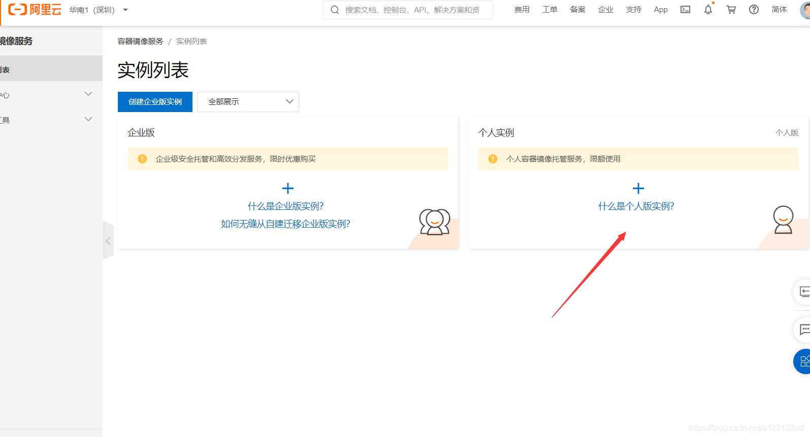
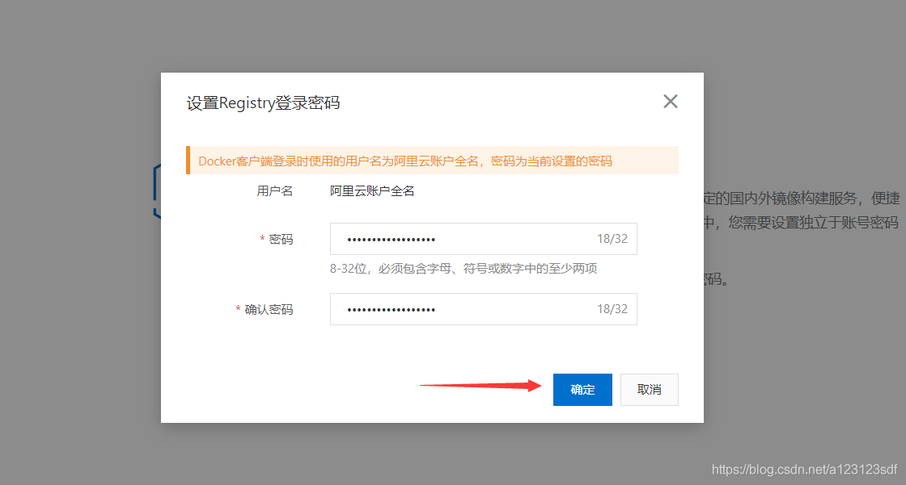
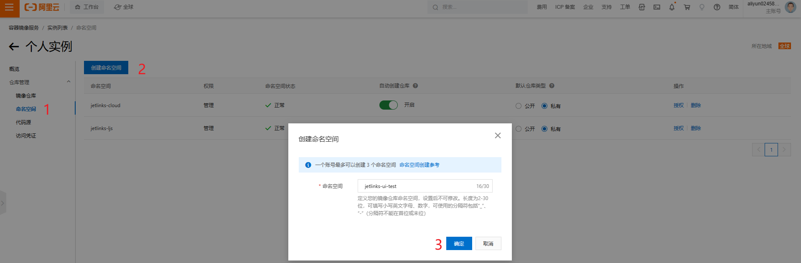
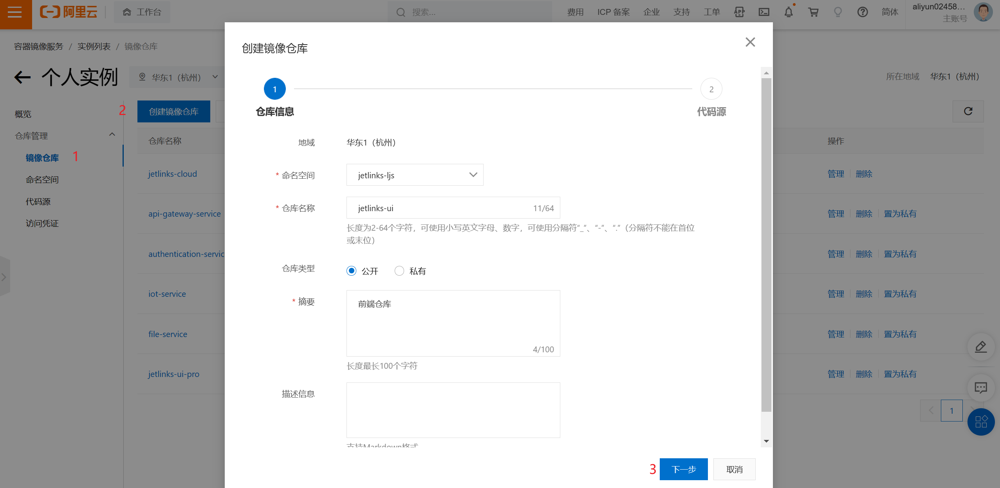
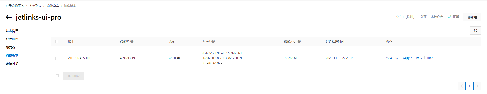

# 前端部署说明

<div class='explanation primary'>
  <p class='explanation-title-warp'>
    <span class='iconfont icon-bangzhu explanation-icon'></span>
    <span class='explanation-title font-weight'>说明</span>
  </p>
  <p>本文档部署环境为Centos7，提供了两种部署方式分别为源码部署和docker部署，可根据实际情况选择对应的部署方式。社区版、企业版和微服务版共用一个前端，部署方式统一参照本文档。</p>
</div>

## 指导介绍
1. <a href="/dev-guide/ui-deploy.html#打包前端镜像">使用命令打包前端镜像</a>
2. <a href="/dev-guide/ui-deploy.html#修改nginx文件">修改nginx文件，使用源码方式启动</a>
3. <a href="/dev-guide/ui-deploy.html#创建阿里云镜像仓库">创建阿里云镜像仓库</a>
4. <a href="/dev-guide/ui-deploy.html#推送镜像到仓库">推送镜像到仓库，使用镜像方式启动</a>

## 问题指引
<table>
<tr>
    <td><a href="/dev-guide/pull-code.html#permission-denied-please-try-again">`yarn install`时出现版本`node`版本不兼容的报错</a></td>
    <td><a href="/dev-guide/pull-code.html#拉取代码git抛出无权限异常">拉取代码git抛出无权限异常</a></td>
</tr>
<tr>
   <td><a href="/dev-guide/pull-code.html#上传协议包抛出无法加载协议异常">上传协议包抛出无法加载协议异常</a></td>
    <td><a href="/dev-guide/pull-code.html#下载完源码后maven编译失败">下载完源码后maven编译失败</a></td>
</tr>
</table>

## 源码方式部署

### 版本说明

- nodeJs v12.18.1
- yarn 1.22.19

### 操作步骤
#### 拉取源代码
1. 拉取源代码

```shell
$ git clone git@github.com:jetlinks/jetlinks-ui-antd.git
```

<div class='explanation primary'>
  <p class='explanation-title-warp'>
    <span class='iconfont icon-bangzhu explanation-icon'></span>
    <span class='explanation-title font-weight'>说明</span>
  </p>
  <p>前端源码是开源的且无额外的仓库，源码克隆下来之后，需要将分支从master切换到2.0分支。</p>
</div>

#### 打包前端镜像
2. 使用yarn打包,并将打包后生成的dist文件复制到项目的docker目录下（命令在项目根目录下执行）

3. 执行下方命令

```shell
yarn install
yarn build 
```
#### 修改nginx文件
4. 将打包的`dist`资源文件，上传至服务器上。

5. 使用`pwd`查看`dist`目录的绝对路径。

6. 修改nginx.conf配置文件，nginx配置参考:

```conf
server {
    listen 80;
    # gzip config
    gzip on;
    gzip_min_length 1k;
    gzip_comp_level 9;
    gzip_types text/plain text/css text/javascript application/json application/javascript application/x-javascript application/xml;
    gzip_vary on;
    gzip_disable "MSIE [1-6]\.";

    # 修改为pwd命令指向的完整资源路径
    root /usr/share/nginx/html;
    include /etc/nginx/mime.types;
    location / {
        index  index.html;
    }

    location ^~/api/ {
        #修改此地址为后台服务地址
        proxy_pass http://xxx:8844/; 
        proxy_set_header X-Forwarded-Proto $scheme;
        proxy_set_header Host $host:$server_port;
        proxy_set_header X-Real-IP  $remote_addr;
        proxy_set_header X-Forwarded-For $proxy_add_x_forwarded_for;
        proxy_http_version 1.1;
        proxy_set_header Upgrade $http_upgrade;
        proxy_set_header Connection "upgrade";
        proxy_connect_timeout   1;
        proxy_buffering off;
        chunked_transfer_encoding off;
        proxy_cache off;
        proxy_send_timeout      30m;
        proxy_read_timeout      30m;
        client_max_body_size    100m;
    }
}
```

7. 启动nginx服务。

### 常见问题


<div class='explanation warning'>
  <p class='explanation-title-warp'>
    <span class='iconfont icon-bangzhu explanation-icon'></span>
    <span class='explanation-title font-weight'>问题1</span>
  </p>

`yarn install`时出现版本`node`版本不兼容的报错。

```shell
error react-dev-utils@12.0.1: The engine "node" is incompatible with this module. Expected version ">=14". Got "12.18.1"
error Found incompatible module.
```

使用`yarn install --ignore-engines`命令忽略，再重新执行`yarn build`命令打包资源文件。

</div>


<div class='explanation warning'>
  <p class='explanation-title-warp'>
    <span class='iconfont icon-bangzhu explanation-icon'></span>
    <span class='explanation-title font-weight'>问题2</span>
  </p>
  <p>Q：如访问前端时发现接口出现502状态码？</p>
  <p>A：502、504状态码一般是后端服务异常、或者nginx配置文件内的<span class='explanation-title font-weight'>proxy_pass</span>不正确导致的。</p>
</div>

### 使用docker部署前端

#### 创建阿里云镜像仓库

1. 进入阿里云容器镜像服务页面
网址:`https://cr.console.aliyun.com/cn-hangzhou/instances`
2. 开通镜像服务

   
   

<div class='explanation info'>
  <p class='explanation-title-warp'> 
    <span class='iconfont icon-tishi explanation-icon'></span>
    <span class='explanation-title font-weight'>提示</span>
  </p>
<p>这里设置的密码需要记住，后面推送镜像到仓库时需要用到</p>

</div>

3. 创建命名空间

   

4. 创建镜像仓库
   

#### 推送镜像到仓库

1. 将`dist`资源文件目录拷贝至`docker`目录下
2. 构建docker镜像

```bash
docker build -t registry.cn-shenzhen.aliyuncs.com/jetlinks-ui-test/jetlinks-ui-pro:2.0.0 ./docker
```

<div class='explanation info'>
  <p class='explanation-title-warp'>
    <span class='iconfont icon-tishi explanation-icon'></span>
    <span class='explanation-title font-weight'>提示</span>
  </p>
  <p>如需提交自己的仓库，请自行更换自己的仓库地址。</p>
</div>


3. 查看镜像是否构建成功`docker images`

```
$ docker images
REPOSITORY                                                            TAG                 IMAGE ID       CREATED          SIZE
registry.cn-shenzhen.aliyuncs.com/jetlinks-ui-test/jetlinks-ui-pro    2.0.0               f76af6002bcd   13 seconds ago   176MB
```

4. 将镜像推送到远程仓库

```bash
#登录阿里云镜像仓库，此处会让你输密码，就是创建镜像服务时自己设置的密码
docker login --username=[username] registry.cn-hangzhou.aliyuncs.com
#设置tag
docker tag [ImageId] registry.cn-hangzhou.aliyuncs.com/jetlinks-ui-test/jetlinks-ui-pro:2.0.0-SNAPSHOT
#推送到阿里云镜像仓库
docker push registry.cn-hangzhou.aliyuncs.com/jetlinks-ui-test/jetlinks-ui-pro:2.0.0-SNAPSHOT
```

<div class='explanation info'>
  <p class='explanation-title-warp'>
    <span class='iconfont icon-tishi explanation-icon'></span>
    <span class='explanation-title font-weight'>提示</span>
  </p>
  username和ImageId这两个参数需要自行替换,username为阿里云账户全名,ImageId为本地构建镜像的id
</div>

5. 查看是否推送成功



6. 运行docker镜像

```bash
docker run -it --rm -p 9000:80 -e "API_BASE_PATH=http://xxx:8844/" registry.cn-shenzhen.aliyuncs.com/jetlinks-ui-test/jetlinks-ui-pro:2.0.0
```

<div class='explanation warning'>
  <p class='explanation-title-warp'>
    <span class='iconfont icon-bangzhu explanation-icon'></span>
    <span class='explanation-title font-weight'>说明</span>
  </p>
<p>环境变量<span class='explanation-title font-weight'>API_BASE_PATH</span>为后台API根地址，由docker容器自行转发代理，请根据自己的系统配置，
<span class='explanation-title font-weight'>API_BASE_PATH</span>请使用ipv4地址，使用locahost或者127.0.0.1会因docker地址解析错误而启动镜像失败。</p>
</div>

