## 产品
产品管理对具有相同功能的设备模型进行统一的维护管理，包括产品的基本信息、物模型、设备接入等功能。
### 功能列表

#### 新增
##### 操作步骤
1.**登录**Jetlinks物联网平台。 
2.在左侧导航栏，选择**设备管理>产品**，点击**新增**。 
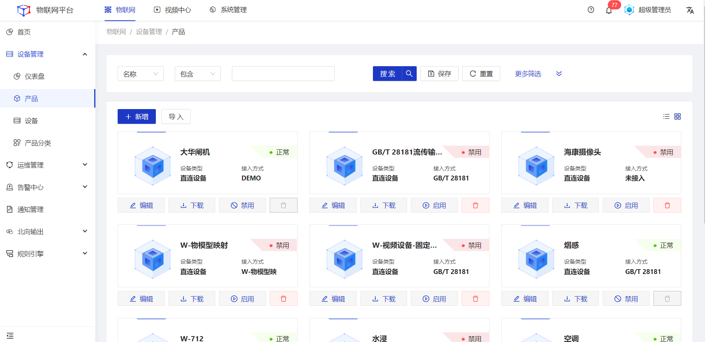
3.在**新建**弹框中，根据设备实际情况，按照页面提示填写信息，然后单击**确定**。 
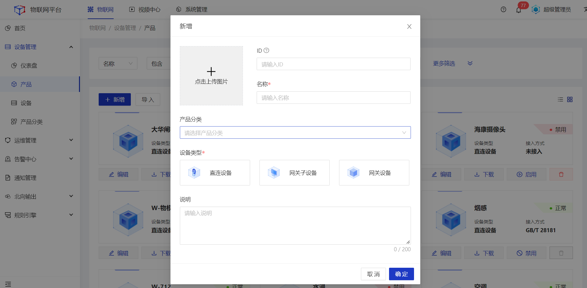

<table class='table'>
        <thead>
            <tr>
              <td>参数</td>
              <td>说明</td>
            </tr>
        </thead>
        <tbody>
          <tr>
            <td>ID</td>
            <td>设备唯一标识，在系统内具有全局唯一性。</td>
          </tr>
          <tr>
            <td>名称</td>
            <td>为设备命名，最多可输入64个字符。</td>
          </tr>
          <tr>
            <td>产品分类</td>
            <td>单选下拉框，非必填。可根据业务实际情况选择产品分类。</td>
          </tr>
          <tr>
            <td>说明</td>
            <td>备注说明信息，最多可输入200个字符</td>
          </tr>
        </tbody>
</table>

#### 编辑
##### 操作步骤
1.**登录**Jetlinks物联网平台。 
2.在左侧导航栏，选择**设备管理>产品**，选择具体产品。点击**编辑**。 
3.在**编辑**弹框中，编辑相关配置，然后单击**确定**。 
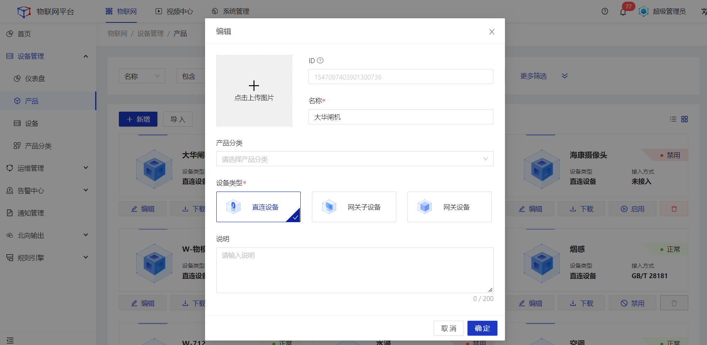

  

    
    说明
  

 ID不可编辑。

#### 启用/禁用
##### 操作步骤
1.**登录**Jetlinks物联网平台。 
2.在左侧导航栏，选择**设备管理>产品**，选择具体产品。点击**启用/禁用**。 
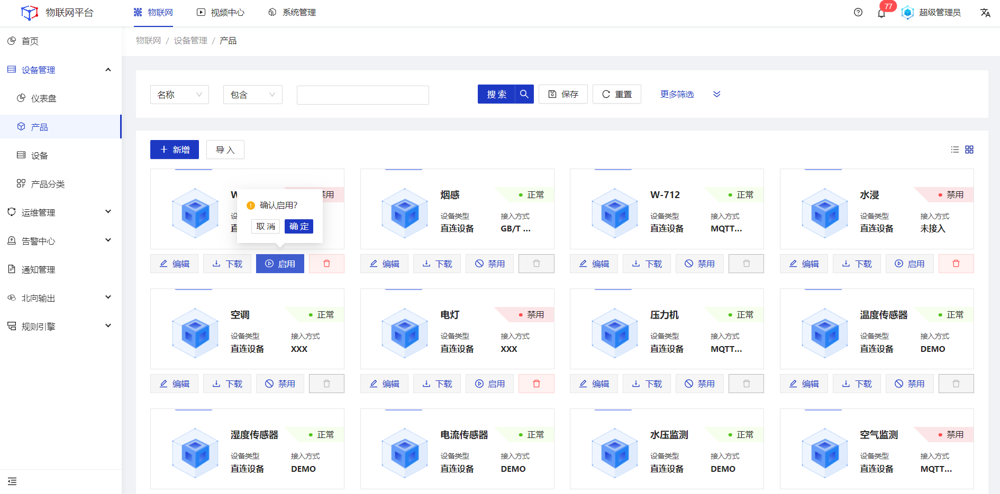

  

    
    说明
  

  <li>产品在正常状态时，按钮显示为禁用；产品在禁用状态时，按钮显示为启用。</li>
  <li>产品禁用后，设备无法再接入。但不影响已经接入的设备。</li>

#### 删除
##### 操作步骤
1.**登录**Jetlinks物联网平台。 
2.在左侧导航栏，选择**设备管理>产品**，选择具体产品。点击**删除**。 
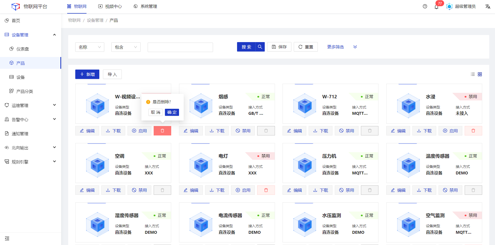

  

    
    说明
  

  产品在正常状态时，不可删除。

#### 导入
##### 操作步骤
1.**登录**Jetlinks物联网平台。 
2.在左侧导航栏，选择**设备管理>产品**，点击**导入**。 
3.选择需要导入的**JSON**文件，并上传。 

  

    
    说明
  

  导入数据根据ID进行匹配，系统中不存在对应ID时，将自动创建新产品，默认导入的产品为禁用状态;系统中已存在对应ID时，将自动覆盖原产品数据。

#### 下载
##### 操作步骤
1.登录Jetlinks物联网平台。 
2.在左侧导航栏，选择**设备管理>产品**，选择具体产品，点击**下载**。 
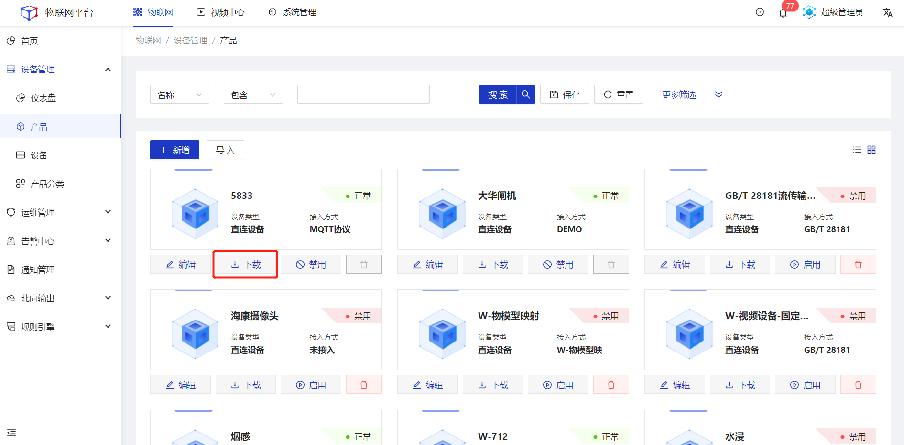

### 物模型
物模型是对设备在云端的功能描述，包括设备的属性、功能、事件和标签。物联网平台通过定义一种物的描述语言来描述物模型，称之为TSL（即 Thing Specification Language），采用JSON格式，您可以根据TSL组装上报设备的数据。
#### 新增
##### 操作步骤
1.**登录**Jetlinks物联网平台。 
2.在左侧导航栏，选择**设备管理>产品**，点击**查看**，切换至物模型tab页，并点击**新增**按钮。 
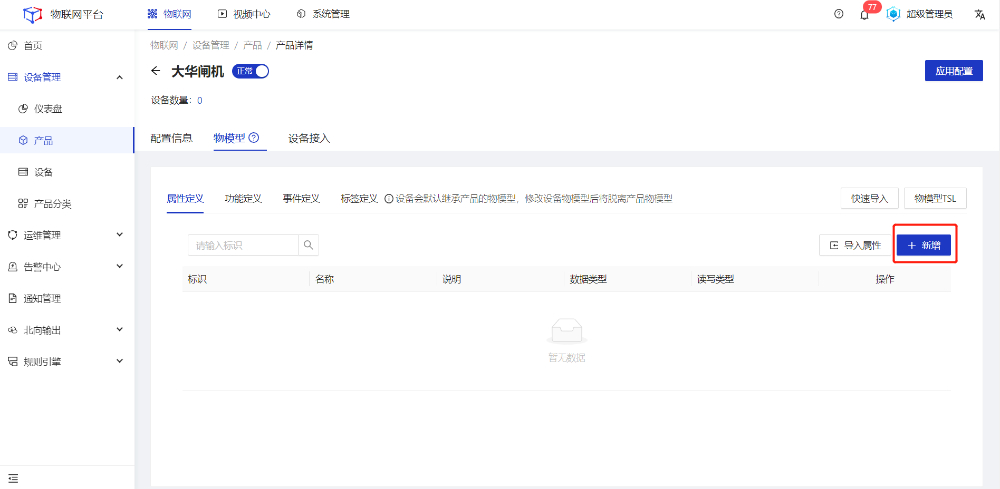
3.在**新建**抽屉中，根据设备实际情况，按照页面提示填写信息，然后单击右上角**保存**。 
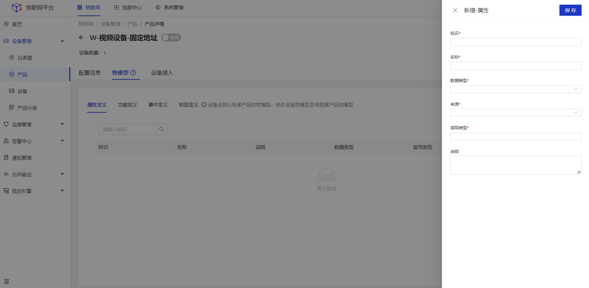

##### 属性参数说明

<table class='table'>
        <thead>
            <tr>
              <td>标识</td>
              <td>同一个产品内属性标识具有唯一性，不支持编辑</td>
            </tr>
        </thead>
        <tbody>
          <tr>
            <td>名称</td>
            <td>为设备命名，最多可输入64个字符。</td>
          </tr>
          <tr>
            <td>数据类型</td>
            <td>1. int：32位整数型。需定义单位。 
            2. long：长整数型，需定义单位符号。 
            3. float：单精度浮点型。需定义单位符号。 
            4. double：双精度浮点型。需定义单位、精度。 
            5. text：字符串。需定义字符串的数据长度，最长支持2048字节。 
            6. boolean：布尔型。采用true或false来定义布尔值，例如true-关；false-开。 
            7. date：时间型。默认yyyy-MM-DD HH:mm:ss。 
            8. enum：枚举型。定义枚举项的参数值和参数描述，例如1-加热模式、2-制冷模式等。 
            9. array：数组。需声明数组内元素的数据类型，可选择int32、float、double、text或object。需确保同一个数组元素类型相同。数组内可包含1-128个元素。 
            10. object：JSON对象。定义一个JSON结构体，新增JSON参数项，例如定义灯的颜色是由Red、Green、Blue三个参数组成的结构体。 
            11.  file：文件。需声明文件元素类型，可选择URL、base64、binary(二进制)。 
            12. password：密码。上报时如果属性为密码，将进行加密或者是隐秘的方式进行显现或者处理。 
            13. geoPoint：地理位置，按经纬度格式进行定义。
            </td>
          </tr>
          <tr>
            <td>单位</td>
            <td>单选下拉框，可选择为无或根据实际情况选择。</td>
          </tr>
         <tr>
            <td>精度</td>
            <td>控制所需的小数位数。</td>
          </tr>
         <tr>
            <td>最大长度</td>
            <td>单位为字节。</td>
          </tr>
           <tr>
            <td>读写类型</td>
            <td>多选下拉框，支持读、写、上报。</td>
          </tr>
          <tr>
            <td>存储配置</td>
            <td>单选下拉框，支持存储、不存储。
            </td>
          </tr>
         <tr>
            <td>来源</td>
            <td>单选下拉框，支持设备、手动、规则。</td>
          </tr>
          <tr>
            <td>读写类型</td>
            <td>多选下拉框，支持读、写、上报。</td>
          </tr>
           <tr>
            <td>说明</td>
            <td>备注说明，最多可输入200个字符。</td>
          </tr>
          </tbody>
</table>

##### 功能参数说明

<table class='table'>
        <thead>
            <tr>
              <td>标识</td>
              <td>同一个产品内功能标识具有唯一性，不支持编辑</td>
            </tr>
        </thead>
        <tbody>
          <tr>
            <td>名称</td>
            <td>为功能命名，最多可输入64个字符。</td>
          </tr>
         <tr>
            <td>是否异步</td>
            <td>异步：服务为异步调用时，云端执行调用后直接返回结果，不会等待设备的回复消息。 同步：服务为同步调用时，云端会等待设备回复；若设备没有回复，则调用超时。</td>
          </tr>
          <tr>
            <td>输入参数</td>
            <td>定义功能的输入参数标识、名称、数据类型。</td>
          </tr>
          <tr>
            <td>输出参数</td>
            <td>1. int：32位整型。需定义单位。 
            2. long：长整数型，需定义单位符号。 
            3. float：单精度浮点型。需定义单位符号。 
            4. double：双精度浮点型。需定义单位、精度。 
            5. text：字符串。需定义字符串的数据长度，最长支持2048字节。 
            6. boolean：布尔型。采用true或false来定义布尔值，例如true-关；false-开。 
            7. date：时间型。默认yyyy-MM-DD HH:mm:ss。 
            8. enum：枚举型。定义枚举项的参数值和参数描述，例如1-加热模式、2-制冷模式等。 
            9. array：数组。需声明数组内元素的数据类型，可选择int32、float、double、text或object。需确保同一个数组元素类型相同。数组内可包含1-128个元素。 
            10. object：JSON对象。定义一个JSON结构体，新增JSON参数项，例如定义灯的颜色是由Red、Green、Blue三个参数组成的结构体。 
            11.  file：文件。需声明文件元素类型，可选择URL、base64、binary(二进制)。 
            12. password：密码。上报时如果属性为密码，将进行加密或者是隐秘的方式进行显现或者处理。 
            13. geoPoint：地理位置，按经纬度格式进行定义。
            </td>
            </tr>
           <tr>
            <td>说明</td>
            <td>备注说明，最多可输入200个字符。</td>
          </tr>
</tbody>
</table>

##### 事件参数说明
<table class='table'>
        <thead>
            <tr>
              <td>标识</td>
              <td>同一个产品内事件标识具有唯一性，不支持编辑</td>
            </tr>
        </thead>
        <tbody>
          <tr>
            <td>名称</td>
            <td>为事件命名，最多可输入64个字符。</td>
          </tr>
         <tr>
            <td>级别</td>
            <td>单选下拉框，点击展开：普通、告警、紧急</td>
          </tr>
          <tr>
            <td>输出参数</td>
            <td> object：JSON对象。定义一个JSON结构体，新增JSON参数项，例如定义灯的颜色是由Red、Green、Blue三个参数组成的结构体。 miniui版本不支持结构体嵌套。 

    说明
    <ul>
事件的触发记录，将在设备“运行状态”左侧菜单中进行显示。
    </ul>
  

              </td>
           <tr>
            <td>JSON对象</td>
            <td>定义结构体的标识、名称、数据类型。</td>
          </tr>
          <tr>
            <td>说明</td>
            <td>备注说明，最多可输入200个字符。</td>
          </tr>
</tbody>
</table>

##### 标签参数说明
<table class='table'>
        <thead>
            <tr>
              <td>标识</td>
              <td>同一个产品内标签标识具有唯一性，不支持编辑</td>
            </tr>
        </thead>
        <tbody>
          <tr>
            <td>名称</td>
            <td>为标签命名，最多可输入64个字符。</td>
          </tr>
          <tr>
            <td>输出参数</td>
            <td>1. int32：32位整型。需定义单位。 
            2. long：长整数型，需定义单位符号。 
            3. float：单精度浮点型。需定义单位符号。 
            4. double：双精度浮点型。需定义单位、精度。 
            5. text：字符串。需定义字符串的数据长度，最长支持2048字节。 
            6. boolean：布尔型。采用true或false来定义布尔值，例如true-关；false-开。 
            7. date：时间型。默认yyyy-MM-DD HH:mm:ss。 
            8. enum：枚举型。定义枚举项的参数值和参数描述，例如1-加热模式、2-制冷模式等。 
            9. array：数组。需声明数组内元素的数据类型，可选择int32、float、double、text或object。需确保同一个数组元素类型相同。数组内可包含1-128个元素。 
            10. object：JSON对象。定义一个JSON结构体，新增JSON参数项，例如定义灯的颜色是由Red、Green、Blue三个参数组成的结构体。 
            11.  file：文件。需声明文件元素类型，可选择URL、base64、binary(二进制)。 
            12. password：密码。上报时如果属性为密码，将进行加密或者是隐秘的方式进行显现或者处理。 
            13. geoPoint：地理位置，按经纬度格式进行定义。
            </td>
           </tr>
           <tr>
            <td>标签类型</td>
            <td>多选下拉框，支持读、写、上报</td>
          </tr>
          <tr>
            <td>说明</td>
            <td>备注说明，最多可输入200个字符。</td>
          </tr>
</tbody>
</table>

#### 编辑
##### 操作步骤
1.**登录**Jetlinks物联网平台。 
2.在左侧导航栏，选择**设备管理>产品**，点击**查看**，切换至物模型tab页，选择具体属性，点击**编辑**按钮。 
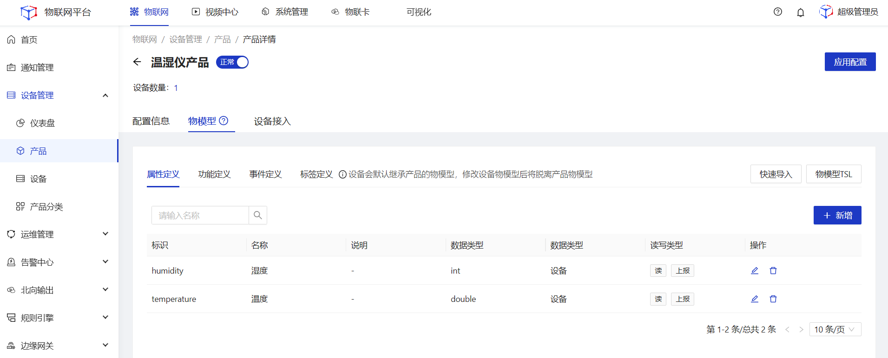
3.在**编辑**抽屉中，编辑相关参数，然后点击**保存**。 

  

    
    说明
  

 标识和来源均不可编辑。

#### 删除
##### 操作步骤
1.**登录**Jetlinks物联网平台。 
2.在左侧导航栏，选择**设备管理>产品**，点击**查看**，切换至物模型tab页，选择具体属性，点击**删除**按钮。 
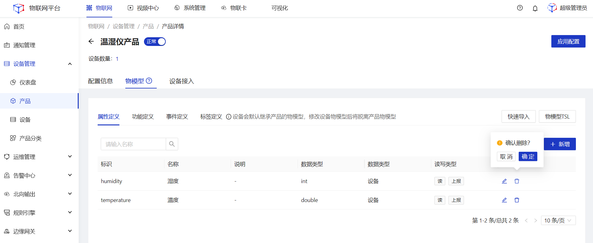

#### 快速导入
##### 操作步骤
1.**登录**Jetlinks物联网平台。 
2.在左侧导航栏，选择**设备管理>产品**，选择具体产品，点击**查看**，切换至物模型tab页，点击页面右上角**快速导入**按钮。 
3.在**导入物模型**弹框中，选择导入方式，并根据导入方式，选择需要导入的物模型，然后点击**确定**。 
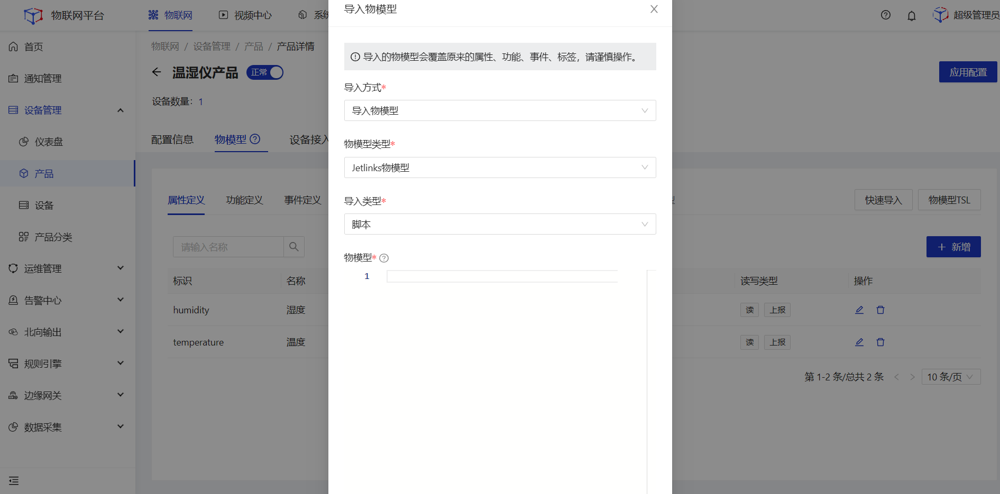

### 设备接入
维护管理产品模型的接入方式，产品下的设备将基于产品模型的接入配置与平台进行数据交互。设备接入配置包括基于通信协议和协议包生成的动态参数配置2部分。

#### 新增
##### 操作步骤
1.**登录**Jetlinks物联网平台。 
2.在左侧导航栏，选择**设备管理>产品**，点击**查看**，切换至设备接入tab页。 
3.在设备接入tab页中选择设备接入方式，然后单击**确定**。 
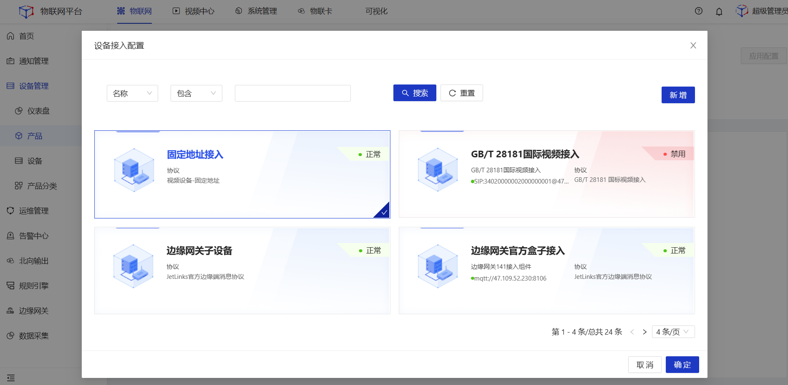

##### 后续步骤
1.填写产品接入相关参数，然后点击**保存**。
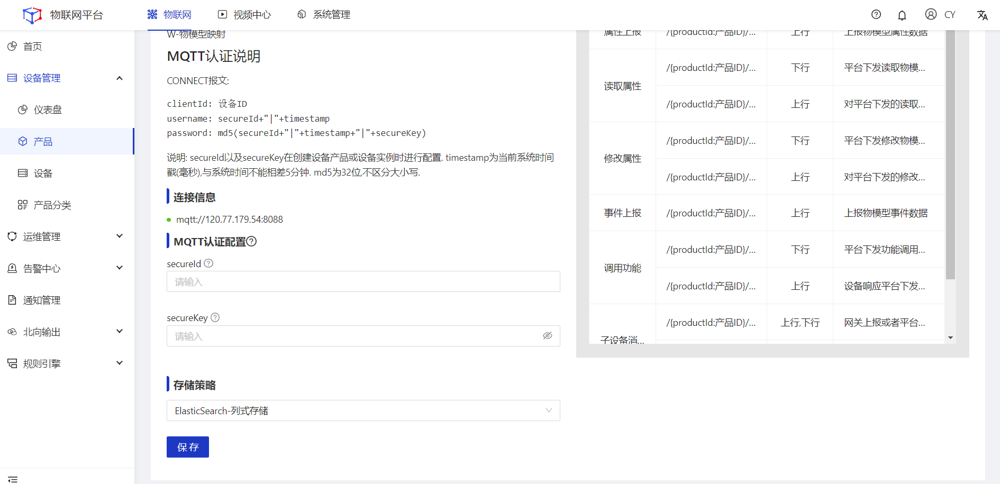

  

    
    说明
  

  接入配置中的参数根据所选择的接入方式以及协议包内容动态显示。

2.填写产品存储策略，然后点击**保存**。

  

    
    注意
  

      <li>    在确定好存储方案后,尽量不要跨类型进行修改,如将: 行式存储修改为列式存储,可能会导致数据结构错乱 </li>
      <li>     在创建物模型时,请根据存储策略判断好是否支持此类型      </li>

#### 更换接入方式
##### 操作步骤
1.**登录**Jetlinks物联网平台。 
2.在左侧导航栏，选择**设备管理>产品**，点击**查看**，切换至设备接入tab页。 
3.在设备接入tab页中点击**更换**，重新选择接入方式后，单击**确定**。 
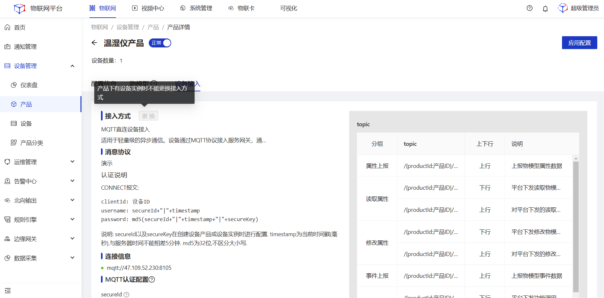

  

    
    说明
  

    当前产品下若已接入设备，不支持更换接入方式。

### 数据解析
通过可视化脚本编写的方式，自定义产品模型的数据解析规则。设备将自动继承产品的数据解析规则，修改后将脱离产品影响。

#### 适用场景
当同一个产品下有多个相同型号的网关设备，代理接入了不同的子设备时，可使用该功能对网关设备产品配置包含对所有类型子设备数据进行解析的统一规则。

#### 配置解析规则
##### 操作步骤
1.**登录**Jetlinks物联网平台。 
2.在左侧导航栏，选择**设备管理>产品**，点击**查看**，切换至数据解析tab页。 
3.在数据解析页面，自定义编写**数据解析脚本**。 
4.输入**Topic**或**URL**进行调试。

  

    
    说明
  

     显示Topic配置/URL配置由协议包拟定。

5.调试通过后，点击**保存**。

  

    
    说明
  

  <li>该tab页的展示与否由协议包拟定。</li>
  <li>设备-数据解析将自动继承产品的数据解析规则。</li>

## 设备
设备管理可对设备实例进行全生命周期管理，包括设备基本信息、物模型、运行状态、设备功能、日志管理、设备诊断、物模型映射、数据解析、点位绑定等管理功能。
### 列表功能

#### 新增
##### 操作步骤
1.**登录**Jetlinks物联网平台。 
2.在左侧导航栏，选择**设备管理>设备**，点击**新增**。 
3.在**新建**弹框中，根据设备实际情况，按照页面提示填写信息，然后单击**确定**。 
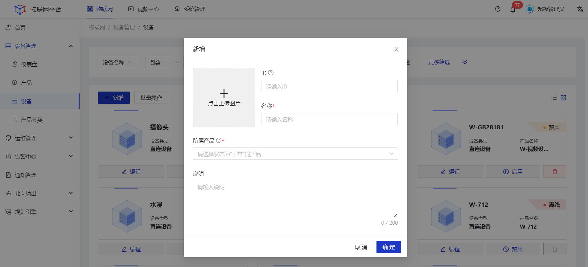

<table class='table'>
        <thead>
            <tr>
              <td>参数</td>
              <td>说明</td>
            </tr>
        </thead>
        <tbody>
          <tr>
            <td>ID</td>
            <td>设备唯一标识，在系统内具有全局唯一性。 </td>
          </tr>
          <tr>
            <td>名称</td>
            <td>为设备命名，最多可输入64个字符。</td>
          </tr>
          <tr>
            <td>所属产品</td>
            <td>单选下拉框，只能选择正常状态下的产品。</td>
          </tr>
          <tr>
            <td>标签</td>
            <td>设备基于业务需要，自定义补充的标签信息。</td>
          </tr>
         </tbody>
</table>

#### 编辑 
##### 操作步骤
1.**登录**Jetlinks物联网平台。 
2.在左侧导航栏，选择**设备管理>设备**，选择具体设备。点击**编辑**。 
3.在**编辑**弹框中，编辑相关配置，然后单击**确定**。 
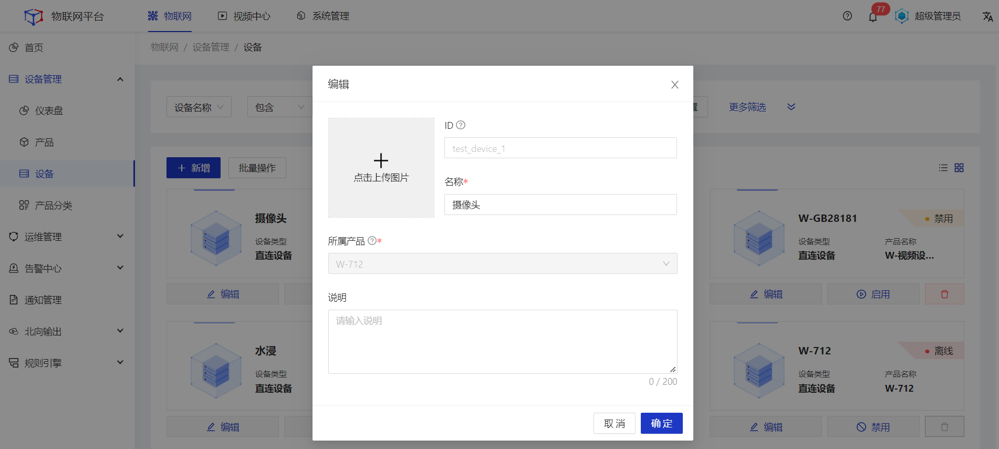

  

    
    说明
  

   ID和所属产品不支持编辑。

#### 启用/禁用
##### 操作步骤
1.**登录**Jetlinks物联网平台。 
2.在左侧导航栏，选择**设备管理>设备**，选择具体设备。点击**启用/禁用**。 
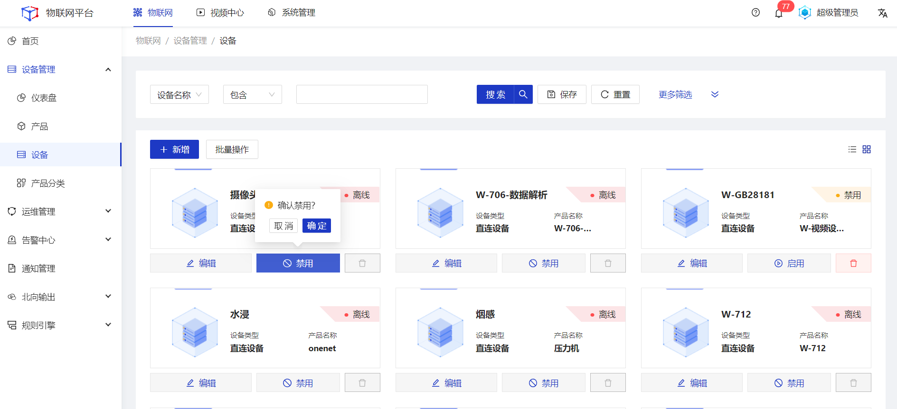

  

    
    说明
  

 设备在离线/在线状态时，按钮显示为禁用；设备在禁用状态时，按钮显示为启用。

#### 删除
##### 操作步骤
1.**登录**Jetlinks物联网平台。 
2.在左侧导航栏，选择**设备管理>设备**，选择具体设备。点击**删除**。 
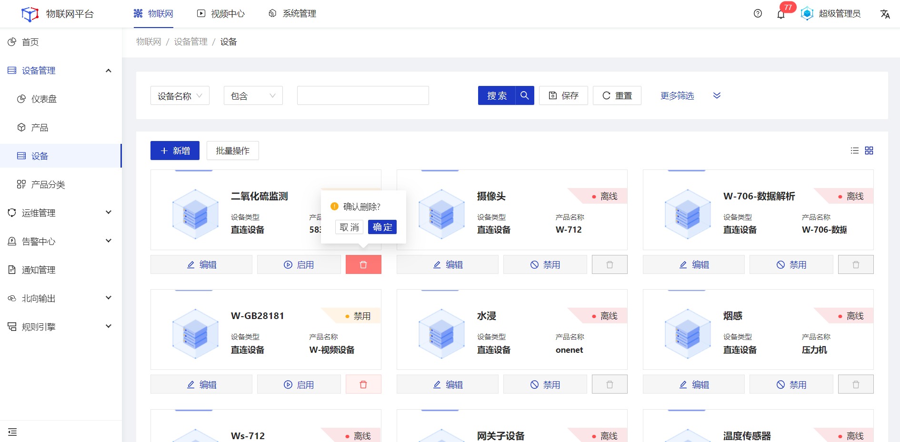

  

    
    说明
  

 设备在离线/在线状态时，不可删除。

#### 批量操作
##### 操作步骤
1.**登录**Jetlinks物联网平台。 
2.在左侧导航栏，选择**设备管理>设备**，点击**批量操作**。
   + 点击导入，可在对应产品下批量导入设备基础数据。
   + 点击导出，不选择产品时导出所有设备基础数据，选择产品时导出对应产品下的设备数据。
   + 点击激活全部设备，向所有设备发送激活指令。
   + 点击同步设备状态，平台读取一遍所有设备的最新状态数据。

### 实例信息
实例信息是对设备实例信息的统一管理，包括设备信息、设备标签信息、接入配置信息、关系信息。除设备信息外，其他信息根据产品接入配置、系统配置**动态显示**。 
+ `配置`当接入方式为**云平台接入**或产品使用的**协议包中拟定有额外配置配置项**时将出现此部分配置内容
+ `标签`当设备模型中有标签字段时，将不出现该配置卡片
+ `关系信息`由**系统管理-关系配置**中的配置进行动态显示

#### 实例信息管理
##### 操作步骤
1.**登录**Jetlinks物联网平台。 
2.在左侧导航栏，选择**设备管理>设备**，列表页中点击**查看**按钮，进入实例信息页面。 
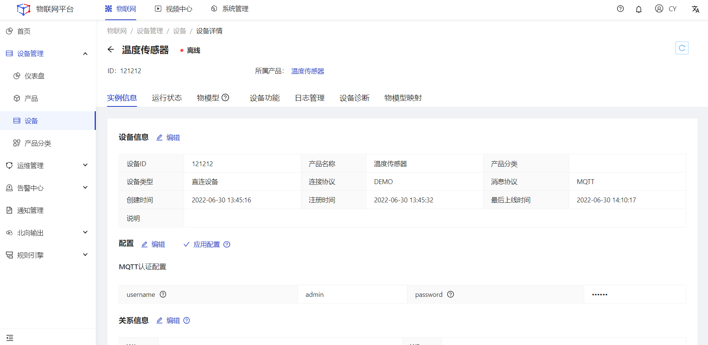

#### 后续步骤
1.点击基本信息卡片中的**编辑**按钮，可以修改基本信息。 
2.点击配置信息卡片中的**编辑**按钮，可修改配置信息。 
3.点击关系信息卡片中的**编辑**按钮，可绑定设备与用户之间的关系，例如`设备负责人`。 

### 运行状态
实时查看设备运行状态数据，支持文本、图片、视频、音频等多种类型数据的展示。可查看具体属性的历史上报记录数据，并对数据进行简单的聚合运算统计分析。支持查看事件上报的历史数据。

#### 查看
##### 操作步骤
1.**登录**Jetlinks物联网平台。 
2.在左侧导航栏，选择**设备管理>设备**，列表页中点击**查看**按钮。 
3.进入详情页后，切换至**运行状态**tab页。 
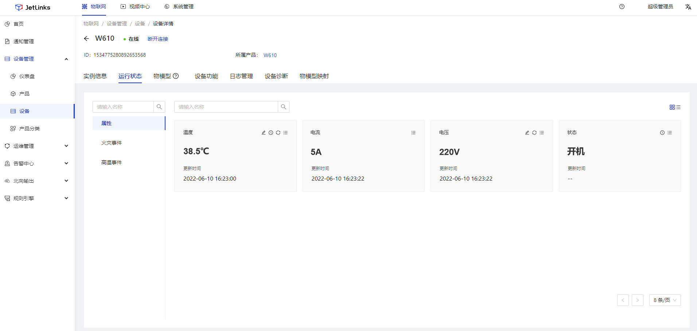

  

    
    说明
  

文件为url-视频类型，显示视频ICON，点击ICON进行判断，以下条件不可播放
<li>域名为https时，不支持访问http地址</li>
<li>非.mp4,.flv,.m3u8格式的视频</li>

#### 后续步骤
1.击左侧tab菜单可切换至查看事件详情。 
2.点击属性卡片右上角的操作按钮，可手动编辑属性值、查看属性历史数据、更新属性数据。 
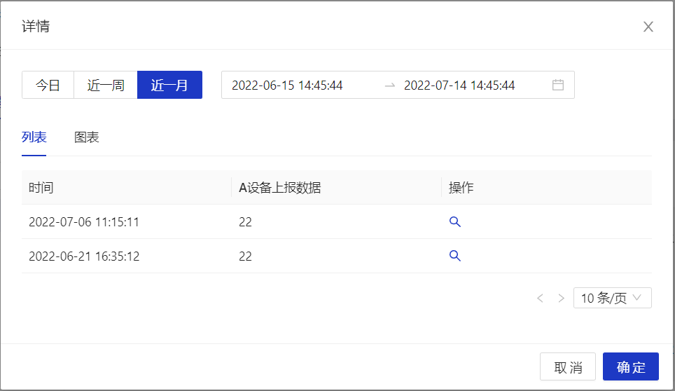

### 物模型
物模型是对设备在云端的功能描述，包括设备的属性、功能、事件和标签。物联网平台通过定义一种物的描述语言来描述物模型，称之为TSL（即 Thing Specification Language），采用JSON格式，您可以根据TSL组装上报设备的数据。
#### 新增
##### 操作步骤
1.**登录**Jetlinks物联网平台。 
2.在左侧导航栏，选择**设备管理>设备**，点击**查看**，切换至物模型tab页，并点击**新增**按钮。 
3.在**新建**抽屉中，根据设备实际情况，按照页面提示填写信息，然后单击**确定**。 

##### 属性参数说明
<table class='table'>
        <thead>
            <tr>
              <td>标识</td>
              <td>同一个产品内属性标识具有唯一性，不支持编辑</td>
            </tr>
        </thead>
        <tbody>
          <tr>
            <td>名称</td>
            <td>为设备命名，最多可输入64个字符。</td>
          </tr>
          <tr>
            <td>数据类型</td>
            <td>1. int32：32位整型。需定义单位。 
            2. long：长整数型，需定义单位符号。 
            3. float：单精度浮点型。需定义单位符号。 
            4. double：双精度浮点型。需定义单位、精度。 
            5. text：字符串。需定义字符串的数据长度，最长支持2048字节。 
            6. boolean：布尔型。采用true或false来定义布尔值，例如true-关；false-开。 
            7. date：时间型。默认yyyy-MM-DD HH:mm:ss。 
            8. enum：枚举型。定义枚举项的参数值和参数描述，例如1-加热模式、2-制冷模式等。 
            9. array：数组。需声明数组内元素的数据类型，可选择int32、float、double、text或object。需确保同一个数组元素类型相同。数组内可包含1-128个元素。 
            10. object：JSON对象。定义一个JSON结构体，新增JSON参数项，例如定义灯的颜色是由Red、Green、Blue三个参数组成的结构体。 
            11.  file：文件。需声明文件元素类型，可选择URL、base64、binary(二进制)。 
            12. password：密码。上报时如果属性为密码，将进行加密或者是隐秘的方式进行显现或者处理。 
            13. geoPoint：地理位置，按经纬度格式进行定义。
</td>
         </td>
          </tr>
          <tr>
            <td>单位</td>
            <td>单选下拉框，可选择为无或根据实际情况选择。</td>
          </tr>
         <tr>
            <td>精度</td>
            <td>控制所需的小数位数。</td>
          </tr>
         <tr>
            <td>最大长度</td>
            <td>单位为字节。</td>
          </tr>
         <tr>
            <td>来源</td>
            <td>单选下拉框，支持设备、手动、规则。</td>
          </tr>
          <tr>
            <td>读写类型</td>
            <td>多选下拉框，支持读、写、上报</td>
          </tr>
          <tr>
            <td>说明</td>
            <td>备注说明，最多可输入200个字符。</td>
          </tr>
          </tbody>
</table>

##### 功能参数说明
<table class='table'>
        <thead>
            <tr>
              <td>标识</td>
              <td>同一个产品内功能标识具有唯一性，不支持编辑</td>
            </tr>
        </thead>
        <tbody>
          <tr>
            <td>名称</td>
            <td>为功能命名，最多可输入64个字符。</td>
          </tr>
         <tr>
            <td>是否异步</td>
            <td>异步：服务为异步调用时，云端执行调用后直接返回结果，不会等待设备的回复消息。 同步：服务为同步调用时，云端会等待设备回复；若设备没有回复，则调用超时。</td>
          </tr>
          <tr>
            <td>输入参数</td>
            <td>定义功能的输入参数标识、名称、数据类型。
            </td>
          </tr>
          <tr>
            <td>输出参数</td>
            <td>1. int32：32位整型。需定义单位。 
            2. long：长整数型，需定义单位符号。 
            3. float：单精度浮点型。需定义单位符号。 
            4. double：双精度浮点型。需定义单位、精度。 
            5. text：字符串。需定义字符串的数据长度，最长支持2048字节。 
            6. boolean：布尔型。采用true或false来定义布尔值，例如true-关；false-开。 
            7. date：时间型。默认yyyy-MM-DD HH:mm:ss。 
            8. enum：枚举型。定义枚举项的参数值和参数描述，例如1-加热模式、2-制冷模式等。 
            9. array：数组。需声明数组内元素的数据类型，可选择int32、float、double、text或object。需确保同一个数组元素类型相同。数组内可包含1-128个元素。 
            10. object：JSON对象。定义一个JSON结构体，新增JSON参数项，例如定义灯的颜色是由Red、Green、Blue三个参数组成的结构体。 
            11.  file：文件。需声明文件元素类型，可选择URL、base64、binary(二进制)。 
            12. password：密码。上报时如果属性为密码，将进行加密或者是隐秘的方式进行显现或者处理。 
            13. geoPoint：地理位置，按经纬度格式进行定义。
          </td>
      </tr>
          <tr>
            <td>说明</td>
            <td>备注说明，最多可输入200个字符。</td>
          </tr>
</tbody>
</table>

##### 事件参数说明
<table class='table'>
        <thead>
            <tr>
              <td>标识</td>
              <td>同一个产品内事件标识具有唯一性，不支持编辑</td>
            </tr>
        </thead>
        <tbody>
          <tr>
            <td>名称</td>
            <td>为功能命名，最多可输入64个字符。</td>
          </tr>
         <tr>
            <td>级别</td>
            <td>单选下拉框，点击展开：普通、告警、紧急</td>
          </tr>
          <tr>
            <td>输出参数</td>
            <td> object：JSON对象。定义一个JSON结构体，新增JSON参数项，例如定义灯的颜色是由Red、Green、Blue三个参数组成的结构体。 miniui版本不支持结构体嵌套。 

    说明
    <ul>
 配置的事件的触发记录，将在设备“运行状态”左侧菜单中进行显示。
    </ul>
  

            </td>
          </tr>
           <tr>
            <td>JSON对象</td>
            <td>定义结构体的标识、名称、数据类型。</td>
          </tr>
           <tr>
            <td>说明</td>
            <td>备注说明，最多可输入200个字符。</td>
          </tr>
</tbody>
</table>

##### 标签参数说明
<table class='table'>
        <thead>
            <tr>
              <td>标识</td>
              <td>同一个产品内标签标识具有唯一性，不支持编辑</td>
            </tr>
        </thead>
        <tbody>
          <tr>
            <td>名称</td>
            <td>为标签命名，最多可输入64个字符。</td>
          </tr>
          <tr>
            <td>输出参数</td>
            <td>1. int32：32位整型。需定义单位。 
            2. long：长整数型，需定义单位符号。 
            3. float：单精度浮点型。需定义单位符号。 
            4. double：双精度浮点型。需定义单位、精度。 
            5. text：字符串。需定义字符串的数据长度，最长支持2048字节。 
            6. boolean：布尔型。采用true或false来定义布尔值，例如true-关；false-开。 
            7. date：时间型。默认yyyy-MM-DD HH:mm:ss。 
            8. enum：枚举型。定义枚举项的参数值和参数描述，例如1-加热模式、2-制冷模式等。 
            9. array：数组。需声明数组内元素的数据类型，可选择int32、float、double、text或object。需确保同一个数组元素类型相同。数组内可包含1-128个元素。 
            10. object：JSON对象。定义一个JSON结构体，新增JSON参数项，例如定义灯的颜色是由Red、Green、Blue三个参数组成的结构体。 
            11. file：文件。需声明文件元素类型，可选择URL、base64、binary(二进制)。 
            12. password：密码。上报时如果属性为密码，将进行加密或者是隐秘的方式进行显现或者处理。 
            13. geoPoint：地理位置，按经纬度格式进行定义。
            </td>
           </tr>
           <tr>
            <td>标签类型</td>
            <td>多选下拉框，支持读、写、上报</td>
          </tr>
          <tr>
            <td>说明</td>
            <td>备注说明，最多可输入200个字符。</td>
          </tr>
</tbody>
</table>

#### 编辑
##### 操作步骤
1.**登录**Jetlinks物联网平台。 
2.在左侧导航栏，选择**设备管理>设备**，点击**查看**，切换至物模型tab页，并点击**编辑**按钮。 
3.在**编辑**抽屉中，编辑相关参数，然后单击**确定**。 
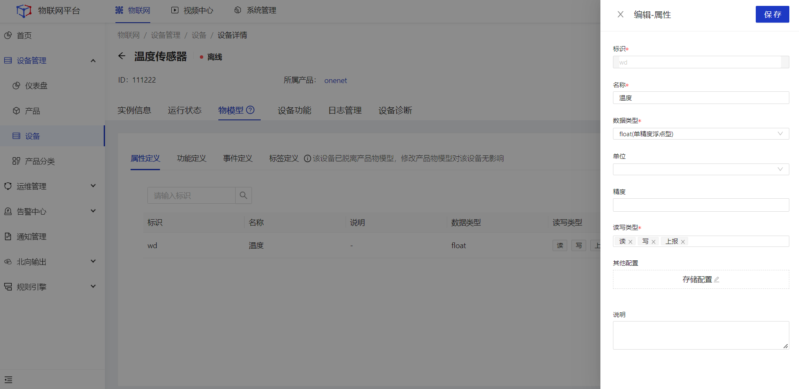

  

    
    说明
  

  标识不支持编辑。

#### 快速导入
##### 操作步骤
1.**登录**Jetlinks物联网平台。 
2.在左侧导航栏，选择**设备管理>设备**，点击**查看**，切换至物模型tab页，并点击**快速导入**按钮。 
3.在**导入物模型**弹框中，选择导入方式，并根据导入方式，选择需要导入的物模型，然后单击**确定**。 
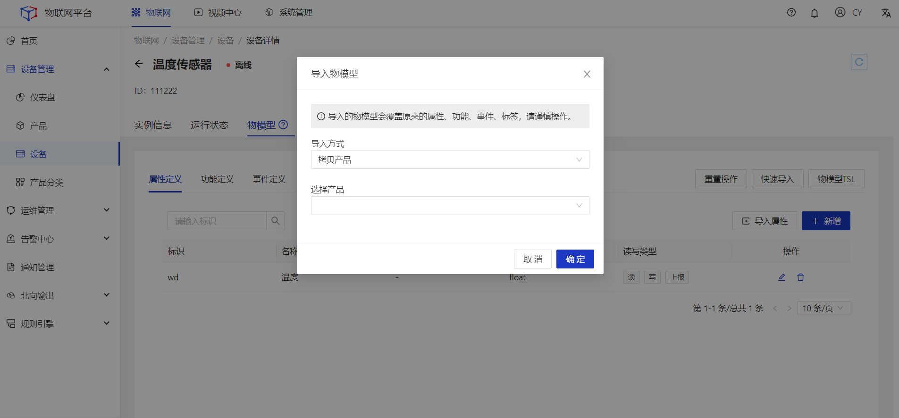

  

    
    说明
  

  导入的物模型会覆盖原来的属性、功能、事件、标签，请谨慎操作。

### 设备功能
通过可视化配置或自定义脚本的方式对设备功能进行调试，通常在设备刚接入至平台中时进行调试，以验证设备接入配置、物模型配置等是否正确。

#### 调用设备功能
##### 操作步骤
1.**登录**Jetlinks物联网平台。 
2.在左侧导航栏，选择**设备管理>设备**，点击**查看**，切换至设备功能tab页，点击左侧需要调用的功能，设置功能参数值。 
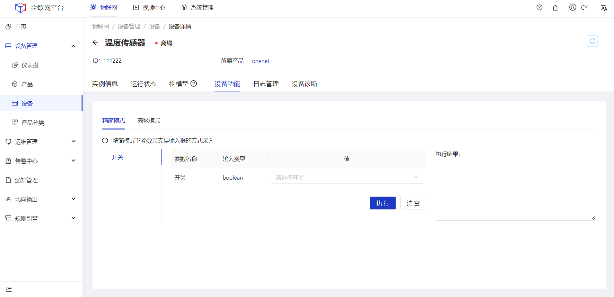
3.点击**执行**按钮，查看右侧**执行结果**。 
4.（可选操作）点击**高级模式**，切换至高级模式tab页，输入**脚本**后，点击执行，查看右侧**执行结果** 
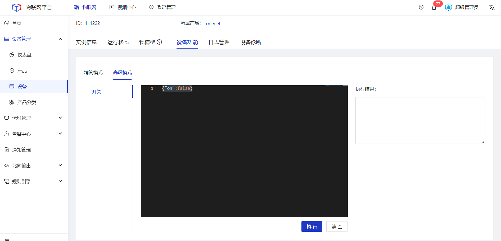

### 日志管理
记录设备运行日志至云端，以支持查询和故障分析。

#### 查看
##### 操作步骤
1.**登录**Jetlinks物联网平台。 
2.在左侧导航栏，选择**设备管理>设备**，点击**查看**，切换至日志管理tab页。 
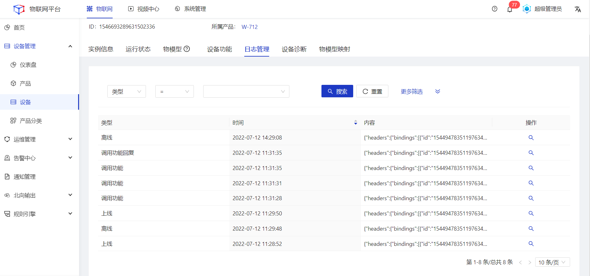
3.点击具体日志的**查看**按钮，查看日志详情。 
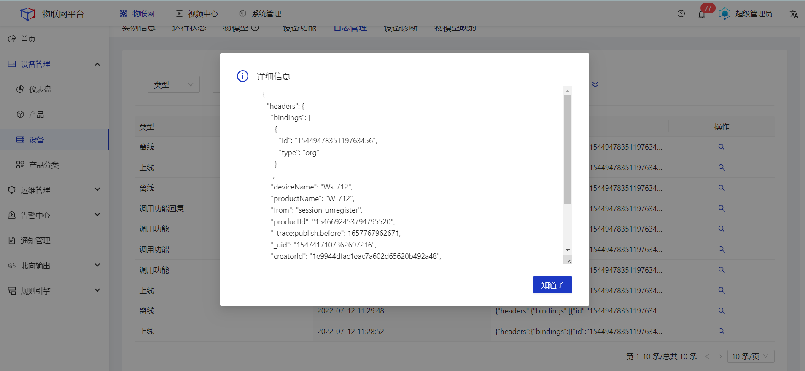

### 设备诊断
基于不同的设备接入方式，对离线设备进行诊断分析，并支持对在线状态的设备进行消息通信的调试。

  

    
    说明
  

 设备诊断只对平台端的设备接入步骤进行逐一诊断，不能对设备端的相关配置进行诊断。

#### 连接状态诊断
##### 操作步骤
1.**登录**Jetlinks物联网平台。 
2.在左侧导航栏，选择**设备管理>设备**，点击**查看**，切换至设备诊断tab页。 
3.根据系统自动诊断结果，对**异常**或**可能存在异常**的检查项进行处理。 
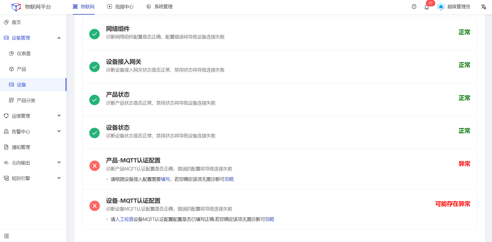

  

    
    说明
  

 <li>人工检查：人工核查一遍对应诊断项的配置参数是否填写正确。</li>
 <li>忽略：人工判断该检查项不影响设备接入平台时，可直接点击忽略。</li>

4.连接成功后，点击**消息通信**按钮，切换至消息通信tab，选择**调用功能**或**操作属性**。 
5.配置完成后，点击**发送**按钮，在对话框中查看具体的上下行消息，同时可查看页面右侧详细日志数据。 
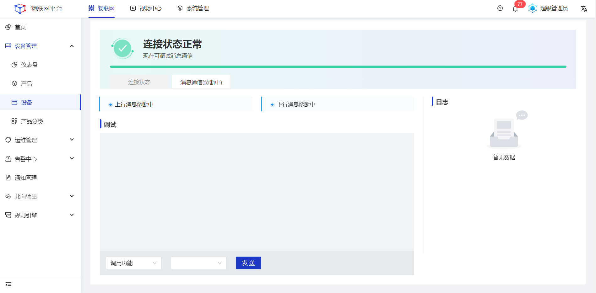

### 数据解析
通过可视化脚本编写的方式，自定义设备模型的数据解析规则。设备将自动继承产品的数据解析规则，修改后将脱离产品影响。

#### 适用场景
当同一个产品下有多个相同型号的网关设备，代理接入了不同的子设备时，可基于网关设备代理的子设备实际情况，针对每一个网关设备配置独立的数据解析规则。

##### 操作步骤
1.**登录**Jetlinks物联网平台。 
2.在左侧导航栏，选择**设备管理>设备**，点击**查看**，切换至数据解析tab页。 
3.在数据解析页面，点击**修改**按钮，在线编辑数据解析规则后，模拟输入进行调试，调试完成后点击**保存**。 
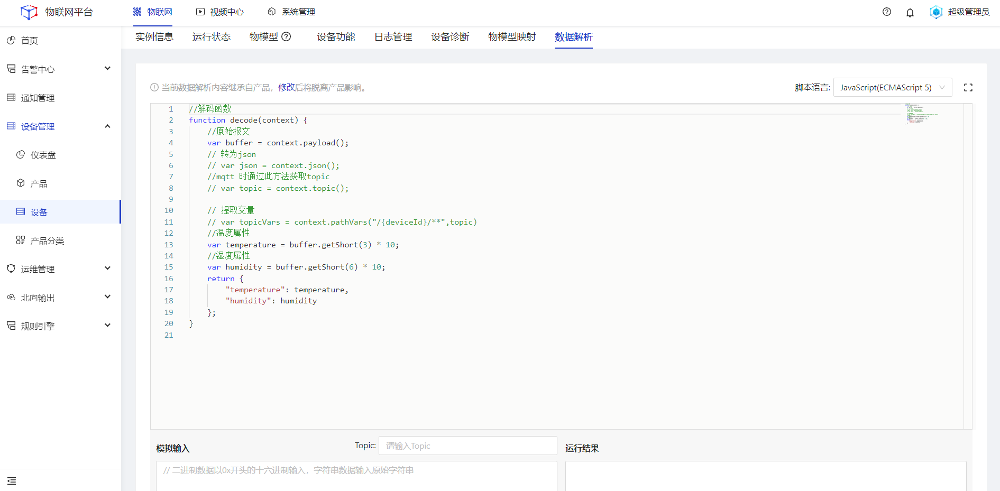

### 数采点位绑定
当设备所属产品的接入方式为Modbus TCP/OPC UA接入时将会出现此tab页。该功能用于将Modbus TCP/OPC UA采集到的点位数据与设备物模型属性进行映射绑定，绑定后设备运行状态页面将能进行设备运行数据的展示。

##### 操作步骤
1.**登录**Jetlinks物联网平台。 
2.在左侧导航栏，选择**设备管理>设备**，点击**查看**，切换至Modbus TCP/OPC UA列表页。 
3.在列表页面，建立**物模型属性**与**modbus点位**的关联关系。 
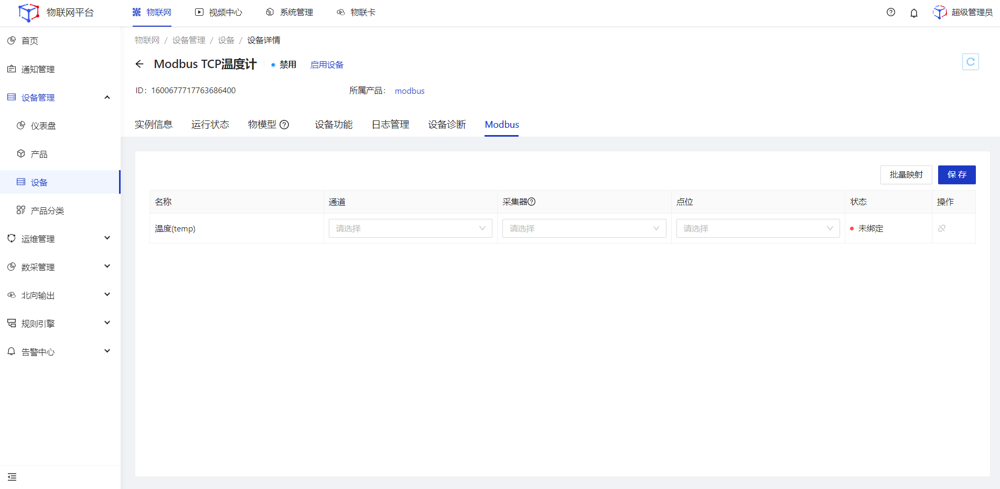

##### 后续步骤
1.点击属性操作列的**解绑**按钮，然后点击**确定**，解除属性与modbus点位的绑定关系。
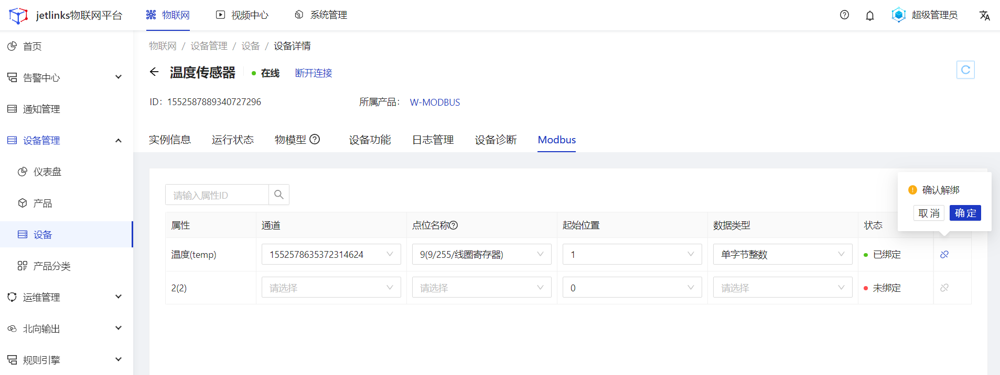

## 产品分类
自定义产品分类标识，实现对不同厂家、不同类型产品的分类管理。

#### 新增
##### 操作步骤
1.**登录**Jetlinks物联网平台。 
2.在左侧导航栏，选择**设备管理>产品分类**，进入列表页。 
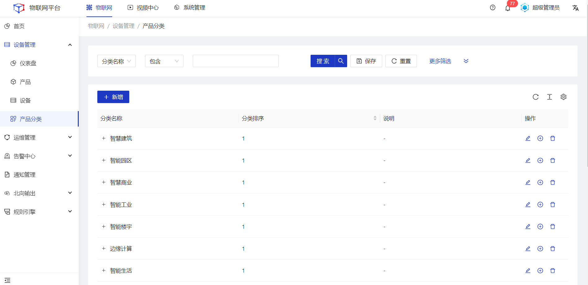
3.点击**新增**按钮，在新增弹框中填写配置信息，然后点击**确定**。 
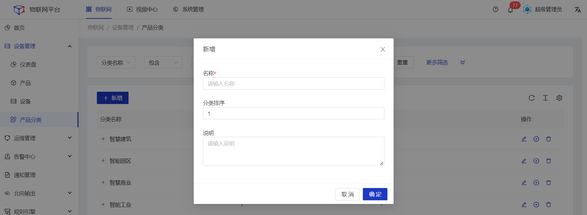

<table class='table'>
        <thead>
            <tr>
              <td>参数</td>
              <td>说明</td>
            </tr>
        </thead>
        <tbody>
          <tr>
            <td>名称</td>
            <td>为产品分类命名，最多可输入64个字符。</td>
          </tr>
          <tr>
            <td>分类排序</td>
            <td>填写分类排序，页面数据按照升序排列，排序可重复。</td>
          </tr>
          <tr>
            <td>说明</td>
            <td>为产品分类填写备注信息，最多可输入200个字符，非必填。</td>
          </tr>
        </tbody>
      </table>

#### 编辑
##### 操作步骤
1.**登录**Jetlinks物联网平台。 
2.在左侧导航栏，选择**设备管理>产品分类**，进入列表页。 
3.点击具体分类的**编辑**按钮，在编辑弹框中修改配置信息，然后点击**确定**。 

#### 添加子分类
##### 操作步骤
1.**登录**Jetlinks物联网平台。 
2.在左侧导航栏，选择**设备管理>产品分类**，进入列表页。 
3.点击具体分类的**添加子分类**按钮，在编辑弹框中修改配置信息，然后点击**确定**。 

#### 删除
##### 操作步骤
1.**登录**Jetlinks物联网平台。 
2.在左侧导航栏，选择**设备管理>产品分类**，进入列表页。 
3.点击具体分类的**删除**按钮，然后点击**确定**。 
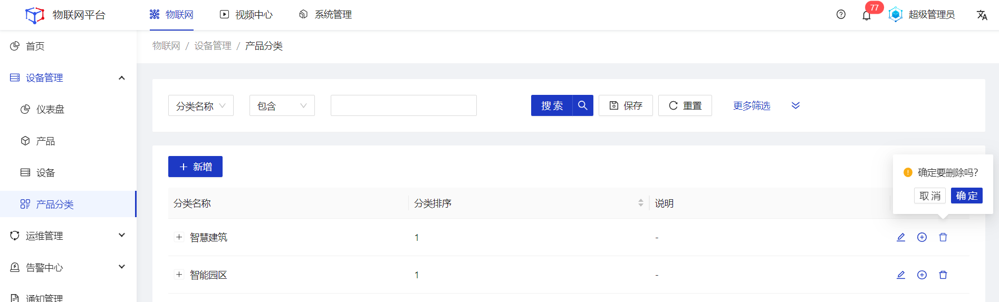

  

    
    说明
  

 <li>已经被产品绑定的分类，不可删除。</li>
 <li>删除父节点时，子节点也会被一起删除。</li>

