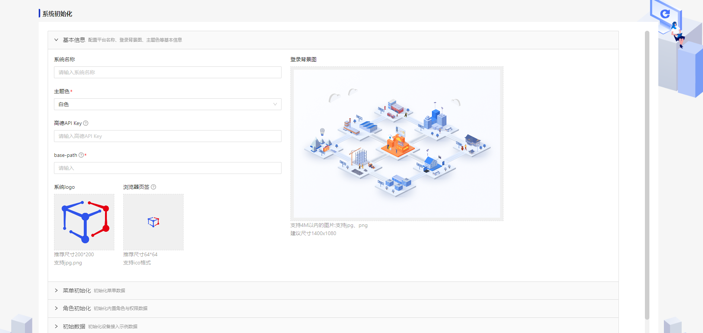
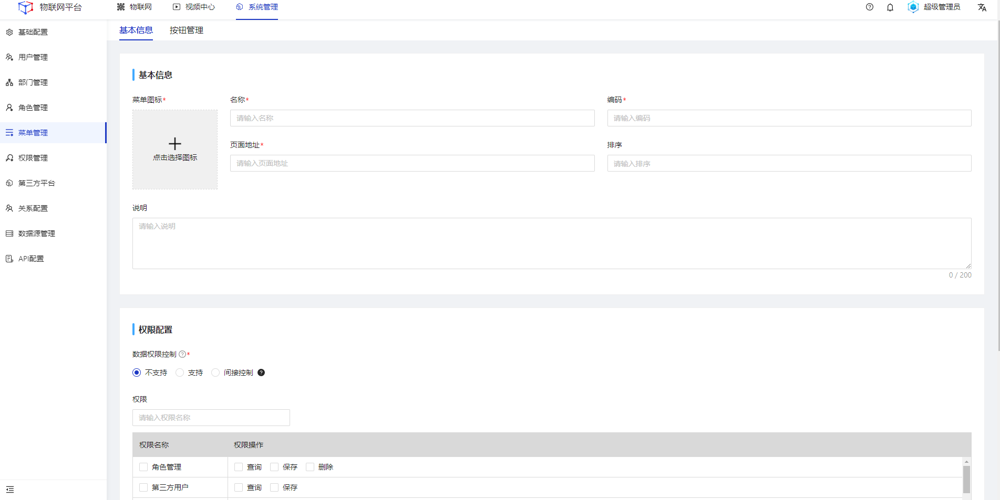
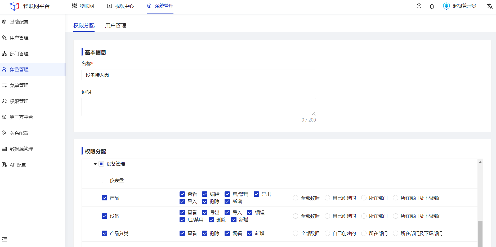
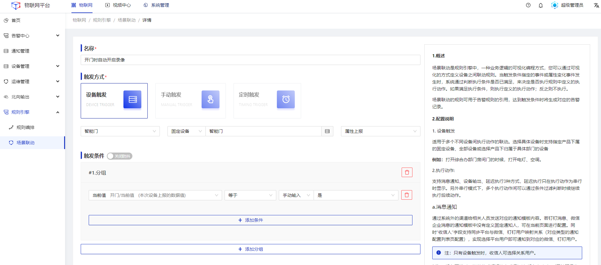
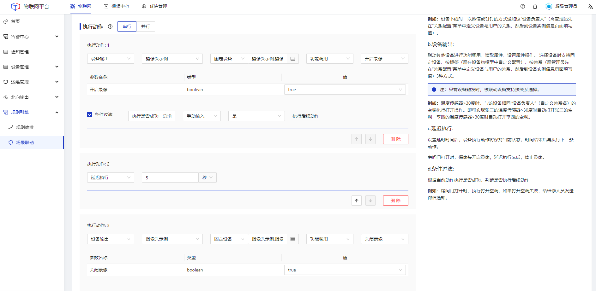
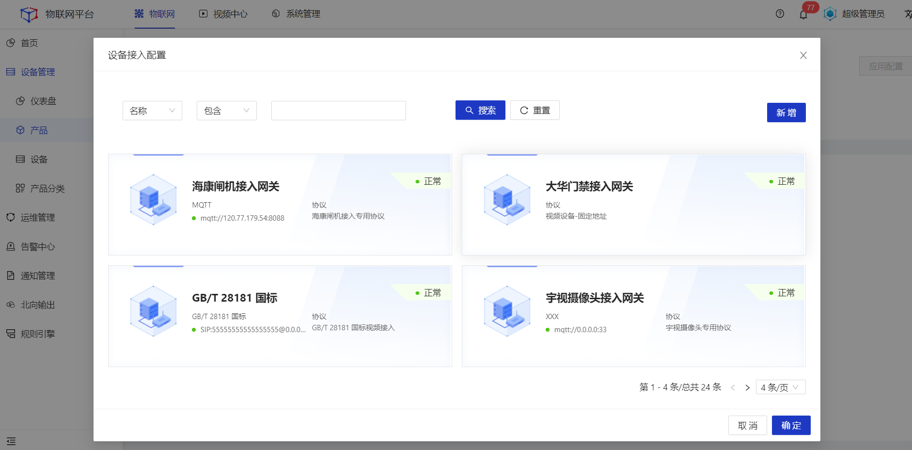
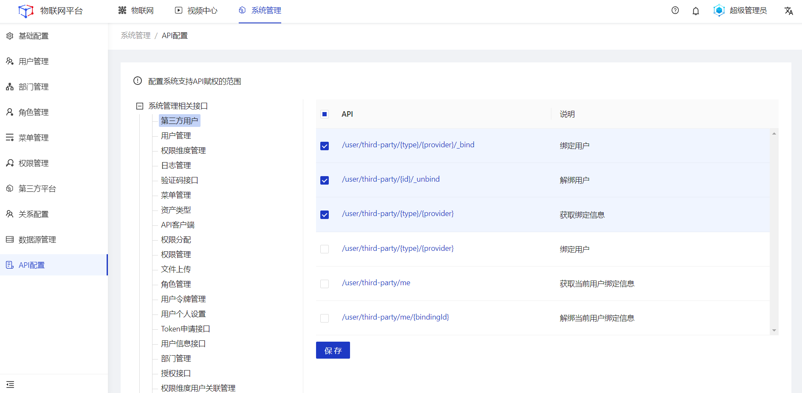
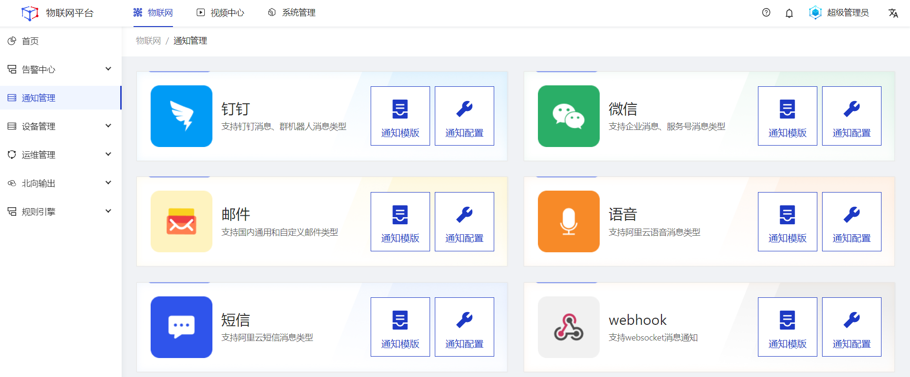
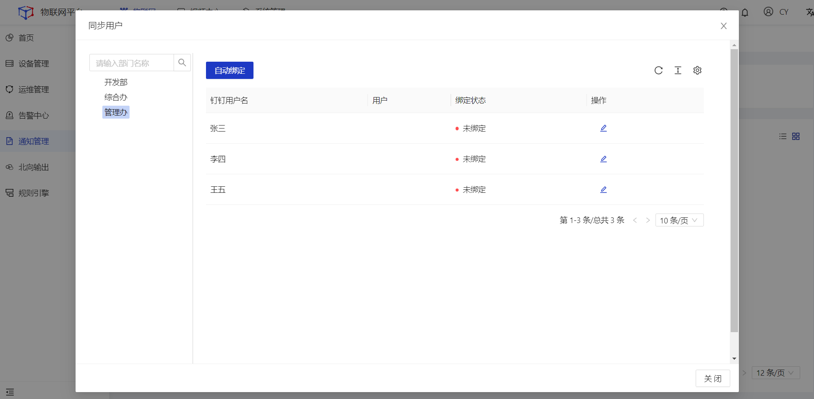
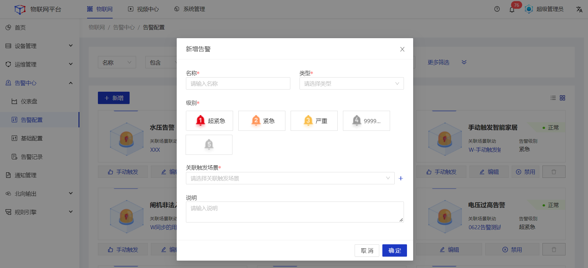

# Jetlinks 2.0重大升级说明
1. 系统**初始化**支持**可视化配置**，降低部署操作难度，提升操作体验。
  
2. 新增**菜单管理**功能，可自动从源代码中**读取菜单数据**、自定义**菜单关联的权限**，以及菜单下的**按钮权限**，支撑系统权限的精细化管理。
  
3. **角色管理**支持**菜单、按钮、数据权限**多维度配置自定义配置，适配各类复杂的业务管理场景。
 
4. **场景联动**可视化配置全面升级，包括且不限于：下游执行动作可**获取上游动态数据**；串行执行时可自定义**条件过滤**规则，满足规则时再执行后续动作；执行动作支持**延迟执行**；执行动作-消息通知支持**获取动态参数**；支持**按关系**通知相关人员；支持根据**属性指标**配置触发条件等。
 

5. 设备**接入流程规范化**，所有的接入方式均以产品为入口，通过为产品配置设备接入网关的方式实现设备接入配置。
  
6. 新增**API开放范围**可视化配置功能，支持自定义选择开放的API接口范围，**第三方平台**只能在开放的API接口范围内进行赋权配置。
 
7. 通知管理新增**webhook类型**；钉钉消息和微信企业消息通知模板新增**同步用户**功能，可将**钉钉/企业微信**的用户与**物联网平台内的用户**进行关联，为场景联动中的消息通知提供关联数据支撑。
 
 
8. 新增**告警中心**功能，聚合系统内的告警模块，统一维护管理**告警基础配置、告警配置、告警记录**，同时支持通过kafka的方式快速实现**告警数据流转**。
 
 