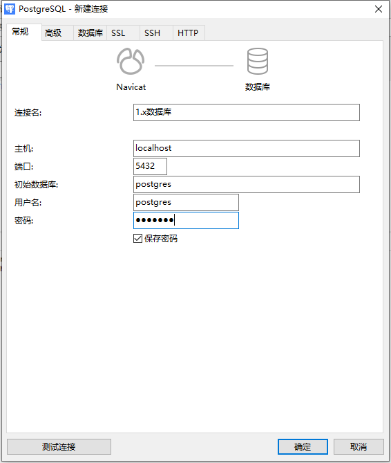
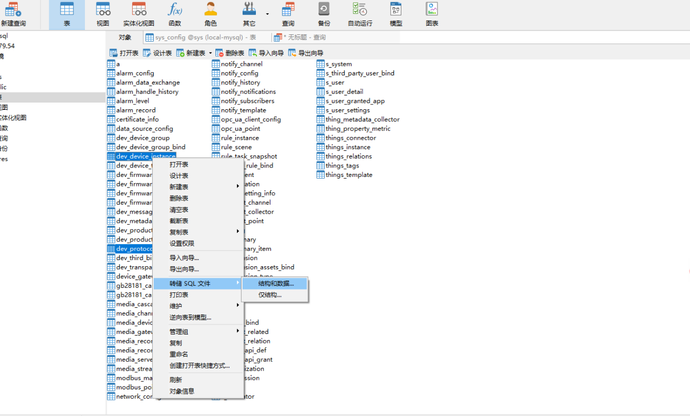
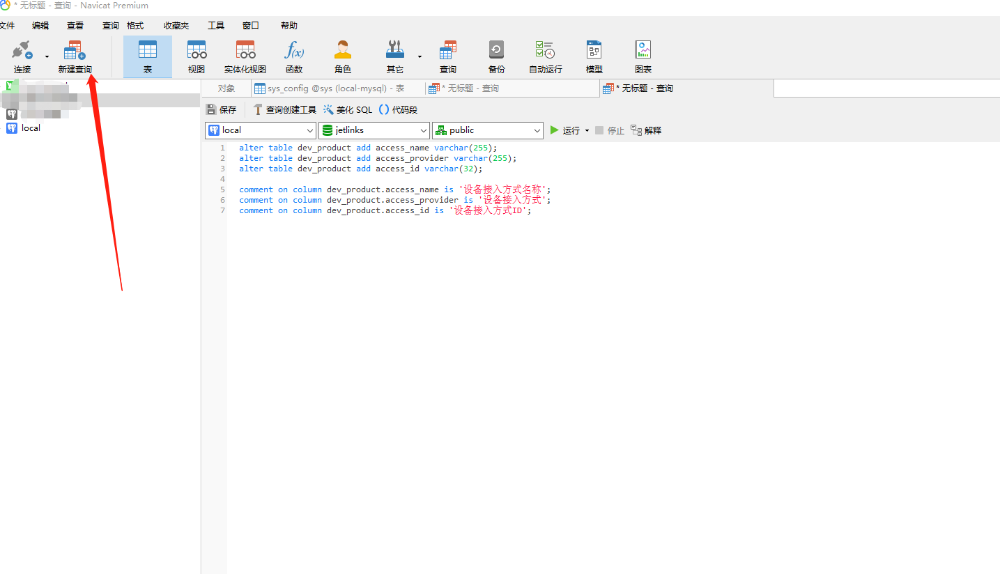

# 1.x版本迁移说明

2.0版本权限控制体系、设备接入流程等功能都已做较大的变更，因此不在兼容1.x版本。 **所有数据都请按对应的功能操作手册重新录入**。


<div class='explanation primary'>
  <p class='explanation-title-warp'>
    <span class='iconfont icon-bangzhu explanation-icon'></span>
    <span class='explanation-title font-weight'>说明</span>
  </p>

如你设备数据较多，可以参考如下迁移建议

</div>


## 2.0版本环境准备

参考[源码启动](/install-deployment/start-with-source.html)或[docker启动](/install-deployment/docker-start.html) 运行环境。

## 设备数据迁移

### 迁移前准备

启动成功进入控制台参考【最佳实践】创建好`协议管理数据`、`网络组件数据`、`设备接入网关数据`

<div class='explanation warning'>
  <p class='explanation-title-warp'>
    <span class='iconfont icon-jinggao explanation-icon'></span>
    <span class='explanation-title font-weight'>注意</span>
  </p>

协议管理数据格式已发生变更，请勿使用表数据导入导出的方式迁移。

</div>

### 迁移前提

关系型数据库使用pgsql。


### 数据迁移

**1、迁移产品表与设备表数据**

下载[Navicat](https://navicat.com/en/)软件。分别连接1.x数据库与2.0数据库



导出1.x产品和设备表结构与数据



将1.x导出的数据导入到2.x数据库中

**2、完善产品表结构**

在Navicat-新建查询项下执行如下sql完善表结构



```sql

alter table dev_product add access_name varchar(255);
alter table dev_product add access_provider varchar(255);
alter table dev_product add access_id varchar(32);

comment on column dev_product.access_name is '设备接入方式名称';
comment on column dev_product.access_provider is '设备接入方式';
comment on column dev_product.access_id is '设备接入方式ID';

```

2、完善产品表数据

以产品为【MQTT直连接入】类型为例。在2.0数据库的`device_gateway`表中找到`provider`字段数据为"mqtt-server-gateway"的记录。

在Navicat-新建查询项下执行如下sql完善产品表数据

```sql

-- device_gateway.xxx 为设备网关表对应xxx字段的数据值。
update dev_product 
set 
    access_name = device_gateway.name,
    access_provider = device_gateway.provider,
    access_id = device_gateway.id,
    message_protocol = device_gateway.protocol,
    protocol_name = device_gateway.protocol
where transport_portocol = "MQTT"
```

<div class='explanation warning'>
  <p class='explanation-title-warp'>
    <span class='iconfont icon-jinggao explanation-icon'></span>
    <span class='explanation-title font-weight'>注意</span>
  </p>

当前产品数据完善方式仅限于一类传输协议的产品仅有一种设备接入网关的前提。如不满足条件，需要到2.0产品详情界面中逐一设置。

</div>