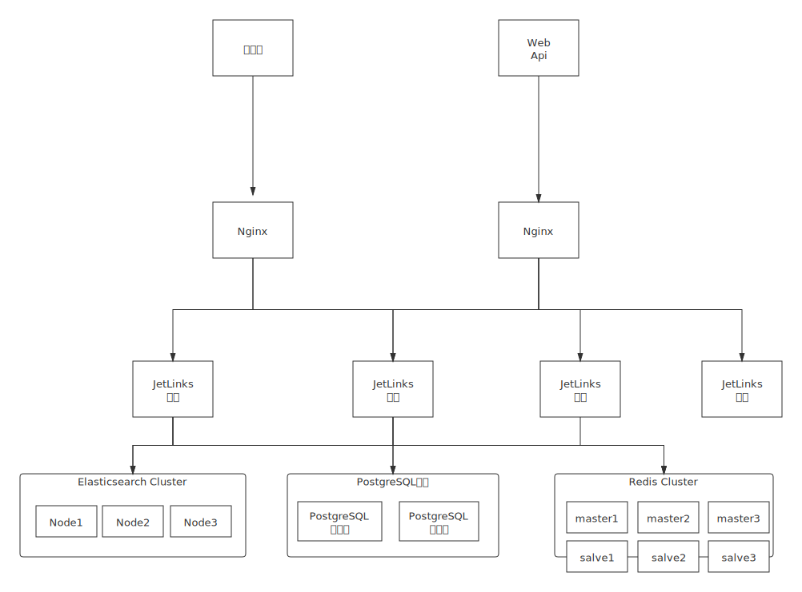

# 集群部署
jetlinks以及所需中间件的集群部署
<div class='explanation warning'>
  <p class='explanation-title-warp'>
    <span class='iconfont icon-jinggao explanation-icon'></span>
    <span class='explanation-title font-weight'>注意</span>
  </p>

仅企业版以上支持。  
本文档以172.16.4.13、172.16.4.12、172.16.4.11三台服务器来搭建集群。

</div>

## 集群架构图


## redis集群安装配置
这里准备在一台服务器上搭建一个三主三从的redis集群。  

1. 安装redis 
先<a href='http://download.redis.io/releases/'>下载redis</a>,本文档以redis5.0.5为例。  
下载完成后进行解压、编译、安装。  

<div class='explanation primary'>
  <p class='explanation-title-warp'>
    <span class='iconfont icon-bangzhu explanation-icon'></span>
    <span class='explanation-title font-weight'>提示</span>
  </p>

redis是由C语言编写的，它的运行需要C环境，所以编译前需安装 gcc。

</div>

2. 新建一个cluster文件夹，用来存放集群节点目录。  
分别在172.16.4.11上创建7000、7003、7001、7004、7002、7005六文件夹，，这些节点分别使用7000、7003、7001、7004、7002、7005端口，以7000节点为例配置如下：
```bash
port 7000
bind 172.16.4.11
cluster-enabled yes
cluster-config-file nodes_7000.conf
cluster-node-timeout 5000
appendonly no
daemonize  yes 
```

其他节点只需修改端口和文件名，依次按此进行配置即可，配置完成后启动节点。  

<div class='explanation info'>
  <p class='explanation-title-warp'> 
    <span class='iconfont icon-tishi explanation-icon'></span>
    <span class='explanation-title font-weight'>提示</span>
  </p>

建议appendonly在从节点开启，主节点关闭。

</div>

2.  主从节点分配 
```bash
redis-cli --cluster create 172.16.4.11:7000 172.16.4.11:7001 172.16.4.11:7002 172.16.4.11:7003 172.16.4.11:7004 172.16.4.11:7005 --cluster -replicas 1
```
<div class='explanation info'>
  <p class='explanation-title-warp'> 
    <span class='iconfont icon-tishi explanation-icon'></span>
    <span class='explanation-title font-weight'>提示</span>
  </p>

其中-replicas 1表示每个主节点1个从节点

</div>

3. 查看集群节点信息
```shell script
ops@jetlinks-server-3:~/data/redis-5.0.5$ redis-cli -h 172.16.4.11  -p 7000 cluster nodes
562558e5afa0575d1059c47b9531a37cd75a9190 172.16.4.11:7003@17003 slave 9174a3ebcdbda174ec9189fbae0e38d9bbeeff5f 0 1594368796612 4 connected
bd974dbdd2f8447b27375c832c4c9c99328f4487 172.16.4.11:7005@17005 slave 3ab893f4cdcfaa52254a8cece2b54b561de29990 0 1594368797514 6 connected
9174a3ebcdbda174ec9189fbae0e38d9bbeeff5f 172.16.4.11:7002@17002 master - 0 1594368797615 3 connected 10923-16383
3ab893f4cdcfaa52254a8cece2b54b561de29990 172.16.4.11:7001@17001 master - 0 1594368797000 2 connected 5461-10922
238585a079196b0ab15ebb47ac681d42c083cdaf 172.16.4.11:7000@17000 myself,master - 0 1594368796000 1 connected 0-5460
d1ae6c623694c5f1fafc64d7abbeac4a9926ff49 172.16.4.11:7004@17004 slave 238585a079196b0ab15ebb47ac681d42c083cdaf 0 1594368796000 5 connected
```
redis集群搭建请参考[redis官方文档](https://redis.io/topics/cluster-tutorial)  

## elasticsearch集群安装配置
1. 分别在三台服务器上安装elasticsearch
前往官网<a href='https://www.elastic.co/cn/downloads/elasticsearch'>下载</a>。  
下载完成后安装es。  
2. 配置elasticsearch.yml文件

```shell script
ops@jetlinks-server-3:~/elasticsearch/config$ sudo vi elasticsearch.yml 
# ======================== Elasticsearch Configuration =========================
#
# NOTE: Elasticsearch comes with reasonable defaults for most settings.
#       Before you set out to tweak and tune the configuration, make sure you
#       understand what are you trying to accomplish and the consequences.
#
# The primary way of configuring a node is via this file. This template lists
# the most important settings you may want to configure for a production cluster.
#
# Please consult the documentation for further information on configuration options:
# https://www.elastic.co/guide/en/elasticsearch/reference/index.html
#
# ---------------------------------- Cluster -----------------------------------
#
# Use a descriptive name for your cluster:
#
cluster.name: es-cluster
#
# ------------------------------------ Node ------------------------------------
#
# Use a descriptive name for the node:
#
node.name: node-3
#
# Add custom attributes to the node:
#
#node.attr.rack: r1
#
# ----------------------------------- Paths ------------------------------------
#
# Path to directory where to store the data (separate multiple locations by comma):
#
#path.data: /path/to/data
#
# Path to log files:
#
#path.logs: /path/to/logs
#
# ----------------------------------- Memory -----------------------------------
#
# Lock the memory on startup:
#
#bootstrap.memory_lock: true
#
# Make sure that the heap size is set to about half the memory available
# on the system and that the owner of the process is allowed to use this
# limit.
#
# Elasticsearch performs poorly when the system is swapping the memory.
#
# ---------------------------------- Network -----------------------------------
#
# Set the bind address to a specific IP (IPv4 or IPv6):
#
network.host: 172.16.4.11

transport.tcp.port: 9300
#
# Set a custom port for HTTP:
#
http.port: 9200
#
# For more information, consult the network module documentation.
#
# --------------------------------- Discovery ----------------------------------
#
# Pass an initial list of hosts to perform discovery when new node is started:
# The default list of hosts is ["127.0.0.1", "[::1]"]
#
discovery.zen.ping.unicast.hosts: ["172.16.4.13:9300", "172.16.4.12:19300","172.16.4.11:9300"]
#
# Prevent the "split brain" by configuring the majority of nodes (total number of master-eligible nodes / 2 + 1):
#
discovery.zen.minimum_master_nodes: 1
#
# For more information, consult the zen discovery module documentation.
#
# ---------------------------------- Gateway -----------------------------------
#
# Block initial recovery after a full cluster restart until N nodes are started:
#
#gateway.recover_after_nodes: 3
#
# For more information, consult the gateway module documentation.
#
# ---------------------------------- Various -----------------------------------
#
# Require explicit names when deleting indices:
#
#action.destructive_requires_name: true
```
三台服务器不同的配置：  
```shell script
#172.16.4.11
node.name: node-3  
network.host:172.16.4.11    
```
```shell script
#172.16.4.12
node.name: node-2  
network.host:172.16.4.12 
```
```shell script
#172.16.4.13
node.name: node-1  
network.host:172.16.4.13 
```
3 在三台服务器上分别启动es
```shell script
./bin/elasticsearch
```
## 数据库启动
本文档案例使用docker启动postgresql，可参考<a href='https://github.com/jetlinks/jetlinks-community/blob/master/docker/run-all/docker-compose.yml'>docker-compose.yml</a>文件中的postgresql配置。  

## jetlinks集群安装配置
1.修改application.yml,并将jetlinks打成jar包

application.yml文件：
```yaml
server:
  port: 8844
  max-http-header-size: 64KB
  error:
    include-message: always
spring:
  profiles:
    active: dev
  application:
    name: jetlinks-platform
  jackson:
    date-format: yyyy-MM-dd HH:mm:ss
    time-zone: Asia/Shanghai
    serialization:
      WRITE_DATES_AS_TIMESTAMPS: true
    default-property-inclusion: non_null
  web:
    resources:
      static-locations: file:./static,classpath:/META-INF/resources/,classpath:/resources/,classpath:/static/, classpath:/public/
  redis:
    # redis集群配置
    cluster:
      nodes:
        - 172.16.4.11:7000
        - 172.16.4.11:7001
        - 172.16.4.11:7002
        - 172.16.4.11:7003
        - 172.16.4.11:7004
        - 172.16.4.11:7005
      max-redirects: 3
    lettuce:
      pool:
        max-active: 1024
    timeout: 20s
    serializer: obj # 设置fst时,redis key使用string序列化,value使用 fst序列化.
    database: 0
  r2dbc:
    url: r2dbc:postgresql://172.16.4.12:5432/jetlinks  #数据库地址 本文档数据库为docker启动
    username: postgres
    password: jetlinks
    pool:
      max-size: 32
      max-idle-time: 60s
      max-life-time: 1m
      acquire-retry: 3
  #    properties:
  #      preparedStatementCacheQueries: 100
  codec:
    max-in-memory-size: 100MB
  rabbitmq: # 开启了device.message.writer.rabbitmq.enabled=true时生效
    host: localhost
    port: 5672
    username: admin
    password: jetlinks
  kafka: # 开启了device.message.writer.kafka.enabled=true时生效
    consumer:
      client-id: ${spring.application.name}-consumer:${server.port}
      group-id: ${spring.application.name}
      max-poll-records: 1000
    producer:
      client-id: ${spring.application.name}-producer:${server.port}
      acks: 1
      retries: 3
    bootstrap-servers: [ "127.0.0.1:9092" ]
  reactor:
    debug-agent:
      enabled: true # 开启调试代理,在打印异常时将会生成调用踪栈信息
  elasticsearch:
    uris:
      - http://172.16.4.13:9200
      - http://172.16.4.12:19200
      - http://172.16.4.11:9200
    socket-timeout: 10s
    connection-timeout: 15s
    webclient:
      max-in-memory-size: 100MB
#    username:
#    password:
easyorm:
  default-schema: public # 数据库默认的schema
  dialect: postgres #数据库方言
elasticsearch:
  index:
    default-strategy: time-by-month #默认es的索引按月进行分表
    settings:
      number-of-shards: 1 # es 分片数量，通常对应es集群节点数量
      number-of-replicas: 0 # 副本数量
#      options:
#        lifecycle.name: lifecycle_name # 在kibana中配置的生命周期
influxdb:
  enabled: true #开启inflxdb
  endpoint: "http://localhost:8086/"
  database: jetlinks
  max-in-memory-size: 100MB
  socket-timeout: 5S
  connection-timeout: 10S
tdengine:
  enabled: true #开启tdengine
  database: jetlinks
  connector: restful # 支持restful和jdbc
  jdbc:
    url: jdbc:TAOS://127.0.0.1:6030/jetlinks
    username: root
    password: taosdata
    maximum-pool-size: 32
  restful:
    endpoint: "http://localhost:6041/"
    username: root
    password: taosdata
    max-in-memory-size: 100MB
    socket-timeout: 5S
    connection-timeout: 10S
clickhouse:
  enabled: false
  restful:
    url: http://127.0.0.1:8123
    username: default
    password: jetlinks
  max-batch-size: 10000 # 最大批量提交数量
  batch-duration: 2s # 批量提交间隔
device:
  message:
    writer:
      time-series:
        enabled: true # 直接写出设备消息数据到时序数据库
      kafka:
        enabled: false  # 推送设备消息到kafka
        consumer: true  # 从kafka订阅消息并写入到时序数据库
        topic-name: device.message
      #        type:
      #          excludes:
      #          includes:
      rabbitmq:
        enabled: false  # 推送设备消息到rabbitMQ
        consumer: true  # 从rabbitMQ订阅消息并写入到时序数据库
        thread-size: 4 # 消费线程数
        auto-ack: true  # 自定应答,为true可能导致数据丢失,但是性能最高。
        topic-name: device.message  # exchange名称
      #        type:
      #          excludes:
      #          includes:
      geo:
        enable-property: true
captcha:
  enabled: true # 开启验证码
  ttl: 2m #验证码过期时间,2分钟
hsweb:
  cors:
    enable: true
    configs:
      - path: /**
        allowed-headers: "*"
        allowed-methods: [ "GET", "POST", "PUT", "PATCH", "DELETE", "OPTIONS" ]
        allowed-origins: [ "*" ]
        #        allow-credentials: false
        max-age: 1800
  dict:
    enum-packages: org.jetlinks
  file:
    upload:
      static-file-path: ./static/upload
      static-location: http://172.16.4.11:8844/upload
      deny-files: php,asp,jsp,exe,dll,so,cmd,bat,sh,shell,js,html
  webflux:
    response-wrapper:
      enabled: true #开启响应包装器(将返回值包装为ResponseMessage)
      excludes: # 这下包下的接口不包装
        - org.springdoc
  authorize:
    auto-parse: true
  #  user-token:
  #    allopatric-login-mode: offlineOther  ## 设置异地登录模式为 将其他地方登录的相同用户踢下线
  #    allopatric-login-modes:
  #      app: offlineOther
  permission:
    filter:
      enabled: true # 设置为true开启权限过滤,赋权时,不能赋予比自己多的权限.
      exclude-username: admin # admin用户不受上述限制
      un-auth-strategy: ignore # error表示:发生越权时,抛出403错误. ignore表示会忽略越权的赋权.
  cache:
    type: redis
    redis:
      local-cache-type: caffeine
    caffeine:
      maximum-size: 10240
jetlinks:
  server-id: ${spring.application.name}:${server.port} #设备服务网关服务ID,不同服务请设置不同的ID
  cluster:
    id: ${jetlinks.server-id}
    name: ${spring.application.name}
    port: 1${server.port} # 集群通信通信本地端口
    external-host: 172.16.4.11  #集群节点通信对外暴露的host
    external-port: ${jetlinks.cluster.port} #集群节点通信对外暴露的端口
    rpc-port: 2${server.port} # 集群节点本地RPC端口
    rpc-external-host: ${jetlinks.cluster.external-host}  #集群节点RPC对外暴露host
    rpc-external-port: 2${server.port} #集群节点RPC对外暴露端口
    seeds:  #集群种子节点,集群时,配置为集群节点的 external-host:external-port
      - 172.16.4.11:18844
      - 172.16.4.12:18844
      - 172.16.4.13:18844
  logging:
    system:
      context:
        server: ${jetlinks.server-id}
  protocol:
    spi:
      enabled: false # 为true时开启自动加载通过依赖引入的协议包
  device:
    registry:
      auto-discover: enabled  #当无法从注册中心获取设备时,尝试从数据库中获取,并自动注册到注册中心.
    storage:
      default-policy: default-row # 默认设备数据存储策略
      enable-last-data-in-db: false # 是否将设备最新到数据存储到数据库
#      log:
#        excludes: # 这些日志不存储
#          - REPORT_PROPERTY
rule:
  engine:
    server-id: ${jetlinks.server-id}
    server-name: ${spring.application.name}
logging:
  level:
    org.jetlinks: warn
    rule.engine: warn
    org.hswebframework: warn
    org.springframework.transaction: warn
    org.springframework.data.r2dbc.connectionfactory: warn
    io.micrometer: warn
    org.hswebframework.expands: error
    system: warn
    org.jetlinks.rule.engine: warn
    org.jetlinks.supports.event: warn
    org.springframework: warn
    org.apache.kafka: warn
    org.jetlinks.pro.device.message.writer: warn
    org.jetlinks.pro.elastic.search.service: warn
    org.jetlinks.pro.elastic.search.service.reactive: warn
    org.jetlinks.pro.network: warn
    org.jetlinks.demo: warn
    io.vertx.mqtt.impl: warn
    org.jetlinks.supports.device.session: warn
    org.elasticsearch.deprecation: off
    #    org.jetlinks.supports.cluster: trace
    #    org.springframework.data.elasticsearch.client: trace
    #    org.elasticsearch: error
    org.jetlinks.pro.influx: trace
    org.elasticsearch.deprecation.search.aggregations.bucket.histogram: off
  config: classpath:logback-spring.xml
  logback:
    rollingpolicy:
      max-file-size: 100MB
vertx:
  max-event-loop-execute-time-unit: seconds
  max-event-loop-execute-time: 30
  max-worker-execute-time-unit: seconds
  max-worker-execute-time: 30
  prefer-native-transport: true
micrometer:
  time-series:
    tags:
      server: ${jetlinks.server-id}
    metrics:
      default:
        step: 30s
    ignore:
      - jetlinks-metrics #忽略内部监控信息
springdoc:
  swagger-ui:
    path: /swagger-ui.html
  #  packages-to-scan: org.jetlinks
  group-configs:
    - group: 设备管理相关接口
      packages-to-scan:
        - org.jetlinks.pro.device
        - org.jetlinks.pro.geo.web
        - org.jetlinks.pro.media.web
      paths-to-exclude:
        - /device-instance/**
        - /device-product/**
        - /protocol/**
        - /api/v1/geo/object/**
    - group: 规则引擎相关接口
      packages-to-scan: org.jetlinks.pro.rule.engine.web
      paths-to-exclude: /api/**
    - group: 通知管理相关接口
      packages-to-scan: org.jetlinks.pro.notify.manager.web
    - group: 设备接入相关接口
      packages-to-scan:
        - org.jetlinks.pro.network.manager.web
        - org.jetlinks.pro.device.web
      paths-to-match:
        - /gateway/**
        - /network/**
        - /protocol/**
    - group: 系统管理相关接口
      packages-to-scan:
        - org.jetlinks.pro.auth
        - org.hswebframework.web.system.authorization.defaults.webflux
        - org.hswebframework.web.file
        - org.hswebframework.web.authorization.basic.web
        - org.jetlinks.pro.openapi.manager.web
        - org.jetlinks.pro.logging.controller
        - org.jetlinks.pro.tenant.web
  cache:
    disabled: false
messaging:
  mqtt:
    enabled: true
    port: 11883
    host: 0.0.0.0
sso:
  token-set-page-url: http://localhost:9000/jetlinks/token-set.html
  bind-page-url: http://localhost:9000/#/account/center/bind
  base-url: http://localhost:9000/jetlinks
api:
  urls:
    big-screen-path: http://localhost:9002/
  base-path: http://172.16.4.11:${server.port}/
trace:
  enabled: true
system:
  config:
    scopes:
      - id: front
        name: 前端配置
        public-access: true
      - id: paths
        name: 访问路径配置
        public-access: true
        properties:
          - key: base-path
            name: 接口根路径
            default-value: ${api.base-path}
      - id: amap
        name: 高德地图配置
        public-access: false
        properties:
          - key: apiKey # 配置id
            name: 高德地图ApiKey # 名称
#            default-value: "请输入高德地图的apikey" # 默认值
management:
  metrics:
    export:
      simple:
        enabled: false
file:
  manager:
    storage-base-path: "./data/files"
    read-buffer-size: 64KB
network:
  resources:
    - 0.0.0.0:8100-8110/tcp
    - 0.0.0.0:8083-8088
    - 127.0.0.1:8200-8210/udp

```

<div class='explanation info'>
  <p class='explanation-title-warp'> 
    <span class='iconfont icon-tishi explanation-icon'></span>
    <span class='explanation-title font-weight'>提示</span>
  </p>

在多台服务器上启动jetlinks，配置中的jetlinks.server-id必须互不相同。需要在jetlinks.cluster.seeds中配置所有集群节点的地址

</div>

在项目根目录执行：   
```shell script
mvn clean package -DskipTests
```
2. 分别在三台服务器上启动jetlinks
文档以脚本方式启动，脚本如下：
```shell script
#!/bin/bash
nohup java -jar -Dspring.application.name=jetlinks-cluster-test-3   jetlinks-standalone.jar >jetlinks-pro.log 2>&1 &
```

<div class='explanation info'>
  <p class='explanation-title-warp'> 
    <span class='iconfont icon-tishi explanation-icon'></span>
    <span class='explanation-title font-weight'>提示</span>
  </p>

三台服务启动的jetlinks.server-id应该互不相同，在application.yml中jetlinks.server-id引用了spring.application.name，所以此处的name应不相同。

</div>

## nginx配置
通过nginx来代理前后端。  
1. 安装nginx  
前往官网<a href='https://nginx.org/download/'>下载</a>
下载完成后解压、编译、安装。  
2. 修改配置文件

配置文件如下：
```text
upstream iotserver {
  server 172.16.4.11:8844;
  server 172.16.4.12:8844;
  server 172.16.4.13:8844;
}

upstream webserver {
  server 172.16.4.11:9000;
}

upstream fileserver {
  server 172.16.4.11:8844; #此处指定文件上传到该服务器上
}

server {

  listen       8080;
  server_name  demo2.jetlinks.cn;

  location ^~/upload/ {
    proxy_pass http://fileserver;
    proxy_set_header Host $host:$server_port;
    proxy_set_header X-Real-IP  $remote_addr;
    proxy_set_header X-Forwarded-For $proxy_add_x_forwarded_for;
  }

  location ^~/jetlinks/file/static {
    proxy_pass http://fileserver/file/static;
    proxy_set_header X-Forwarded-Proto $scheme;
    proxy_set_header Host $host:$server_port;
    proxy_set_header X-Real-IP  $remote_addr;
    proxy_set_header X-Forwarded-For $proxy_add_x_forwarded_for;
    proxy_send_timeout      30m;
    proxy_read_timeout      30m;
    client_max_body_size    100m;
  }

  location ^~/jetlinks/ {
    proxy_pass http://iotserver/;
    proxy_set_header X-Forwarded-Proto $scheme;
    proxy_set_header Host $host:$server_port;
    proxy_set_header X-Real-IP  $remote_addr;
    proxy_set_header X-Forwarded-For $proxy_add_x_forwarded_for;
    proxy_http_version 1.1;
    proxy_set_header Upgrade $http_upgrade;
    proxy_set_header Connection "upgrade";
    proxy_connect_timeout   1;
    proxy_buffering off;
    chunked_transfer_encoding off;
    proxy_cache off;
    proxy_send_timeout      30m;
    proxy_read_timeout      30m;
    client_max_body_size    100m;
  }

  location / {
    proxy_pass http://webserver/;
  }
}
```
3. 启动
```shell script
systemctl status nginx.service
```

## tcp负载均衡配置方式
用于代理设备连接。此处使用nginx作为演示,也可以使用LVS,haProxy等方式。

配置文件：
```text
load_module /usr/lib/nginx/modules/ngx_stream_module.so;
user  root;
worker_processes  1;

error_log  /etc/nginx/log/error.log warn;
pid        /var/run/nginx.pid;


events {
    worker_connections  1024;
}

stream {
   
   upstream tcp-test {
       hash $remote_addr consistent;
       server 172.16.4.13:1889 max_fails=3 fail_timeout=10s;
       #server 172.16.4.12:1889 max_fails=3 fail_timeout=10s;
       server 172.16.4.11:1889 max_fails=3 fail_timeout=10s;
   }

   server {
     
       listen 1884;
     
       proxy_pass tcp-test;
  
       proxy_connect_timeout 30s;
  
       proxy_timeout 30s;
   }
}
```

<div class='explanation info'>
  <p class='explanation-title-warp'> 
    <span class='iconfont icon-tishi explanation-icon'></span>
    <span class='explanation-title font-weight'>提示</span>
  </p>

此配置监听的MQTT的1884端口，代理到服务器上的1889。如需代理自定义端口需保持代理端口与jetlinks平台中网络组件开启的端口一致。
如此处平台中MQTT服务网络组件设置的端口应为1889。

</div>