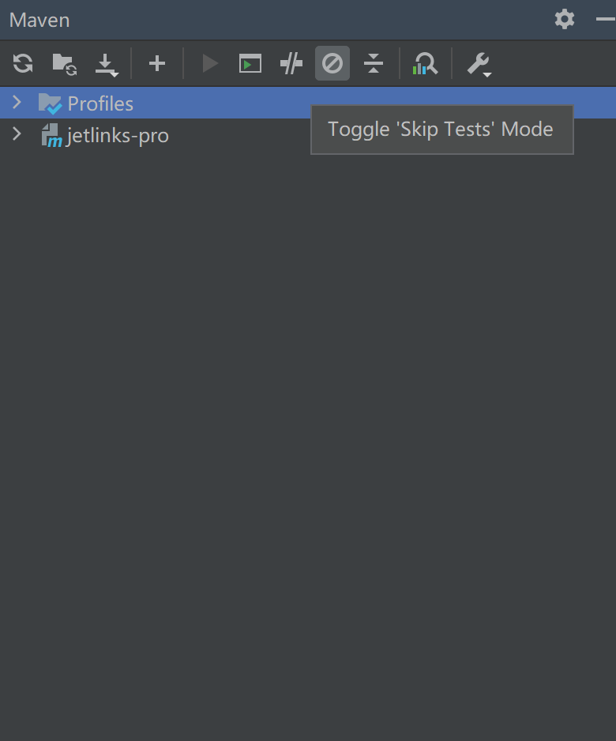
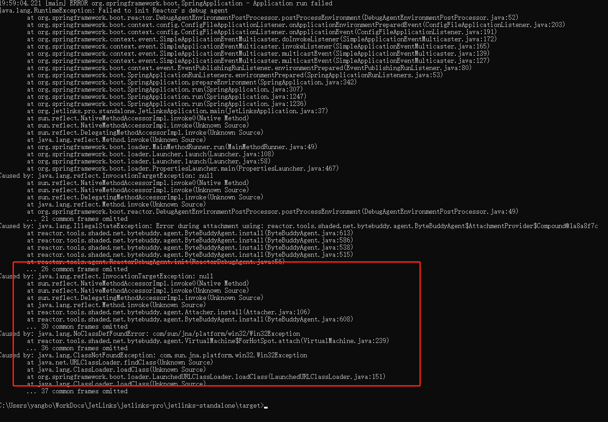
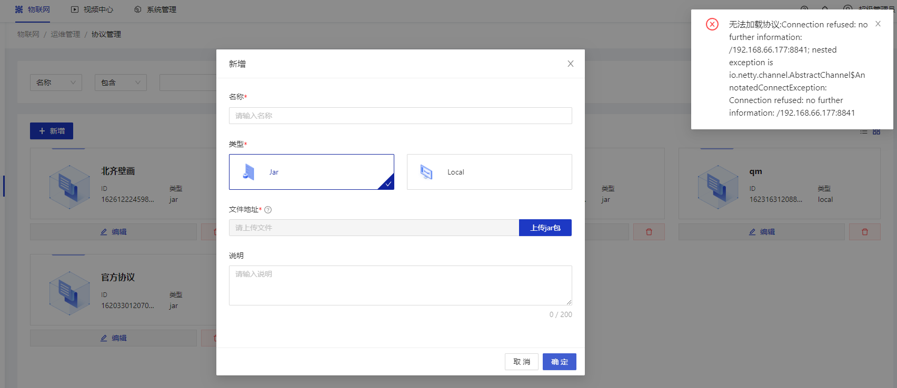

# 安装部署常见问题

<table>
<tr>
    <td><a href="/install-deployment/deploy-question.html#下载完源码后maven编译失败">下载完源码后maven编译失败</a></td>
    <td><a href="/install-deployment/deploy-question.html#项目打包时有test文件校验不通过">项目打包时有Test文件校验不通过</a></td>
</tr>
<tr>
   <td><a href="/install-deployment/deploy-question.html#数据库不存在">更换为mysql数据库unknown database jetlinks</a></td>
   <td><a href="/install-deployment/deploy-question.html#更换为mysql数据库启动失败">更换为mysql数据库启动失败</a></td>
</tr>
<tr>
   <td><a href="/install-deployment/deploy-question.html#使用mysql后项目启动报sslhandshakeexception">使用mysql后项目启动报SSLHandshakeException</a></td>
   <td><a href="/install-deployment/deploy-question.html#首次启动时抛出表已存在异常">首次启动时抛出表已存在异常</a></td>
</tr>
<tr>
   <td><a href="/install-deployment/deploy-question.html#启动时抛出noauth-authentication-required">启动时抛出"NOAUTH Authentication required"</a></td>
   <td><a href="/install-deployment/deploy-question.html#windows运行jar抛出win32exception">windows运行jar抛出win32exception</a></td>
</tr>
<tr>
   <td><a href="/install-deployment/deploy-question.html#启动前端登录后无导航和菜单信息">启动前端登录后无导航和菜单信息</a></td>
   <td><a href="/install-deployment/deploy-question.html#上传协议包报无法加载的错误">上传协议包无法加载</a></td>
</tr>
</table>


## 常见问题

#### 下载完源码后maven编译失败

<div class='explanation warning'>
  <p class='explanation-title-warp'>
    <span class='iconfont icon-bangzhu explanation-icon'></span>
    <span class='explanation-title font-weight'>问题</span>
  </p>

  <p>Q：Maven项目启动过程中出现jar包引入失败。</p>
  <p>A：一般是由于自行设置了配置文件的mirrors镜像加速地址，注释或者使用纯净的<b class='explanation-title font-weight'>settings.xml</b>配置文件。</p>
</div>

#### 项目打包时有Test文件校验不通过

<div class='explanation warning'>
  <p class='explanation-title-warp'>
    <span class='iconfont icon-bangzhu explanation-icon'></span>
    <span class='explanation-title font-weight'>问题</span>
  </p>

  <p>Q：项目打包时有Test文件校验不通过。</p>
  <p>A：使用如下命令重新打包或者在Maven窗口关闭test校验</p>

```bash
#linux系统或许macOS
./mvnw clean package -Dmaven.test.skip=true

#windows系统
mvnw.cmd clean package '-Dmaven.test.skip=true'
```


</div>

#### 更换为mysql数据库，提示数据库不存在

<div class='explanation warning'>
  <p class='explanation-title-warp'>
    <span class='iconfont icon-bangzhu explanation-icon'></span>
    <span class='explanation-title font-weight'>问题</span>
  </p>

  <p>Q：更换为mysql数据库，提示数据库不存在。</p>
  <p>A：平台默认使用PostgreSQL，如需切换使用mysql数据库则自行连接mysql服务，手动创建数据库。</p>
</div>

#### 更换为mysql数据库启动失败

<div class='explanation warning'>
  <p class='explanation-title-warp'>
    <span class='iconfont icon-bangzhu explanation-icon'></span>
    <span class='explanation-title font-weight'>问题</span>
  </p>

  <p>Q：更换为mysql数据库启动报错，报错截图如下。</p>
   
  <p>A：修改<span class='explanation-title font-weight'>easyorm.dialect和easyorm.default-schema</span>参数，</p>


</div>

#### 首次启动时抛出表已存在异常

<div class='explanation warning'>
  <p class='explanation-title-warp'>
    <span class='iconfont icon-bangzhu explanation-icon'></span>
    <span class='explanation-title font-weight'>问题</span>
  </p>

  <p>Q：首次启动时抛出"Table 'xx' already exists"异常。</p>
  <p>A：删除数据库并重新创建数据然后重启项目，由项目自行创建表及表结构。</p>
</div>

#### 使用mysql后项目启动报SSLHandshakeException

<div class='explanation warning'>
  <p class='explanation-title-warp'>
    <span class='iconfont icon-bangzhu explanation-icon'></span>
    <span class='explanation-title font-weight'>问题</span>
  </p>

  <p>Q：使用mysql后项目启动报SSLHandshakeException。异常信息如下</p>

```bash
"Operator called default onErrorDropped"
"Caused by: javax.net.ssl.SSLHandshakeException: No appropriate protocol (protocol is disabled or cipher suites are inappropriate)"
```
  <p>A：关闭mysql的SSL连接认证。在连接地址上加入  <span class='explanation-title font-weight'>问题</span></p>
</div>

#### 启动时抛出NOAUTH Authentication required

<div class='explanation warning'>
  <p class='explanation-title-warp'>
    <span class='iconfont icon-bangzhu explanation-icon'></span>
    <span class='explanation-title font-weight'>问题</span>
  </p>

  <p>Q：启动时抛出NOAUTH Authentication required。</p>
  <p>A：Redis并未设置密码，在配置文件中指定了<span class='explanation-title font-weight'>spring.redis.password</span>参数，修改该参数置空即可。
</p>
</div>

#### Windows运行jar抛出Win32Exception

<div class='explanation warning'>
  <p class='explanation-title-warp'>
    <span class='iconfont icon-bangzhu explanation-icon'></span>
    <span class='explanation-title font-weight'>问题</span>
  </p>

  <p>Q：Windows运行jar抛出Win32Exception。</p>
   
  <p>A：修改<span class='explanation-title font-weight'>spring.reactor.debug-agent.enabled</span>参数为false。</p>
</div>

#### 启动前端登录后无导航和菜单信息

<div class='explanation warning'>
  <p class='explanation-title-warp'>
    <span class='iconfont icon-bangzhu explanation-icon'></span>
    <span class='explanation-title font-weight'>问题</span>
  </p>

  <p>Q：启动前端登录后顶部无导航和左侧菜单信息，如下图。</p>
  
  <p>A：前端编译时使用<span class='explanation-title font-weight'>yarn</span>命令，npm命令下载依赖包时会存在资源无法下载问题。已编译过的需要删除node_modules和package-lock.json文件后再使用yarn命令编译启动</p>
</div>


#### 上传协议包报无法加载的错误

<div class='explanation warning'>
  <p class='explanation-title-warp'>
    <span class='iconfont icon-bangzhu explanation-icon'></span>
    <span class='explanation-title font-weight'>问题</span>
  </p>

  <p>Q：无法加载协议，如下图。</p>
  

A：

原因一：目录名称使用中文进行命名！使用中文命名目录，当系统查找协议包时在查找中文目录名称时转义失败，抛出无法加载协议的异常。

原因二：协议内未找到主入口类<span class='explanation-title font-weight'>（implements ProtocolSupportProvider的类）</span>，确认类名是否正确。

原因三：未配置系统管理-基础配置中<span class='explanation-title font-weight'>base-path </span>的值,
格式为 `http://后端ip:前端端口/api ` ,
例如 `http://192.168.66.177:9000/api` 。

</div>

[//]: # (#### 上传协议包抛出无法加载协议异常)

[//]: # ()
[//]: # (<div class='explanation warning'>)

[//]: # (  <p class='explanation-title-warp'>)

[//]: # (    <span class='iconfont icon-bangzhu explanation-icon'></span>)

[//]: # (    <span class='explanation-title font-weight'>问题</span>)

[//]: # (  </p>)

[//]: # ()
[//]: # (  <p>Q：上传协议包抛出无法加载协议异常</p>)

[//]: # (  <p>A: 原因一：目录名称使用中文进行命名！使用中文命名目录，当系统查找协议包时在查找中文目录名称时转义失败，抛出无法加载协议的异常。</p>)

[//]: # (   <p>原因二：协议内未找到主入口类<span class='explanation-title font-weight'>（implements ProtocolSupportProvider的类）</span>。</p>)

[//]: # ()
[//]: # (</div>)