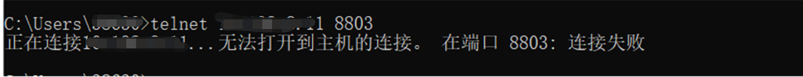
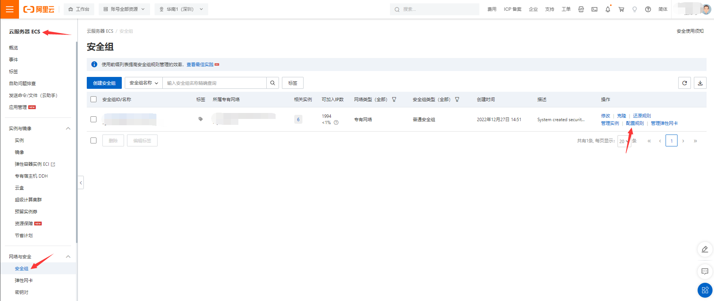
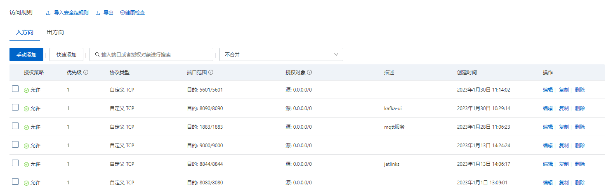

# 使用Docker启动

## 概述
为了快速启动JetLinks应用，以及在开发过程中为了保持环境一致性，平台还支持使用Docker的方式启动。

## 问题指引
<table>
<tr>
   <td><a href="/install-deployment/docker-start.html#使用docker部署es时accessdeniedexception异常">使用docker部署es时accessdeniedexception异常</a></td>
   <td><a href="/install-deployment/docker-start.html#docker常用命令">docker常用命令</a></td>
</tr>
<tr>
   <td><a href="/install-deployment/docker-start.html#使用已有docker部署的redis等基础服务">使用已有docker部署的redis等基础服务</a></td>
   <td><a href="/install-deployment/docker-start.html#服务启动后发起连接报connection-refused或time-out">服务启动后发起连接报connection refused或time out</a></td>
</tr>
</table>

## 安装docker

根据不同操作系统选择安装docker-ce或者Docker Desktop。  
- <a href='https://hub.docker.com/editions/community/docker-ce-desktop-mac'>Mac</a>
- <a href='https://hub.docker.com/search?q=&type=edition&offering=community&sort=updated_at&order=desc&operating_system=linux'>Linux</a>
- <a href='https://hub.docker.com/editions/community/docker-ce-desktop-windows'>Windows</a>  


## 获取源代码
jetlinks源代码托管在<a href='https://gitee.com/jetlinks/jetlinks-community'>Gitee</a>，可直接前往克隆或者下载。  


建议使用git clone。
```bash

$ git clone -b 2.0 https://gitee.com/jetlinks/jetlinks-community.git && cd jetlinks-community

```

## 启动
<a href='#获取源代码'>获取源代码</a>成功后，进入docker/run-all目录。  
```bash

 cd docker/run-all
 docker-compose up

```

<div class='explanation info'>
  <p class='explanation-title-warp'> 
    <span class='iconfont icon-tishi explanation-icon'></span>
    <span class='explanation-title font-weight'>提示</span>
  </p>

docker-compose中的jetlinks、jetlinks-ui-vue镜像持续更新中，启动docker之前请及时下载更新。

更新命令

```shell
# 查询镜像REPOSITORY 
docker images
REPOSITORY                                                     TAG         IMAGE ID       CREATED        SIZE
registry.cn-shenzhen.aliyuncs.com/jetlinks/jetlinks-ui-vue     1.0.0       c4d539556f75   2 days ago     180MB

# 将上一步查询的镜像仓库和tag号带入，执行更新命令。
docker pull [REPOSITORY]:[TAG]

```

</div>

## 启动成功后访问系统  

地址: `http://localhost:9000`  

默认用户名:`admin`，密码:`admin`

## 常见问题

#### 使用docker部署ES时AccessDeniedException异常

<div class='explanation warning'>
  <p class='explanation-title-warp'>
    <span class='iconfont icon-bangzhu explanation-icon'></span>
    <span class='explanation-title font-weight'>问题</span>
  </p>

  <p>Q：docker中启动ES报错：AccessDeniedException: /usr/share/elasticsearch/data/nodes</p>

```bash
ElasticsearchException[failed to bind service]; nested: AccessDeniedException[/usr/share/elasticsearch/data/nodes];
Likely root cause: java.nio.file.AccessDeniedException: /usr/share/elasticsearch/data/nodes
        at java.base/sun.nio.fs.UnixException.translateToIOException(UnixException.java:90)
        at java.base/sun.nio.fs.UnixException.rethrowAsIOException(UnixException.java:106)
        at java.base/sun.nio.fs.UnixException.rethrowAsIOException(UnixException.java:111)
        at java.base/sun.nio.fs.UnixFileSystemProvider.createDirectory(UnixFileSystemProvider.java:396)
        at java.base/java.nio.file.Files.createDirectory(Files.java:694)
        at java.base/java.nio.file.Files.createAndCheckIsDirectory(Files.java:801)
        at java.base/java.nio.file.Files.createDirectories(Files.java:787)
```
  <p>A：对ES挂载目录进行授权，命令如下。重启es服务节点和后端应用。</p>

```bash
sudo chmod 777 -R elasticsearch
```

</div>

#### docker常用命令

| 命令                                        | 说明                              | 
|-------------------------------------------|---------------------------------|
| `docker-compose up -d`                    | 守护态启动`docker-compose`文件内编排的所有容器 |
| `docker-compose down`                     | 停止`docker-compose`文件内编排的所有容器    | 
| `docker ps -a`                            | 查看所有`docker`容器状态                |
| `docker images`                           | 查看所有`docker`镜像信息                | 
| `docker exec -it [containerID] /bin/bash` | 进入指定`docker`容器内部                | 
| `docker logs -f [containerID]`            | 查看指定`docker`容器日志信息              | 
| `docker stop [containerID]`               | 停止指定`docker`容器                  | 
| `docker rm [containerID]`                 | 移除指定`docker`容器                  | 
| `docker rmi [imageID]`                    | 移除指定`docker`镜像                  | 
| `docker network ls`                       | 查看全部`docker`网络信息                | 
| `docker port [containerID]`               | 查看指定`docker`容器端口映射            | 

<div class='explanation info'>
  <p class='explanation-title-warp'>
    <span class='iconfont icon-tishi explanation-icon'></span>
    <span class='explanation-title font-weight'>补充</span>
  </p>

  <p>以上是docker部署中常见命令，表格内的containerID可换成容器名称，containerID可以使用前三位。</p>

```shell
$ docker ps -a
CONTAINER ID   IMAGE                                                              COMMAND                  CREATED        STATUS                      PORTS                                                                                                                                       NAMES
312a03479d88   registry.cn-shenzhen.aliyuncs.com/jetlinks/jetlinks-ui-vue:2.1   "/docker-entrypoint.…"   25 hours 
ago   Up 25 hours                 0.0.0.0:9000->80/tcp                                                               
                                                         jetlinks-ui-vue
4c1dbee856a4   elasticsearch:6.8.10                                               "/usr/local/bin/dock…"   2 weeks ago    Up 25 hours                 0.0.0.0:9200->9200/tcp, 0.0.0.0:9300->9300/tcp                                                                                              jetlinks-elasticsearch
9cd18f5d05c1   emqx/emqx:5.0.9                                                    "/usr/bin/docker-ent…"   3 weeks ago    Exited (255) 25 hours ago   4370/tcp, 0.0.0.0:8083-8084->8083-8084/tcp, 5369/tcp, 0.0.0.0:8883->8883/tcp, 11883/tcp, 0.0.0.0:18083->18083/tcp, 0.0.0.0:1884->1883/tcp   emqx
75537b2086ca   tdengine/tdengine:2.6.0.16                                         "/tini -- /usr/bin/e…"   3 weeks ago    Exited (255) 3 weeks ago    0.0.0.0:6030->6030/tcp, 0.0.0.0:6035->6035/tcp, 0.0.0.0:6041->6041/tcp, 0.0.0.0:6030-6040->6030-6040/udp                                    tdengine-component-tdengine-1
7f8e4809e188   redis:5.0.4                                                        "docker-entrypoint.s…"   5 weeks ago    Exited (255) 2 weeks ago    16379/tcp, 0.0.0.0:16379->6379/tcp       

# 查看312a03479d88容器的端口映射信息
$ docker port 312
80/tcp -> 0.0.0.0:9000

```

</div>

#### 使用已有docker部署的redis等基础服务

<div class='explanation warning'>
  <p class='explanation-title-warp'>
    <span class='iconfont icon-bangzhu explanation-icon'></span>
    <span class='explanation-title font-weight'>问题</span>
  </p>

  <p>Q：如何使用已有的docker部署的redis、pg等服务？</p>
  <p>A：开发者在部署过redis和pg后，直接启动Jetlinks不想重新编排启动新的容器的情况下可以选择加入已有的docker网络组网内。</p>
</div>
具体操作步骤:

1. 在jetlinks所在的编排文件内加入`external_links`和`networks.default.external.name`参数

```yaml
version: '2'
services:
  jetlinks:
    image: registry.cn-shenzhen.aliyuncs.com/jetlinks-pro/jetlinks-develop:2.0.0-SNAPSHOT
    container_name: jetlinks-pro
    ports:
      - "1883:1883" #其他端口省略
    environment:
      - "TZ=Asia/Shanghai"
      - "server.port=8845" #其他参数省略
      - "spring.elasticsearch.uris=elasticsearch:9200" #使用external_links参数左侧声明的容器名称
      - "spring.redis.host=redis"
      - "spring.r2dbc.url=r2dbc:postgresql://postgres:5432/jetlinks"
    volumes:
      - "./data/upload:/application/static/upload"  #其他数据卷省略
    external_links:
      - redis:jetlinks-redis                    # 声明使用jetlinks-redis内部网络
      - postgres:jetlinks-postgres              # 声明使用jetlinks-postgres内部网络
      - elasticsearch:jetlinks-elasticsearch    # 声明使用jetlinks-elasticsearch内部网络
networks:
  default:
    external:
      name: jetlinks-pro_default             # 加入已有的docker组网内

```

2. `external_links`详解

```bash

# 左侧：编排文件内使用的容器名称；右侧：已有的容器名称
# 使用docker ps -a 查看已有的容器，替换右侧内容即可
redis:jetlinks-redis

```

3. `networks.default.external.name`详解

该参数是将当前dc文件内编排的容器加入已有的docker组网内，使用下方命令查询已有的组网信息，将`NAME`值填入即可。
```bash
$ docker network ls
NETWORK ID     NAME                         DRIVER    SCOPE
5af1840e9104   bridge                       bridge    local
e8468c49c868   host                         host      local
8b66b8223ada   jetlinks-pro_default         bridge    local
1e6513c2fd71   jetlinks-v2_default          bridge    local
bd667d011f1c   none                         null      local
9ef284ce9922   tdengine-component_default   bridge    local


```

#### 服务启动后发起连接报connection refused或time out

<div class='explanation warning'>
  <p class='explanation-title-warp'>
    <span class='iconfont icon-bangzhu explanation-icon'></span>
    <span class='explanation-title font-weight'>问题</span>
  </p>

  <p>Q：服务启动后报connection refused或time out。</p>
    使用<span class='explanation-title font-weight'>WIN+R</span>启动cmd界面，输入telnet [ip] [port]命令，如下图：
    
  <div>A：出现该情况一般是以下几种情况。
<p>1. 服务端口没启动</p>
<p>2. 服务端口未开放</p>
<p>3. docker端口未映射正确</p>
<p>4. 防火墙开启连接被拒绝</p>
    </div>

</div>

1. 服务端口没启动

此处以1883端口示例检查端口是否启动监听程序，根据实际情况修改检查端口号，如执行命令后没有列表信息则说明端口未启动成功，重启网络组件。
```bash
# 
[root@iZ2vcgpzoxgzd1e5bysh4xZ jetlinks-v2]# netstat -tlnp | grep 1883
tcp        0      0 0.0.0.0:11883           0.0.0.0:*               LISTEN      17408/docker-proxy  
tcp        0      0 0.0.0.0:1883            0.0.0.0:*               LISTEN      17754/docker-proxy  

```

2. 服务端口未开放

云服务器存在安全组策略原因，登录云服务器管理平台设置端口开放



<div class='explanation error'>
  <p class='explanation-title-warp'>
    <span class='iconfont icon-jinggao explanation-icon'></span>
    <span class='explanation-title font-weight'>警告</span>
  </p>

  <p>不建议将redis、kibana、pg等服务组件端口暴露在公网内。</p>
</div>

3. docker端口未映射正确

检查需要连接的端口是否在下方查询的容器映射范围内。同时也需要注意通信协议是否匹配，如使用udp协议，但端口后是/tcp也无法正确连接。

```bash
[root@iZ2vcgpzoxgzd1e5bysh4xZ jetlinks-v2]# docker port jetlinks
8106/tcp -> 0.0.0.0:8106
8210/udp -> 0.0.0.0:8210
8206/udp -> 0.0.0.0:8206
8208/udp -> 0.0.0.0:8208
1883/tcp -> 0.0.0.0:1883
8100/tcp -> 0.0.0.0:8100
8101/tcp -> 0.0.0.0:8101
8102/tcp -> 0.0.0.0:8102
8105/tcp -> 0.0.0.0:8105
8107/tcp -> 0.0.0.0:8107
8209/udp -> 0.0.0.0:8209
8844/tcp -> 0.0.0.0:8844
11883/tcp -> 0.0.0.0:11883
8104/tcp -> 0.0.0.0:8104
8201/udp -> 0.0.0.0:8201
8203/udp -> 0.0.0.0:8203
8204/udp -> 0.0.0.0:8204
8207/udp -> 0.0.0.0:8207
8205/udp -> 0.0.0.0:8205
8103/tcp -> 0.0.0.0:8103
8108/tcp -> 0.0.0.0:8108
8109/tcp -> 0.0.0.0:8109
8110/tcp -> 0.0.0.0:8110
8200/udp -> 0.0.0.0:8200
8202/udp -> 0.0.0.0:8202

```

4. 防火墙开启连接被拒绝

检查防火墙状态，如果是绿色状态需要关闭，关闭时信息如下。具体防火墙有所不同，此处以iptables为例。

```bash
[root@iZ2vcgpzoxgzd1e5bysh4xZ jetlinks-v2]# systemctl status iptables
● iptables.service - IPv4 firewall with iptables
   Loaded: loaded (/usr/lib/systemd/system/iptables.service; disabled; vendor preset: disabled)
   Active: inactive (dead)

```