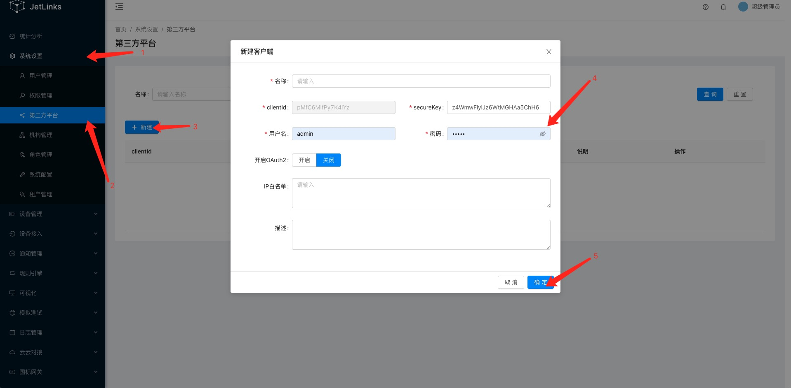
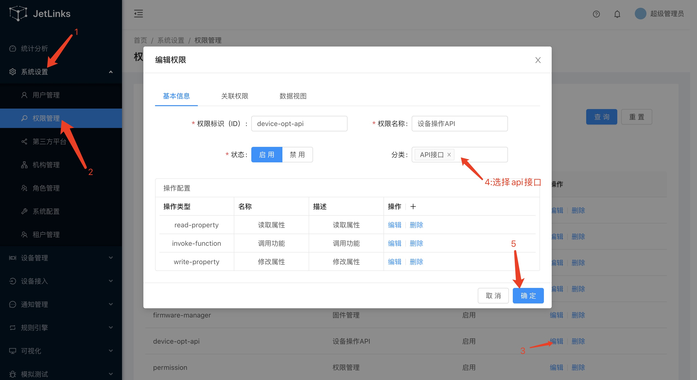

# 第三方平台使用

基于数据签名的第三方平台模块.用于提供对外开放接口的认证方式.

::: tip 注意
本功能仅在企业版中提供. 
:::

## 创建第三方平台

进入平台:[系统设置]-[第三方平台]

点击新建按钮:



填写对应的内容保存.

::: tip 注意
 `clientId`和`secureKey`需要提供给客户端开发者.
 用户名和密码是系统统一的用户主体,会自动创建到用户管理中.使用此用户名密码也能登录到系统中.
 与其他用户相同,可以将用户绑定到机构实现数据权限控制.
:::

## 赋权

点击操作列中的赋权按钮对第三方平台进行赋权.大部分情况下只需要勾选: `设备操作API`和`设备数据API`权限即可.

如果操作栏`赋权`里
没有任何权限选项，先去`权限管理`赋予权限，`分类`选择`APi接口`。

::: tip 注意
此赋权操作实际上是对`第三方平台`对应对`用户主体`进行赋权.
:::

## 使用签名的方式
### 验证流程


::: tip 说明

1. 图中`Signature`函数为客户端设置的签名方式,支持`MD5`和`Sha256`.
2. 发起请求的签名信息都需要放到请求头中,而不是请求体.
3. OpenApi对开发是透明的,开发只需要关心权限控制即可.OpenAPI和后台接口使用的是相同的权限控制API.
因此开发一个`OpenAPI接口`就是写一个`WebFlux Controller`. [查看使用方式](../../dev-guide/crud.md#web)

:::

### 签名

平台使用签名来校验客户端请求的完整性以及合法性.

例:

ClientId为`testId`,
SecureKey为:`testSecure`.
客户端请求接口: `/api/v1/device/dev0001/log/_query`,参数为`pageSize=20&pageIndex=0`,签名方式为`md5`.

1. 将参数key按ascii排序得到: pageIndex=0&pageSize=20
2. 使用拼接时间戳以及密钥得到: pageIndex=0&pageSize=201574993804802testSecure
3. 使用`md5("pageIndex=0&pageSize=201574993804802testSecure")`得到`837fe7fa29e7a5e4852d447578269523`

示例:

```text
GET /api/device?pageIndex=0&pageSize=20
X-Client-Id: testId
X-Timestamp: 1574993804802
X-Sign: 837fe7fa29e7a5e4852d447578269523
```

响应结果:

```text
HTTP/1.1 200 OK
X-Timestamp: 1574994269075
X-Sign: c23faa3c46784ada64423a8bba433f25

{"status":200,result:[]}

```

### 验签

使用和签名相同的算法(不需要对响应结果排序):

```java

String secureKey = ...; //密钥
String responseBody = ...;//服务端响应结果
String timestampHeader = ...;//响应头: X-Timestamp
String signHeader = ...; //响应头: X-Sign

String sign = DigestUtils.md5Hex(responseBody+timestampHeader+secureKey);
if(sign.equalsIgnoreCase(signHeader)){
    //验签通过

}

```

## 使用token的方式

通过请求接口`/api/v1/token`来获取`X-Access-Token`，之后可以使用此token来发起api请求。

### 申请token
客户端请求接口`/api/v1/token`  
    请求方式： POST  

```text

POST /api/v1/token
X-Sign: 932bbe8a39ae03f568f73a507d87afac
X-Timestamp: 1587719082698 
X-Client-Id: kF**********HRZ  
Content-Type: application/json 

{  
    "expires": 7200 // 过期时间,单位秒.
}

//返回

{
    "status":200,
    "result":"3bcddb719b01da679b88d07acde2516" //token信息
}

```

### 使用token发起请求 
此处以获取设备test001详情为例。  
```text
GET /api/v1/device/test001/_detail  
X-Access-Token: 3bcddb719b01da679b88d07acde2516  
```
响应结果：
```json
{
    "result": {
        "id": "test001",
        "name": "温控设备0309",
        "protocol": "demo-v1",
        "transport": "MQTT",
        "orgId": "test",
        "productId": "1236859833832701952",
        "productName": "智能温控",
        "deviceType": {
            "text": "网关设备",
            "value": "gateway"
        },
        "state": {
            "text": "离线",
            "value": "offline"
        },
        "address": "/127.0.0.1:36982",
        "onlineTime": 1586705515429,
        "offlineTime": 1586705507734,
        "createTime": 1585809343175,
        "registerTime": 1583805253659,
        "metadata": "{\"events\":[{\"id\":\"fire_alarm\",\"name\":\"火警报警\",\"expands\":{\"eventType\":\"reportData\",\"level\":\"urgent\"},\"valueType\":{\"type\":\"object\",\"properties\":[{\"id\":\"a_name\",\"name\":\"区域名称\",\"valueType\":{\"type\":\"string\"}},{\"id\":\"b_name\",\"name\":\"建筑名称\",\"valueType\":{\"type\":\"string\"}},{\"id\":\"l_name\",\"name\":\"位置名称\",\"valueType\":{\"type\":\"string\"}}]}}],\"properties\":[{\"id\":\"temperature\",\"name\":\"温度\",\"valueType\":{\"type\":\"float\",\"min\":\"0\",\"max\":\"100\",\"step\":\"0.1\",\"unit\":\"celsiusDegrees\"},\"expands\":{\"readOnly\":\"true\"}}],\"functions\":[{\"id\":\"get-log\",\"name\":\"获取日志\",\"isAsync\":true,\"output\":{\"type\":\"string\",\"expands\":{\"maxLength\":\"2048\"}},\"inputs\":[{\"id\":\"start_date\",\"name\":\"开始日期\",\"valueType\":{\"type\":\"date\",\"dateFormat\":\"yyyy-MM-dd HH:mm:ss\"}},{\"id\":\"end_data\",\"name\":\"结束日期\",\"valueType\":{\"type\":\"date\",\"dateFormat\":\"yyyy-MM-dd HH:mm:ss\"}},{\"id\":\"time\",\"name\":\"分组\",\"valueType\":{\"type\":\"string\"}}]}]}",
        "configuration": {
            "username": "test",
            "password": "test"
        },
        "tags": []
    },
    "status": 200,
    "code": "success"
}
```
    
## Demo 

Demo中测试包org.jetlinks.demo.openapi下的测试类已测试通过平台已有的openApi接口。  
Demo中使用签名的方式接入。  

**[前往下载Demo](https://github.com/jetlinks/jetlinks-openapi-demo)**。

## OAuth2.0

平台也支持通过OAuth2.0进行认证,支持: `authorization_code`和`client_credentials`以及`refresh_token`.

+ 授权地址: http://{domain}/#/user/login
+ client_id: 第三方平台中配置的clientId
+ ClientSecret: 第三方平台中配置的secureKey
+ Token地址: http://{domain}/jetlinks/oauth2/token

例如:
```js
POST /jetlinks/oauth2/token
Content-Type: application/json

{
    "grant_type": "client_credentials", //固定client_credentials
    "client_id":"client_id",            
    "client_secret":"client_secret",
}

响应:

{
    "access_token":"access_token",
    "refresh_token":"refresh_token",
    "expires_in":7200 //有效期,单位秒
}
```

使用token请求接口:

```js
POST /device/instance/_query
Authorization: bearer access_token

{}
```

或者
```js
POST /device/instance/_query?access_token=access_token
 
{}
```