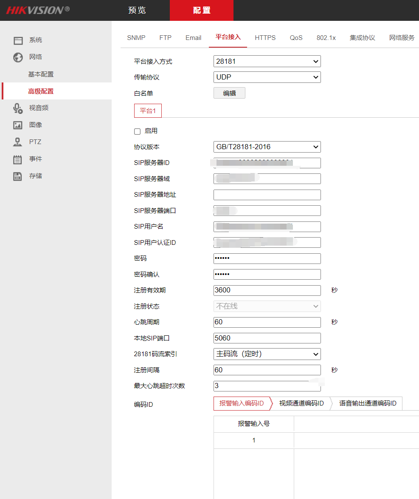
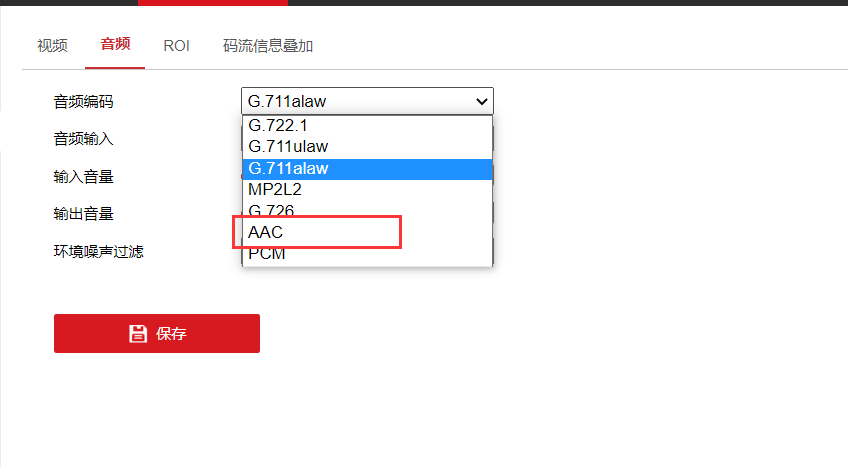

# 1设备管理/产品
新建产品，平台集成gb28181协议 默认即可

# 2 配置视频网关-基本配置
# 2.1 流媒体服务配置

公网host: 【流媒体部署服务器公网ip/域名】

API host 【流媒体部署服务器公网ip】

* api 端口:8180 默认
* http 端口:8180 默认
* rtp 端口:9100 默认
* rtmp 端口:1935 默认
* 秘钥:p@ssw0rd 默认

点击保存

以上配置文件可在zlmedia服务的docker-compose和config.ini中修改及查看

# 2.2 GB28181/2016配置

* SIP ID：[https://www.cnblogs.com/cash/p/14177671.html](https://www.cnblogs.com/cash/p/14177671.html?fileGuid=Wcq8TJ69WYrw3Yqp)根据这个网站提供的规则进行编写
* SIP 域：SIP ID取前10位
* SIP Host：0.0.0.0
* 公网Host: 服务部署ip
* 接入密码：用户自定义
* 端口：jetlinks-pro的docker-compose 里面预留的udp端口
* 公网端口：同【端口】

点击保存

点击启用

# 2.3 注意事项

确保服务器开启 2.1 和2.2配置的端口

2.2 配置的服务器 及 端口用于设备连接

2.1 配置的服务器 及 端口用于设备推送流媒体数据

# 2.4 配置摄像头连接信息

进入摄像头网关内

本文档使用海康威视的摄像头示例：

**不同的是 11 12 13位需要改为对应设备类型，后5位用户自定义**

添加好通道后就更新通道->查看通道

# 4 FAQ
* Q：RTSP为什么无法点击播放？
* A：浏览器不支持
* Q：为什么不同的摄像头有的可以使用FLV格式播放有的是MP4格式播放？
* A：进入摄像头网关/音视频设置内查看 音频设置里的音频编码

FLV格式只支持视频编码-【H.264】和音频编码-【ACC编码】

MP4格式支持H.264不支持H.265

如果您的视频通道没有画面请检查音视频编码是否是上面两种编码格式

* Q：如果音频编码没有ACC选项怎么办？
* A：关闭音频即可

* Q：国标级联作用是什么？
* A：jetlinks平台可以当做数据中转，如果您的摄像头不支持多平台配置，那么可以通过国标级联推送给上级平台。

