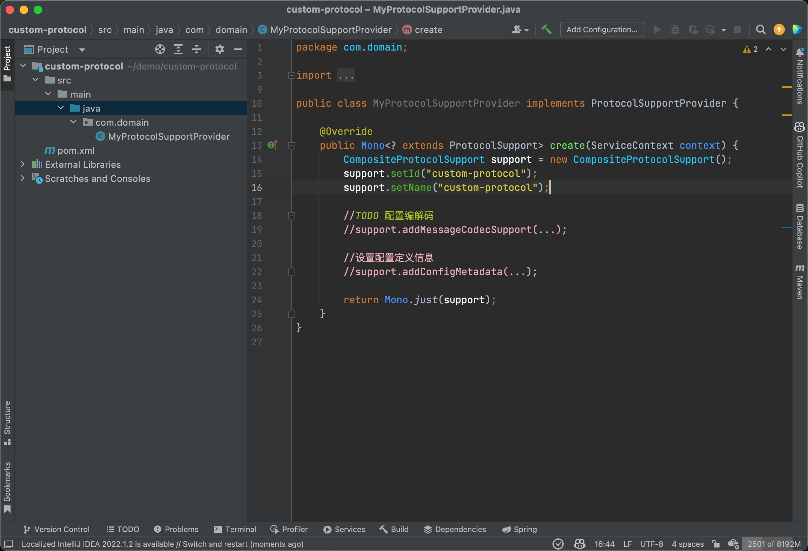

# 协议包开发快速开始

::: warning 说明
请先安装和配置`java8`和`maven3`,能正常执行`mvn`命令即可,本文不做单独介绍. 
:::

## 创建Maven项目

基于模版项目创建

`linux` 或者 `macOS` 下执行
```shell
mvn dependency:get \
-DremoteRepositories=https://nexus.hsweb.me/content/groups/public \
-DgroupId=org.jetlinks.protocol \
-DartifactId=protocol-archetype \
-Dversion=1.0.0-SNAPSHOT \
&& \
mvn archetype:generate \
-DarchetypeGroupId=org.jetlinks.protocol \
-DarchetypeArtifactId=protocol-archetype \
-DarchetypeVersion=1.0.0-SNAPSHOT \
-DoutputDirectory=./ \
-DgroupId=com.domain \
-DartifactId=custom-protocol \
-Dversion=1.0 \
-DarchetypeCatalog=local \
-DinteractiveMode=false
```

`windows`下使用`PowerShell`执行:

```shell
mvn dependency:get `
-DremoteRepositories="https://nexus.hsweb.me/content/groups/public" `
-DgroupId="org.jetlinks.protocol" `
-DartifactId="protocol-archetype" `
-Dversion="1.0.0-SNAPSHOT" 
;
mvn archetype:generate `
-DarchetypeGroupId="org.jetlinks.protocol" `
-DarchetypeArtifactId="protocol-archetype" `
-DarchetypeVersion="1.0.0-SNAPSHOT" `
-DoutputDirectory="./" `
-DgroupId="com.domain" `
-DartifactId="custom-protocol" `
-Dversion="1.0" `
-DarchetypeCatalog="local" `
-DinteractiveMode="false"
```

::: tip 温馨提示

可根据需要修改第二个命令中的 `-DgroupId=com.domain`
以及`-DartifactId=custom-protocol`

:::

命令执行成功后,将会在当前目录中创建名为`custom-protocol`的项目


## 使用Idea打开

使用`File`-`open` 打开刚才创建的项目目录




## 开始开发

[MQTT协议解析](./mqtt.md)

<!-- [TCP协议解析](./tcp.md) -->

<!-- [HTTP协议解析](./http.md) -->
